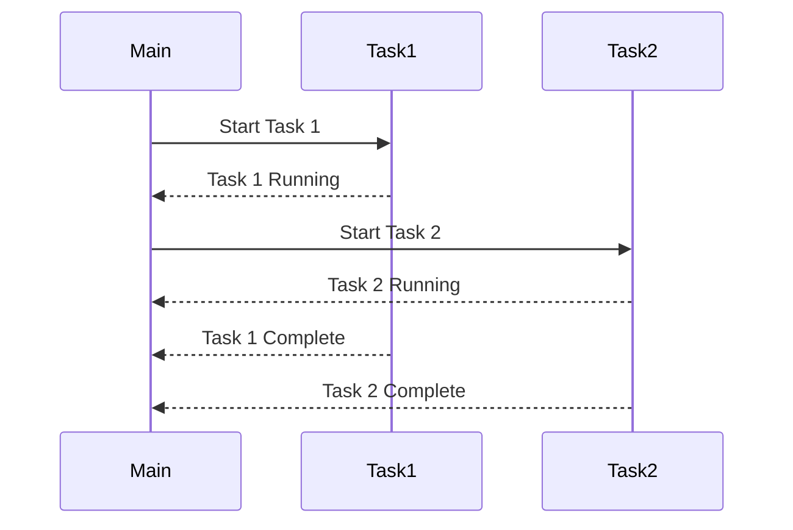

## 9.8 Asynchronous Programming Patterns

In the ever-evolving landscape of software development, efficiency and responsiveness are paramount. Asynchronous programming is a powerful paradigm that allows developers to write non-blocking code, enabling applications to handle multiple tasks simultaneously without waiting for each to complete before starting the next. This section delves into asynchronous programming patterns in Ruby, offering insights into techniques, libraries, and practical examples to help you build scalable and maintainable applications.

### Understanding Asynchronous Programming

Asynchronous programming is a method of writing code that allows tasks to run independently of the main program flow. Unlike synchronous programming, where tasks are executed sequentially, asynchronous programming enables tasks to be executed concurrently, improving the efficiency and responsiveness of applications.

#### Importance of Asynchronous Programming

- **Improved Performance**: By allowing tasks to run concurrently, applications can perform more efficiently, especially when dealing with I/O-bound operations like network requests or file I/O.
- **Enhanced User Experience**: Asynchronous programming can lead to more responsive applications, as tasks such as loading data or processing files can occur in the background without freezing the user interface.
- **Resource Optimization**: Efficient use of system resources, as tasks can be scheduled and executed based on availability, reducing idle time.

### Asynchronous Programming Patterns in Ruby

Ruby, known for its elegance and simplicity, provides several patterns and libraries to facilitate asynchronous programming. Let's explore some of these patterns and how they can be implemented in Ruby.

#### Callbacks

Callbacks are functions passed as arguments to other functions, executed after the completion of a task. They are a fundamental building block of asynchronous programming.

```ruby
def fetch_data(url, &callback)
  # Simulate an asynchronous operation
  Thread.new do
    sleep(2) # Simulate network delay
    data = "Data from #{url}"
    callback.call(data) if callback
  end
end

fetch_data("http://example.com") do |data|
  puts "Received: #{data}"
end
```

In this example, `fetch_data` simulates an asynchronous HTTP request, invoking the callback once the data is fetched.

#### Event Loops

An event loop is a programming construct that waits for and dispatches events or messages in a program. It is a core component of asynchronous programming, enabling non-blocking I/O operations.

```ruby
require 'async'

Async do |task|
  task.async do
    puts "Task 1: Start"
    sleep(2)
    puts "Task 1: End"
  end

  task.async do
    puts "Task 2: Start"
    sleep(1)
    puts "Task 2: End"
  end
end
```

Using the `Async` gem, this example demonstrates how tasks can be scheduled and executed concurrently within an event loop.

#### Promises and Futures

Promises and futures are abstractions that represent a value that may not yet be available. They provide a way to handle asynchronous operations more gracefully.

```ruby
require 'concurrent-ruby'

promise = Concurrent::Promise.execute do
  sleep(2)
  "Result from asynchronous operation"
end

promise.then do |result|
  puts result
end

promise.rescue do |error|
  puts "Error: #{error.message}"
end
```

Here, `Concurrent::Promise` is used to execute an asynchronous operation, with `then` and `rescue` blocks handling the result or any errors.

#### Async/Await

The `async/await` pattern simplifies asynchronous code by allowing developers to write it in a synchronous style. Although not natively supported in Ruby, libraries like `Async` provide similar functionality.

```ruby
require 'async'

Async do |task|
  result = task.async do
    sleep(2)
    "Async result"
  end

  puts result.wait
end
```

This example uses the `Async` gem to mimic the `async/await` pattern, making asynchronous code easier to read and maintain.

### Libraries Supporting Asynchronous Programming in Ruby

Several libraries enhance Ruby's asynchronous capabilities, providing tools and abstractions to simplify the development process.

#### Async

The [Async](https://github.com/socketry/async) library provides a structured concurrency model, enabling developers to write asynchronous code using fibers. It offers a clean API for managing tasks and handling I/O operations.

#### EventMachine

EventMachine is a popular library for building event-driven applications. It provides a robust framework for handling network connections and asynchronous I/O operations.

#### Celluloid

Celluloid is an actor-based concurrent object framework for Ruby. It simplifies the process of building concurrent applications by abstracting complex threading and synchronization issues.

### Practical Examples of Asynchronous Programming

Let's explore some practical examples to illustrate how asynchronous programming can be applied in real-world scenarios.

#### Asynchronous HTTP Requests

```ruby
require 'async'
require 'async/http/internet'

Async do
  internet = Async::HTTP::Internet.new

  response = internet.get("http://example.com")
  puts response.read
ensure
  internet.close
end
```

Using the `Async` library, this example demonstrates how to perform an asynchronous HTTP GET request, allowing the application to continue executing other tasks while waiting for the response.

#### Asynchronous File Operations

```ruby
require 'async'
require 'async/io'

Async do
  file = Async::IO::File.open("example.txt", "w")

  file.write("Asynchronous file write operation")
  file.close
end
```

This example showcases how to perform asynchronous file operations, enabling non-blocking I/O and improving application performance.

### Comparing Asynchronous, Synchronous, and Concurrent Patterns

Understanding the differences between asynchronous, synchronous, and concurrent programming is crucial for selecting the right approach for your application.

- **Synchronous Programming**: Tasks are executed sequentially, one after the other. This approach is simple but can lead to inefficiencies, especially for I/O-bound operations.
- **Asynchronous Programming**: Tasks are executed independently, allowing the application to perform other operations while waiting for a task to complete. This approach improves efficiency and responsiveness.
- **Concurrent Programming**: Multiple tasks are executed simultaneously, often using threads or processes. This approach can improve performance but may introduce complexity due to synchronization issues.

### Benefits and Challenges of Asynchronous Programming

#### Benefits

- **Efficiency**: Asynchronous programming can significantly improve application performance by reducing idle time and optimizing resource usage.
- **Scalability**: Applications can handle more tasks concurrently, making them more scalable and responsive.
- **User Experience**: By performing tasks in the background, applications can remain responsive, enhancing the user experience.

#### Challenges

- **Complexity**: Asynchronous code can be more challenging to write and understand, especially for developers new to the paradigm.
- **Debugging**: Identifying and fixing bugs in asynchronous code can be more difficult due to the non-linear execution flow.
- **Readability**: Asynchronous code can be harder to read and maintain, especially when using callbacks or complex event loops.

### Impact on Code Readability and Maintainability

While asynchronous programming offers numerous benefits, it can also impact code readability and maintainability. To mitigate these challenges, consider the following best practices:

- **Use Promises or Async/Await**: These patterns can simplify asynchronous code, making it easier to read and maintain.
- **Leverage Libraries**: Utilize libraries like `Async` or `EventMachine` to abstract complex asynchronous operations and improve code readability.
- **Document Code**: Provide clear documentation and comments to explain the asynchronous flow and any potential pitfalls.

### Visualizing Asynchronous Programming

To better understand the flow of asynchronous programming, let's visualize the execution of tasks using a sequence diagram.



This diagram illustrates how tasks can be executed concurrently, with the main program flow continuing while tasks run in the background.

### Conclusion

Asynchronous programming is a powerful paradigm that can significantly enhance the performance and responsiveness of Ruby applications. By leveraging patterns like callbacks, event loops, and promises, along with libraries such as `Async` and `EventMachine`, developers can build scalable and maintainable applications. While asynchronous programming introduces some complexity, the benefits often outweigh the challenges, making it a valuable tool in any developer's toolkit.

Remember, this is just the beginning. As you progress, you'll build more complex and interactive applications. Keep experimenting, stay curious, and enjoy the journey!

## Quiz: Asynchronous Programming Patterns



### What is the primary benefit of asynchronous programming?

- [x] Improved performance and responsiveness
- [ ] Simplified code structure
- [ ] Easier debugging
- [ ] Reduced memory usage

> **Explanation:** Asynchronous programming allows tasks to run concurrently, improving performance and responsiveness.

### Which Ruby library provides a structured concurrency model for asynchronous programming?

- [x] Async
- [ ] EventMachine
- [ ] Celluloid
- [ ] Concurrent-Ruby

> **Explanation:** The `Async` library provides a structured concurrency model for writing asynchronous code in Ruby.

### What is a callback in asynchronous programming?

- [x] A function executed after a task completes
- [ ] A method that blocks execution
- [ ] A synchronous operation
- [ ] A type of event loop

> **Explanation:** A callback is a function passed as an argument to another function, executed after a task completes.

### How does the async/await pattern benefit asynchronous programming?

- [x] Simplifies asynchronous code by allowing it to be written in a synchronous style
- [ ] Increases the complexity of asynchronous code
- [ ] Reduces the need for event loops
- [ ] Eliminates the use of callbacks

> **Explanation:** The async/await pattern simplifies asynchronous code by allowing developers to write it in a synchronous style.

### What is the role of an event loop in asynchronous programming?

- [x] Waits for and dispatches events or messages
- [ ] Executes tasks sequentially
- [ ] Blocks I/O operations
- [ ] Simplifies synchronous code

> **Explanation:** An event loop is a programming construct that waits for and dispatches events or messages in a program.

### Which pattern is not natively supported in Ruby but can be mimicked using libraries?

- [x] Async/Await
- [ ] Callbacks
- [ ] Event Loops
- [ ] Promises

> **Explanation:** The async/await pattern is not natively supported in Ruby but can be mimicked using libraries like `Async`.

### What is a promise in asynchronous programming?

- [x] An abstraction representing a value that may not yet be available
- [ ] A function executed after a task completes
- [ ] A synchronous operation
- [ ] A type of event loop

> **Explanation:** A promise is an abstraction that represents a value that may not yet be available, providing a way to handle asynchronous operations.

### Which library is known for building event-driven applications in Ruby?

- [x] EventMachine
- [ ] Async
- [ ] Celluloid
- [ ] Concurrent-Ruby

> **Explanation:** EventMachine is a popular library for building event-driven applications in Ruby.

### What is a common challenge of asynchronous programming?

- [x] Increased complexity and difficulty in debugging
- [ ] Simplified code structure
- [ ] Reduced performance
- [ ] Easier error handling

> **Explanation:** Asynchronous programming can increase complexity and make debugging more difficult due to the non-linear execution flow.

### True or False: Asynchronous programming can improve the scalability of applications.

- [x] True
- [ ] False

> **Explanation:** Asynchronous programming can improve scalability by allowing applications to handle more tasks concurrently.


