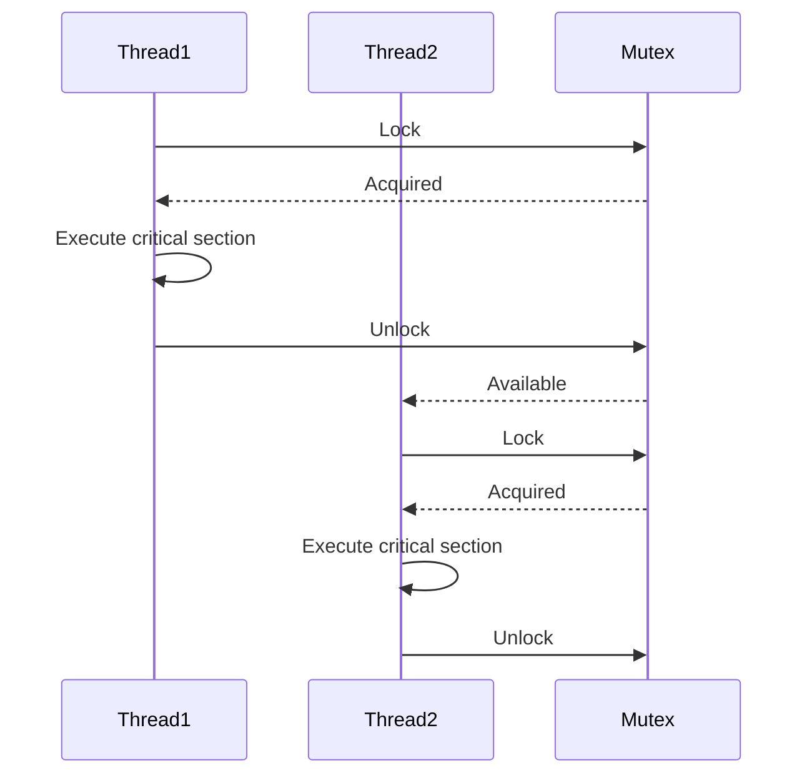

## 9.9 Synchronization Primitives and Mutexes

In the world of concurrent programming, synchronization is a critical concept that ensures multiple threads or processes can safely access shared resources. Without proper synchronization, race conditions can occur, leading to unpredictable behavior and bugs that are notoriously difficult to track down. In this section, we'll delve into the synchronization primitives available in Ruby, focusing on Mutexes, Monitors, Queues, and ConditionVariables, and explore how they can be used to build thread-safe applications.

### Why Synchronization is Necessary

Concurrency allows multiple parts of a program to execute independently, potentially improving performance and responsiveness. However, when these concurrent parts need to access shared resources, such as variables, files, or network connections, synchronization becomes necessary to prevent conflicts and ensure data integrity.

**Race Conditions**: A race condition occurs when the outcome of a program depends on the sequence or timing of uncontrollable events, such as thread scheduling. Without synchronization, two threads might simultaneously read and write to a shared variable, leading to inconsistent or incorrect results.

**Thread Safety**: A piece of code is thread-safe if it functions correctly during simultaneous execution by multiple threads. Achieving thread safety often requires synchronization to control access to shared resources.

### Synchronization Primitives in Ruby

Ruby provides several synchronization primitives to help manage access to shared resources:

1. **Mutex**: A Mutex (short for mutual exclusion) is a lock that ensures only one thread can access a resource at a time. It's the most basic synchronization primitive in Ruby.

2. **Monitor**: A Monitor is similar to a Mutex but provides additional features for condition synchronization, making it easier to manage complex thread interactions.

3. **Queue**: A thread-safe data structure that allows threads to communicate by passing messages or data between them.

4. **ConditionVariable**: Used in conjunction with a Mutex or Monitor, a ConditionVariable allows threads to wait for certain conditions to be met before proceeding.

### Using Mutexes to Protect Critical Sections

A critical section is a part of the code that accesses shared resources and must not be executed by more than one thread at a time. Mutexes are used to protect these critical sections.

#### Example: Using Mutex in Ruby

```ruby
require 'thread'

# Shared resource
counter = 0
mutex = Mutex.new

# Create an array of threads
threads = 10.times.map do
  Thread.new do
    1000.times do
      # Protect the critical section with a mutex
      mutex.synchronize do
        counter += 1
      end
    end
  end
end

# Wait for all threads to finish
threads.each(&:join)

puts "Final counter value: #{counter}"
```

In this example, we have a shared `counter` variable that multiple threads increment. By using a `Mutex`, we ensure that only one thread can modify the `counter` at a time, preventing race conditions.

### Deadlocks, Livelocks, and Avoidance Strategies

**Deadlocks** occur when two or more threads are waiting for each other to release resources, causing the program to halt indefinitely. **Livelocks** are similar, but the threads keep changing states in response to each other without making progress.

#### Avoiding Deadlocks and Livelocks

1. **Lock Ordering**: Always acquire locks in a consistent order to prevent circular wait conditions.
2. **Timeouts**: Use timeouts to avoid waiting indefinitely for a lock.
3. **Deadlock Detection**: Implement mechanisms to detect and recover from deadlocks.

### Differences Between Mutex and Monitor

While both Mutex and Monitor provide mechanisms for mutual exclusion, they have some differences:

- **Mutex**: Provides basic locking functionality. It's simple and efficient for protecting critical sections.
- **Monitor**: Extends the functionality of Mutex by providing condition variables, which allow threads to wait for certain conditions to be met. This makes it more suitable for complex synchronization scenarios.

#### Example: Using Monitor in Ruby

```ruby
require 'monitor'

# Shared resource
buffer = []
buffer.extend(MonitorMixin)
condition = buffer.new_cond

# Producer thread
producer = Thread.new do
  5.times do |i|
    buffer.synchronize do
      buffer << i
      condition.signal
    end
    sleep 1
  end
end

# Consumer thread
consumer = Thread.new do
  5.times do
    buffer.synchronize do
      condition.wait_while { buffer.empty? }
      puts "Consumed: #{buffer.shift}"
    end
  end
end

producer.join
consumer.join
```

In this example, a `Monitor` is used to synchronize access to a shared `buffer`. The `ConditionVariable` allows the consumer thread to wait until the buffer is not empty before consuming an item.

### Best Practices for Synchronization

1. **Minimize Lock Scope**: Keep the critical section as small as possible to reduce contention and improve performance.
2. **Avoid Nested Locks**: Nested locks can lead to deadlocks. If necessary, ensure a consistent lock order.
3. **Use Higher-Level Abstractions**: When possible, use higher-level abstractions like Queues or Monitors to simplify synchronization logic.
4. **Test Thoroughly**: Concurrency bugs can be subtle and hard to reproduce. Use thorough testing to ensure thread safety.

### Visualizing Synchronization with Mermaid.js

To better understand how synchronization works, let's visualize the interaction between threads and a Mutex using a sequence diagram.



This diagram illustrates how two threads interact with a Mutex to ensure exclusive access to a critical section.

### Try It Yourself

Experiment with the provided code examples by modifying the number of threads or iterations. Observe how the final counter value changes when the Mutex is removed or when different synchronization primitives are used.

### References and Further Reading

- [Ruby Mutex Documentation](https://ruby-doc.org/core-3.0.0/Mutex.html)
- [Ruby Monitor Documentation](https://ruby-doc.org/stdlib-3.0.0/libdoc/monitor/rdoc/Monitor.html)
- [Concurrency in Ruby](https://www.ruby-lang.org/en/documentation/)

### Knowledge Check

- What is a race condition, and how can it be prevented?
- How does a Mutex ensure thread safety?
- What are deadlocks, and how can they be avoided?
- What is the difference between a Mutex and a Monitor?

### Embrace the Journey

Remember, mastering synchronization is a journey. As you continue to explore concurrency in Ruby, you'll develop more robust and efficient applications. Keep experimenting, stay curious, and enjoy the process!

## Quiz: Synchronization Primitives and Mutexes



### What is the primary purpose of a Mutex in Ruby?

- [x] To ensure that only one thread can access a critical section at a time
- [ ] To allow multiple threads to access a shared resource simultaneously
- [ ] To improve the performance of single-threaded applications
- [ ] To manage memory allocation for threads

> **Explanation:** A Mutex is used to ensure mutual exclusion, allowing only one thread to access a critical section at a time, preventing race conditions.

### Which of the following is a common cause of deadlocks?

- [x] Circular wait conditions
- [ ] Using too many threads
- [ ] Excessive memory usage
- [ ] High CPU utilization

> **Explanation:** Deadlocks often occur due to circular wait conditions, where two or more threads are waiting for each other to release resources.

### How can livelocks be described?

- [x] Threads are active but not making progress
- [ ] Threads are blocked indefinitely
- [ ] Threads are executing critical sections simultaneously
- [ ] Threads are terminated unexpectedly

> **Explanation:** In a livelock, threads remain active and responsive but keep changing states without making progress.

### What is a key difference between a Mutex and a Monitor in Ruby?

- [x] A Monitor provides condition variables for complex synchronization
- [ ] A Mutex can be used without locking
- [ ] A Monitor is faster than a Mutex
- [ ] A Mutex allows multiple threads to access a resource simultaneously

> **Explanation:** A Monitor extends the functionality of a Mutex by providing condition variables, which are useful for complex synchronization scenarios.

### Which of the following is a best practice for using Mutexes?

- [x] Minimize the scope of the lock
- [ ] Use nested locks frequently
- [ ] Avoid using Mutexes in critical sections
- [ ] Lock all resources at once

> **Explanation:** Minimizing the scope of the lock reduces contention and improves performance, making it a best practice when using Mutexes.

### What is the role of a ConditionVariable in Ruby?

- [x] To allow threads to wait for certain conditions to be met
- [ ] To lock and unlock resources automatically
- [ ] To manage memory allocation for threads
- [ ] To improve CPU utilization

> **Explanation:** A ConditionVariable allows threads to wait for specific conditions to be met before proceeding, often used with a Mutex or Monitor.

### How can deadlocks be avoided?

- [x] By acquiring locks in a consistent order
- [ ] By using more threads
- [ ] By increasing memory allocation
- [ ] By reducing CPU usage

> **Explanation:** Acquiring locks in a consistent order helps prevent circular wait conditions, reducing the risk of deadlocks.

### What is a critical section in concurrent programming?

- [x] A part of the code that accesses shared resources
- [ ] A section of code that runs faster than others
- [ ] A part of the code that is never executed
- [ ] A section of code that is always executed first

> **Explanation:** A critical section is a part of the code that accesses shared resources and must be protected to prevent concurrent access.

### What is the purpose of using a Queue in Ruby concurrency?

- [x] To allow threads to communicate by passing messages or data
- [ ] To lock resources automatically
- [ ] To improve memory management
- [ ] To increase CPU utilization

> **Explanation:** A Queue is a thread-safe data structure that allows threads to communicate by passing messages or data between them.

### True or False: A livelock is when threads are blocked indefinitely.

- [ ] True
- [x] False

> **Explanation:** A livelock occurs when threads remain active but are unable to make progress, unlike a deadlock where threads are blocked indefinitely.


