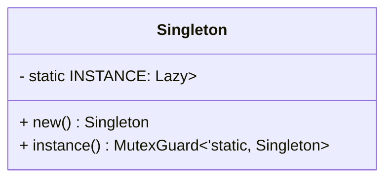

## 1.1. What Are Design Patterns in Rust?

### Introduction

Design patterns are a crucial aspect of software development, providing reusable solutions to common problems that arise during the design and implementation of software systems. In the context of Rust, a systems programming language known for its safety and concurrency features, design patterns play a pivotal role in crafting efficient, maintainable, and idiomatic code. This section delves into the essence of design patterns in Rust, exploring their significance, how Rust's unique features influence their implementation, and why understanding these patterns is essential for any Rust developer.

### Understanding Design Patterns

Design patterns are established solutions to recurring design problems. They encapsulate best practices that have been refined over time, offering a blueprint for solving specific issues in software architecture. These patterns are not language-specific; however, their implementation can vary significantly depending on the language's features and paradigms.

#### Role in Software Development

Design patterns serve several purposes in software development:

- **Standardization**: They provide a common vocabulary for developers, facilitating communication and understanding.
- **Efficiency**: By reusing proven solutions, developers can avoid reinventing the wheel, saving time and effort.
- **Maintainability**: Patterns promote code that is easier to understand, modify, and extend.
- **Scalability**: They help in designing systems that can grow and adapt to changing requirements.

### Relevance of Design Patterns in Rust

Rust's unique features, such as ownership, borrowing, and its powerful type system, influence the way design patterns are implemented. These features not only enhance safety and performance but also require a different approach to traditional design patterns.

#### Rust's Unique Features

- **Ownership and Borrowing**: Rust's ownership model ensures memory safety without a garbage collector, which affects how resources are managed and shared across patterns.
- **Concurrency**: Rust's concurrency model, often referred to as "fearless concurrency," allows for safe concurrent programming, influencing patterns related to parallelism and synchronization.
- **Type System and Traits**: Rust's expressive type system and traits enable polymorphism and abstraction, impacting the implementation of patterns like Strategy and Observer.

### Implementing Traditional Design Patterns in Rust

While the core concepts of design patterns remain consistent across languages, Rust's features necessitate adaptations. Let's explore how some traditional design patterns are implemented in Rust and how they differ from other languages.

#### Singleton Pattern

The Singleton pattern ensures a class has only one instance and provides a global point of access to it. In Rust, this pattern can be implemented using `lazy_static!` or `OnceCell` to ensure thread-safe initialization.

```rust
use once_cell::sync::Lazy;
use std::sync::Mutex;

// Singleton using Lazy and Mutex
static INSTANCE: Lazy<Mutex<Singleton>> = Lazy::new(|| Mutex::new(Singleton::new()));

struct Singleton {
    // Fields of the singleton
}

impl Singleton {
    fn new() -> Self {
        Singleton {
            // Initialize fields
        }
    }

    fn instance() -> std::sync::MutexGuard<'static, Singleton> {
        INSTANCE.lock().unwrap()
    }
}

fn main() {
    let singleton = Singleton::instance();
    // Use the singleton instance
}
```

**Comparison with Other Languages**: In languages like Java, the Singleton pattern often relies on static fields and synchronized methods. Rust's approach leverages its concurrency primitives to ensure thread safety without the overhead of synchronization mechanisms like locks.

#### Observer Pattern

The Observer pattern defines a one-to-many dependency between objects, allowing one object to notify others of state changes. In Rust, this can be achieved using channels for communication between observers and subjects.

```rust
use std::sync::mpsc::{self, Sender, Receiver};
use std::thread;

struct Subject {
    observers: Vec<Sender<String>>,
}

impl Subject {
    fn new() -> Self {
        Subject { observers: vec![] }
    }

    fn register_observer(&mut self, observer: Sender<String>) {
        self.observers.push(observer);
    }

    fn notify_observers(&self, message: String) {
        for observer in &self.observers {
            observer.send(message.clone()).unwrap();
        }
    }
}

fn main() {
    let (tx, rx): (Sender<String>, Receiver<String>) = mpsc::channel();
    let mut subject = Subject::new();
    subject.register_observer(tx);

    thread::spawn(move || {
        while let Ok(message) = rx.recv() {
            println!("Observer received: {}", message);
        }
    });

    subject.notify_observers("Hello, Observer!".to_string());
}
```

**Comparison with Other Languages**: In languages like C#, the Observer pattern might use events and delegates. Rust's use of channels provides a safe and efficient way to handle communication between threads, aligning with its concurrency model.

### Importance of Understanding Design Patterns in Rust

Mastering design patterns in Rust is essential for several reasons:

- **Idiomatic Code**: Understanding patterns helps write code that adheres to Rust's idioms, making it more readable and maintainable.
- **Efficiency**: Patterns provide optimized solutions that leverage Rust's features, leading to more efficient code.
- **Problem-Solving**: Familiarity with patterns equips developers with a toolkit for addressing common design challenges effectively.

### Visualizing Design Patterns in Rust

To better understand how design patterns are adapted in Rust, let's visualize the Singleton pattern using a class diagram.



**Diagram Description**: This diagram illustrates the Singleton pattern in Rust, highlighting the use of `Lazy` and `Mutex` to manage the single instance and ensure thread safety.

### Try It Yourself

Experiment with the provided code examples by modifying them to suit different scenarios. For instance, try implementing a thread-safe Singleton pattern without using `Lazy` or `OnceCell`, or adapt the Observer pattern to handle multiple types of messages.

### References and Further Reading

- [Rust Book](https://doc.rust-lang.org/book/)
- [Rust Design Patterns](https://rust-unofficial.github.io/patterns/)
- [Design Patterns: Elements of Reusable Object-Oriented Software](https://en.wikipedia.org/wiki/Design_Patterns)

### Knowledge Check

- What are design patterns, and why are they important in software development?
- How do Rust's ownership and borrowing features influence design patterns?
- Compare the implementation of the Singleton pattern in Rust with another language of your choice.
- Why is understanding design patterns crucial for writing idiomatic Rust code?

### Embrace the Journey

Remember, mastering design patterns in Rust is a journey. As you explore these patterns, you'll gain deeper insights into Rust's capabilities and how to harness them effectively. Keep experimenting, stay curious, and enjoy the process of becoming a proficient Rust developer!

## Quiz Time!



### What is the primary purpose of design patterns in software development?

- [x] To provide reusable solutions to common problems
- [ ] To enforce strict coding standards
- [ ] To replace the need for documentation
- [ ] To eliminate the need for testing

> **Explanation:** Design patterns offer reusable solutions to common design problems, helping developers create efficient and maintainable code.

### How does Rust's ownership model affect design patterns?

- [x] It ensures memory safety without a garbage collector
- [ ] It complicates the implementation of all design patterns
- [ ] It makes design patterns unnecessary
- [ ] It requires the use of garbage collection

> **Explanation:** Rust's ownership model ensures memory safety without a garbage collector, influencing how resources are managed in design patterns.

### Which Rust feature is crucial for implementing the Observer pattern?

- [x] Channels
- [ ] Traits
- [ ] Macros
- [ ] Generics

> **Explanation:** Channels are used in Rust to implement the Observer pattern, facilitating communication between observers and subjects.

### In Rust, what is used to ensure thread-safe initialization in the Singleton pattern?

- [x] Lazy and Mutex
- [ ] Static variables
- [ ] Synchronized methods
- [ ] Global variables

> **Explanation:** Rust uses `Lazy` and `Mutex` to ensure thread-safe initialization in the Singleton pattern.

### Why is understanding design patterns important for Rust developers?

- [x] It helps write idiomatic and efficient code
- [ ] It eliminates the need for testing
- [ ] It simplifies the Rust syntax
- [ ] It replaces the need for documentation

> **Explanation:** Understanding design patterns helps Rust developers write idiomatic and efficient code, leveraging Rust's unique features.

### What is a key benefit of using design patterns?

- [x] They promote code maintainability
- [ ] They eliminate the need for comments
- [ ] They make code execution faster
- [ ] They reduce code readability

> **Explanation:** Design patterns promote code maintainability by providing standardized solutions to common problems.

### How do design patterns facilitate communication among developers?

- [x] By providing a common vocabulary
- [ ] By enforcing strict coding standards
- [ ] By eliminating the need for meetings
- [ ] By automating code reviews

> **Explanation:** Design patterns provide a common vocabulary, making it easier for developers to communicate and understand each other's code.

### What is a common use of traits in Rust design patterns?

- [x] To enable polymorphism and abstraction
- [ ] To enforce strict type checking
- [ ] To replace the need for functions
- [ ] To simplify syntax

> **Explanation:** Traits in Rust are used to enable polymorphism and abstraction, which are crucial for implementing certain design patterns.

### True or False: Design patterns are language-specific and cannot be adapted to different programming languages.

- [ ] True
- [x] False

> **Explanation:** Design patterns are not language-specific; they can be adapted to different programming languages, though their implementation may vary.

### What is a key characteristic of Rust's concurrency model?

- [x] Fearless concurrency
- [ ] Synchronized methods
- [ ] Global locks
- [ ] Garbage collection

> **Explanation:** Rust's concurrency model is often referred to as "fearless concurrency," allowing for safe concurrent programming.




