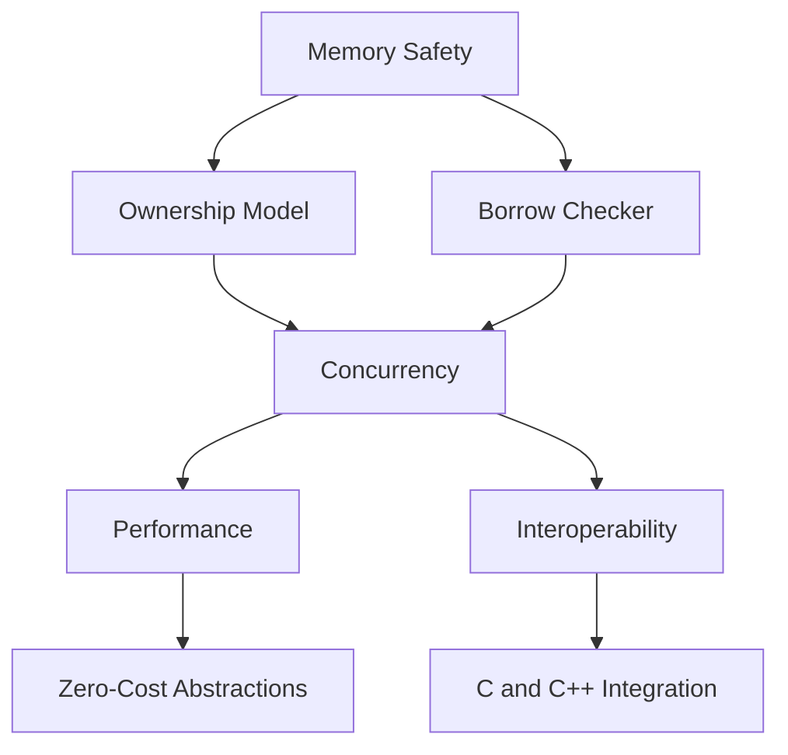

## 1.2. The Systems Programming Paradigm

### Introduction

The systems programming paradigm is a cornerstone of software development, focusing on creating software that interacts closely with hardware and operating systems. This paradigm is crucial for developing operating systems, embedded systems, real-time applications, and other performance-critical software. Rust, a modern systems programming language, has gained prominence for its ability to address the challenges traditionally associated with systems programming, such as memory safety and concurrency, while maintaining high performance.

### Defining Systems Programming

Systems programming involves writing software that provides services to other software, often interacting directly with hardware or managing system resources. Key characteristics of systems programming include:

- **Low-Level Access**: Direct interaction with hardware and system resources.
- **Performance**: High efficiency and speed, often with real-time constraints.
- **Resource Management**: Manual management of memory and other resources.
- **Concurrency**: Ability to handle multiple tasks simultaneously.
- **Portability**: Code that can run on various hardware platforms.

### Importance of Systems Programming

Systems programming is vital for several reasons:

1. **Foundation of Software Ecosystems**: Operating systems, device drivers, and embedded systems form the backbone of modern computing environments.
2. **Performance-Critical Applications**: Systems programming is essential for applications requiring high performance and low latency, such as gaming engines and high-frequency trading systems.
3. **Resource-Constrained Environments**: Embedded systems and IoT devices often operate with limited resources, necessitating efficient systems programming.

### Rust's Place in Systems Programming

Rust has emerged as a powerful language for systems programming, offering unique features that address traditional challenges:

- **Memory Safety**: Rust's ownership model ensures memory safety without a garbage collector, preventing common bugs like null pointer dereferencing and buffer overflows.
- **Concurrency**: Rust's type system and ownership model facilitate safe concurrency, allowing developers to write concurrent code without data races.
- **Performance**: Rust provides zero-cost abstractions, enabling high performance comparable to C and C++.
- **Interoperability**: Rust can interoperate with C and other languages, making it suitable for integrating with existing systems.

### Comparing Rust with C and C++

C and C++ have long been the dominant languages for systems programming. Let's compare them with Rust:

- **Memory Management**: C and C++ require manual memory management, leading to potential memory leaks and undefined behavior. Rust's ownership model automates memory management, reducing these risks.
- **Concurrency**: C and C++ offer concurrency but lack built-in safety mechanisms, leading to potential data races. Rust's concurrency model ensures thread safety.
- **Safety**: Rust provides compile-time guarantees for memory safety, while C and C++ rely on runtime checks and developer discipline.
- **Syntax and Features**: Rust offers modern syntax and features like pattern matching, algebraic data types, and a powerful macro system, enhancing developer productivity.

### Addressing Common Challenges in Systems Programming with Rust

#### Memory Safety

Memory safety is a critical concern in systems programming. Rust's ownership model enforces strict rules on how memory is accessed and modified, preventing common issues like:

- **Dangling Pointers**: Rust's borrow checker ensures that references are valid for the duration of their use.
- **Buffer Overflows**: Rust checks array bounds at compile time, preventing buffer overflows.
- **Use-After-Free**: Rust's ownership model prevents accessing memory after it has been freed.

Here's a simple example demonstrating Rust's memory safety:

```rust
fn main() {
    let mut data = vec![1, 2, 3];
    let data_ref = &data; // Borrowing data

    // Uncommenting the next line will cause a compile-time error
    // data.push(4);

    println!("{:?}", data_ref);
}
```

In this example, Rust prevents modifying `data` while it is borrowed, ensuring memory safety.

#### Concurrency

Concurrency is another challenge in systems programming. Rust's ownership model and type system provide safe concurrency mechanisms:

- **Ownership and Borrowing**: Rust ensures that data is accessed safely across threads.
- **Send and Sync Traits**: Rust's type system uses these traits to ensure that types are safe to transfer or share between threads.

Consider the following example of safe concurrency in Rust:

```rust
use std::thread;

fn main() {
    let data = vec![1, 2, 3];

    let handle = thread::spawn(move || {
        println!("{:?}", data);
    });

    handle.join().unwrap();
}
```

In this example, Rust's ownership model ensures that `data` is safely transferred to the new thread.

### Visualizing Rust's Systems Programming Model

Let's visualize Rust's systems programming model using a Mermaid.js diagram:



**Diagram Description**: This diagram illustrates how Rust's memory safety features, such as the ownership model and borrow checker, contribute to safe concurrency and high performance. It also highlights Rust's interoperability with C and C++.

### Knowledge Check

Let's test your understanding of the systems programming paradigm and Rust's role in it:

- **What are the key characteristics of systems programming?**
- **Why is memory safety important in systems programming?**
- **How does Rust's ownership model contribute to memory safety?**
- **What are the advantages of Rust's concurrency model over C and C++?**

### Conclusion

The systems programming paradigm is essential for developing reliable and efficient software that interacts closely with hardware and system resources. Rust embodies the principles of systems programming, offering unique features that address traditional challenges such as memory safety and concurrency. By leveraging Rust's capabilities, developers can build robust systems software with confidence.

### Embrace the Journey

Remember, mastering systems programming with Rust is a journey. As you explore Rust's features and design patterns, you'll gain the skills needed to tackle complex systems programming challenges. Keep experimenting, stay curious, and enjoy the journey!

## Quiz Time!



### What is a key characteristic of systems programming?

- [x] Low-Level Access
- [ ] High-Level Abstractions
- [ ] Automatic Memory Management
- [ ] Dynamic Typing

> **Explanation:** Systems programming involves direct interaction with hardware and system resources, which requires low-level access.

### Why is memory safety crucial in systems programming?

- [x] To prevent common bugs like null pointer dereferencing
- [ ] To enable dynamic typing
- [ ] To simplify syntax
- [ ] To allow automatic memory management

> **Explanation:** Memory safety prevents common bugs such as null pointer dereferencing and buffer overflows, which are critical in systems programming.

### How does Rust's ownership model ensure memory safety?

- [x] By enforcing strict rules on how memory is accessed and modified
- [ ] By using a garbage collector
- [ ] By allowing dynamic typing
- [ ] By providing high-level abstractions

> **Explanation:** Rust's ownership model enforces strict rules on memory access and modification, preventing issues like dangling pointers and use-after-free.

### What advantage does Rust's concurrency model have over C and C++?

- [x] It ensures thread safety through the type system
- [ ] It uses a garbage collector
- [ ] It allows dynamic typing
- [ ] It provides high-level abstractions

> **Explanation:** Rust's concurrency model ensures thread safety through its type system, preventing data races.

### Which feature of Rust contributes to high performance?

- [x] Zero-Cost Abstractions
- [ ] Automatic Memory Management
- [ ] Dynamic Typing
- [ ] High-Level Abstractions

> **Explanation:** Rust provides zero-cost abstractions, enabling high performance comparable to C and C++.

### What is a common challenge in systems programming that Rust addresses?

- [x] Memory Safety
- [ ] Dynamic Typing
- [ ] Automatic Memory Management
- [ ] High-Level Abstractions

> **Explanation:** Rust addresses memory safety, a common challenge in systems programming, through its ownership model.

### How does Rust ensure safe concurrency?

- [x] Through its ownership model and type system
- [ ] By using a garbage collector
- [ ] By allowing dynamic typing
- [ ] By providing high-level abstractions

> **Explanation:** Rust ensures safe concurrency through its ownership model and type system, preventing data races.

### What is a benefit of Rust's interoperability with C and C++?

- [x] It allows integration with existing systems
- [ ] It enables dynamic typing
- [ ] It simplifies syntax
- [ ] It provides automatic memory management

> **Explanation:** Rust's interoperability with C and C++ allows it to integrate with existing systems, making it suitable for systems programming.

### True or False: Rust uses a garbage collector for memory management.

- [ ] True
- [x] False

> **Explanation:** Rust does not use a garbage collector; it relies on its ownership model for memory management.

### Which of the following is NOT a characteristic of systems programming?

- [ ] Low-Level Access
- [ ] Performance
- [ ] Resource Management
- [x] Automatic Memory Management

> **Explanation:** Systems programming involves manual resource management, not automatic memory management.


