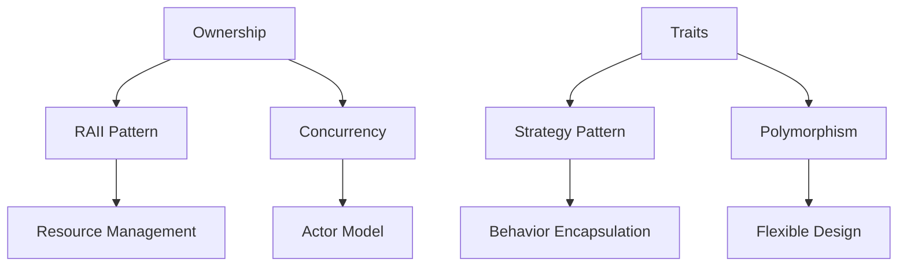

## 1.3. Why Design Patterns Matter in Rust

In the realm of software development, design patterns are akin to blueprints that guide developers in solving common problems efficiently. They encapsulate best practices and provide a shared language for developers to communicate complex ideas succinctly. In Rust, a systems programming language known for its emphasis on safety and concurrency, design patterns play a crucial role in harnessing the language's unique features to write clean, efficient, and scalable code.

### The Benefits of Using Design Patterns

Design patterns offer several benefits that are universally applicable across programming languages, including Rust:

- **Problem-Solving Efficiency**: Design patterns provide tried-and-tested solutions to common problems, saving developers time and effort in devising new solutions from scratch.
- **Code Reusability**: Patterns encourage the reuse of code structures, reducing redundancy and promoting consistency across projects.
- **Improved Communication**: By using a common vocabulary, design patterns facilitate better communication among team members and across different teams.
- **Enhanced Maintainability**: Patterns help organize code in a way that is easier to understand, modify, and extend, leading to more maintainable software.
- **Scalability**: Design patterns often provide scalable solutions that can grow with the application, accommodating increased complexity and functionality.

### Applying Design Patterns in Rust

Rust's unique features, such as ownership, borrowing, and traits, make it particularly well-suited for certain design patterns. Let's explore how these patterns can be applied in Rust to address specific challenges:

#### Ownership and Borrowing

Rust's ownership model is a powerful tool for ensuring memory safety without a garbage collector. Design patterns that leverage ownership and borrowing can help manage resources efficiently.

**Example: The RAII Pattern**

The RAII (Resource Acquisition Is Initialization) pattern is a common design pattern in Rust that leverages ownership to manage resources. By tying resource management to the lifetime of objects, RAII ensures that resources are released when they are no longer needed.

```rust
struct FileHandler {
    file: std::fs::File,
}

impl FileHandler {
    fn new(filename: &str) -> std::io::Result<FileHandler> {
        let file = std::fs::File::open(filename)?;
        Ok(FileHandler { file })
    }
}

// The file is automatically closed when FileHandler goes out of scope.
```

#### Traits and Trait Objects

Traits in Rust provide a way to define shared behavior across different types. They are essential for implementing polymorphism and can be used to apply various design patterns.

**Example: The Strategy Pattern**

The Strategy pattern allows the behavior of a class to be changed at runtime by encapsulating algorithms in separate classes. In Rust, this can be achieved using traits.

```rust
trait CompressionStrategy {
    fn compress(&self, data: &[u8]) -> Vec<u8>;
}

struct ZipCompression;
impl CompressionStrategy for ZipCompression {
    fn compress(&self, data: &[u8]) -> Vec<u8> {
        // Implement ZIP compression
        data.to_vec()
    }
}

struct RarCompression;
impl CompressionStrategy for RarCompression {
    fn compress(&self, data: &[u8]) -> Vec<u8> {
        // Implement RAR compression
        data.to_vec()
    }
}

fn compress_data(strategy: &dyn CompressionStrategy, data: &[u8]) -> Vec<u8> {
    strategy.compress(data)
}
```

#### Concurrency

Rust's fearless concurrency model, enabled by its ownership system, allows developers to write concurrent code without fear of data races. Design patterns that facilitate concurrency can be particularly effective in Rust.

**Example: The Actor Model**

The Actor model is a concurrency pattern that treats "actors" as the fundamental units of computation. In Rust, this can be implemented using channels for message passing.

```rust
use std::sync::mpsc;
use std::thread;

struct Actor {
    sender: mpsc::Sender<String>,
}

impl Actor {
    fn new() -> (Self, mpsc::Receiver<String>) {
        let (sender, receiver) = mpsc::channel();
        (Actor { sender }, receiver)
    }

    fn send_message(&self, message: String) {
        self.sender.send(message).unwrap();
    }
}

fn main() {
    let (actor, receiver) = Actor::new();

    thread::spawn(move || {
        actor.send_message("Hello, Actor!".to_string());
    });

    println!("Received: {}", receiver.recv().unwrap());
}
```

### Synergy Between Rust's Features and Design Patterns

Rust's features not only support but also enhance the application of design patterns. The synergy between Rust's unique characteristics and design patterns can lead to more robust and efficient software solutions.

- **Ownership and Safety**: Patterns that rely on resource management, like RAII, are naturally aligned with Rust's ownership model, ensuring safety and preventing resource leaks.
- **Traits and Flexibility**: Traits provide a flexible mechanism for implementing polymorphism, making patterns like Strategy and Observer straightforward to implement.
- **Concurrency and Performance**: Rust's concurrency model, combined with patterns like the Actor model, allows developers to write high-performance concurrent applications without sacrificing safety.

### Encouraging the Adoption of Design Patterns

Adopting design patterns in Rust can lead to significant improvements in code quality and maintainability. Here are some reasons to embrace design patterns in your Rust projects:

- **Clean Code**: Patterns help organize code in a way that is logical and easy to follow, reducing complexity and improving readability.
- **Efficiency**: By leveraging Rust's features, design patterns can lead to more efficient code, both in terms of performance and resource usage.
- **Scalability**: Patterns provide scalable solutions that can accommodate growth and changes in requirements, making them ideal for large and complex projects.

### Conclusion

Design patterns are an essential tool in the Rust developer's toolkit. By providing solutions to common problems and promoting best practices, they enhance the quality and maintainability of Rust code. The synergy between Rust's unique features and design patterns offers a powerful combination that can lead to robust, efficient, and scalable software solutions. As you continue your journey in Rust programming, consider incorporating design patterns into your projects to unlock their full potential.

### Try It Yourself

Experiment with the code examples provided in this section. Try modifying the `CompressionStrategy` trait to add a new compression algorithm, or implement a new actor in the Actor model example. These exercises will help reinforce your understanding of how design patterns can be applied in Rust.

### Visualizing Design Patterns in Rust

To better understand how design patterns integrate with Rust's features, let's visualize the interaction between ownership, traits, and concurrency.



**Figure 1**: This diagram illustrates the interaction between Rust's features and design patterns. Ownership supports the RAII pattern for resource management, while traits enable the Strategy pattern for behavior encapsulation. Concurrency in Rust is enhanced by the Actor model.

### References and Further Reading

- [Rust Programming Language](https://www.rust-lang.org/)
- [Design Patterns: Elements of Reusable Object-Oriented Software](https://en.wikipedia.org/wiki/Design_Patterns)
- [Rust by Example](https://doc.rust-lang.org/rust-by-example/)
- [The Rust Book](https://doc.rust-lang.org/book/)

### Knowledge Check

- What are the benefits of using design patterns in Rust?
- How does Rust's ownership model enhance the application of the RAII pattern?
- In what ways do traits facilitate the implementation of the Strategy pattern in Rust?
- How can the Actor model be used to achieve concurrency in Rust?
- Why is it important to adopt design patterns in Rust projects?

### Embrace the Journey

Remember, this is just the beginning. As you progress in your Rust programming journey, you'll discover more complex patterns and techniques. Keep experimenting, stay curious, and enjoy the journey!

## Quiz Time!



### What is one of the main benefits of using design patterns in Rust?

- [x] They provide tried-and-tested solutions to common problems.
- [ ] They eliminate the need for testing.
- [ ] They automatically optimize code.
- [ ] They replace the need for documentation.

> **Explanation:** Design patterns offer established solutions to common programming problems, improving efficiency and maintainability.

### How does the RAII pattern benefit from Rust's ownership model?

- [x] It ensures resources are released when they are no longer needed.
- [ ] It allows for dynamic memory allocation.
- [ ] It prevents the need for manual memory management.
- [ ] It enables garbage collection.

> **Explanation:** The RAII pattern ties resource management to object lifetimes, leveraging Rust's ownership model to ensure resources are released appropriately.

### Which Rust feature is essential for implementing the Strategy pattern?

- [x] Traits
- [ ] Enums
- [ ] Macros
- [ ] Modules

> **Explanation:** Traits in Rust allow for defining shared behavior, which is crucial for implementing the Strategy pattern.

### What is the primary purpose of the Actor model in Rust?

- [x] To achieve concurrency through message passing.
- [ ] To manage memory allocation.
- [ ] To implement polymorphism.
- [ ] To handle error propagation.

> **Explanation:** The Actor model uses message passing to achieve concurrency, aligning well with Rust's concurrency model.

### Why should developers adopt design patterns in Rust projects?

- [x] To improve code quality and maintainability.
- [ ] To eliminate the need for comments.
- [ ] To reduce the number of lines of code.
- [ ] To avoid using Rust's unique features.

> **Explanation:** Design patterns help organize code, making it easier to understand, modify, and extend, thus improving quality and maintainability.

### What role do traits play in Rust's design patterns?

- [x] They enable polymorphism and flexible design.
- [ ] They manage memory allocation.
- [ ] They enforce strict typing.
- [ ] They replace the need for functions.

> **Explanation:** Traits in Rust provide a mechanism for polymorphism, allowing for flexible and reusable design patterns.

### How does Rust's concurrency model enhance design patterns?

- [x] By allowing safe concurrent programming without data races.
- [ ] By enabling garbage collection.
- [ ] By simplifying memory management.
- [ ] By enforcing single-threaded execution.

> **Explanation:** Rust's concurrency model, supported by its ownership system, allows for safe concurrent programming, enhancing patterns like the Actor model.

### What is a key advantage of using the Strategy pattern in Rust?

- [x] It allows behavior to be changed at runtime.
- [ ] It simplifies memory management.
- [ ] It enforces compile-time checks.
- [ ] It eliminates the need for interfaces.

> **Explanation:** The Strategy pattern encapsulates algorithms, allowing behavior to be changed dynamically at runtime.

### How do design patterns improve scalability in Rust projects?

- [x] By providing scalable solutions that accommodate growth.
- [ ] By reducing the need for testing.
- [ ] By eliminating runtime errors.
- [ ] By enforcing strict memory limits.

> **Explanation:** Design patterns offer scalable solutions that can grow with the application, accommodating increased complexity and functionality.

### True or False: Design patterns in Rust replace the need for documentation.

- [ ] True
- [x] False

> **Explanation:** While design patterns improve code organization and readability, they do not replace the need for comprehensive documentation.


