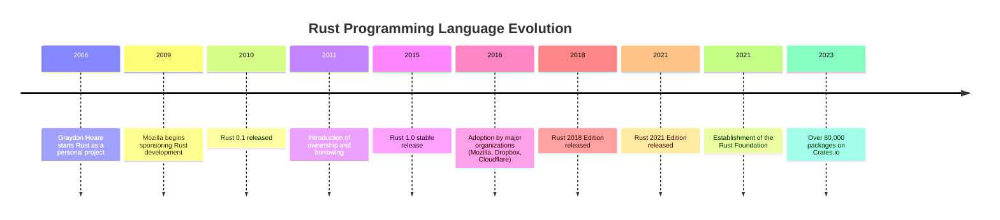

## 1.4. History of Rust and Its Ecosystem

The Rust programming language has become a cornerstone in the world of systems programming, renowned for its focus on safety, concurrency, and performance. This section delves into the history of Rust, tracing its origins, significant milestones, and the growth of its ecosystem. We will explore how Rust's history has shaped its current capabilities and community, making it a preferred choice for developers worldwide.

### Origins of Rust

Rust was conceived in 2006 by Graydon Hoare, a Mozilla employee, as a personal project. The language aimed to address common issues in systems programming, such as memory safety and concurrency, without sacrificing performance. Mozilla recognized the potential of Rust and began sponsoring its development in 2009. This marked the beginning of Rust's journey as a language designed to empower developers to build reliable and efficient software.

### Key Milestones in Rust's Development

Rust's development has been marked by several key milestones, each contributing to its evolution as a robust programming language. Let's explore these milestones in detail:

#### 1. **Rust 0.1 - The First Release (2010)**

The first official release of Rust, version 0.1, was announced in January 2010. This release laid the foundation for Rust's core principles, including memory safety, concurrency, and zero-cost abstractions. Although primitive compared to today's standards, Rust 0.1 set the stage for future developments.

#### 2. **Introduction of Ownership and Borrowing (2011)**

In 2011, Rust introduced its unique ownership and borrowing system, a groundbreaking feature that ensures memory safety without the need for a garbage collector. This system allows developers to manage memory manually while preventing common bugs like null pointer dereferencing and data races.

#### 3. **Rust 1.0 - The Stable Release (2015)**

Rust 1.0, released in May 2015, marked a significant milestone in the language's history. This stable release provided a solid foundation for developers, ensuring backward compatibility and a commitment to stability. Rust 1.0 introduced several key features, including pattern matching, traits, and the `Cargo` package manager.

#### 4. **Adoption of Rust by Major Organizations (2016-2018)**

Between 2016 and 2018, Rust gained traction among major organizations, including Mozilla, Dropbox, and Cloudflare. These companies recognized Rust's potential for building secure and high-performance software, leading to its adoption in critical projects.

#### 5. **Rust 2018 Edition (2018)**

The Rust 2018 Edition, released in December 2018, introduced several improvements and new features, including the `async`/`await` syntax for asynchronous programming, module system enhancements, and better error messages. This edition aimed to make Rust more accessible and productive for developers.

#### 6. **Rust 2021 Edition (2021)**

The Rust 2021 Edition, released in October 2021, continued the tradition of enhancing the language with new features and improvements. This edition focused on ergonomics, performance, and productivity, introducing features like the `IntoIterator` trait for arrays and the `or_patterns` feature for pattern matching.

### Growth of the Rust Community and Ecosystem

Rust's success can be attributed not only to its technical features but also to its vibrant community and ecosystem. Let's explore the key aspects of Rust's community and ecosystem:

#### 1. **The Rise of Crates.io**

Crates.io, Rust's official package registry, has played a pivotal role in the growth of the Rust ecosystem. Launched in 2014, Crates.io allows developers to share and discover Rust libraries and packages, fostering collaboration and innovation. As of 2023, Crates.io hosts over 80,000 packages, covering a wide range of domains, from web development to embedded systems.

#### 2. **RustConf and Community Events**

RustConf, the annual conference dedicated to Rust, has become a cornerstone of the Rust community. Since its inception in 2016, RustConf has brought together developers, enthusiasts, and industry leaders to share knowledge, discuss trends, and celebrate Rust's achievements. In addition to RustConf, numerous meetups, workshops, and online events contribute to the vibrant Rust community.

#### 3. **The Rust Foundation**

In 2021, the Rust Foundation was established to support the development and sustainability of the Rust programming language. The foundation provides financial and organizational support to the Rust project, ensuring its long-term success and growth. The Rust Foundation's efforts have strengthened the community and fostered collaboration among contributors.

### Notable Projects and Organizations Using Rust

Rust's unique features and capabilities have attracted a wide range of projects and organizations. Let's explore some notable examples:

#### 1. **Mozilla and Servo**

Mozilla, Rust's original sponsor, has been a key player in its development. The Servo project, a high-performance web browser engine, is one of the most prominent Rust-based projects. Servo's use of Rust's safety and concurrency features has demonstrated the language's potential in building complex and efficient software.

#### 2. **Dropbox**

Dropbox adopted Rust to enhance the performance and reliability of its file synchronization service. Rust's memory safety and concurrency features have enabled Dropbox to build a robust and efficient system, reducing bugs and improving user experience.

#### 3. **Cloudflare**

Cloudflare, a leading provider of internet security and performance solutions, has embraced Rust for its ability to deliver high-performance and secure software. Rust's safety guarantees have allowed Cloudflare to build reliable systems that handle millions of requests per second.

#### 4. **Microsoft and Azure**

Microsoft has recognized Rust's potential in building secure and efficient software. The company has integrated Rust into its Azure cloud platform, leveraging Rust's safety and performance features to enhance the security and reliability of its services.

### Reflecting on Rust's History and Its Impact

Rust's history is a testament to its commitment to safety, performance, and community. From its humble beginnings as a personal project to its current status as a leading systems programming language, Rust has evolved through innovation and collaboration. Its unique features, such as ownership and borrowing, have set new standards for memory safety and concurrency, influencing the design of other programming languages.

The growth of Rust's ecosystem, driven by Crates.io, RustConf, and the Rust Foundation, has fostered a vibrant community that continues to push the boundaries of what Rust can achieve. As Rust continues to evolve, its history serves as a foundation for future developments, ensuring that it remains a powerful and versatile tool for developers worldwide.

### Visualizing Rust's Evolution

To better understand Rust's evolution, let's visualize its development timeline and ecosystem growth using a Mermaid.js diagram:



### Conclusion

Rust's journey from a personal project to a widely adopted programming language is a testament to its innovative features and vibrant community. Its focus on safety, performance, and concurrency has made it a preferred choice for developers building reliable and efficient software. As Rust continues to evolve, its history and ecosystem will undoubtedly shape its future, ensuring its place as a leading language in the world of systems programming.

### Try It Yourself

To get hands-on experience with Rust, try modifying the following code example to explore Rust's ownership and borrowing system:

```rust
fn main() {
    let s1 = String::from("Hello");
    let s2 = s1; // Try changing this line to borrow s1 instead of moving it

    println!("{}", s2);
    // println!("{}", s1); // Uncomment this line to see the error
}
```

### Knowledge Check

- What are the key features that differentiate Rust from other systems programming languages?
- How has the Rust community contributed to the language's growth and success?
- What role does the Rust Foundation play in the development of Rust?

### References and Further Reading

- [Rust Programming Language](https://www.rust-lang.org/)
- [Crates.io](https://crates.io/)
- [RustConf](https://rustconf.com/)
- [Mozilla and Servo](https://servo.org/)
- [Dropbox Tech Blog](https://dropbox.tech/)
- [Cloudflare Blog](https://blog.cloudflare.com/)
- [Microsoft Azure](https://azure.microsoft.com/)

### Embrace the Journey

Remember, this is just the beginning of your journey with Rust. As you explore its history and ecosystem, you'll gain a deeper understanding of its capabilities and potential. Keep experimenting, stay curious, and enjoy the journey!

## Quiz Time!



### What year was Rust first conceived by Graydon Hoare?

- [x] 2006
- [ ] 2009
- [ ] 2010
- [ ] 2015

> **Explanation:** Rust was first conceived by Graydon Hoare in 2006 as a personal project.

### When did Mozilla begin sponsoring Rust's development?

- [ ] 2006
- [x] 2009
- [ ] 2010
- [ ] 2015

> **Explanation:** Mozilla began sponsoring Rust's development in 2009.

### What is the significance of Rust 1.0?

- [x] It marked the stable release of Rust.
- [ ] It introduced the ownership and borrowing system.
- [ ] It was the first release of Rust.
- [ ] It introduced the `async`/`await` syntax.

> **Explanation:** Rust 1.0, released in 2015, marked the stable release of the language, ensuring backward compatibility and stability.

### What feature was introduced in Rust 2018 Edition?

- [ ] Ownership and borrowing
- [ ] Pattern matching
- [x] `async`/`await` syntax
- [ ] The `IntoIterator` trait for arrays

> **Explanation:** The Rust 2018 Edition introduced the `async`/`await` syntax for asynchronous programming.

### Which organization was the original sponsor of Rust?

- [x] Mozilla
- [ ] Dropbox
- [ ] Cloudflare
- [ ] Microsoft

> **Explanation:** Mozilla was the original sponsor of Rust, recognizing its potential for systems programming.

### What is Crates.io?

- [x] Rust's official package registry
- [ ] A Rust-based web framework
- [ ] A Rust conference
- [ ] A Rust IDE

> **Explanation:** Crates.io is Rust's official package registry, allowing developers to share and discover Rust libraries and packages.

### What role does the Rust Foundation play?

- [x] It supports the development and sustainability of Rust.
- [ ] It organizes RustConf.
- [ ] It develops Rust-based applications.
- [ ] It manages Crates.io.

> **Explanation:** The Rust Foundation supports the development and sustainability of the Rust programming language.

### Which company adopted Rust to enhance its file synchronization service?

- [ ] Mozilla
- [x] Dropbox
- [ ] Cloudflare
- [ ] Microsoft

> **Explanation:** Dropbox adopted Rust to enhance the performance and reliability of its file synchronization service.

### What is the focus of RustConf?

- [x] To bring together developers and enthusiasts to share knowledge about Rust.
- [ ] To develop new Rust features.
- [ ] To manage Crates.io.
- [ ] To organize Rust-based hackathons.

> **Explanation:** RustConf is an annual conference that brings together developers and enthusiasts to share knowledge about Rust.

### True or False: Rust's ownership and borrowing system requires a garbage collector.

- [ ] True
- [x] False

> **Explanation:** Rust's ownership and borrowing system ensures memory safety without the need for a garbage collector.


