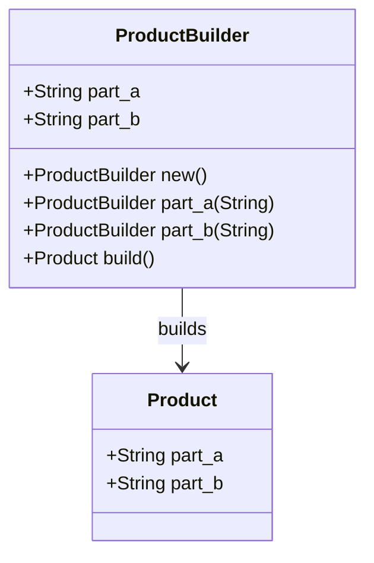

## 1.6. Benefits of Using Design Patterns in Rust

Design patterns are proven solutions to common problems in software design. In Rust, a systems programming language known for its emphasis on safety and concurrency, design patterns play a crucial role in enhancing code quality, maintainability, and collaboration. Let's explore the key benefits of using design patterns in Rust projects.

### Key Benefits of Implementing Design Patterns in Rust

1. **Improved Code Organization and Structure**

   Design patterns provide a blueprint for organizing code in a way that is both logical and efficient. By following established patterns, developers can create a consistent structure that makes the codebase easier to navigate and understand. This is particularly beneficial in Rust, where the ownership model and strict type system can lead to complex code structures.

   **Example: The Module System**

   Rust's module system allows developers to organize code into separate namespaces. By applying the Facade pattern, you can create a simplified interface for complex subsystems, making it easier to manage and use.

   ```rust
   // Facade pattern example
   mod subsystem_a {
       pub fn operation_a() {
           println!("Subsystem A operation");
       }
   }

   mod subsystem_b {
       pub fn operation_b() {
           println!("Subsystem B operation");
       }
   }

   pub struct Facade;

   impl Facade {
       pub fn perform_operations() {
           subsystem_a::operation_a();
           subsystem_b::operation_b();
       }
   }

   fn main() {
       Facade::perform_operations();
   }
   ```

   In this example, the `Facade` struct provides a simple interface to the underlying subsystems, improving code organization and usability.

2. **Enhanced Code Reusability**

   Design patterns promote code reuse by providing generic solutions that can be adapted to different contexts. This reduces duplication and the potential for errors, as well as saving development time.

   **Example: The Iterator Pattern**

   Rust's standard library extensively uses the Iterator pattern, allowing developers to create reusable and composable iteration logic.

   ```rust
   fn main() {
       let numbers = vec![1, 2, 3, 4, 5];
       let sum: i32 = numbers.iter().sum();
       println!("Sum: {}", sum);
   }
   ```

   The Iterator pattern allows for concise and reusable code, as seen in the use of the `iter()` method and the `sum()` function.

3. **Effective Problem Solving**

   Design patterns provide tried-and-tested solutions to common problems, enabling developers to solve complex issues more effectively. By leveraging patterns, developers can avoid reinventing the wheel and focus on the unique aspects of their projects.

   **Example: The Observer Pattern**

   In Rust, the Observer pattern can be used to implement event-driven systems, where changes in one part of the system automatically trigger updates in others.

   ```rust
   use std::sync::{Arc, Mutex};
   use std::thread;

   struct Subject {
       observers: Vec<Arc<Mutex<dyn Observer + Send>>>,
   }

   impl Subject {
       fn new() -> Self {
           Subject { observers: Vec::new() }
       }

       fn register_observer(&mut self, observer: Arc<Mutex<dyn Observer + Send>>) {
           self.observers.push(observer);
       }

       fn notify_observers(&self) {
           for observer in &self.observers {
               observer.lock().unwrap().update();
           }
       }
   }

   trait Observer {
       fn update(&self);
   }

   struct ConcreteObserver;

   impl Observer for ConcreteObserver {
       fn update(&self) {
           println!("Observer updated!");
       }
   }

   fn main() {
       let mut subject = Subject::new();
       let observer = Arc::new(Mutex::new(ConcreteObserver));
       subject.register_observer(observer.clone());

       thread::spawn(move || {
           subject.notify_observers();
       })
       .join()
       .unwrap();
   }
   ```

   This example demonstrates how the Observer pattern can be used to manage dependencies between objects, facilitating effective problem-solving.

4. **Managing Rust's Ownership Model**

   Rust's ownership model is one of its defining features, ensuring memory safety without a garbage collector. However, it can also introduce complexity, especially for developers new to the language. Design patterns help manage this complexity by providing clear guidelines for handling ownership, borrowing, and lifetimes.

   **Example: The Builder Pattern**

   The Builder pattern is particularly useful in Rust for constructing complex objects while managing ownership and borrowing.

   ```rust
   struct Product {
       part_a: String,
       part_b: String,
   }

   struct ProductBuilder {
       part_a: String,
       part_b: String,
   }

   impl ProductBuilder {
       fn new() -> Self {
           ProductBuilder {
               part_a: String::new(),
               part_b: String::new(),
           }
       }

       fn part_a(mut self, part_a: &str) -> Self {
           self.part_a = part_a.to_string();
           self
       }

       fn part_b(mut self, part_b: &str) -> Self {
           self.part_b = part_b.to_string();
           self
       }

       fn build(self) -> Product {
           Product {
               part_a: self.part_a,
               part_b: self.part_b,
           }
       }
   }

   fn main() {
       let product = ProductBuilder::new()
           .part_a("Part A")
           .part_b("Part B")
           .build();

       println!("Product: {} - {}", product.part_a, product.part_b);
   }
   ```

   The Builder pattern allows for flexible and safe object construction, handling ownership transitions smoothly.

5. **Facilitating Team Collaboration and Code Readability**

   Design patterns provide a common vocabulary for developers, making it easier to communicate ideas and collaborate on projects. By adhering to well-known patterns, teams can ensure that their code is readable and maintainable, even as team members change.

   **Example: The Strategy Pattern**

   The Strategy pattern allows developers to define a family of algorithms, encapsulate each one, and make them interchangeable. This promotes collaboration by enabling team members to work on different strategies independently.

   ```rust
   trait Strategy {
       fn execute(&self);
   }

   struct ConcreteStrategyA;

   impl Strategy for ConcreteStrategyA {
       fn execute(&self) {
           println!("Executing strategy A");
       }
   }

   struct ConcreteStrategyB;

   impl Strategy for ConcreteStrategyB {
       fn execute(&self) {
           println!("Executing strategy B");
       }
   }

   struct Context {
       strategy: Box<dyn Strategy>,
   }

   impl Context {
       fn new(strategy: Box<dyn Strategy>) -> Self {
           Context { strategy }
       }

       fn execute_strategy(&self) {
           self.strategy.execute();
       }
   }

   fn main() {
       let context = Context::new(Box::new(ConcreteStrategyA));
       context.execute_strategy();

       let context = Context::new(Box::new(ConcreteStrategyB));
       context.execute_strategy();
   }
   ```

   By using the Strategy pattern, teams can easily swap out different algorithms, enhancing collaboration and code readability.

### Try It Yourself

Now that we've explored the benefits of design patterns in Rust, it's time to experiment with the examples provided. Try modifying the code to implement additional features or patterns. For instance, extend the Observer pattern example to include multiple types of observers, or modify the Builder pattern to handle more complex objects. Remember, practice is key to mastering design patterns in Rust!

### Visualizing Design Patterns in Rust

To further enhance your understanding, let's visualize how design patterns interact with Rust's unique features, such as ownership and borrowing.



**Diagram Description:** This class diagram illustrates the relationship between the `ProductBuilder` and `Product` classes in the Builder pattern example. The `ProductBuilder` constructs a `Product` by managing the ownership of its parts.

### References and Links

- [Rust Design Patterns](https://rust-unofficial.github.io/patterns/)
- [The Rust Programming Language](https://doc.rust-lang.org/book/)
- [Design Patterns: Elements of Reusable Object-Oriented Software](https://en.wikipedia.org/wiki/Design_Patterns)

### Knowledge Check

- How do design patterns improve code organization in Rust?
- What role do design patterns play in managing Rust's ownership model?
- How can the Strategy pattern facilitate team collaboration?

### Embrace the Journey

Remember, this is just the beginning. As you continue to explore Rust and its design patterns, you'll discover new ways to enhance your code and collaborate effectively with your team. Keep experimenting, stay curious, and enjoy the journey!

## Quiz Time!



### What is one of the main benefits of using design patterns in Rust?

- [x] Improved code organization and structure
- [ ] Increased code complexity
- [ ] Reduced code readability
- [ ] Decreased collaboration

> **Explanation:** Design patterns help organize code in a logical and efficient manner, making it easier to navigate and understand.

### How do design patterns enhance code reusability in Rust?

- [x] By providing generic solutions that can be adapted to different contexts
- [ ] By increasing code duplication
- [ ] By making code less modular
- [ ] By complicating the codebase

> **Explanation:** Design patterns offer generic solutions that can be reused across different projects, reducing duplication and potential errors.

### Which design pattern is particularly useful for managing Rust's ownership model?

- [x] Builder Pattern
- [ ] Singleton Pattern
- [ ] Observer Pattern
- [ ] Strategy Pattern

> **Explanation:** The Builder pattern is useful for constructing complex objects while managing ownership and borrowing in Rust.

### How do design patterns facilitate team collaboration?

- [x] By providing a common vocabulary for developers
- [ ] By making code less readable
- [ ] By increasing code complexity
- [ ] By reducing code maintainability

> **Explanation:** Design patterns provide a common language that helps developers communicate ideas and collaborate effectively.

### What is the role of the Facade pattern in Rust?

- [x] To create a simplified interface for complex subsystems
- [ ] To increase code complexity
- [ ] To reduce code reusability
- [ ] To complicate the codebase

> **Explanation:** The Facade pattern simplifies the interface to complex subsystems, improving code organization and usability.

### Which pattern allows for defining a family of algorithms and making them interchangeable?

- [x] Strategy Pattern
- [ ] Observer Pattern
- [ ] Singleton Pattern
- [ ] Builder Pattern

> **Explanation:** The Strategy pattern allows for defining a family of algorithms, encapsulating each one, and making them interchangeable.

### How does the Observer pattern help in Rust?

- [x] By implementing event-driven systems
- [ ] By increasing code complexity
- [ ] By reducing code readability
- [ ] By complicating the ownership model

> **Explanation:** The Observer pattern is used to implement event-driven systems, where changes in one part of the system automatically trigger updates in others.

### What is a key benefit of using the Iterator pattern in Rust?

- [x] It allows for concise and reusable code
- [ ] It increases code duplication
- [ ] It complicates the codebase
- [ ] It reduces code modularity

> **Explanation:** The Iterator pattern allows for concise and reusable iteration logic, as seen in Rust's standard library.

### How do design patterns help manage Rust's ownership model?

- [x] By providing clear guidelines for handling ownership, borrowing, and lifetimes
- [ ] By increasing code complexity
- [ ] By reducing code readability
- [ ] By complicating the codebase

> **Explanation:** Design patterns offer clear guidelines for managing ownership, borrowing, and lifetimes, reducing complexity.

### True or False: Design patterns in Rust can lead to decreased collaboration among team members.

- [ ] True
- [x] False

> **Explanation:** Design patterns facilitate collaboration by providing a common vocabulary and ensuring code readability and maintainability.




