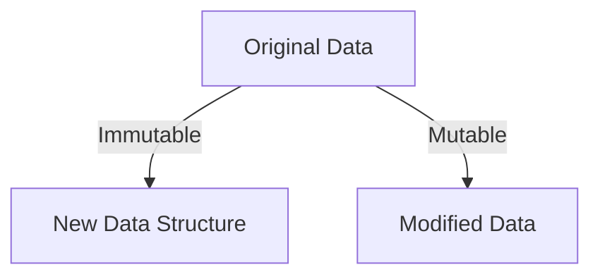

## 10.1. Immutability in Rust: Benefits and Best Practices

In the world of programming, immutability is a concept that has gained significant traction, especially in functional programming paradigms. Rust, a systems programming language known for its focus on safety and concurrency, embraces immutability as a core principle. In this section, we will delve into what immutability means, how Rust encourages it, and the myriad benefits it offers. We will also explore when to choose immutability over mutability and provide practical examples to illustrate these concepts.

### Understanding Immutability

Immutability refers to the state of an object or variable that cannot be modified after it is created. In contrast, mutability allows changes to the state or value of an object. Immutability is a fundamental concept in functional programming, where functions are expected to have no side effects, meaning they do not alter the state of the program or its variables.

#### Key Concepts of Immutability

- **Immutable Data Structures**: These are data structures that cannot be changed once created. Any modification results in a new data structure.
- **Referential Transparency**: A property of functions where the output is determined solely by its input values, without observable side effects.
- **Pure Functions**: Functions that do not alter any state and return the same result given the same inputs.

### Rust's Approach to Immutability

Rust encourages immutability by default. When you declare a variable in Rust, it is immutable unless explicitly stated otherwise. This design choice promotes safer and more predictable code by preventing unintended side effects and race conditions.

#### Declaring Variables in Rust

In Rust, variables are immutable by default. To declare a mutable variable, you must use the `mut` keyword.

```rust
fn main() {
    let x = 5; // Immutable variable
    // x = 6; // This line would cause a compile-time error

    let mut y = 10; // Mutable variable
    y = 15; // This is allowed
}
```

In the example above, `x` is immutable, and any attempt to change its value will result in a compile-time error. On the other hand, `y` is mutable, allowing its value to be modified.

### Benefits of Immutability

Immutability offers several advantages, particularly in the context of concurrent and parallel programming. Let's explore some of these benefits:

#### 1. Thread Safety

One of the most significant advantages of immutability is thread safety. In a multi-threaded environment, immutable data can be shared across threads without the need for synchronization mechanisms like locks. This is because immutable data cannot be altered, eliminating the risk of data races.

#### 2. Easier Debugging and Reasoning

Immutable data structures simplify debugging and reasoning about code. Since immutable variables do not change state, you can be confident that their values remain consistent throughout the program's execution. This consistency makes it easier to track down bugs and understand the flow of data.

#### 3. Predictable Code

Immutability leads to more predictable code. When functions operate on immutable data, their behavior is easier to predict, as they do not produce side effects that could alter the program's state unexpectedly.

#### 4. Simplified State Management

Managing state in applications becomes simpler with immutability. Since state changes result in new data structures, you can easily track changes over time, enabling features like undo/redo functionality.

### When to Choose Immutability Over Mutability

While immutability offers numerous benefits, there are scenarios where mutability is necessary or more efficient. Here are some guidelines on when to choose immutability:

- **Use Immutability**: When you want to ensure thread safety, simplify debugging, or maintain a consistent state throughout the program.
- **Use Mutability**: When performance is a critical concern, and you need to modify data in place to avoid the overhead of creating new data structures.

### Practical Examples

Let's explore some practical examples to illustrate the concepts of immutability and mutability in Rust.

#### Example 1: Immutable Data Structures

Consider a scenario where you need to process a list of numbers and calculate their sum. Using immutable data structures, you can achieve this without altering the original list.

```rust
fn sum_numbers(numbers: &[i32]) -> i32 {
    numbers.iter().sum()
}

fn main() {
    let numbers = vec![1, 2, 3, 4, 5];
    let total = sum_numbers(&numbers);
    println!("The sum is: {}", total);
}
```

In this example, the `numbers` vector remains unchanged, and the `sum_numbers` function operates on an immutable reference to the data.

#### Example 2: Mutable Data Structures

In some cases, you may need to modify data in place for performance reasons. Here's an example of using mutable data structures:

```rust
fn increment_numbers(numbers: &mut [i32]) {
    for number in numbers.iter_mut() {
        *number += 1;
    }
}

fn main() {
    let mut numbers = vec![1, 2, 3, 4, 5];
    increment_numbers(&mut numbers);
    println!("Incremented numbers: {:?}", numbers);
}
```

In this example, the `increment_numbers` function modifies the `numbers` vector in place, demonstrating the use of mutable data structures.

### Visualizing Immutability

To better understand the concept of immutability, let's visualize the flow of data in immutable and mutable scenarios.



**Figure 1**: This diagram illustrates how immutable data results in a new data structure, while mutable data modifies the original data in place.

### Try It Yourself

Experiment with the code examples provided above. Try modifying the immutable example to use mutable data structures and observe the differences in behavior. Conversely, attempt to make the mutable example immutable and note the changes required.

### Further Reading

For more information on immutability and its benefits, consider exploring the following resources:

- [Rust Programming Language Documentation](https://doc.rust-lang.org/)
- [Functional Programming Concepts](https://en.wikipedia.org/wiki/Functional_programming)
- [Concurrency in Rust](https://doc.rust-lang.org/book/ch16-00-concurrency.html)

### Knowledge Check

Before we wrap up, let's reinforce our understanding of immutability with a few questions:

1. What is immutability, and how does it differ from mutability?
2. Why does Rust encourage immutability by default?
3. What are some benefits of using immutable data structures?
4. When might you choose mutability over immutability?
5. How does immutability contribute to thread safety?

### Embrace the Journey

Remember, immutability is just one of the many powerful features Rust offers to help you write safer and more efficient code. As you continue your journey with Rust, keep experimenting with these concepts, stay curious, and enjoy the process of learning and growing as a developer!

## Quiz Time!



### What is immutability in programming?

- [x] The state of an object or variable that cannot be modified after it is created.
- [ ] The ability to change the state of an object or variable.
- [ ] A feature that allows functions to have side effects.
- [ ] A property of mutable data structures.

> **Explanation:** Immutability refers to the state of an object or variable that cannot be modified after it is created, ensuring consistency and predictability in code.

### How does Rust encourage immutability?

- [x] By making variables immutable by default.
- [ ] By requiring the use of the `mut` keyword for all variables.
- [ ] By disallowing mutable data structures.
- [ ] By using garbage collection to manage memory.

> **Explanation:** Rust encourages immutability by making variables immutable by default, requiring the `mut` keyword to explicitly declare mutable variables.

### What is a benefit of immutability?

- [x] Thread safety.
- [ ] Increased memory usage.
- [ ] Slower performance.
- [ ] More complex code.

> **Explanation:** Immutability provides thread safety, as immutable data can be shared across threads without the risk of data races.

### When should you choose mutability over immutability?

- [x] When performance is a critical concern and you need to modify data in place.
- [ ] When you want to ensure thread safety.
- [ ] When you want to simplify debugging.
- [ ] When you need to maintain a consistent state throughout the program.

> **Explanation:** Mutability is chosen over immutability when performance is a critical concern, allowing data to be modified in place to avoid the overhead of creating new data structures.

### What is referential transparency?

- [x] A property of functions where the output is determined solely by its input values, without observable side effects.
- [ ] The ability to change the state of an object or variable.
- [ ] A feature that allows functions to have side effects.
- [ ] A property of mutable data structures.

> **Explanation:** Referential transparency is a property of functions where the output is determined solely by its input values, without observable side effects, ensuring predictability.

### What is a pure function?

- [x] A function that does not alter any state and returns the same result given the same inputs.
- [ ] A function that modifies global variables.
- [ ] A function that has side effects.
- [ ] A function that uses mutable data structures.

> **Explanation:** A pure function does not alter any state and returns the same result given the same inputs, ensuring consistency and predictability.

### How does immutability simplify state management?

- [x] By ensuring state changes result in new data structures, making it easy to track changes over time.
- [ ] By allowing data to be modified in place.
- [ ] By increasing memory usage.
- [ ] By making code more complex.

> **Explanation:** Immutability simplifies state management by ensuring state changes result in new data structures, making it easy to track changes over time.

### What is a key advantage of immutable data structures in concurrent programming?

- [x] They can be shared across threads without the need for synchronization mechanisms like locks.
- [ ] They require more memory.
- [ ] They are slower to access.
- [ ] They increase the complexity of code.

> **Explanation:** Immutable data structures can be shared across threads without the need for synchronization mechanisms like locks, providing thread safety.

### What is the `mut` keyword used for in Rust?

- [x] To declare a variable as mutable.
- [ ] To declare a variable as immutable.
- [ ] To create a new data structure.
- [ ] To manage memory allocation.

> **Explanation:** The `mut` keyword is used in Rust to declare a variable as mutable, allowing its value to be modified.

### True or False: Immutability leads to more predictable code.

- [x] True
- [ ] False

> **Explanation:** True. Immutability leads to more predictable code, as functions operating on immutable data do not produce side effects that could alter the program's state unexpectedly.




