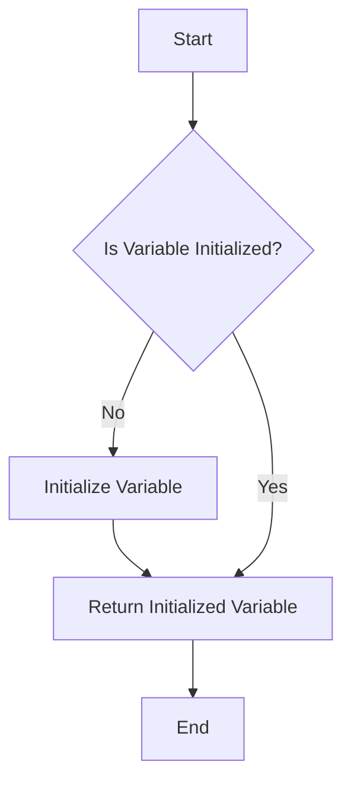

## 10.10. Lazy Static Initialization

In the world of systems programming, efficient resource management is crucial. One powerful technique to achieve this is **lazy initialization**. This pattern allows us to defer the computation of a value until it is actually needed, optimizing resource usage and improving application performance. In Rust, lazy initialization is particularly useful for managing global constants and shared resources in a thread-safe manner.

### What is Lazy Initialization?

Lazy initialization is a design pattern that delays the creation of an object or the computation of a value until it is needed. This can be particularly beneficial in scenarios where the initialization is resource-intensive or when the value might not be needed at all during the program's execution.

#### Why Use Lazy Initialization?

- **Resource Optimization**: By deferring the initialization, resources are only consumed when necessary.
- **Performance Improvement**: Reduces the startup time of applications by avoiding unnecessary computations.
- **Thread Safety**: Ensures that initialization is performed safely in concurrent environments.

### Introducing `lazy_static` and `once_cell`

Rust provides two popular crates for implementing lazy initialization: `lazy_static` and `once_cell`. Both offer mechanisms to initialize static variables lazily, but they have different use cases and features.

#### `lazy_static` Crate

The `lazy_static` crate allows you to define statics that are initialized lazily. It uses macros to create a static variable that is initialized on its first access.

- **Pros**: Simple to use, widely adopted.
- **Cons**: Requires macros, which can be less flexible than other approaches.

#### `once_cell` Crate

The `once_cell` crate provides a more flexible approach to lazy initialization. It offers both `OnceCell` and `Lazy` types, which can be used for single-threaded and multi-threaded contexts.

- **Pros**: More flexible, supports both single-threaded and multi-threaded contexts.
- **Cons**: Slightly more complex API compared to `lazy_static`.

### Using `lazy_static` for Global Constants

Let's start by exploring how to use the `lazy_static` crate to define global constants.

```rust
// Import the lazy_static crate
#[macro_use]
extern crate lazy_static;

use std::collections::HashMap;

// Define a lazily initialized static variable
lazy_static! {
    static ref CONFIG: HashMap<String, String> = {
        let mut m = HashMap::new();
        m.insert("key1".to_string(), "value1".to_string());
        m.insert("key2".to_string(), "value2".to_string());
        m
    };
}

fn main() {
    // Access the lazily initialized CONFIG
    println!("Config: {:?}", *CONFIG);
}
```

In this example, the `CONFIG` variable is a `HashMap` that is initialized only when it is accessed for the first time. This is achieved using the `lazy_static!` macro, which ensures thread-safe initialization.

### Using `once_cell` for Lazy Initialization

The `once_cell` crate provides a more flexible way to achieve lazy initialization. It can be used in both single-threaded and multi-threaded contexts.

#### Single-threaded Example

```rust
use once_cell::sync::Lazy;
use std::collections::HashMap;

// Define a lazily initialized static variable
static CONFIG: Lazy<HashMap<String, String>> = Lazy::new(|| {
    let mut m = HashMap::new();
    m.insert("key1".to_string(), "value1".to_string());
    m.insert("key2".to_string(), "value2".to_string());
    m
});

fn main() {
    // Access the lazily initialized CONFIG
    println!("Config: {:?}", *CONFIG);
}
```

#### Multi-threaded Example

For multi-threaded contexts, `once_cell::sync::Lazy` ensures that the initialization is thread-safe.

```rust
use once_cell::sync::Lazy;
use std::sync::Mutex;

// Define a lazily initialized static variable
static COUNTER: Lazy<Mutex<i32>> = Lazy::new(|| Mutex::new(0));

fn main() {
    // Access and modify the COUNTER in a thread-safe manner
    let mut num = COUNTER.lock().unwrap();
    *num += 1;
    println!("Counter: {}", *num);
}
```

### Thread Safety and Initialization Guarantees

Both `lazy_static` and `once_cell` provide strong guarantees about thread safety. They ensure that the initialization code is executed only once, even in the presence of multiple threads. This is achieved using synchronization primitives under the hood.

#### Key Points

- **Atomic Initialization**: The initialization is atomic, meaning it is completed fully before any thread can access the variable.
- **No Data Races**: The use of synchronization primitives ensures that there are no data races during initialization.

### Practical Use Cases and Best Practices

Lazy initialization is particularly useful in scenarios where the initialization is expensive or when the value might not be needed at all.

#### Use Cases

- **Configuration Management**: Load configuration settings only when they are needed.
- **Resource-Intensive Computations**: Defer expensive computations until their results are required.
- **Singleton Pattern**: Implement singletons that are initialized lazily.

#### Best Practices

- **Avoid Overuse**: While lazy initialization is powerful, it should not be overused. Use it only when there is a clear benefit.
- **Consider Initialization Cost**: Ensure that the initialization cost is justified by the deferred computation.
- **Thread Safety**: Always consider thread safety when using lazy initialization in multi-threaded contexts.

### Visualizing Lazy Initialization

To better understand how lazy initialization works, let's visualize the process using a flowchart.



**Figure 1**: Lazy Initialization Flowchart

This flowchart illustrates the decision-making process in lazy initialization. If the variable is not initialized, it is initialized and then returned. If it is already initialized, it is simply returned.

### Try It Yourself

To deepen your understanding, try modifying the examples provided:

- **Experiment with Different Data Structures**: Replace `HashMap` with other data structures like `Vec` or `BTreeMap`.
- **Add More Complexity**: Introduce more complex initialization logic, such as reading from a file or making a network request.
- **Test Thread Safety**: Create a multi-threaded program that accesses the lazily initialized variable from multiple threads.

### References and Further Reading

- [`lazy_static` crate documentation](https://crates.io/crates/lazy_static)
- [`once_cell` crate documentation](https://crates.io/crates/once_cell)
- [Rust Book: Concurrency](https://doc.rust-lang.org/book/ch16-00-concurrency.html)

### Knowledge Check

Before we wrap up, let's reinforce what we've learned with a few questions:

1. What is lazy initialization, and why is it useful?
2. How does the `lazy_static` crate help in implementing lazy initialization?
3. What are the differences between `lazy_static` and `once_cell`?
4. Why is thread safety important in lazy initialization?
5. Can you think of a scenario where lazy initialization might not be beneficial?

### Embrace the Journey

Remember, mastering lazy initialization is just one step in your Rust journey. As you continue to explore Rust's powerful features, you'll find more opportunities to optimize your code and improve performance. Keep experimenting, stay curious, and enjoy the journey!

## Quiz Time!



### What is lazy initialization?

- [x] A pattern that delays the creation of an object until it is needed.
- [ ] A pattern that initializes all objects at the start of a program.
- [ ] A pattern that prevents objects from being initialized.
- [ ] A pattern that initializes objects in parallel.

> **Explanation:** Lazy initialization delays the creation of an object until it is needed, optimizing resource usage.

### Which crate provides macros for lazy initialization in Rust?

- [x] `lazy_static`
- [ ] `serde`
- [ ] `tokio`
- [ ] `rand`

> **Explanation:** The `lazy_static` crate provides macros for lazy initialization in Rust.

### What is a key benefit of lazy initialization?

- [x] Resource optimization
- [ ] Increased memory usage
- [ ] Slower program startup
- [ ] Guaranteed initialization order

> **Explanation:** Lazy initialization optimizes resource usage by deferring computation until needed.

### How does `once_cell` differ from `lazy_static`?

- [x] `once_cell` provides more flexibility and supports both single-threaded and multi-threaded contexts.
- [ ] `once_cell` is only for single-threaded contexts.
- [ ] `once_cell` requires macros for initialization.
- [ ] `once_cell` is less flexible than `lazy_static`.

> **Explanation:** `once_cell` offers more flexibility and supports both single-threaded and multi-threaded contexts.

### Why is thread safety important in lazy initialization?

- [x] To prevent data races and ensure atomic initialization.
- [ ] To increase the speed of initialization.
- [ ] To allow multiple initializations.
- [ ] To reduce memory usage.

> **Explanation:** Thread safety prevents data races and ensures atomic initialization, crucial in concurrent environments.

### What is a common use case for lazy initialization?

- [x] Configuration management
- [ ] Immediate computation
- [ ] Parallel processing
- [ ] Static typing

> **Explanation:** Lazy initialization is commonly used for configuration management to load settings only when needed.

### Which of the following is a best practice for lazy initialization?

- [x] Avoid overuse and ensure the initialization cost is justified.
- [ ] Use it for all variables.
- [ ] Initialize variables in parallel.
- [ ] Avoid using it in multi-threaded contexts.

> **Explanation:** Avoid overusing lazy initialization and ensure the initialization cost is justified.

### What does the `lazy_static!` macro do?

- [x] It creates a static variable that is initialized on its first access.
- [ ] It creates a static variable that is initialized at program start.
- [ ] It creates a dynamic variable that is initialized on its first access.
- [ ] It creates a dynamic variable that is initialized at program start.

> **Explanation:** The `lazy_static!` macro creates a static variable initialized on its first access.

### Can `once_cell` be used in multi-threaded contexts?

- [x] True
- [ ] False

> **Explanation:** `once_cell` can be used in multi-threaded contexts, providing thread-safe initialization.

### What is the main advantage of using `once_cell::sync::Lazy`?

- [x] It ensures thread-safe initialization in multi-threaded contexts.
- [ ] It requires less memory.
- [ ] It speeds up program startup.
- [ ] It simplifies code syntax.

> **Explanation:** `once_cell::sync::Lazy` ensures thread-safe initialization in multi-threaded contexts.




