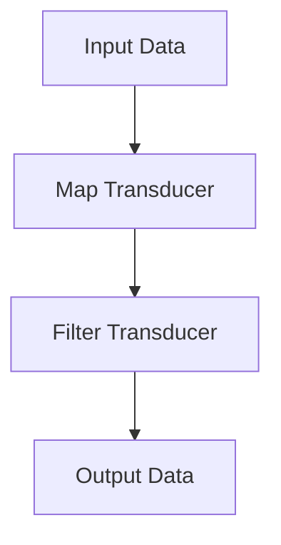

## 10.11. Transducers for Efficient Data Processing

In the realm of functional programming, transducers are a powerful concept that allows us to compose data transformations efficiently without creating intermediate collections. This section will delve into the concept of transducers, their implementation in Rust, and how they can be leveraged to improve performance in data-intensive applications.

### What Are Transducers?

Transducers are a concept that originated in the Clojure programming language, designed to provide a way to compose sequence transformations in a way that is independent of the context of their application. In simpler terms, transducers are composable and reusable transformations that can be applied to different kinds of data structures, such as lists, vectors, or streams, without the need for intermediate data structures.

#### Purpose of Transducers

The primary purpose of transducers is to optimize data processing by eliminating the creation of intermediate collections. This is particularly useful in scenarios where large datasets are being processed, as it reduces memory overhead and improves performance.

### How Transducers Differ from Regular Iterators

While both transducers and iterators are used for processing sequences of data, they differ in several key ways:

- **Composition**: Transducers are designed to be composed together, allowing multiple transformations to be combined into a single operation. Iterators, on the other hand, typically chain operations, which can lead to the creation of intermediate collections.
- **Context Independence**: Transducers are context-independent, meaning they can be applied to any data structure that supports the necessary operations. Iterators are often tied to specific data structures.
- **Efficiency**: By eliminating intermediate collections, transducers can offer significant performance improvements over traditional iterator-based approaches.

### Implementing Transducers in Rust

Let's explore how we can implement transducers in Rust. We'll start with a simple example and gradually build up to more complex use cases.

#### Basic Transducer Implementation

To implement a transducer in Rust, we need to define a transformation function that can be applied to a sequence of data. Here's a basic example:

```rust
fn map_transducer<F, T, U>(f: F) -> impl Fn(Box<dyn Fn(U) -> U>) -> Box<dyn Fn(T) -> U>
where
    F: Fn(T) -> U + 'static,
    T: 'static,
    U: 'static,
{
    move |next| {
        Box::new(move |input| {
            let result = f(input);
            next(result)
        })
    }
}
```

In this example, `map_transducer` is a function that takes a transformation function `f` and returns a new function that applies `f` to each element of a sequence, passing the result to the next function in the chain.

#### Composing Transducers

One of the key benefits of transducers is their ability to be composed together. Let's see how we can compose multiple transducers:

```rust
fn compose_transducers<T, U, V>(
    transducer1: impl Fn(Box<dyn Fn(U) -> V>) -> Box<dyn Fn(T) -> U>,
    transducer2: impl Fn(Box<dyn Fn(V) -> V>) -> Box<dyn Fn(U) -> V>,
) -> impl Fn(Box<dyn Fn(V) -> V>) -> Box<dyn Fn(T) -> V> {
    move |next| {
        let next = transducer2(next);
        transducer1(next)
    }
}
```

This `compose_transducers` function takes two transducers and returns a new transducer that applies both transformations in sequence.

#### Applying Transducers to Data

To apply a transducer to a sequence of data, we need to define a reducing function that processes each element of the sequence. Here's an example of how we can apply a composed transducer to a vector of integers:

```rust
fn main() {
    let data = vec![1, 2, 3, 4, 5];

    let map_transducer = map_transducer(|x| x * 2);
    let filter_transducer = map_transducer(|x| x > 5);

    let composed_transducer = compose_transducers(map_transducer, filter_transducer);

    let result: Vec<_> = data.into_iter().map(composed_transducer).collect();

    println!("{:?}", result);
}
```

In this example, we define a `map_transducer` that doubles each element and a `filter_transducer` that filters out elements less than or equal to 5. We then compose these transducers and apply them to a vector of integers.

### Performance Improvements with Transducers

Transducers can offer significant performance improvements over traditional iterator-based approaches by eliminating the creation of intermediate collections. This is particularly beneficial in scenarios where large datasets are being processed, as it reduces memory overhead and improves cache locality.

#### Benchmarking Transducers

To demonstrate the performance benefits of transducers, let's compare the execution time of a transducer-based approach with a traditional iterator-based approach:

```rust
use std::time::Instant;

fn main() {
    let data: Vec<i32> = (0..1_000_000).collect();

    let start = Instant::now();
    let result: Vec<_> = data.iter().map(|x| x * 2).filter(|x| x > &5).collect();
    let duration = start.elapsed();
    println!("Iterator-based approach: {:?}", duration);

    let start = Instant::now();
    let map_transducer = map_transducer(|x| x * 2);
    let filter_transducer = map_transducer(|x| x > 5);
    let composed_transducer = compose_transducers(map_transducer, filter_transducer);
    let result: Vec<_> = data.into_iter().map(composed_transducer).collect();
    let duration = start.elapsed();
    println!("Transducer-based approach: {:?}", duration);
}
```

In this benchmark, we process a vector of one million integers using both an iterator-based approach and a transducer-based approach. The transducer-based approach is expected to be faster due to the elimination of intermediate collections.

### Use Cases for Transducers

Transducers are particularly useful in data-intensive applications where performance and memory efficiency are critical. Some potential use cases include:

- **Data Processing Pipelines**: Transducers can be used to build efficient data processing pipelines that handle large datasets without creating intermediate collections.
- **Real-Time Data Processing**: In real-time data processing applications, transducers can help reduce latency by minimizing memory overhead.
- **Functional Programming**: Transducers are a natural fit for functional programming paradigms, allowing for the composition of reusable and composable transformations.

### Rust's Unique Features for Transducers

Rust's ownership model and zero-cost abstractions make it an ideal language for implementing transducers. The language's strong type system and borrow checker ensure memory safety and prevent common errors such as null pointer dereferences and data races.

#### Leveraging Rust's Type System

Rust's type system allows us to define transducers in a way that is both safe and efficient. By using traits and generics, we can create flexible and reusable transducers that can be applied to different types of data structures.

### Differences and Similarities with Other Patterns

Transducers are often compared to other functional programming patterns such as iterators and monads. While they share some similarities, transducers are unique in their ability to compose transformations without creating intermediate collections.

#### Key Differences

- **Iterators**: While iterators are used to process sequences of data, they often create intermediate collections when chaining operations. Transducers eliminate this overhead by composing transformations into a single operation.
- **Monads**: Monads are a more general concept that can be used to model computations. Transducers are specifically designed for sequence transformations and are more efficient in this context.

### Conclusion

Transducers are a powerful tool for efficient data processing in Rust. By eliminating intermediate collections and allowing for the composition of reusable transformations, transducers can significantly improve performance in data-intensive applications. Rust's unique features, such as its ownership model and strong type system, make it an ideal language for implementing transducers.

### Try It Yourself

To get a better understanding of transducers, try modifying the code examples provided in this section. Experiment with different transformation functions and data structures to see how transducers can be applied in various scenarios.

### Visualizing Transducers

To help visualize the concept of transducers, let's use a Mermaid.js diagram to illustrate the flow of data through a composed transducer:



This diagram shows how input data flows through a series of transducers, with each transducer applying a transformation to the data before passing it to the next transducer in the chain.

### References and Links

For further reading on transducers and functional programming in Rust, consider the following resources:

- [Clojure Transducers](https://clojure.org/reference/transducers)
- [Rust Programming Language](https://www.rust-lang.org/)
- [Functional Programming in Rust](https://doc.rust-lang.org/book/ch13-00-functional-features.html)

### Knowledge Check

To reinforce your understanding of transducers, try answering the following questions:

## Quiz Time!



### What is the primary purpose of transducers?

- [x] To optimize data processing by eliminating intermediate collections
- [ ] To provide a way to iterate over data
- [ ] To create new data structures
- [ ] To simplify error handling

> **Explanation:** Transducers are designed to optimize data processing by eliminating the creation of intermediate collections, reducing memory overhead and improving performance.

### How do transducers differ from regular iterators?

- [x] Transducers compose transformations without creating intermediate collections
- [ ] Transducers are specific to Rust
- [ ] Transducers are a type of iterator
- [ ] Transducers are used for error handling

> **Explanation:** Transducers differ from regular iterators in that they compose transformations into a single operation, eliminating the need for intermediate collections.

### What is a key benefit of using transducers in data-intensive applications?

- [x] Improved performance and reduced memory overhead
- [ ] Simplified error handling
- [ ] Enhanced security
- [ ] Increased code readability

> **Explanation:** Transducers offer improved performance and reduced memory overhead by eliminating intermediate collections, making them ideal for data-intensive applications.

### In which programming language did the concept of transducers originate?

- [x] Clojure
- [ ] Rust
- [ ] Python
- [ ] JavaScript

> **Explanation:** The concept of transducers originated in the Clojure programming language.

### What is a common use case for transducers?

- [x] Building efficient data processing pipelines
- [ ] Simplifying error handling
- [ ] Enhancing security
- [ ] Improving code readability

> **Explanation:** Transducers are commonly used to build efficient data processing pipelines that handle large datasets without creating intermediate collections.

### Which Rust feature makes it an ideal language for implementing transducers?

- [x] Ownership model and zero-cost abstractions
- [ ] Dynamic typing
- [ ] Garbage collection
- [ ] Weak typing

> **Explanation:** Rust's ownership model and zero-cost abstractions make it an ideal language for implementing transducers, ensuring memory safety and performance.

### How can transducers be composed together?

- [x] By combining multiple transformations into a single operation
- [ ] By creating new data structures
- [ ] By using error handling mechanisms
- [ ] By simplifying code readability

> **Explanation:** Transducers can be composed together by combining multiple transformations into a single operation, eliminating the need for intermediate collections.

### What is a key difference between transducers and monads?

- [x] Transducers are specifically designed for sequence transformations
- [ ] Transducers are more general than monads
- [ ] Transducers are used for error handling
- [ ] Transducers are a type of iterator

> **Explanation:** Transducers are specifically designed for sequence transformations, while monads are a more general concept used to model computations.

### What is the expected outcome of using transducers in a data processing pipeline?

- [x] Reduced memory overhead and improved performance
- [ ] Increased code complexity
- [ ] Enhanced security
- [ ] Simplified error handling

> **Explanation:** The expected outcome of using transducers in a data processing pipeline is reduced memory overhead and improved performance.

### True or False: Transducers are tied to specific data structures.

- [ ] True
- [x] False

> **Explanation:** Transducers are context-independent and can be applied to any data structure that supports the necessary operations.



Remember, this is just the beginning. As you progress, you'll discover more advanced techniques and patterns that can be applied to your Rust projects. Keep experimenting, stay curious, and enjoy the journey!
