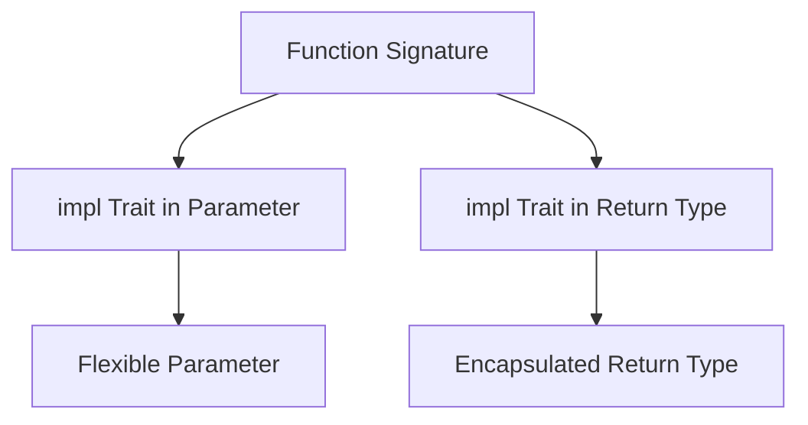

## 10.12. Using the `impl Trait` for Abstraction

In the world of Rust programming, abstraction is a powerful tool that allows developers to write flexible and reusable code. One of the features that Rust provides to facilitate abstraction is `impl Trait`. This feature simplifies code by enabling abstraction over types in function signatures, making it easier to work with complex type systems. In this section, we'll delve into what `impl Trait` is, how it differs from explicit generics, and how you can use it effectively in your Rust programs.

### What is `impl Trait`?

`impl Trait` is a feature in Rust that allows you to specify that a function parameter or return type implements a particular trait without explicitly naming the type. This can make your code more concise and easier to read, as it abstracts away the details of the specific types involved.

#### Key Concepts

- **Trait**: A collection of methods that define behavior. In Rust, traits are used to specify shared behavior across different types.
- **`impl Trait`**: A syntax that allows you to specify that a type implements a trait without naming the type explicitly.

### Differences Between `impl Trait` and Explicit Generics

While both `impl Trait` and explicit generics provide ways to work with types that implement certain traits, they serve different purposes and have distinct characteristics.

#### Explicit Generics

Explicit generics require you to define a generic type parameter and specify the trait bounds. This approach is more verbose but offers greater flexibility, such as allowing multiple trait bounds and specifying the same type across multiple parameters.

```rust
fn print_items<T: std::fmt::Display>(items: Vec<T>) {
    for item in items {
        println!("{}", item);
    }
}
```

#### `impl Trait`

`impl Trait` simplifies function signatures by removing the need to declare generic parameters explicitly. It is particularly useful when you don't need to refer to the type elsewhere in the function signature.

```rust
fn print_items(items: impl IntoIterator<Item = impl std::fmt::Display>) {
    for item in items {
        println!("{}", item);
    }
}
```

### Using `impl Trait` in Function Parameters

One of the most common uses of `impl Trait` is in function parameters. This allows you to specify that a parameter implements a particular trait without naming the type.

#### Example: Parameter Position

```rust
fn display_length(item: impl std::fmt::Display) {
    println!("The item is: {}", item);
}
```

In this example, `display_length` accepts any type that implements the `Display` trait. This makes the function flexible and reusable with different types.

### Using `impl Trait` in Return Types

`impl Trait` can also be used in return types, allowing you to specify that a function returns a type that implements a particular trait.

#### Example: Return Position

```rust
fn make_adder(x: i32) -> impl Fn(i32) -> i32 {
    move |y| x + y
}
```

Here, `make_adder` returns a closure that implements the `Fn` trait. This is a powerful feature that allows you to return complex types without exposing their concrete types.

### Benefits of Using `impl Trait`

- **Conciseness**: `impl Trait` reduces boilerplate code, making function signatures cleaner and easier to read.
- **Encapsulation**: By hiding the concrete type, `impl Trait` helps encapsulate implementation details, promoting better abstraction.
- **Flexibility**: It allows functions to work with any type that satisfies the trait bounds, increasing the flexibility and reusability of code.

### Limitations and Considerations

While `impl Trait` offers many benefits, there are some limitations and scenarios where explicit generics might be preferable.

- **Single Trait Bound**: `impl Trait` only allows a single trait bound. If you need multiple trait bounds, explicit generics are necessary.
- **Type Consistency**: If you need to ensure that multiple parameters or return types are the same, explicit generics provide a way to enforce this.
- **Complex Trait Bounds**: For complex trait bounds involving multiple traits or lifetimes, explicit generics offer more control and clarity.

### When to Use `impl Trait`

- **Simplifying Function Signatures**: Use `impl Trait` when you want to simplify function signatures and don't need to refer to the type elsewhere.
- **Hiding Implementation Details**: When you want to hide the concrete type from the function's users, `impl Trait` provides a way to encapsulate these details.
- **Working with Closures**: `impl Trait` is particularly useful for returning closures, as it abstracts away the complex types involved.

### Code Examples

Let's explore some practical examples to see how `impl Trait` can be used effectively.

#### Example 1: Filtering Items

```rust
fn filter_items<F>(items: Vec<i32>, predicate: F) -> Vec<i32>
where
    F: Fn(i32) -> bool,
{
    items.into_iter().filter(predicate).collect()
}

fn main() {
    let numbers = vec![1, 2, 3, 4, 5];
    let even_numbers = filter_items(numbers, |x| x % 2 == 0);
    println!("{:?}", even_numbers);
}
```

#### Example 2: Returning Iterators

```rust
fn range(start: i32, end: i32) -> impl Iterator<Item = i32> {
    (start..end).filter(|x| x % 2 == 0)
}

fn main() {
    for number in range(0, 10) {
        println!("{}", number);
    }
}
```

### Visualizing `impl Trait` Usage

To better understand how `impl Trait` works, let's visualize its usage in a function signature.



This diagram illustrates how `impl Trait` can be used in both parameter and return positions to create flexible and encapsulated function signatures.

### Try It Yourself

Experiment with the code examples provided. Try modifying the predicates or the range values to see how `impl Trait` handles different scenarios. This hands-on approach will help solidify your understanding of `impl Trait`.

### Further Reading

For more information on `impl Trait`, consider exploring the following resources:

- [Rust Documentation on `impl Trait`](https://doc.rust-lang.org/book/ch10-02-traits.html)
- [Rust by Example: Traits](https://doc.rust-lang.org/rust-by-example/trait.html)

### Summary

`impl Trait` is a powerful feature in Rust that simplifies code and enhances abstraction by allowing you to specify that a type implements a trait without naming the type. It offers benefits such as conciseness, encapsulation, and flexibility, making it a valuable tool in a Rust developer's toolkit. However, it's essential to understand its limitations and when to prefer explicit generics for more complex scenarios.

## Quiz Time!



### What is `impl Trait` used for in Rust?

- [x] To specify that a type implements a trait without naming the type.
- [ ] To define a new trait.
- [ ] To create a new type.
- [ ] To implement a trait for a type.

> **Explanation:** `impl Trait` is used to specify that a type implements a trait without explicitly naming the type, simplifying function signatures.

### How does `impl Trait` differ from explicit generics?

- [x] `impl Trait` simplifies function signatures by removing the need to declare generic parameters explicitly.
- [ ] `impl Trait` allows multiple trait bounds.
- [ ] `impl Trait` requires naming the type.
- [ ] `impl Trait` is used only for return types.

> **Explanation:** `impl Trait` simplifies function signatures by removing the need to declare generic parameters explicitly, unlike explicit generics.

### In which positions can `impl Trait` be used?

- [x] Parameter and return positions.
- [ ] Only parameter positions.
- [ ] Only return positions.
- [ ] In trait definitions.

> **Explanation:** `impl Trait` can be used in both parameter and return positions in function signatures.

### What is a limitation of `impl Trait`?

- [x] It only allows a single trait bound.
- [ ] It requires explicit type naming.
- [ ] It cannot be used in return types.
- [ ] It is not supported in stable Rust.

> **Explanation:** `impl Trait` only allows a single trait bound, which is a limitation compared to explicit generics.

### When is it preferable to use explicit generics over `impl Trait`?

- [x] When multiple trait bounds are needed.
- [ ] When simplifying function signatures.
- [ ] When hiding implementation details.
- [ ] When working with closures.

> **Explanation:** Explicit generics are preferable when multiple trait bounds are needed, as `impl Trait` only supports a single trait bound.

### What is a benefit of using `impl Trait`?

- [x] It reduces boilerplate code.
- [ ] It requires more explicit type declarations.
- [ ] It complicates function signatures.
- [ ] It is only useful for closures.

> **Explanation:** `impl Trait` reduces boilerplate code, making function signatures cleaner and easier to read.

### Can `impl Trait` be used to return closures?

- [x] Yes, it can abstract away the complex types involved in closures.
- [ ] No, closures require explicit generics.
- [ ] Only in parameter positions.
- [ ] Only with a single trait bound.

> **Explanation:** `impl Trait` can be used to return closures, abstracting away the complex types involved.

### What does `impl Trait` help encapsulate?

- [x] Implementation details by hiding the concrete type.
- [ ] The entire function body.
- [ ] Only the function parameters.
- [ ] Only the function return type.

> **Explanation:** `impl Trait` helps encapsulate implementation details by hiding the concrete type from the function's users.

### Which of the following is a correct use of `impl Trait`?

- [x] `fn display_length(item: impl std::fmt::Display)`
- [ ] `fn display_length<T: std::fmt::Display>(item: T)`
- [ ] `fn display_length(item: T) where T: std::fmt::Display`
- [ ] `fn display_length(item: impl T)`

> **Explanation:** `fn display_length(item: impl std::fmt::Display)` is a correct use of `impl Trait` to specify that the parameter implements the `Display` trait.

### True or False: `impl Trait` can be used to enforce type consistency across multiple parameters.

- [ ] True
- [x] False

> **Explanation:** False. `impl Trait` does not enforce type consistency across multiple parameters; explicit generics are needed for that.



Remember, this is just the beginning. As you progress, you'll build more complex and interactive Rust applications. Keep experimenting, stay curious, and enjoy the journey!
