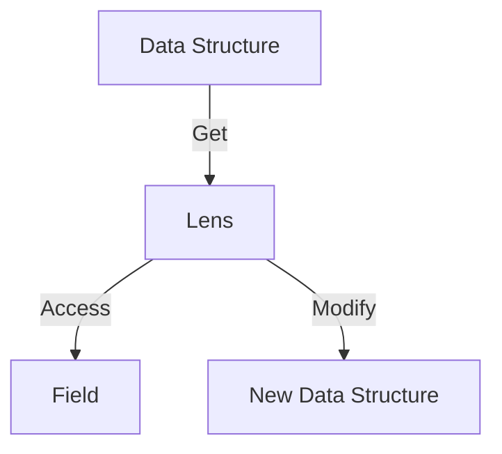

## 10.14. The Lens Pattern

In the world of functional programming, the concept of lenses offers a powerful way to interact with nested data structures. In Rust, the lens pattern provides a means to access and modify data immutably and composably. This section will delve into the lens pattern, explaining its purpose, how it works, and how you can use it effectively in Rust.

### What Are Lenses?

Lenses are composable abstractions that allow you to focus on a specific part of a data structure. They provide a way to access and update nested data structures in a functional and immutable manner. The lens pattern is particularly useful when dealing with deeply nested data, as it simplifies the process of accessing and modifying specific fields without mutating the entire structure.

#### Purpose of Lenses

The primary purpose of lenses is to enable immutable updates to nested data structures. In functional programming, immutability is a core principle, and lenses provide a way to adhere to this principle while still allowing for modifications. By using lenses, you can:

- **Access**: Retrieve a specific part of a data structure.
- **Modify**: Create a new version of the data structure with a specific part updated.
- **Compose**: Combine multiple lenses to focus on deeper parts of a structure.

### How Lenses Work

Lenses work by encapsulating the logic for accessing and updating a specific part of a data structure. They consist of two main operations:

1. **Get**: A function that extracts a value from a data structure.
2. **Set**: A function that returns a new data structure with a modified value.

These operations are designed to be composable, allowing you to build complex lenses from simpler ones.

### Implementing Lenses in Rust

Let's explore how to implement and use lenses in Rust. We'll start with a simple example and gradually build up to more complex scenarios.

#### Basic Lens Implementation

Consider a simple data structure representing a `Person` with a nested `Address`:

```rust
#[derive(Debug, Clone)]
struct Address {
    street: String,
    city: String,
}

#[derive(Debug, Clone)]
struct Person {
    name: String,
    address: Address,
}
```

To create a lens for accessing and modifying the `city` field within the `Address`, we can define a `Lens` trait:

```rust
trait Lens<S, A> {
    fn get(&self, source: &S) -> A;
    fn set(&self, source: &S, value: A) -> S;
}

struct CityLens;

impl Lens<Address, String> for CityLens {
    fn get(&self, source: &Address) -> String {
        source.city.clone()
    }

    fn set(&self, source: &Address, value: String) -> Address {
        Address {
            city: value,
            ..source.clone()
        }
    }
}
```

#### Using the Lens

With the `CityLens` defined, we can now use it to access and modify the `city` field of a `Person`'s `Address`:

```rust
fn main() {
    let address = Address {
        street: "123 Main St".to_string(),
        city: "Hometown".to_string(),
    };

    let person = Person {
        name: "Alice".to_string(),
        address,
    };

    let city_lens = CityLens;

    // Access the city
    let city = city_lens.get(&person.address);
    println!("City: {}", city);

    // Modify the city
    let new_address = city_lens.set(&person.address, "Newtown".to_string());
    println!("Updated Address: {:?}", new_address);
}
```

### Libraries Supporting Lenses

While implementing lenses manually can be educational, there are libraries available in Rust that provide more robust and feature-rich implementations. One such library is the [`enview` crate](https://crates.io/crates/enview).

#### Using the `enview` Crate

The `enview` crate offers a comprehensive set of tools for working with lenses in Rust. It simplifies the creation and use of lenses, making it easier to work with complex data structures.

To use `enview`, add it to your `Cargo.toml`:

```toml
[dependencies]
enview = "0.1"
```

Here's how you can use `enview` to work with lenses:

```rust
use enview::{Lens, LensExt};

#[derive(Debug, Clone)]
struct Address {
    street: String,
    city: String,
}

#[derive(Debug, Clone)]
struct Person {
    name: String,
    address: Address,
}

fn main() {
    let address = Address {
        street: "123 Main St".to_string(),
        city: "Hometown".to_string(),
    };

    let person = Person {
        name: "Alice".to_string(),
        address,
    };

    // Define a lens for the city field
    let city_lens = enview::lens!(Person, address, city);

    // Access the city
    let city = city_lens.get(&person);
    println!("City: {}", city);

    // Modify the city
    let updated_person = city_lens.set(&person, "Newtown".to_string());
    println!("Updated Person: {:?}", updated_person);
}
```

### Benefits of Using Lenses

Lenses offer several benefits that enhance code clarity and safety:

- **Immutability**: Lenses allow you to work with immutable data structures, reducing the risk of unintended side effects.
- **Composability**: You can compose lenses to focus on deeply nested fields, making your code more modular and reusable.
- **Clarity**: By encapsulating access and modification logic, lenses make your code easier to read and understand.
- **Safety**: Lenses help prevent common errors associated with mutable state, such as data races and inconsistent state.

### Design Considerations

When using lenses in Rust, consider the following:

- **Performance**: While lenses provide a clean abstraction, they may introduce overhead due to cloning. Evaluate the performance implications in performance-critical applications.
- **Complexity**: For simple data structures, lenses might add unnecessary complexity. Use them judiciously where they provide clear benefits.
- **Library Support**: Leverage existing libraries like `enview` to avoid reinventing the wheel and to benefit from community-tested implementations.

### Rust Unique Features

Rust's ownership and borrowing system complements the lens pattern by ensuring that data access and modification are safe and free from data races. The combination of lenses and Rust's type system provides a powerful toolkit for building robust and maintainable applications.

### Differences and Similarities

Lenses are often compared to other functional programming patterns, such as monads and functors. While they share some similarities in terms of composability, lenses are specifically designed for accessing and modifying data structures, making them distinct in their purpose and application.

### Try It Yourself

To deepen your understanding of lenses, try modifying the code examples provided. Experiment with creating lenses for different fields and composing them to access nested data. Consider how lenses can be applied in your own projects to improve code clarity and safety.

### Visualizing Lenses

To better understand how lenses work, let's visualize the process of accessing and modifying data using a lens:



**Diagram Description**: This diagram illustrates the flow of data through a lens. The lens accesses a specific field from the data structure and can modify it to produce a new data structure.

### References and Links

For further reading on lenses and functional programming in Rust, consider the following resources:

- [Rust Book](https://doc.rust-lang.org/book/)
- [enview crate documentation](https://crates.io/crates/enview)
- [Functional Programming in Rust](https://www.fpcomplete.com/blog/functional-programming-rust/)

### Knowledge Check

- What are the main operations of a lens?
- How do lenses enhance code clarity and safety?
- What are the benefits of using the `enview` crate for lenses in Rust?

### Embrace the Journey

Remember, mastering the lens pattern is just one step in your Rust journey. As you continue to explore functional programming patterns, you'll discover new ways to write clean, efficient, and safe code. Keep experimenting, stay curious, and enjoy the journey!

## Quiz Time!



### What is the primary purpose of lenses in Rust?

- [x] To enable immutable updates to nested data structures
- [ ] To provide mutable access to data structures
- [ ] To simplify the creation of data structures
- [ ] To enhance performance of data access

> **Explanation:** Lenses are used to enable immutable updates to nested data structures, adhering to functional programming principles.

### Which operations are fundamental to a lens?

- [x] Get and Set
- [ ] Add and Remove
- [ ] Create and Destroy
- [ ] Open and Close

> **Explanation:** Lenses consist of Get and Set operations, which allow access and modification of data.

### What crate is commonly used for implementing lenses in Rust?

- [x] enview
- [ ] serde
- [ ] tokio
- [ ] rayon

> **Explanation:** The `enview` crate provides tools for working with lenses in Rust.

### How do lenses improve code clarity?

- [x] By encapsulating access and modification logic
- [ ] By reducing the number of lines of code
- [ ] By increasing the complexity of data structures
- [ ] By eliminating the need for functions

> **Explanation:** Lenses encapsulate access and modification logic, making code easier to read and understand.

### What is a potential drawback of using lenses?

- [x] Performance overhead due to cloning
- [ ] Increased risk of data races
- [ ] Difficulty in composing lenses
- [ ] Lack of library support

> **Explanation:** Lenses may introduce performance overhead due to cloning, which should be considered in performance-critical applications.

### What does the `set` operation in a lens do?

- [x] Returns a new data structure with a modified value
- [ ] Deletes a value from the data structure
- [ ] Retrieves a value from the data structure
- [ ] Locks the data structure for modification

> **Explanation:** The `set` operation returns a new data structure with a modified value, adhering to immutability.

### How do lenses complement Rust's type system?

- [x] By ensuring safe data access and modification
- [ ] By allowing unsafe code execution
- [ ] By bypassing the borrow checker
- [ ] By providing mutable references

> **Explanation:** Lenses complement Rust's type system by ensuring safe data access and modification, preventing data races.

### What is a key benefit of using the `enview` crate?

- [x] It simplifies the creation and use of lenses
- [ ] It provides mutable access to data structures
- [ ] It enhances the performance of data access
- [ ] It eliminates the need for Rust's type system

> **Explanation:** The `enview` crate simplifies the creation and use of lenses, making it easier to work with complex data structures.

### What is the main advantage of composing lenses?

- [x] It allows focusing on deeply nested fields
- [ ] It reduces the need for data structures
- [ ] It simplifies the Rust syntax
- [ ] It enhances the performance of Rust programs

> **Explanation:** Composing lenses allows focusing on deeply nested fields, making code more modular and reusable.

### True or False: Lenses are only useful in functional programming languages.

- [ ] True
- [x] False

> **Explanation:** Lenses are useful in any language that supports functional programming principles, including Rust.


