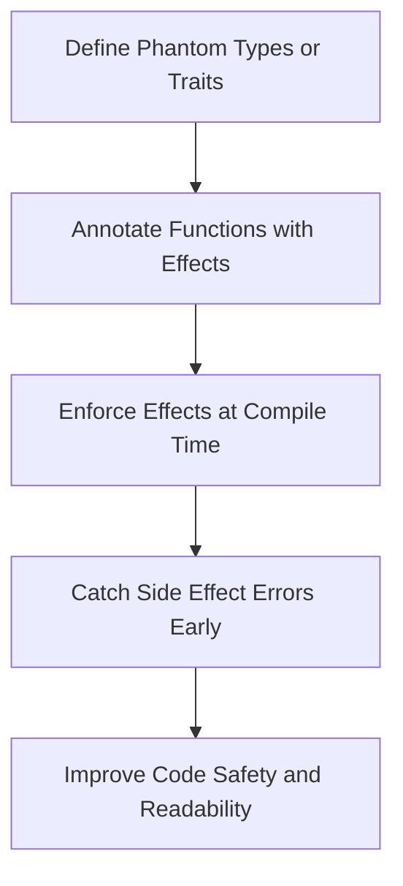

## 10.15. Effect Systems and Enforcing Purity

In the realm of functional programming, effect systems play a crucial role in managing and controlling side effects. Rust, while not a purely functional language, offers powerful tools through its type system to simulate effect systems, allowing developers to enforce purity and reason more effectively about code behavior. In this section, we will delve into what effect systems are, how Rust manages side effects, and how we can encode effects using phantom types or traits. We will also discuss the benefits and limitations of Rust's approach compared to dedicated effect systems.

### What is an Effect System?

An effect system is a formal mechanism used in programming languages to track and control side effects in a program. Side effects are operations that affect the state outside their local environment, such as modifying a global variable, performing I/O operations, or changing a mutable reference. Effect systems extend the type system to include information about the side effects that functions may have, enabling the compiler to enforce constraints on these effects.

**Key Concepts of Effect Systems:**

- **Effect Annotations**: Functions are annotated with the effects they may perform, such as reading from or writing to a file.
- **Effect Polymorphism**: Functions can be generic over effects, allowing them to be reused in different contexts with varying side effects.
- **Effect Inference**: The compiler can infer the effects of a function based on its implementation and the effects of the functions it calls.

### Rust's Approach to Managing Side Effects

Rust does not have a built-in effect system like some functional languages (e.g., Haskell with its monads). However, Rust's type system, ownership model, and borrowing rules provide a robust framework for managing side effects and enforcing purity.

**Rust's Key Features for Managing Side Effects:**

- **Ownership and Borrowing**: Rust's ownership model ensures that data races and memory leaks are prevented, which indirectly helps manage side effects by controlling access to shared state.
- **Lifetimes**: Lifetimes in Rust ensure that references are valid for the duration of their use, preventing dangling references and ensuring safe memory access.
- **Traits and Generics**: Traits allow for defining behavior that can be shared across types, and generics enable code reuse while maintaining type safety.

### Encoding Effects Using Phantom Types or Traits

In Rust, we can simulate effect systems by encoding effects using phantom types or traits. This approach allows us to specify and enforce constraints on the side effects that functions can perform.

#### Phantom Types

Phantom types are a way to encode additional type information without affecting the runtime representation of a type. They are used to enforce compile-time constraints and can be leveraged to simulate effect systems.

```rust
use std::marker::PhantomData;

// Define a phantom type for effects
struct Effect<E> {
    _marker: PhantomData<E>,
}

// Define specific effects
struct ReadEffect;
struct WriteEffect;

// Function that performs a read effect
fn read_data<E>(data: &str, _effect: Effect<E>) -> &str
where
    E: ReadEffectTrait,
{
    println!("Reading data: {}", data);
    data
}

// Trait to enforce read effect
trait ReadEffectTrait {}

impl ReadEffectTrait for ReadEffect {}

fn main() {
    let read_effect = Effect::<ReadEffect> { _marker: PhantomData };
    let data = "Hello, Rust!";
    let _result = read_data(data, read_effect);
}
```

In this example, we define a phantom type `Effect<E>` to represent an effect, and a trait `ReadEffectTrait` to enforce the read effect. The function `read_data` requires an effect parameter, ensuring that only functions with the appropriate effect can be called.

#### Traits for Effect Management

Traits can also be used to manage effects by defining behavior that must be implemented by types that perform certain effects.

```rust
// Define a trait for logging
trait Logger {
    fn log(&self, message: &str);
}

// Implement the Logger trait for a ConsoleLogger
struct ConsoleLogger;

impl Logger for ConsoleLogger {
    fn log(&self, message: &str) {
        println!("Log: {}", message);
    }
}

// Function that requires a Logger
fn perform_logging<L: Logger>(logger: L, message: &str) {
    logger.log(message);
}

fn main() {
    let logger = ConsoleLogger;
    perform_logging(logger, "This is a log message.");
}
```

In this example, the `Logger` trait defines a logging effect, and the `perform_logging` function requires a type that implements this trait, ensuring that only types capable of logging can be used.

### Benefits of Simulating Effect Systems in Rust

Simulating effect systems in Rust provides several benefits:

- **Improved Code Safety**: By encoding effects in the type system, we can catch potential side effect-related errors at compile time, reducing runtime errors.
- **Enhanced Code Readability**: Explicitly specifying effects makes the code easier to understand and reason about, as the effects of a function are clear from its signature.
- **Better Code Reusability**: Effect polymorphism allows functions to be reused in different contexts with varying side effects, promoting code reuse.

### Limitations Compared to Dedicated Effect Systems

While Rust's approach to managing side effects is powerful, it has some limitations compared to dedicated effect systems:

- **Lack of Built-in Effect Annotations**: Rust does not have built-in syntax for effect annotations, requiring developers to simulate them using types and traits.
- **Manual Effect Management**: Developers must manually encode and enforce effects, which can be error-prone and cumbersome for complex systems.
- **Limited Effect Inference**: Rust's compiler does not infer effects, so developers must explicitly specify them, which can lead to verbose code.

### Visualizing Effect Systems in Rust

To better understand how Rust's type system can simulate effect systems, let's visualize the process using a flowchart.



**Diagram Description**: This flowchart illustrates the process of simulating effect systems in Rust. We start by defining phantom types or traits to represent effects. Functions are then annotated with these effects, and the Rust compiler enforces them at compile time, catching side effect-related errors early and improving code safety and readability.

### Try It Yourself

Now that we've explored how to simulate effect systems in Rust, let's encourage you to experiment with the code examples provided. Try modifying the phantom types or traits to represent different effects, or create new functions that require specific effects. This hands-on approach will deepen your understanding of how Rust's type system can be leveraged to manage side effects.

### Knowledge Check

To reinforce your understanding of effect systems and enforcing purity in Rust, consider the following questions and exercises:

1. **What is an effect system, and how does it help manage side effects in a program?**

2. **How does Rust's type system simulate effect systems, and what are the key features that enable this?**

3. **Modify the `read_data` function to require both a read and write effect. How does this change the function's signature and usage?**

4. **Create a new trait to represent a network effect and implement it for a type that performs network operations.**

5. **Discuss the benefits and limitations of using phantom types to simulate effect systems in Rust.**

### Embrace the Journey

Remember, this is just the beginning of your journey into effect systems and enforcing purity in Rust. As you continue to explore and experiment with these concepts, you'll gain a deeper understanding of how Rust's type system can enhance code reliability and maintainability. Keep experimenting, stay curious, and enjoy the journey!

## Quiz Time!



### What is an effect system?

- [x] A mechanism to track and control side effects in a program
- [ ] A system to manage memory allocation
- [ ] A tool for optimizing code performance
- [ ] A framework for building user interfaces

> **Explanation:** An effect system is used to track and control side effects in a program, enhancing code safety and readability.

### How does Rust manage side effects?

- [x] Through its type system, ownership model, and borrowing rules
- [ ] By using a built-in effect system
- [ ] Through dynamic typing
- [ ] By relying on garbage collection

> **Explanation:** Rust manages side effects using its type system, ownership model, and borrowing rules, ensuring memory safety and preventing data races.

### What is a phantom type?

- [x] A type used to encode additional type information without affecting runtime representation
- [ ] A type that exists only at runtime
- [ ] A type used for dynamic dispatch
- [ ] A type that automatically manages memory

> **Explanation:** Phantom types encode additional type information at compile time without affecting the runtime representation, useful for enforcing constraints.

### What is the main benefit of simulating effect systems in Rust?

- [x] Improved code safety and readability
- [ ] Faster code execution
- [ ] Reduced memory usage
- [ ] Easier debugging

> **Explanation:** Simulating effect systems in Rust improves code safety and readability by catching side effect-related errors at compile time.

### Which of the following is a limitation of Rust's approach to effect systems?

- [x] Lack of built-in effect annotations
- [ ] Inability to handle concurrency
- [ ] Poor performance
- [ ] Lack of support for generics

> **Explanation:** Rust lacks built-in effect annotations, requiring developers to manually encode and enforce effects.

### How can traits be used to manage effects in Rust?

- [x] By defining behavior that must be implemented by types performing certain effects
- [ ] By dynamically dispatching function calls
- [ ] By automatically managing memory
- [ ] By providing runtime type information

> **Explanation:** Traits define behavior that must be implemented by types performing certain effects, allowing for compile-time enforcement.

### What is the role of lifetimes in Rust's type system?

- [x] Ensuring references are valid for their duration of use
- [ ] Managing memory allocation
- [ ] Providing dynamic typing
- [ ] Enabling polymorphism

> **Explanation:** Lifetimes ensure that references are valid for their duration of use, preventing dangling references and ensuring safe memory access.

### How does effect polymorphism benefit code reuse?

- [x] Allows functions to be reused in different contexts with varying side effects
- [ ] Enables faster code execution
- [ ] Reduces memory usage
- [ ] Simplifies debugging

> **Explanation:** Effect polymorphism allows functions to be reused in different contexts with varying side effects, promoting code reuse.

### What is the primary challenge of manually encoding effects in Rust?

- [x] It can be error-prone and cumbersome for complex systems
- [ ] It leads to slower code execution
- [ ] It increases memory usage
- [ ] It complicates debugging

> **Explanation:** Manually encoding effects can be error-prone and cumbersome, especially for complex systems, as it requires explicit specification of effects.

### Rust's type system can simulate effect systems.

- [x] True
- [ ] False

> **Explanation:** Rust's type system can simulate effect systems by using phantom types and traits to encode and enforce side effects.


