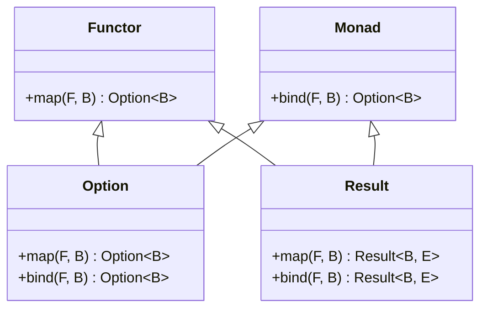

## 10.16. Simulating Higher-Kinded Types in Rust

In the world of functional programming, higher-kinded types (HKTs) are a powerful abstraction that allows developers to write more generic and reusable code. However, Rust, with its focus on safety and performance, does not natively support HKTs. In this section, we will explore what higher-kinded types are, why they are important, and how we can simulate them in Rust using existing language features. We will also discuss potential future enhancements to Rust's type system that could bring native support for HKTs.

### Understanding Higher-Kinded Types

Higher-kinded types are types that take other types as parameters. They are a step beyond regular generic types, which are types that are parameterized by other types. In languages like Haskell, HKTs allow for the creation of abstractions over type constructors, enabling more flexible and reusable code.

#### Importance of Higher-Kinded Types

HKTs are crucial in functional programming for several reasons:

- **Abstraction**: They allow for the creation of abstractions over type constructors, enabling more flexible and reusable code.
- **Code Reusability**: With HKTs, you can write functions and data structures that work with any type constructor, not just specific instances.
- **Expressiveness**: They increase the expressiveness of the type system, allowing for more precise type constraints and better type inference.

### Rust's Limitations with Higher-Kinded Types

Rust's type system is powerful, but it currently lacks native support for higher-kinded types. This limitation arises from Rust's focus on safety and performance, which requires a more explicit type system. As a result, Rust developers have to rely on workarounds to achieve similar functionality.

### Simulating Higher-Kinded Types in Rust

Despite the lack of native support, Rust provides several features that can be used to approximate higher-kinded types. These include traits, associated types, and generic parameters. Let's explore these techniques in detail.

#### Using Traits and Associated Types

One common approach to simulating HKTs in Rust is to use traits with associated types. This allows us to define a trait that represents a type constructor, and then implement this trait for specific types.

```rust
// Define a trait with an associated type
trait Functor {
    type Inner;
    fn map<F, B>(self, f: F) -> Self::Inner
    where
        F: FnOnce(Self::Inner) -> B;
}

// Implement the Functor trait for Option
impl<T> Functor for Option<T> {
    type Inner = T;

    fn map<F, B>(self, f: F) -> Option<B>
    where
        F: FnOnce(T) -> B,
    {
        self.map(f)
    }
}

// Implement the Functor trait for Result
impl<T, E> Functor for Result<T, E> {
    type Inner = T;

    fn map<F, B>(self, f: F) -> Result<B, E>
    where
        F: FnOnce(T) -> B,
    {
        self.map(f)
    }
}
```

In this example, we define a `Functor` trait with an associated type `Inner`. We then implement this trait for `Option` and `Result`, allowing us to use the `map` function with any type that implements `Functor`.

#### Using Generic Parameters

Another approach is to use generic parameters to simulate HKTs. This involves defining a trait with a generic parameter that represents the type constructor.

```rust
// Define a trait with a generic parameter
trait Monad<M> {
    fn bind<F, B>(self, f: F) -> M
    where
        F: FnOnce(Self) -> M;
}

// Implement the Monad trait for Option
impl<T> Monad<Option<T>> for Option<T> {
    fn bind<F, B>(self, f: F) -> Option<B>
    where
        F: FnOnce(T) -> Option<B>,
    {
        self.and_then(f)
    }
}

// Implement the Monad trait for Result
impl<T, E> Monad<Result<T, E>> for Result<T, E> {
    fn bind<F, B>(self, f: F) -> Result<B, E>
    where
        F: FnOnce(T) -> Result<B, E>,
    {
        self.and_then(f)
    }
}
```

Here, we define a `Monad` trait with a generic parameter `M` that represents the type constructor. We then implement this trait for `Option` and `Result`, allowing us to use the `bind` function with any type that implements `Monad`.

### Potential Future Enhancements to Rust's Type System

There has been ongoing discussion in the Rust community about adding support for higher-kinded types. While there is no concrete timeline for when this might happen, several proposals have been made to extend Rust's type system to support HKTs.

#### Generic Associated Types (GATs)

One promising proposal is the introduction of Generic Associated Types (GATs). GATs would allow for more flexible and expressive type constraints, making it easier to simulate HKTs in Rust.

```rust
// Example of a potential GATs implementation
trait Container {
    type Item<'a>;
    fn get(&self) -> Self::Item<'_>;
}
```

GATs would enable developers to define associated types that are themselves generic, providing a more powerful abstraction mechanism.

### Visualizing Higher-Kinded Types in Rust

To better understand how we can simulate higher-kinded types in Rust, let's visualize the relationships between traits, associated types, and generic parameters.



This diagram illustrates how the `Functor` and `Monad` traits are implemented for the `Option` and `Result` types, allowing us to use these abstractions with different type constructors.

### Try It Yourself

Now that we've explored how to simulate higher-kinded types in Rust, let's try modifying the code examples to experiment with different type constructors. For example, try implementing the `Functor` and `Monad` traits for a custom data structure, such as a binary tree or a linked list.

### References and Further Reading

- [Rust Language Reference](https://doc.rust-lang.org/reference/)
- [Rust RFCs](https://github.com/rust-lang/rfcs)
- [Haskell Wiki on Higher-Kinded Types](https://wiki.haskell.org/Higher-kinded_type)

### Knowledge Check

- What are higher-kinded types, and why are they important in functional programming?
- How can we simulate higher-kinded types in Rust using traits and associated types?
- What are some potential future enhancements to Rust's type system that could support higher-kinded types?

### Embrace the Journey

Remember, this is just the beginning. As you progress, you'll discover more advanced techniques for simulating higher-kinded types in Rust. Keep experimenting, stay curious, and enjoy the journey!

## Quiz Time!



### What are higher-kinded types?

- [x] Types that take other types as parameters
- [ ] Types that are parameterized by values
- [ ] Types that are only used in functional programming
- [ ] Types that are specific to Rust

> **Explanation:** Higher-kinded types are types that take other types as parameters, allowing for greater abstraction and code reusability.

### Why are higher-kinded types important?

- [x] They allow for greater abstraction and code reusability
- [ ] They make code execution faster
- [ ] They are required for all functional programming languages
- [ ] They simplify error handling

> **Explanation:** Higher-kinded types enable greater abstraction and code reusability by allowing functions and data structures to work with any type constructor.

### How can we simulate higher-kinded types in Rust?

- [x] Using traits and associated types
- [ ] Using macros
- [ ] Using enums
- [ ] Using structs

> **Explanation:** We can simulate higher-kinded types in Rust using traits and associated types, which allow us to define abstractions over type constructors.

### What is a limitation of Rust's type system regarding higher-kinded types?

- [x] Rust does not natively support higher-kinded types
- [ ] Rust does not support generics
- [ ] Rust does not support traits
- [ ] Rust does not support associated types

> **Explanation:** Rust's type system does not natively support higher-kinded types, requiring developers to use workarounds.

### What is a potential future enhancement to Rust's type system?

- [x] Generic Associated Types (GATs)
- [ ] Higher-order functions
- [ ] Pattern matching
- [ ] Macros

> **Explanation:** Generic Associated Types (GATs) are a proposed enhancement to Rust's type system that would allow for more flexible and expressive type constraints.

### What is the purpose of the `Functor` trait in the example?

- [x] To define a mapping operation for type constructors
- [ ] To define a binding operation for type constructors
- [ ] To define a comparison operation for type constructors
- [ ] To define a sorting operation for type constructors

> **Explanation:** The `Functor` trait defines a mapping operation for type constructors, allowing us to apply a function to the inner value of a type.

### What is the purpose of the `Monad` trait in the example?

- [x] To define a binding operation for type constructors
- [ ] To define a mapping operation for type constructors
- [ ] To define a comparison operation for type constructors
- [ ] To define a sorting operation for type constructors

> **Explanation:** The `Monad` trait defines a binding operation for type constructors, allowing us to chain operations on the inner value of a type.

### How can we visualize the relationships between traits and types in Rust?

- [x] Using class diagrams
- [ ] Using flowcharts
- [ ] Using sequence diagrams
- [ ] Using pie charts

> **Explanation:** Class diagrams can be used to visualize the relationships between traits and types in Rust, showing how traits are implemented for different types.

### What is the role of associated types in simulating higher-kinded types?

- [x] They allow traits to define type constructors
- [ ] They allow traits to define functions
- [ ] They allow traits to define constants
- [ ] They allow traits to define variables

> **Explanation:** Associated types allow traits to define type constructors, enabling the simulation of higher-kinded types in Rust.

### True or False: Rust natively supports higher-kinded types.

- [ ] True
- [x] False

> **Explanation:** False. Rust does not natively support higher-kinded types, but developers can use workarounds to simulate them.


