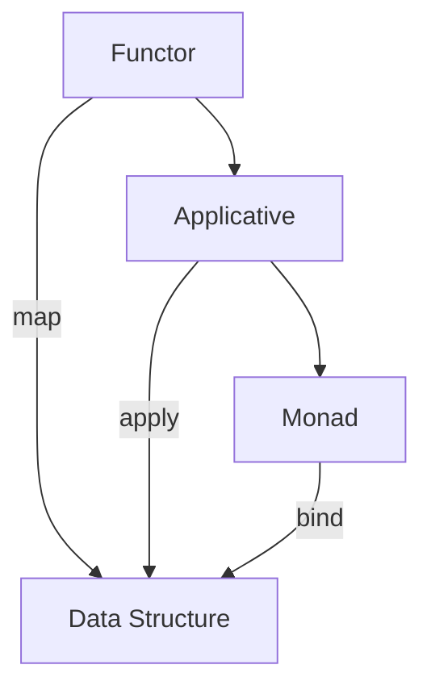

## 10.17. Functor, Applicative, and Monad Traits

In the world of functional programming, Functors, Applicatives, and Monads are powerful abstractions that allow developers to write generic and composable code. These concepts, while originating from category theory, have practical applications in programming languages, including Rust. In this section, we will explore these abstractions, understand how they relate to Rust's type system, and see how they can be implemented and utilized in Rust.

### Understanding Functors

**Definition**: A Functor is a type that can be mapped over. In programming terms, it is a structure that implements a `map` function, which applies a function to every element within the structure.

#### Functor in Rust

In Rust, the concept of a Functor can be represented using a trait. The `map` function is analogous to the `map` method found in Rust's standard library for collections like `Vec` and `Option`.

```rust
trait Functor<T> {
    fn map<U, F: FnOnce(T) -> U>(self, f: F) -> Self::Output;
    
    type Output;
}

// Example implementation for Option
impl<T> Functor<T> for Option<T> {
    type Output = Option<U>;

    fn map<U, F: FnOnce(T) -> U>(self, f: F) -> Self::Output {
        match self {
            Some(value) => Some(f(value)),
            None => None,
        }
    }
}
```

In this example, we define a `Functor` trait with a `map` method. The `Option` type is a natural fit for a Functor because it can either contain a value or be empty, and we can apply a function to the contained value if it exists.

#### Practical Benefits

- **Code Reusability**: By abstracting the mapping logic, we can reuse it across different types.
- **Composability**: Functions can be composed and applied to data structures in a consistent manner.

### Exploring Applicatives

**Definition**: An Applicative is a Functor with additional capabilities. It allows for functions that are themselves wrapped in a context (like `Option`) to be applied to values wrapped in the same context.

#### Applicative in Rust

To represent Applicatives in Rust, we extend the Functor concept with an `apply` method.

```rust
trait Applicative<T>: Functor<T> {
    fn apply<U, F: FnOnce(T) -> U>(self, f: Self::Output) -> Self::Output;
}

// Example implementation for Option
impl<T> Applicative<T> for Option<T> {
    fn apply<U, F: FnOnce(T) -> U>(self, f: Option<F>) -> Option<U> {
        match (self, f) {
            (Some(value), Some(func)) => Some(func(value)),
            _ => None,
        }
    }
}
```

Here, the `apply` method takes a function wrapped in the same context and applies it to the value inside the context.

#### Practical Benefits

- **Function Application**: Allows for the application of functions within a context, enabling more complex operations.
- **Enhanced Composability**: Builds on Functor's composability by allowing function application within contexts.

### Delving into Monads

**Definition**: A Monad is an Applicative with a `bind` operation (often called `flatMap` or `and_then` in Rust), which allows for chaining operations that return wrapped values.

#### Monad in Rust

Monads in Rust can be represented by extending the Applicative trait with a `bind` method.

```rust
trait Monad<T>: Applicative<T> {
    fn bind<U, F: FnOnce(T) -> Self::Output>(self, f: F) -> Self::Output;
}

// Example implementation for Option
impl<T> Monad<T> for Option<T> {
    fn bind<U, F: FnOnce(T) -> Option<U>>(self, f: F) -> Option<U> {
        match self {
            Some(value) => f(value),
            None => None,
        }
    }
}
```

The `bind` method allows for chaining operations that return wrapped values, making it possible to sequence computations.

#### Practical Benefits

- **Chaining Operations**: Enables chaining of operations that produce wrapped values, leading to cleaner and more readable code.
- **Error Handling**: Monads are particularly useful for error handling, as they can encapsulate operations that may fail.

### Challenges and Limitations in Rust

Implementing these functional abstractions in Rust presents some challenges:

- **Type System**: Rust's strict type system can make it difficult to implement these abstractions in a way that is both flexible and type-safe.
- **Lack of Higher-Kinded Types**: Rust does not support higher-kinded types, which are often used in other languages to implement these abstractions more naturally.
- **Complexity**: Understanding and using these abstractions can be complex, especially for developers new to functional programming.

### Visualizing Functor, Applicative, and Monad

To better understand these concepts, let's visualize how they relate to each other and how they operate on data.



**Diagram Description**: This diagram illustrates the relationship between Functor, Applicative, and Monad. Each builds upon the previous, adding more capabilities for operating on data structures.

### Try It Yourself

To deepen your understanding, try modifying the code examples:

- Implement the `Functor`, `Applicative`, and `Monad` traits for other data structures like `Result`.
- Experiment with chaining operations using the `bind` method.
- Create your own data structure and implement these traits.

### References and Further Reading

- [Rust Programming Language](https://www.rust-lang.org/)
- [Category Theory for Programmers](https://bartoszmilewski.com/category/category-theory/)
- [Rust by Example](https://doc.rust-lang.org/rust-by-example/)

### Knowledge Check

- What is a Functor, and how is it implemented in Rust?
- How does an Applicative extend the capabilities of a Functor?
- What is the purpose of the `bind` method in a Monad?
- What are some challenges of implementing these abstractions in Rust?

### Embrace the Journey

Remember, mastering these concepts is a journey. As you experiment and apply these patterns, you'll gain a deeper understanding of functional programming in Rust. Keep exploring, stay curious, and enjoy the process!

## Quiz Time!



### What is a Functor in Rust?

- [x] A type that can be mapped over using a function.
- [ ] A type that can be applied using a function.
- [ ] A type that can be chained using a function.
- [ ] A type that can be transformed using a function.

> **Explanation:** A Functor is a type that can be mapped over using a function, allowing the function to be applied to each element within the structure.

### How does an Applicative differ from a Functor?

- [x] An Applicative allows for functions within a context to be applied to values within the same context.
- [ ] An Applicative allows for chaining operations that return wrapped values.
- [ ] An Applicative allows for mapping over a type using a function.
- [ ] An Applicative allows for transforming a type using a function.

> **Explanation:** An Applicative extends a Functor by allowing functions within a context to be applied to values within the same context.

### What is the purpose of the `bind` method in a Monad?

- [x] To chain operations that return wrapped values.
- [ ] To map over a type using a function.
- [ ] To apply functions within a context to values within the same context.
- [ ] To transform a type using a function.

> **Explanation:** The `bind` method in a Monad allows for chaining operations that return wrapped values, enabling sequencing of computations.

### What is a challenge of implementing these abstractions in Rust?

- [x] Rust's strict type system can make it difficult to implement these abstractions in a flexible and type-safe manner.
- [ ] Rust's lack of support for object-oriented programming.
- [ ] Rust's garbage collection system.
- [ ] Rust's lack of support for concurrency.

> **Explanation:** Rust's strict type system can make it challenging to implement these abstractions in a way that is both flexible and type-safe.

### Which of the following is true about Monads?

- [x] Monads are useful for chaining operations that produce wrapped values.
- [ ] Monads are only useful for error handling.
- [x] Monads build upon Applicatives by adding the `bind` operation.
- [ ] Monads are a type of Functor.

> **Explanation:** Monads are useful for chaining operations that produce wrapped values and build upon Applicatives by adding the `bind` operation.

### What is a practical benefit of using Functors?

- [x] Code reusability and composability.
- [ ] Enhanced error handling.
- [ ] Improved performance.
- [ ] Simplified concurrency.

> **Explanation:** Functors provide code reusability and composability by abstracting the mapping logic.

### Which trait in Rust is analogous to the Functor's `map` method?

- [x] The `map` method in Rust's standard library for collections like `Vec` and `Option`.
- [ ] The `apply` method in Rust's standard library.
- [ ] The `bind` method in Rust's standard library.
- [ ] The `transform` method in Rust's standard library.

> **Explanation:** The `map` method in Rust's standard library for collections like `Vec` and `Option` is analogous to the Functor's `map` method.

### What is a limitation of implementing these abstractions in Rust?

- [x] Rust does not support higher-kinded types.
- [ ] Rust lacks support for functional programming.
- [ ] Rust's garbage collection system.
- [ ] Rust's lack of support for object-oriented programming.

> **Explanation:** Rust does not support higher-kinded types, which are often used in other languages to implement these abstractions more naturally.

### What does the `apply` method in an Applicative do?

- [x] It applies functions within a context to values within the same context.
- [ ] It maps over a type using a function.
- [ ] It chains operations that return wrapped values.
- [ ] It transforms a type using a function.

> **Explanation:** The `apply` method in an Applicative applies functions within a context to values within the same context.

### True or False: Monads are only useful for error handling.

- [ ] True
- [x] False

> **Explanation:** Monads are not only useful for error handling; they are also useful for chaining operations that produce wrapped values and sequencing computations.


