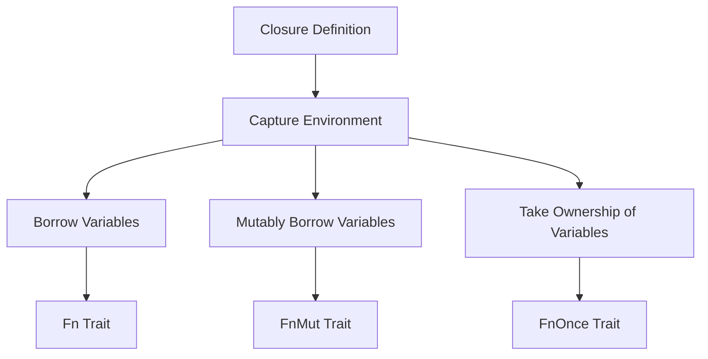

## 10.2. Higher-Order Functions and Closures

In this section, we will delve into the fascinating world of higher-order functions and closures in Rust. These powerful constructs allow us to write more concise, expressive, and flexible code. By the end of this chapter, you'll have a solid understanding of how to use higher-order functions and closures effectively in your Rust programs.

### Understanding Higher-Order Functions

Higher-order functions are functions that can take other functions as arguments or return them as results. This concept is a cornerstone of functional programming and is widely used in Rust to create flexible and reusable code.

#### Defining Higher-Order Functions

A higher-order function can be defined as follows:

- **Takes one or more functions as parameters**: This allows you to pass behavior into functions, enabling customization and reuse.
- **Returns a function**: This allows you to generate new functions dynamically based on input parameters.

Here's a simple example of a higher-order function in Rust:

```rust
fn apply_function<F>(x: i32, func: F) -> i32
where
    F: Fn(i32) -> i32,
{
    func(x)
}

fn main() {
    let double = |x| x * 2;
    let result = apply_function(5, double);
    println!("Result: {}", result); // Output: Result: 10
}
```

In this example, `apply_function` is a higher-order function that takes a function `func` as a parameter and applies it to the integer `x`.

### Exploring Closures in Rust

Closures are anonymous functions that can capture variables from their surrounding environment. They are similar to lambda expressions in other languages and are a key feature in Rust for creating concise and flexible code.

#### How Closures Work

Closures in Rust can capture variables from their environment in three ways:

1. **By Borrowing (`&T`)**: The closure borrows the variable immutably.
2. **By Mutably Borrowing (`&mut T`)**: The closure borrows the variable mutably.
3. **By Taking Ownership (`T`)**: The closure takes ownership of the variable.

Here's an example demonstrating closures capturing variables:

```rust
fn main() {
    let x = 10;
    let add_to_x = |y| x + y; // Captures x by borrowing
    println!("Sum: {}", add_to_x(5)); // Output: Sum: 15
}
```

In this example, the closure `add_to_x` captures the variable `x` by borrowing it.

#### Closures with Iterators

Closures are often used with iterators to perform operations on collections. Here's an example using closures with iterators:

```rust
fn main() {
    let numbers = vec![1, 2, 3, 4, 5];
    let doubled: Vec<i32> = numbers.iter().map(|&x| x * 2).collect();
    println!("Doubled: {:?}", doubled); // Output: Doubled: [2, 4, 6, 8, 10]
}
```

In this example, the closure `|&x| x * 2` is used with the `map` iterator to double each element in the vector.

### The Traits `Fn`, `FnMut`, and `FnOnce`

Rust provides three traits to represent closures: `Fn`, `FnMut`, and `FnOnce`. These traits define how a closure can be called and how it captures variables.

#### `Fn` Trait

The `Fn` trait is used for closures that do not mutate the environment. Closures that implement `Fn` can be called multiple times without side effects.

```rust
fn call_fn<F>(f: F)
where
    F: Fn(),
{
    f();
}

fn main() {
    let say_hello = || println!("Hello!");
    call_fn(say_hello);
}
```

#### `FnMut` Trait

The `FnMut` trait is used for closures that mutate the environment. These closures can be called multiple times, but they may change the state of captured variables.

```rust
fn call_fn_mut<F>(mut f: F)
where
    F: FnMut(),
{
    f();
}

fn main() {
    let mut count = 0;
    let mut increment = || count += 1;
    call_fn_mut(increment);
    println!("Count: {}", count); // Output: Count: 1
}
```

#### `FnOnce` Trait

The `FnOnce` trait is used for closures that take ownership of captured variables. These closures can only be called once.

```rust
fn call_fn_once<F>(f: F)
where
    F: FnOnce(),
{
    f();
}

fn main() {
    let name = String::from("Alice");
    let consume_name = || println!("Name: {}", name);
    call_fn_once(consume_name);
    // name can no longer be used here
}
```

### Benefits of Higher-Order Functions and Closures

Higher-order functions and closures provide several benefits:

- **Code Reuse**: By abstracting behavior into functions, you can reuse code across different parts of your program.
- **Flexibility**: Higher-order functions allow you to pass different behaviors into functions, making your code more flexible.
- **Conciseness**: Closures enable you to write concise and expressive code by capturing variables from the surrounding environment.

### Visualizing Closure Capture

To better understand how closures capture variables, let's visualize the process using a diagram.



**Diagram Description**: This diagram illustrates how closures capture variables from their environment in Rust. Depending on how variables are captured, closures implement different traits (`Fn`, `FnMut`, `FnOnce`).

### Try It Yourself

Experiment with the code examples provided in this section. Try modifying the closures to capture variables in different ways or use them with different iterators. This hands-on practice will deepen your understanding of higher-order functions and closures in Rust.

### Knowledge Check

- What is a higher-order function, and how is it used in Rust?
- How do closures capture variables from their environment?
- What are the differences between the `Fn`, `FnMut`, and `FnOnce` traits?

### Summary

In this section, we've explored the power of higher-order functions and closures in Rust. These constructs allow us to write more concise, expressive, and flexible code by abstracting behavior and capturing variables from the environment. By understanding and using these concepts, you can enhance your Rust programming skills and create more reusable and adaptable code.

## Quiz Time!



### What is a higher-order function?

- [x] A function that takes other functions as arguments or returns them as results.
- [ ] A function that only performs arithmetic operations.
- [ ] A function that can only be called once.
- [ ] A function that does not take any parameters.

> **Explanation:** Higher-order functions are those that can take other functions as arguments or return them as results, allowing for more flexible and reusable code.

### How do closures capture variables from their environment?

- [x] By borrowing, mutably borrowing, or taking ownership.
- [ ] By copying variables into a new scope.
- [ ] By creating a new instance of the environment.
- [ ] By using global variables.

> **Explanation:** Closures in Rust capture variables from their environment by borrowing, mutably borrowing, or taking ownership, depending on how they are used.

### Which trait is used for closures that do not mutate the environment?

- [x] Fn
- [ ] FnMut
- [ ] FnOnce
- [ ] FnAll

> **Explanation:** The `Fn` trait is used for closures that do not mutate the environment and can be called multiple times without side effects.

### Which trait is used for closures that mutate the environment?

- [ ] Fn
- [x] FnMut
- [ ] FnOnce
- [ ] FnAll

> **Explanation:** The `FnMut` trait is used for closures that mutate the environment and can be called multiple times, but may change the state of captured variables.

### Which trait is used for closures that take ownership of captured variables?

- [ ] Fn
- [ ] FnMut
- [x] FnOnce
- [ ] FnAll

> **Explanation:** The `FnOnce` trait is used for closures that take ownership of captured variables and can only be called once.

### What is the benefit of using higher-order functions?

- [x] Code reuse and flexibility.
- [ ] They make code run faster.
- [ ] They reduce memory usage.
- [ ] They eliminate the need for variables.

> **Explanation:** Higher-order functions allow for code reuse and flexibility by abstracting behavior into functions that can be passed around and reused.

### What is a closure in Rust?

- [x] An anonymous function that can capture variables from its environment.
- [ ] A function that cannot be called.
- [ ] A function that only performs arithmetic operations.
- [ ] A function that does not take any parameters.

> **Explanation:** A closure in Rust is an anonymous function that can capture variables from its environment, similar to lambda expressions in other languages.

### How can closures be used with iterators?

- [x] By passing them to iterator methods like `map` and `filter`.
- [ ] By using them as loop conditions.
- [ ] By defining them inside a loop.
- [ ] By converting them to strings.

> **Explanation:** Closures can be used with iterators by passing them to iterator methods like `map` and `filter` to perform operations on collections.

### What is the purpose of the `FnOnce` trait?

- [x] To represent closures that take ownership of captured variables and can only be called once.
- [ ] To represent closures that do not mutate the environment.
- [ ] To represent closures that can be called multiple times.
- [ ] To represent closures that do not take any parameters.

> **Explanation:** The `FnOnce` trait is used for closures that take ownership of captured variables and can only be called once.

### True or False: Closures in Rust can only capture variables by borrowing.

- [ ] True
- [x] False

> **Explanation:** Closures in Rust can capture variables by borrowing, mutably borrowing, or taking ownership, depending on how they are used.



Remember, this is just the beginning. As you progress, you'll build more complex and interactive Rust applications. Keep experimenting, stay curious, and enjoy the journey!
