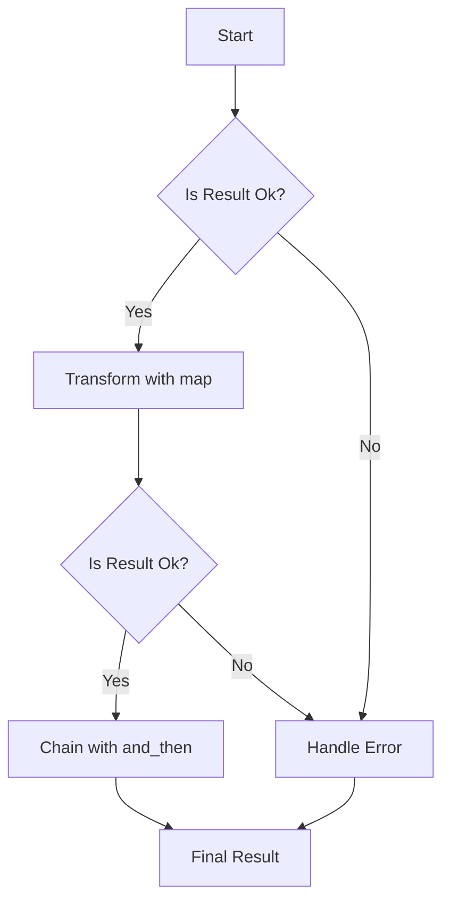

## 10.3. Functional Error Handling with `Result` and `Option`

In Rust, error handling is a fundamental aspect of writing robust and reliable software. Unlike many other programming languages that rely on exceptions, Rust employs a more functional approach to error handling using the `Result` and `Option` types. This approach not only enhances safety but also encourages developers to handle errors explicitly and thoughtfully.

### Understanding `Result` and `Option`

#### The `Result` Type

The `Result` type is an enum that represents either a success (`Ok`) or a failure (`Err`). It is defined as follows:

```rust
enum Result<T, E> {
    Ok(T),
    Err(E),
}
```

- **`Ok(T)`**: Indicates a successful operation, containing a value of type `T`.
- **`Err(E)`**: Represents an error, containing an error value of type `E`.

The `Result` type is used extensively in Rust to handle operations that can fail, such as file I/O, network requests, and more.

#### The `Option` Type

The `Option` type is another enum that represents a value that can be either present (`Some`) or absent (`None`). It is defined as follows:

```rust
enum Option<T> {
    Some(T),
    None,
}
```

- **`Some(T)`**: Contains a value of type `T`.
- **`None`**: Represents the absence of a value.

The `Option` type is used when a value might be optional, such as when searching for an item in a collection.

### Using Combinators for Functional Error Handling

Rust provides a set of combinators that allow you to work with `Result` and `Option` in a functional and composable way. These combinators enable you to transform, chain, and handle these types without resorting to explicit pattern matching.

#### The `map` Combinator

The `map` combinator is used to transform the value inside a `Result` or `Option` if it is `Ok` or `Some`, respectively.

```rust
fn main() {
    let number: Result<i32, &str> = Ok(5);
    let result = number.map(|x| x * 2);
    println!("{:?}", result); // Output: Ok(10)

    let maybe_number: Option<i32> = Some(5);
    let maybe_result = maybe_number.map(|x| x * 2);
    println!("{:?}", maybe_result); // Output: Some(10)
}
```

#### The `and_then` Combinator

The `and_then` combinator, also known as `flat_map`, is used to chain operations that return a `Result` or `Option`.

```rust
fn main() {
    let number: Result<i32, &str> = Ok(5);
    let result = number.and_then(|x| if x > 0 { Ok(x * 2) } else { Err("Negative number") });
    println!("{:?}", result); // Output: Ok(10)

    let maybe_number: Option<i32> = Some(5);
    let maybe_result = maybe_number.and_then(|x| if x > 0 { Some(x * 2) } else { None });
    println!("{:?}", maybe_result); // Output: Some(10)
}
```

#### The `unwrap_or` Combinator

The `unwrap_or` combinator provides a default value in case of `Err` or `None`.

```rust
fn main() {
    let number: Result<i32, &str> = Err("Error");
    let result = number.unwrap_or(0);
    println!("{}", result); // Output: 0

    let maybe_number: Option<i32> = None;
    let maybe_result = maybe_number.unwrap_or(0);
    println!("{}", maybe_result); // Output: 0
}
```

### Chaining Operations with `Result` and `Option`

One of the strengths of using `Result` and `Option` is the ability to chain operations in a clean and readable manner. This is particularly useful in scenarios where multiple operations can fail or return optional values.

```rust
fn main() {
    let result: Result<i32, &str> = Ok(5)
        .map(|x| x + 1)
        .and_then(|x| if x % 2 == 0 { Ok(x / 2) } else { Err("Odd number") })
        .map(|x| x * 3);

    println!("{:?}", result); // Output: Ok(9)
}
```

In this example, we start with a `Result` containing the number 5. We then chain several operations using combinators, transforming and handling the value at each step.

### Promoting Safer Error Handling

The functional approach to error handling in Rust promotes safety by making error handling explicit. Developers are encouraged to handle errors at the point where they occur, reducing the likelihood of unhandled exceptions and unexpected behavior.

- **Explicit Handling**: With `Result` and `Option`, you must explicitly handle the possibility of failure or absence of a value, leading to more robust code.
- **Composability**: Combinators allow you to compose operations in a clear and concise manner, reducing boilerplate code and improving readability.
- **Type Safety**: The type system ensures that you cannot ignore errors or optional values, preventing many common bugs.

### Comparing with Exception-Based Error Handling

In many programming languages, exceptions are used for error handling. While exceptions can be powerful, they also have drawbacks:

- **Implicit Control Flow**: Exceptions can lead to implicit control flow, making it difficult to understand and reason about the code.
- **Error Propagation**: Errors can propagate up the call stack, potentially leading to unhandled exceptions and program crashes.
- **Performance Overhead**: Exception handling can introduce performance overhead, especially in performance-critical applications.

In contrast, Rust's approach with `Result` and `Option` provides:

- **Explicit Control Flow**: Errors are handled explicitly, making the control flow clear and predictable.
- **Compile-Time Guarantees**: The type system ensures that errors are handled, reducing the risk of runtime failures.
- **Minimal Overhead**: The use of enums and combinators introduces minimal performance overhead.

### Visualizing Functional Error Handling

To better understand how `Result` and `Option` work, let's visualize the process of chaining operations using these types.



**Diagram Description**: This flowchart illustrates the process of handling a `Result` type. Starting with a `Result`, we check if it is `Ok`. If so, we transform the value using `map`. We then check again if the result is `Ok` and chain further operations using `and_then`. If at any point the result is `Err`, we handle the error.

### Try It Yourself

Experiment with the code examples provided in this section. Try modifying the operations, introducing errors, and observing how the combinators handle them. This hands-on approach will deepen your understanding of functional error handling in Rust.

### Knowledge Check

- What are the main differences between `Result` and `Option`?
- How does the `map` combinator work with `Result` and `Option`?
- What is the purpose of the `and_then` combinator?
- How does Rust's error handling approach differ from exception-based error handling?

### Summary

Functional error handling with `Result` and `Option` is a powerful feature of Rust that promotes safer and more robust code. By leveraging combinators like `map`, `and_then`, and `unwrap_or`, you can handle errors and optional values in a functional and composable way. This approach not only enhances safety but also improves code readability and maintainability.

Remember, this is just the beginning. As you continue to explore Rust, you'll discover even more ways to leverage its powerful type system and functional programming features. Keep experimenting, stay curious, and enjoy the journey!

## Quiz Time!



### What is the primary purpose of the `Result` type in Rust?

- [x] To represent success or failure of an operation
- [ ] To store optional values
- [ ] To handle exceptions
- [ ] To manage memory allocation

> **Explanation:** The `Result` type is used to represent the success or failure of an operation, with `Ok` for success and `Err` for failure.

### Which combinator is used to transform the value inside a `Result` or `Option`?

- [x] map
- [ ] and_then
- [ ] unwrap_or
- [ ] filter

> **Explanation:** The `map` combinator is used to transform the value inside a `Result` or `Option` if it is `Ok` or `Some`, respectively.

### How does the `and_then` combinator differ from `map`?

- [x] It chains operations that return a `Result` or `Option`
- [ ] It provides a default value
- [ ] It transforms the value inside a `Result` or `Option`
- [ ] It handles errors

> **Explanation:** The `and_then` combinator is used to chain operations that return a `Result` or `Option`, allowing for further processing.

### What does the `unwrap_or` combinator do?

- [x] Provides a default value if the `Result` is `Err` or `Option` is `None`
- [ ] Transforms the value inside a `Result` or `Option`
- [ ] Chains operations that return a `Result` or `Option`
- [ ] Handles errors

> **Explanation:** The `unwrap_or` combinator provides a default value if the `Result` is `Err` or the `Option` is `None`.

### How does Rust's error handling approach differ from exception-based error handling?

- [x] It uses explicit control flow and compile-time guarantees
- [ ] It relies on implicit control flow
- [ ] It introduces significant performance overhead
- [ ] It propagates errors up the call stack

> **Explanation:** Rust's error handling approach uses explicit control flow and compile-time guarantees, making it safer and more predictable than exception-based error handling.

### What is the benefit of using combinators like `map` and `and_then`?

- [x] They allow for functional and composable error handling
- [ ] They automatically handle all errors
- [ ] They improve performance
- [ ] They simplify memory management

> **Explanation:** Combinators like `map` and `and_then` allow for functional and composable error handling, improving code readability and maintainability.

### Which type is used to represent optional values in Rust?

- [x] Option
- [ ] Result
- [ ] Either
- [ ] Maybe

> **Explanation:** The `Option` type is used to represent optional values, with `Some` for present values and `None` for absent values.

### What does the `None` variant of `Option` represent?

- [x] The absence of a value
- [ ] A successful operation
- [ ] An error
- [ ] A default value

> **Explanation:** The `None` variant of `Option` represents the absence of a value.

### Can `Result` and `Option` be used together in Rust?

- [x] True
- [ ] False

> **Explanation:** `Result` and `Option` can be used together in Rust to handle different scenarios, such as optional values that may also result in errors.

### What is the main advantage of Rust's functional error handling approach?

- [x] It promotes safer and more robust code
- [ ] It simplifies syntax
- [ ] It eliminates all runtime errors
- [ ] It improves memory allocation

> **Explanation:** Rust's functional error handling approach promotes safer and more robust code by making error handling explicit and composable.




