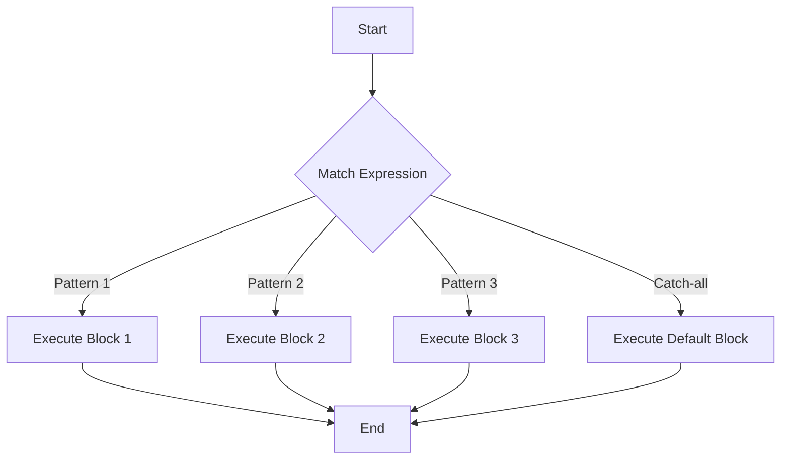

## 10.4. Pattern Matching and Algebraic Data Types

In Rust, pattern matching and algebraic data types (ADTs) are powerful tools that allow developers to write expressive, concise, and type-safe code. These features are particularly useful in functional programming paradigms, where they enable the representation of complex data structures and facilitate robust control flow mechanisms.

### Understanding Algebraic Data Types

Algebraic data types are a way to define data structures that can take on multiple forms. They are composed of two main types: product types and sum types.

- **Product Types**: These are types that combine multiple values into one. In Rust, this is typically represented by structs.
- **Sum Types**: These are types that can be one of several variants. Rust's enums are a perfect example of sum types.

#### Rust's Enums as Algebraic Data Types

Rust's enums are more powerful than those in many other languages because they can carry data. This makes them a versatile tool for defining algebraic data types.

```rust
enum Message {
    Quit,
    Move { x: i32, y: i32 },
    Write(String),
    ChangeColor(i32, i32, i32),
}
```

In the `Message` enum above, each variant can hold different types and amounts of associated data. This allows for a rich representation of data structures.

### Pattern Matching in Rust

Pattern matching is a mechanism for checking a value against a pattern. It is a powerful feature in Rust that allows for concise and expressive code. The `match` expression is the most common way to perform pattern matching.

#### Syntax of Pattern Matching

The basic syntax of a `match` expression is as follows:

```rust
match value {
    pattern1 => expression1,
    pattern2 => expression2,
    _ => default_expression,
}
```

Each pattern is checked in order, and the first one that matches the value is executed. The underscore (`_`) is a catch-all pattern that matches anything.

### Using Enums with Associated Data

Enums with associated data can be matched to extract and use the data they contain. Here's an example using the `Message` enum:

```rust
fn process_message(msg: Message) {
    match msg {
        Message::Quit => println!("Quit message received."),
        Message::Move { x, y } => println!("Move to coordinates: ({}, {})", x, y),
        Message::Write(text) => println!("Text message: {}", text),
        Message::ChangeColor(r, g, b) => println!("Change color to RGB({}, {}, {})", r, g, b),
    }
}
```

In this example, each variant of the `Message` enum is matched, and the associated data is extracted and used within the corresponding block.

### The Power of Match Expressions in Control Flow

Match expressions are not just for enums; they can be used with any type that implements the `PartialEq` trait. This makes them a versatile tool for control flow.

#### Exhaustiveness Checking

One of the key benefits of using match expressions is exhaustiveness checking. The Rust compiler ensures that all possible cases are handled, which helps prevent runtime errors.

```rust
fn describe_number(n: i32) {
    match n {
        1 => println!("One"),
        2 => println!("Two"),
        3 => println!("Three"),
        _ => println!("Other"),
    }
}
```

In the example above, the `_` pattern ensures that all numbers not explicitly matched are handled, making the code robust and error-free.

### Benefits of Pattern Matching and Algebraic Data Types

- **Expressiveness**: Pattern matching allows for concise and readable code.
- **Type Safety**: The compiler checks that all possible cases are handled, reducing runtime errors.
- **Flexibility**: Enums with associated data can represent complex data structures.
- **Control Flow**: Match expressions provide a powerful mechanism for branching logic.

### Visualizing Pattern Matching and Algebraic Data Types

To better understand how pattern matching and algebraic data types work together, let's visualize the process using a flowchart.



**Figure 1**: This flowchart illustrates the flow of a match expression, where each pattern is checked in sequence until a match is found.

### Try It Yourself

To deepen your understanding, try modifying the code examples provided. For instance, add a new variant to the `Message` enum and update the `process_message` function to handle it. Experiment with different patterns and see how the Rust compiler enforces exhaustiveness.

### References and Further Reading

- [Rust Book: Enums and Pattern Matching](https://doc.rust-lang.org/book/ch06-00-enums.html)
- [Rust Reference: Patterns](https://doc.rust-lang.org/reference/patterns.html)
- [Rust By Example: Pattern Matching](https://doc.rust-lang.org/rust-by-example/flow_control/match.html)

### Knowledge Check

- What are algebraic data types, and how do Rust's enums support them?
- How does pattern matching enhance control flow in Rust?
- What are the benefits of using match expressions in Rust?

### Embrace the Journey

Remember, mastering pattern matching and algebraic data types in Rust is a journey. As you continue to explore these concepts, you'll find new ways to write more expressive and efficient code. Keep experimenting, stay curious, and enjoy the journey!

## Quiz Time!



### What are algebraic data types?

- [x] Types that can take on multiple forms, composed of product and sum types.
- [ ] Types that are only used in arithmetic operations.
- [ ] Types that cannot hold any data.
- [ ] Types that are only used in object-oriented programming.

> **Explanation:** Algebraic data types can take on multiple forms and are composed of product types (like structs) and sum types (like enums).

### How do Rust's enums support algebraic data types?

- [x] By allowing variants to carry data, making them versatile for defining complex structures.
- [ ] By being limited to a single data type.
- [ ] By only supporting integer values.
- [ ] By not allowing any associated data.

> **Explanation:** Rust's enums can carry data, making them a powerful tool for defining algebraic data types.

### What is pattern matching in Rust?

- [x] A mechanism for checking a value against a pattern.
- [ ] A way to compare strings.
- [ ] A method for sorting arrays.
- [ ] A technique for encrypting data.

> **Explanation:** Pattern matching is used to check a value against a pattern, allowing for expressive and concise code.

### What is the syntax of a match expression?

- [x] `match value { pattern1 => expression1, pattern2 => expression2, _ => default_expression }`
- [ ] `if value { pattern1 => expression1, pattern2 => expression2, _ => default_expression }`
- [ ] `switch value { pattern1 => expression1, pattern2 => expression2, _ => default_expression }`
- [ ] `case value { pattern1 => expression1, pattern2 => expression2, _ => default_expression }`

> **Explanation:** The correct syntax for a match expression in Rust is `match value { pattern1 => expression1, pattern2 => expression2, _ => default_expression }`.

### What is exhaustiveness checking?

- [x] Ensuring all possible cases are handled in a match expression.
- [ ] Checking for memory leaks.
- [ ] Verifying code syntax.
- [ ] Testing for performance issues.

> **Explanation:** Exhaustiveness checking ensures that all possible cases are handled in a match expression, reducing runtime errors.

### What is the benefit of using enums with associated data?

- [x] They allow for the representation of complex data structures.
- [ ] They limit the flexibility of the code.
- [ ] They make the code harder to read.
- [ ] They are only useful for simple data types.

> **Explanation:** Enums with associated data can represent complex data structures, making the code more expressive.

### How can pattern matching enhance control flow?

- [x] By providing a powerful mechanism for branching logic.
- [ ] By making the code less readable.
- [ ] By limiting the number of possible branches.
- [ ] By only supporting simple conditions.

> **Explanation:** Pattern matching provides a powerful mechanism for branching logic, enhancing control flow.

### What is the role of the underscore (`_`) in a match expression?

- [x] It acts as a catch-all pattern that matches anything.
- [ ] It is used to separate patterns.
- [ ] It indicates a syntax error.
- [ ] It is used for variable declaration.

> **Explanation:** The underscore (`_`) acts as a catch-all pattern that matches anything in a match expression.

### Can match expressions be used with types other than enums?

- [x] True
- [ ] False

> **Explanation:** Match expressions can be used with any type that implements the `PartialEq` trait, not just enums.

### What is a product type in Rust?

- [x] A type that combines multiple values into one, typically represented by structs.
- [ ] A type that can only hold a single value.
- [ ] A type used for arithmetic operations.
- [ ] A type that cannot hold any data.

> **Explanation:** A product type combines multiple values into one and is typically represented by structs in Rust.


