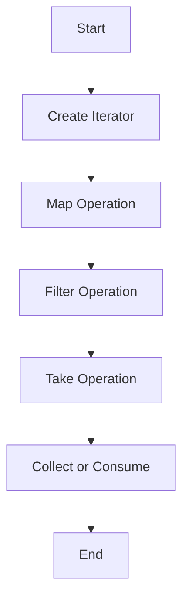

## 10.5. Using Iterators and Lazy Evaluation

In the world of Rust programming, iterators and lazy evaluation are powerful tools that enable efficient data processing. By leveraging these concepts, developers can write code that is both expressive and performant. This section will delve into how iterators facilitate lazy computation, explore the composability of iterator adaptors, and demonstrate real-world applications of lazy evaluation.

### Understanding Iterators in Rust

Iterators in Rust are a core component of the language's approach to functional programming. They provide a way to process sequences of elements without the need for explicit loops or intermediate collections. An iterator in Rust is an object that implements the `Iterator` trait, which requires the implementation of the `next` method. This method returns an `Option`, which is `Some(item)` if there is a next item, or `None` if the iteration is complete.

#### Example: Basic Iterator Usage

```rust
fn main() {
    let numbers = vec![1, 2, 3, 4, 5];
    let mut iter = numbers.iter();

    while let Some(number) = iter.next() {
        println!("{}", number);
    }
}
```

In this example, we create an iterator over a vector of numbers and use a `while let` loop to print each number. The `iter` method creates an iterator that borrows each element of the collection.

### Lazy Evaluation with Iterators

Lazy evaluation is a strategy that delays the computation of expressions until their values are needed. In Rust, iterators are inherently lazy. This means that operations on iterators, such as mapping or filtering, do not execute immediately. Instead, they create a chain of operations that are executed only when the final result is required.

#### Example: Lazy Evaluation with Map and Filter

```rust
fn main() {
    let numbers = vec![1, 2, 3, 4, 5];
    let result: Vec<_> = numbers.iter()
        .map(|x| x * 2)
        .filter(|x| x > 5)
        .collect();

    println!("{:?}", result);
}
```

In this example, the `map` and `filter` operations are chained together, but no computation occurs until `collect` is called. This lazy evaluation allows for efficient processing, as only the necessary elements are computed and stored.

### Iterator Adaptors and Composability

Iterator adaptors are methods that transform iterators into other iterators. They enable the chaining of multiple operations in a concise and readable manner. Some common iterator adaptors include `map`, `filter`, `take`, `skip`, and `zip`.

#### Example: Composing Iterator Adaptors

```rust
fn main() {
    let numbers = vec![1, 2, 3, 4, 5];
    let result: Vec<_> = numbers.iter()
        .map(|x| x * 2)
        .filter(|x| x > 5)
        .take(2)
        .collect();

    println!("{:?}", result);
}
```

Here, we chain `map`, `filter`, and `take` to create a pipeline of operations. This composability is a hallmark of functional programming and allows for expressive and concise code.

### Performance Gains from Lazy Evaluation

One of the key benefits of using iterators and lazy evaluation is the performance gain from avoiding intermediate collections. In traditional programming, each transformation might create a new collection, leading to increased memory usage and processing time. With lazy evaluation, these transformations are applied on-the-fly, reducing overhead.

#### Example: Avoiding Intermediate Collections

```rust
fn main() {
    let numbers = vec![1, 2, 3, 4, 5];
    let sum: i32 = numbers.iter()
        .map(|x| x * 2)
        .filter(|x| x > 5)
        .sum();

    println!("{}", sum);
}
```

In this example, the `sum` method consumes the iterator and computes the total without creating intermediate collections. This approach is both memory-efficient and fast.

### Real-World Applications of Lazy Evaluation

Lazy evaluation is not just a theoretical concept; it has practical applications in real-world programming. It is particularly useful in scenarios involving large data sets, where processing efficiency is crucial.

#### Example: Processing Large Data Sets

Consider a scenario where we need to process a large log file to extract and analyze specific information. Using iterators, we can efficiently filter and transform the data without loading the entire file into memory.

```rust
use std::fs::File;
use std::io::{self, BufRead};
use std::path::Path;

fn main() -> io::Result<()> {
    let path = Path::new("large_log.txt");
    let file = File::open(&path)?;
    let reader = io::BufReader::new(file);

    let error_lines: Vec<String> = reader.lines()
        .filter_map(Result::ok)
        .filter(|line| line.contains("ERROR"))
        .collect();

    println!("Number of error lines: {}", error_lines.len());
    Ok(())
}
```

In this example, we use a buffered reader to process each line of the file lazily. The `filter_map` and `filter` adaptors allow us to efficiently extract lines containing the word "ERROR".

### Visualizing Iterator Chains

To better understand how iterator chains work, let's visualize the process using a flowchart.



This flowchart illustrates the sequence of operations in an iterator chain. Each operation transforms the iterator, and the final operation (collect or consume) triggers the execution of the chain.

### Try It Yourself

Experiment with the code examples provided by modifying the operations or data. For instance, try adding a `skip` operation to the iterator chain or changing the condition in the `filter` adaptor. Observe how these changes affect the output and performance.

### Key Takeaways

- **Iterators in Rust**: Provide a way to process sequences of elements lazily and efficiently.
- **Lazy Evaluation**: Delays computation until the result is needed, reducing memory usage and processing time.
- **Iterator Adaptors**: Enable composability and concise expression of complex data transformations.
- **Performance Gains**: Achieved by avoiding intermediate collections and processing data on-the-fly.
- **Real-World Applications**: Particularly useful in scenarios involving large data sets or streams.

### Further Reading

For more information on iterators and lazy evaluation in Rust, consider exploring the following resources:

- [Rust Documentation on Iterators](https://doc.rust-lang.org/std/iter/index.html)
- [The Rust Programming Language Book](https://doc.rust-lang.org/book/ch13-02-iterators.html)
- [Functional Programming in Rust](https://www.oreilly.com/library/view/functional-programming-in/9781788390637/)

## Quiz Time!



### What is the primary benefit of using iterators in Rust?

- [x] Lazy evaluation and efficient data processing
- [ ] Simplifying syntax
- [ ] Enabling parallel execution
- [ ] Increasing code readability

> **Explanation:** Iterators in Rust provide lazy evaluation, allowing for efficient data processing by delaying computation until necessary.

### Which method is used to create an iterator from a collection in Rust?

- [x] iter()
- [ ] next()
- [ ] map()
- [ ] filter()

> **Explanation:** The `iter()` method is used to create an iterator from a collection in Rust.

### What does the `filter` adaptor do in an iterator chain?

- [x] It removes elements that do not satisfy a predicate
- [ ] It transforms each element
- [ ] It collects elements into a new collection
- [ ] It sorts the elements

> **Explanation:** The `filter` adaptor removes elements that do not satisfy a given predicate.

### How does lazy evaluation improve performance?

- [x] By avoiding intermediate collections
- [ ] By executing operations in parallel
- [ ] By simplifying code syntax
- [ ] By reducing the number of lines of code

> **Explanation:** Lazy evaluation improves performance by avoiding the creation of intermediate collections, thus reducing memory usage and processing time.

### Which of the following is an example of an iterator adaptor?

- [x] map()
- [ ] collect()
- [ ] sum()
- [ ] iter()

> **Explanation:** `map()` is an iterator adaptor that transforms each element of the iterator.

### What is the role of the `collect` method in an iterator chain?

- [x] It consumes the iterator and collects the results into a collection
- [ ] It filters elements based on a condition
- [ ] It transforms each element
- [ ] It creates an iterator from a collection

> **Explanation:** The `collect` method consumes the iterator and collects the results into a collection.

### Which operation triggers the execution of a lazy iterator chain?

- [x] Collecting or consuming the iterator
- [ ] Creating the iterator
- [ ] Mapping the elements
- [ ] Filtering the elements

> **Explanation:** Collecting or consuming the iterator triggers the execution of the lazy iterator chain.

### What does the `map` adaptor do in an iterator chain?

- [x] It transforms each element
- [ ] It removes elements that do not satisfy a predicate
- [ ] It collects elements into a new collection
- [ ] It sorts the elements

> **Explanation:** The `map` adaptor transforms each element of the iterator.

### True or False: Iterators in Rust are inherently eager.

- [ ] True
- [x] False

> **Explanation:** Iterators in Rust are inherently lazy, meaning they delay computation until the result is needed.

### Which of the following is a real-world application of lazy evaluation?

- [x] Processing large data sets efficiently
- [ ] Simplifying syntax
- [ ] Enabling parallel execution
- [ ] Increasing code readability

> **Explanation:** Lazy evaluation is particularly useful for processing large data sets efficiently by reducing memory usage and processing time.



Remember, this is just the beginning. As you progress, you'll discover more ways to harness the power of iterators and lazy evaluation in Rust. Keep experimenting, stay curious, and enjoy the journey!
