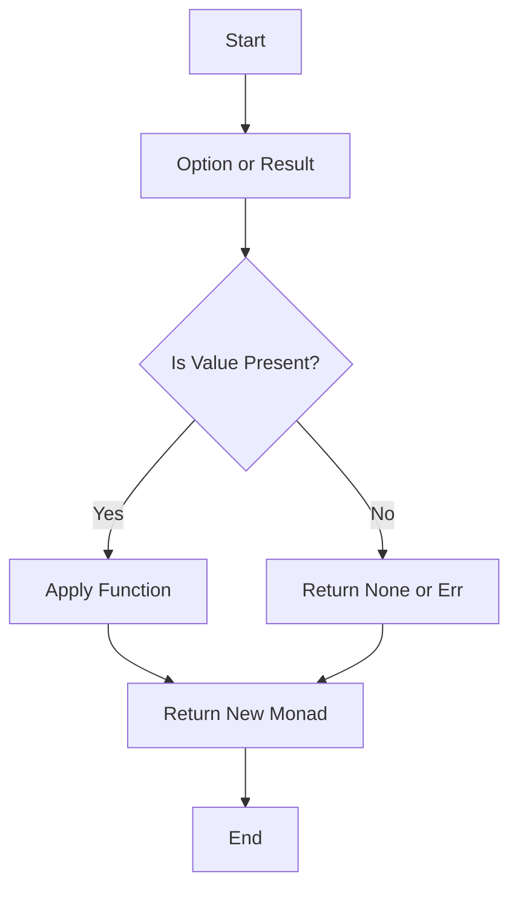

## 10.7. Monads and Monad-Like Patterns in Rust

### Introduction to Monads in Functional Programming

Monads are a fundamental concept in functional programming, providing a way to handle computations with context, such as computations that might fail or computations that produce side effects. In essence, a monad is a design pattern used to encapsulate values within a computational context, allowing for the chaining of operations while maintaining the context.

In Rust, monads are not a built-in feature but are implemented through types like `Option` and `Result`, which embody monadic behavior. These types enable developers to handle optional values and errors gracefully, providing a powerful toolset for managing complex computations.

### Understanding Monads

A monad can be thought of as a type constructor `M` and two operations:

1. **Unit (or Return)**: This operation takes a value and puts it into a monadic context. In Rust, this is akin to creating an `Option` or `Result` from a value.

2. **Bind (or FlatMap)**: This operation takes a monadic value and a function that returns a monadic value, applies the function to the unwrapped value, and returns a new monadic value. In Rust, this is represented by methods like `and_then`.

Monads must satisfy three laws to ensure consistent behavior:

- **Left Identity**: `unit(x).bind(f)` is equivalent to `f(x)`.
- **Right Identity**: `m.bind(unit)` is equivalent to `m`.
- **Associativity**: `(m.bind(f)).bind(g)` is equivalent to `m.bind(x => f(x).bind(g))`.

### Monads in Rust: `Option` and `Result`

Rust's `Option` and `Result` types are the most common examples of monads in Rust. They allow for handling computations that might fail (`Result`) or computations that might not return a value (`Option`).

#### The `Option` Monad

The `Option` type represents a value that can either be `Some(T)` or `None`. It is used to handle cases where a value might be absent.

```rust
fn divide(numerator: f64, denominator: f64) -> Option<f64> {
    if denominator == 0.0 {
        None
    } else {
        Some(numerator / denominator)
    }
}

fn main() {
    let result = divide(10.0, 2.0).and_then(|value| Some(value * 2.0));
    println!("{:?}", result); // Output: Some(10.0)
}
```

In this example, `and_then` is used to chain operations on the `Option` type, demonstrating the monadic behavior of `Option`.

#### The `Result` Monad

The `Result` type is used for error handling and represents either a success (`Ok(T)`) or an error (`Err(E)`).

```rust
fn divide(numerator: f64, denominator: f64) -> Result<f64, String> {
    if denominator == 0.0 {
        Err(String::from("Division by zero"))
    } else {
        Ok(numerator / denominator)
    }
}

fn main() {
    let result = divide(10.0, 0.0).and_then(|value| Ok(value * 2.0));
    match result {
        Ok(value) => println!("Result: {}", value),
        Err(e) => println!("Error: {}", e),
    }
}
```

Here, `and_then` is used to chain operations on the `Result` type, allowing for graceful error handling.

### Monadic Operations in Rust

Monadic operations in Rust are implemented through methods like `map`, `and_then`, and `or_else`. These methods allow for chaining operations while maintaining the monadic context.

#### `map` and `and_then`

- **`map`**: Applies a function to the contained value (if any) and returns a new monad.
- **`and_then`**: Similar to `map`, but the function must return a monad.

```rust
fn main() {
    let option_value = Some(5);
    let result = option_value.map(|x| x * 2);
    println!("{:?}", result); // Output: Some(10)

    let result_value: Result<i32, &str> = Ok(5);
    let result = result_value.and_then(|x| Ok(x * 2));
    println!("{:?}", result); // Output: Ok(10)
}
```

#### `or_else`

- **`or_else`**: Provides a fallback value or computation if the monad is empty or contains an error.

```rust
fn main() {
    let option_value: Option<i32> = None;
    let result = option_value.or_else(|| Some(10));
    println!("{:?}", result); // Output: Some(10)

    let result_value: Result<i32, &str> = Err("Error");
    let result = result_value.or_else(|_| Ok(10));
    println!("{:?}", result); // Output: Ok(10)
}
```

### Benefits of Monads in Rust

Monads provide several benefits in Rust, particularly in error handling and chaining operations:

1. **Error Handling**: Monads like `Result` allow for elegant error handling without the need for exceptions, making code more predictable and easier to reason about.

2. **Chaining Operations**: Monads enable chaining of operations, allowing for more concise and readable code.

3. **Context Management**: Monads encapsulate context, such as the presence or absence of a value (`Option`) or the success or failure of a computation (`Result`).

### Visualizing Monadic Operations

To better understand monadic operations, let's visualize the flow of data through a series of operations using a flowchart.



This flowchart illustrates how monadic operations like `map` and `and_then` process values within a monadic context.

### Understanding Monads to Improve Rust Programming

Understanding monads can significantly improve your Rust programming skills by enabling you to write more robust, concise, and maintainable code. By leveraging monadic patterns, you can handle errors gracefully, chain operations seamlessly, and manage context effectively.

### Try It Yourself

To deepen your understanding of monads in Rust, try modifying the code examples provided. Experiment with different operations and see how they affect the monadic behavior. Consider implementing your own monadic types and operations to gain a deeper insight into this powerful pattern.

### References and Further Reading

- [Rust Documentation on Option](https://doc.rust-lang.org/std/option/)
- [Rust Documentation on Result](https://doc.rust-lang.org/std/result/)
- [Learn You a Haskell for Great Good!](http://learnyouahaskell.com/)

### Knowledge Check

- What are the two main operations of a monad?
- How do `Option` and `Result` embody monadic behavior in Rust?
- What are the benefits of using monads for error handling?

### Embrace the Journey

Remember, understanding monads is just the beginning. As you continue to explore Rust and functional programming, you'll discover more powerful patterns and techniques. Keep experimenting, stay curious, and enjoy the journey!

## Quiz Time!



### What is a monad in functional programming?

- [x] A design pattern for handling computations with context
- [ ] A type of loop structure
- [ ] A method for optimizing memory usage
- [ ] A way to define classes

> **Explanation:** A monad is a design pattern used to handle computations with context, such as computations that might fail or produce side effects.

### Which Rust types embody monadic behavior?

- [x] Option and Result
- [ ] Vec and HashMap
- [ ] String and &str
- [ ] i32 and f64

> **Explanation:** In Rust, `Option` and `Result` types embody monadic behavior, allowing for handling optional values and errors.

### What does the `and_then` method do in Rust?

- [x] Chains operations on monadic types
- [ ] Converts a string to uppercase
- [ ] Allocates memory for a new object
- [ ] Initializes a new thread

> **Explanation:** The `and_then` method is used to chain operations on monadic types like `Option` and `Result`.

### What is the purpose of the `or_else` method?

- [x] Provides a fallback value or computation
- [ ] Converts a number to a string
- [ ] Sorts a list of values
- [ ] Reads data from a file

> **Explanation:** The `or_else` method provides a fallback value or computation if the monad is empty or contains an error.

### How do monads improve error handling in Rust?

- [x] By allowing for elegant error handling without exceptions
- [ ] By increasing the speed of computations
- [ ] By reducing memory usage
- [ ] By simplifying syntax

> **Explanation:** Monads like `Result` allow for elegant error handling without the need for exceptions, making code more predictable and easier to reason about.

### What are the three laws that monads must satisfy?

- [x] Left Identity, Right Identity, Associativity
- [ ] Commutativity, Distributivity, Identity
- [ ] Inheritance, Polymorphism, Encapsulation
- [ ] Abstraction, Encapsulation, Modularity

> **Explanation:** Monads must satisfy the laws of Left Identity, Right Identity, and Associativity to ensure consistent behavior.

### What is the `map` method used for in Rust?

- [x] Applies a function to the contained value and returns a new monad
- [ ] Converts a number to a string
- [ ] Allocates memory for a new object
- [ ] Initializes a new thread

> **Explanation:** The `map` method applies a function to the contained value (if any) and returns a new monad.

### How can understanding monads improve Rust programming?

- [x] By enabling more robust, concise, and maintainable code
- [ ] By increasing the speed of computations
- [ ] By reducing memory usage
- [ ] By simplifying syntax

> **Explanation:** Understanding monads can improve Rust programming by enabling more robust, concise, and maintainable code.

### What is the `unit` operation in the context of monads?

- [x] Takes a value and puts it into a monadic context
- [ ] Converts a string to uppercase
- [ ] Allocates memory for a new object
- [ ] Initializes a new thread

> **Explanation:** The `unit` operation takes a value and puts it into a monadic context, similar to creating an `Option` or `Result` from a value.

### True or False: Monads are a built-in feature in Rust.

- [ ] True
- [x] False

> **Explanation:** Monads are not a built-in feature in Rust but are implemented through types like `Option` and `Result`.


