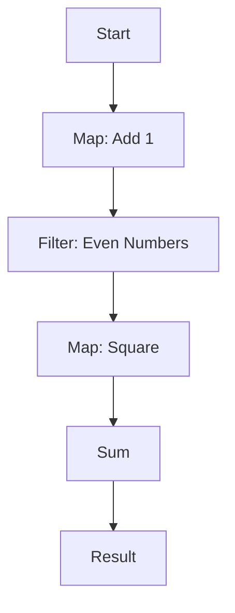

## 10.8. Composition of Functions and Pipelines

In the realm of functional programming, the composition of functions and the creation of pipelines are powerful techniques that allow developers to build complex functionality from simple, reusable components. Rust, with its strong emphasis on safety and performance, provides robust support for these paradigms. In this section, we'll delve into the concepts of function composition and pipelines, explore how to chain functions using method notation, and demonstrate the use of iterators and combinators to enhance code readability and maintainability.

### Understanding Function Composition

**Function composition** is the process of combining two or more functions to produce a new function. This new function represents the application of the original functions in sequence. In mathematical terms, if you have two functions, `f` and `g`, their composition is denoted as `f(g(x))`, meaning `g` is applied to `x`, and then `f` is applied to the result of `g(x)`.

In Rust, function composition can be achieved using closures and higher-order functions. Let's start with a simple example:

```rust
fn add_one(x: i32) -> i32 {
    x + 1
}

fn double(x: i32) -> i32 {
    x * 2
}

fn main() {
    let composed = |x| double(add_one(x));
    let result = composed(5);
    println!("Result: {}", result); // Output: Result: 12
}
```

In this example, we define two functions, `add_one` and `double`. We then create a closure `composed` that applies `add_one` to its input and then applies `double` to the result. This demonstrates the essence of function composition.

### Chaining Functions Using Method Notation

Rust's method notation allows for a more fluent style of function chaining, often referred to as **method chaining**. This is particularly useful when working with iterators and combinators, where each method call returns a new iterator, allowing for a sequence of operations to be performed in a pipeline-like manner.

Consider the following example using Rust's iterator methods:

```rust
fn main() {
    let numbers = vec![1, 2, 3, 4, 5];

    let result: Vec<i32> = numbers.iter()
        .map(|&x| x + 1)
        .filter(|&x| x % 2 == 0)
        .collect();

    println!("{:?}", result); // Output: [2, 4, 6]
}
```

Here, we start with a vector of numbers and use method chaining to create a pipeline of operations. We first map each number to its successor, then filter out the odd numbers, and finally collect the results into a new vector. This approach is not only concise but also highly readable.

### Leveraging Iterators and Combinators

**Iterators** are a core component of Rust's standard library, providing a way to process sequences of elements. They are lazy, meaning they do not perform any computation until they are consumed. This laziness allows for efficient chaining of operations.

**Combinators** are methods provided by iterators that allow for the transformation and combination of iterator elements. Some common combinators include `map`, `filter`, `fold`, and `collect`.

Let's explore a more complex example using iterators and combinators:

```rust
fn main() {
    let words = vec!["hello", "world", "rust", "is", "awesome"];

    let result: String = words.iter()
        .map(|s| s.to_uppercase())
        .filter(|s| s.len() > 4)
        .collect::<Vec<_>>()
        .join(" ");

    println!("{}", result); // Output: "HELLO WORLD AWESOME"
}
```

In this example, we start with a vector of strings and use a series of combinators to transform and filter the data. We convert each string to uppercase, filter out strings with five or fewer characters, and then join the remaining strings into a single space-separated string.

### Readability and Maintainability of Pipelines

One of the key benefits of using function composition and pipelines is the improvement in code readability and maintainability. By breaking down complex operations into a series of simple, composable steps, we make our code easier to understand and modify.

Consider the following example, which processes a list of numbers to compute the sum of the squares of even numbers:

```rust
fn main() {
    let numbers = vec![1, 2, 3, 4, 5, 6];

    let sum_of_squares: i32 = numbers.iter()
        .filter(|&&x| x % 2 == 0)
        .map(|&x| x * x)
        .sum();

    println!("Sum of squares: {}", sum_of_squares); // Output: Sum of squares: 56
}
```

By using a pipeline of iterator combinators, we clearly express the intent of the computation: filter even numbers, square them, and compute the sum. This clarity makes the code easier to read and maintain.

### Limitations and Overcoming Them

While function composition and pipelines offer many advantages, they also come with some limitations. One potential issue is the loss of intermediate results, which can make debugging more challenging. Additionally, deeply nested or overly complex pipelines can become difficult to follow.

To overcome these limitations, consider the following strategies:

- **Use Intermediate Variables**: Break down complex pipelines into smaller steps with intermediate variables. This can help with debugging and improve readability.

- **Leverage Logging**: Insert logging statements within the pipeline to track intermediate results. This can be particularly useful for debugging complex transformations.

- **Refactor Complex Pipelines**: If a pipeline becomes too complex, consider refactoring it into smaller, reusable functions. This can improve both readability and maintainability.

### Rust Unique Features

Rust's unique features, such as its strong type system and ownership model, enhance the power of function composition and pipelines. The type system ensures that operations are type-safe, while the ownership model prevents data races and ensures memory safety.

### Differences and Similarities

Function composition and pipelines in Rust share similarities with other functional programming languages, such as Haskell and Scala. However, Rust's emphasis on safety and performance sets it apart. Unlike some languages, Rust does not have built-in support for function composition operators, but its iterator combinators and method chaining provide a powerful alternative.

### Try It Yourself

To solidify your understanding of function composition and pipelines in Rust, try modifying the examples provided. Experiment with different combinators, such as `fold` or `take_while`, and observe how they affect the output. Consider creating your own pipelines to solve real-world problems.

### Visualizing Function Composition and Pipelines

To better understand the flow of data through a pipeline, let's visualize the process using a flowchart:



This flowchart represents a pipeline that maps numbers by adding 1, filters for even numbers, squares them, and then computes the sum. Each step in the pipeline is clearly defined, illustrating the flow of data.

### References and Links

For further reading on function composition and pipelines in Rust, consider the following resources:

- [Rust by Example: Iterators](https://doc.rust-lang.org/rust-by-example/trait/iter.html)
- [The Rust Programming Language: Functional Language Features](https://doc.rust-lang.org/book/ch13-00-functional-features.html)
- [Rust Standard Library: Iterator](https://doc.rust-lang.org/std/iter/trait.Iterator.html)

### Knowledge Check

To reinforce your understanding, consider the following questions:

- How does function composition improve code readability?
- What are some common iterator combinators used in Rust?
- How can you overcome the limitations of complex pipelines?

### Embrace the Journey

Remember, mastering function composition and pipelines is a journey. As you continue to explore Rust's functional programming features, you'll discover new ways to build efficient, maintainable code. Keep experimenting, stay curious, and enjoy the process!

## Quiz Time!



### What is function composition?

- [x] Combining two or more functions to produce a new function.
- [ ] A method for optimizing code performance.
- [ ] A way to handle errors in Rust.
- [ ] A technique for managing memory.

> **Explanation:** Function composition involves combining functions to create a new function that applies the original functions in sequence.

### How can you chain functions in Rust?

- [x] Using method notation.
- [ ] By writing all functions in a single line.
- [ ] By using macros.
- [ ] By creating a new function for each operation.

> **Explanation:** Method notation allows for chaining functions in Rust, providing a fluent and readable style.

### What is a common use of iterators in Rust?

- [x] Processing sequences of elements.
- [ ] Managing memory allocation.
- [ ] Handling concurrency.
- [ ] Optimizing performance.

> **Explanation:** Iterators are used to process sequences of elements in a lazy and efficient manner.

### What is a combinator in Rust?

- [x] A method provided by iterators for transforming and combining elements.
- [ ] A tool for debugging Rust code.
- [ ] A type of smart pointer.
- [ ] A concurrency primitive.

> **Explanation:** Combinators are methods that allow for the transformation and combination of iterator elements.

### How can you improve the readability of complex pipelines?

- [x] Use intermediate variables.
- [x] Leverage logging.
- [ ] Avoid using iterators.
- [ ] Use macros for all operations.

> **Explanation:** Using intermediate variables and logging can help improve the readability and debuggability of complex pipelines.

### What is a limitation of function composition?

- [x] Loss of intermediate results.
- [ ] Increased memory usage.
- [ ] Poor performance.
- [ ] Lack of type safety.

> **Explanation:** Function composition can lead to the loss of intermediate results, making debugging more challenging.

### How does Rust's type system enhance function composition?

- [x] Ensures type-safe operations.
- [ ] Increases code performance.
- [ ] Simplifies memory management.
- [ ] Provides built-in logging.

> **Explanation:** Rust's type system ensures that operations in function composition are type-safe.

### What is the benefit of using pipelines in Rust?

- [x] Improved code readability and maintainability.
- [ ] Faster execution times.
- [ ] Easier memory management.
- [ ] Built-in error handling.

> **Explanation:** Pipelines improve code readability and maintainability by breaking down complex operations into simple, composable steps.

### Can Rust's ownership model prevent data races in pipelines?

- [x] True
- [ ] False

> **Explanation:** Rust's ownership model prevents data races by ensuring that data is accessed safely and concurrently.

### What is a strategy to overcome the limitations of complex pipelines?

- [x] Refactor into smaller, reusable functions.
- [ ] Use more complex combinators.
- [ ] Avoid using iterators.
- [ ] Write all operations in a single function.

> **Explanation:** Refactoring complex pipelines into smaller, reusable functions can improve readability and maintainability.


