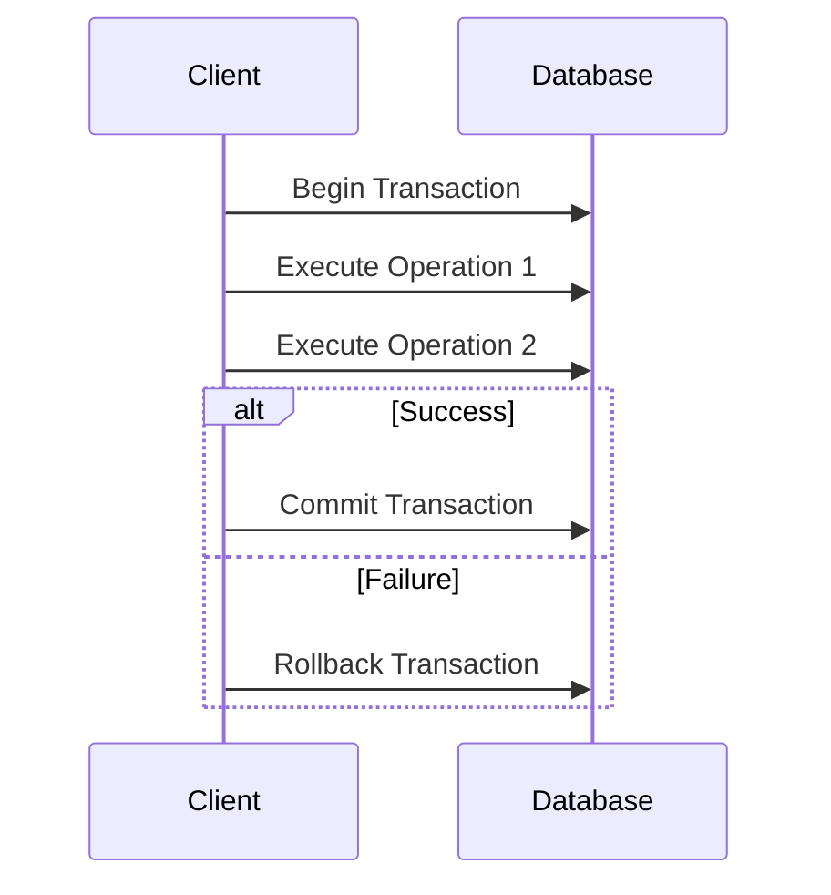

## 11.10. Transaction Management

In the world of software development, ensuring data integrity is paramount, especially when dealing with databases. Transactions play a crucial role in maintaining this integrity by allowing a series of operations to be executed as a single unit of work. In this section, we will delve into transaction management in Rust, focusing on how to handle transactions using popular Rust libraries like Diesel and SQLx. We will explore the importance of transactions, how to begin, commit, and roll back transactions, and the considerations necessary for concurrent environments. Additionally, we will discuss error handling within transaction scopes.

### Understanding Transactions

A transaction is a sequence of operations performed as a single logical unit of work. Transactions are essential for maintaining data integrity and consistency, especially in databases. They ensure that either all operations within the transaction are completed successfully, or none are applied, leaving the database in a consistent state.

#### ACID Properties

Transactions are characterized by the ACID properties:

- **Atomicity**: Ensures that all operations within a transaction are completed; if any operation fails, the entire transaction is rolled back.
- **Consistency**: Guarantees that a transaction will bring the database from one valid state to another, maintaining database invariants.
- **Isolation**: Ensures that concurrent transactions do not interfere with each other, providing a consistent view of the data.
- **Durability**: Once a transaction is committed, the changes are permanent, even in the event of a system failure.

### Transaction Management with Diesel ORM

Diesel is a powerful ORM for Rust that provides a type-safe interface to interact with databases. It supports transaction management, allowing developers to perform operations within a transaction scope.

#### Starting a Transaction

To begin a transaction in Diesel, you use the `transaction` method provided by the `Connection` trait. This method takes a closure that contains the operations to be performed within the transaction.

```rust
use diesel::prelude::*;
use diesel::result::Error;

fn perform_transaction(conn: &PgConnection) -> Result<(), Error> {
    conn.transaction::<_, Error, _>(|| {
        // Perform database operations here
        Ok(())
    })
}
```

#### Committing and Rolling Back Transactions

In Diesel, transactions are automatically committed if the closure returns `Ok(())`. If an error occurs and the closure returns `Err`, the transaction is rolled back.

```rust
use diesel::prelude::*;
use diesel::result::Error;

fn perform_transaction(conn: &PgConnection) -> Result<(), Error> {
    conn.transaction::<_, Error, _>(|| {
        // Insert a new user
        diesel::insert_into(users::table)
            .values(&new_user)
            .execute(conn)?;

        // Update user details
        diesel::update(users::table.find(user_id))
            .set(users::name.eq("New Name"))
            .execute(conn)?;

        // If all operations succeed, the transaction is committed
        Ok(())
    })
}
```

#### Error Handling in Transactions

Error handling is crucial in transaction management. Diesel provides a robust error handling mechanism that allows you to handle errors gracefully within a transaction.

```rust
use diesel::prelude::*;
use diesel::result::Error;

fn perform_transaction(conn: &PgConnection) -> Result<(), Error> {
    conn.transaction::<_, Error, _>(|| {
        // Attempt to insert a new user
        match diesel::insert_into(users::table)
            .values(&new_user)
            .execute(conn) {
            Ok(_) => println!("User inserted successfully"),
            Err(e) => {
                println!("Failed to insert user: {:?}", e);
                return Err(e);
            }
        }

        // If all operations succeed, the transaction is committed
        Ok(())
    })
}
```

### Transaction Management with SQLx

SQLx is another popular library for interacting with databases in Rust. It provides an async-first approach to database operations, making it suitable for modern Rust applications.

#### Starting a Transaction

In SQLx, you can start a transaction using the `begin` method on a connection. This method returns a `Transaction` object that you can use to perform operations.

```rust
use sqlx::PgPool;
use sqlx::Error;

async fn perform_transaction(pool: &PgPool) -> Result<(), Error> {
    let mut tx = pool.begin().await?;

    // Perform database operations here

    tx.commit().await?;
    Ok(())
}
```

#### Committing and Rolling Back Transactions

To commit a transaction in SQLx, you call the `commit` method on the `Transaction` object. If an error occurs, you can roll back the transaction using the `rollback` method.

```rust
use sqlx::PgPool;
use sqlx::Error;

async fn perform_transaction(pool: &PgPool) -> Result<(), Error> {
    let mut tx = pool.begin().await?;

    // Insert a new user
    sqlx::query!("INSERT INTO users (name) VALUES ($1)", "New User")
        .execute(&mut tx)
        .await?;

    // Update user details
    sqlx::query!("UPDATE users SET name = $1 WHERE id = $2", "Updated Name", user_id)
        .execute(&mut tx)
        .await?;

    // If all operations succeed, commit the transaction
    tx.commit().await?;
    Ok(())
}
```

#### Error Handling in Transactions

SQLx provides comprehensive error handling capabilities, allowing you to handle errors within a transaction scope effectively.

```rust
use sqlx::PgPool;
use sqlx::Error;

async fn perform_transaction(pool: &PgPool) -> Result<(), Error> {
    let mut tx = pool.begin().await?;

    // Attempt to insert a new user
    match sqlx::query!("INSERT INTO users (name) VALUES ($1)", "New User")
        .execute(&mut tx)
        .await {
        Ok(_) => println!("User inserted successfully"),
        Err(e) => {
            println!("Failed to insert user: {:?}", e);
            tx.rollback().await?;
            return Err(e);
        }
    }

    // If all operations succeed, commit the transaction
    tx.commit().await?;
    Ok(())
}
```

### Considerations in Concurrent Environments

When dealing with concurrent environments, transaction management becomes more complex. It is essential to ensure that transactions are isolated and do not interfere with each other. Here are some considerations:

- **Isolation Levels**: Different databases support various isolation levels, such as Read Committed, Repeatable Read, and Serializable. Choose the appropriate isolation level based on your application's requirements.
- **Deadlocks**: Be aware of potential deadlocks when multiple transactions are trying to access the same resources. Implement deadlock detection and resolution strategies.
- **Optimistic vs. Pessimistic Locking**: Decide between optimistic and pessimistic locking strategies based on your application's concurrency needs.

### Visualizing Transaction Management

To better understand transaction management, let's visualize the process using a sequence diagram.



This diagram illustrates the sequence of operations in a transaction. The client begins a transaction, executes a series of operations, and either commits or rolls back the transaction based on the success or failure of the operations.

### Try It Yourself

To solidify your understanding of transaction management in Rust, try modifying the code examples provided. Experiment with different operations, error scenarios, and isolation levels. Observe how the transaction behavior changes with these modifications.

### Further Reading

For more information on transaction management and Rust database libraries, consider exploring the following resources:

- [Diesel ORM Documentation](https://diesel.rs/)
- [SQLx Documentation](https://crates.io/crates/sqlx)
- [Rust Programming Language](https://www.rust-lang.org/)

### Summary

In this section, we explored the importance of transaction management in Rust applications and how to handle transactions using Diesel and SQLx. We discussed the ACID properties of transactions, how to begin, commit, and roll back transactions, and the considerations necessary for concurrent environments. Additionally, we covered error handling within transaction scopes and provided visualizations to aid understanding.

Remember, mastering transaction management is crucial for ensuring data integrity and consistency in your Rust applications. Keep experimenting, stay curious, and enjoy the journey!

## Quiz Time!



### What is the primary purpose of a transaction in a database?

- [x] To ensure data integrity and consistency
- [ ] To improve database performance
- [ ] To simplify database queries
- [ ] To reduce database storage requirements

> **Explanation:** Transactions ensure that a series of operations are executed as a single unit, maintaining data integrity and consistency.

### Which of the following is NOT an ACID property?

- [ ] Atomicity
- [ ] Consistency
- [ ] Isolation
- [x] Scalability

> **Explanation:** Scalability is not an ACID property. The ACID properties are Atomicity, Consistency, Isolation, and Durability.

### How does Diesel handle transactions?

- [x] Using the `transaction` method on a connection
- [ ] Using the `begin` method on a connection
- [ ] Using the `commit` method on a connection
- [ ] Using the `rollback` method on a connection

> **Explanation:** Diesel uses the `transaction` method on a connection to handle transactions.

### What happens if an error occurs within a Diesel transaction?

- [ ] The transaction is committed
- [x] The transaction is rolled back
- [ ] The transaction is paused
- [ ] The transaction is ignored

> **Explanation:** If an error occurs within a Diesel transaction, the transaction is rolled back.

### In SQLx, how do you start a transaction?

- [ ] Using the `transaction` method
- [x] Using the `begin` method
- [ ] Using the `commit` method
- [ ] Using the `rollback` method

> **Explanation:** In SQLx, you start a transaction using the `begin` method.

### What is the purpose of the `commit` method in SQLx?

- [x] To finalize and apply the changes made in a transaction
- [ ] To start a new transaction
- [ ] To pause a transaction
- [ ] To roll back a transaction

> **Explanation:** The `commit` method in SQLx is used to finalize and apply the changes made in a transaction.

### What is a potential issue when dealing with concurrent transactions?

- [ ] Increased database storage
- [ ] Faster query execution
- [x] Deadlocks
- [ ] Improved data consistency

> **Explanation:** Deadlocks can occur when multiple transactions are trying to access the same resources concurrently.

### Which isolation level provides the highest level of data consistency?

- [ ] Read Uncommitted
- [ ] Read Committed
- [ ] Repeatable Read
- [x] Serializable

> **Explanation:** Serializable isolation level provides the highest level of data consistency by ensuring complete isolation between transactions.

### What is the role of error handling in transaction management?

- [x] To ensure that transactions are rolled back in case of failures
- [ ] To improve transaction performance
- [ ] To simplify transaction code
- [ ] To reduce transaction storage

> **Explanation:** Error handling ensures that transactions are rolled back in case of failures, maintaining data integrity.

### True or False: Transactions in Diesel are automatically committed if the closure returns `Ok(())`.

- [x] True
- [ ] False

> **Explanation:** In Diesel, transactions are automatically committed if the closure returns `Ok(())`.


