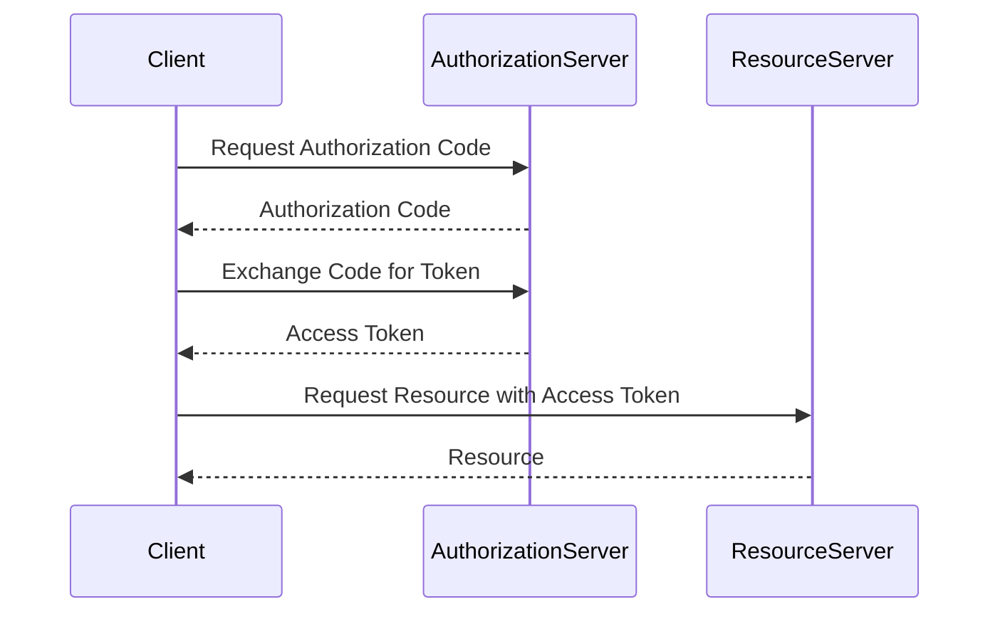

## 11.11. Security and Authentication Integration

In today's digital landscape, security and authentication are critical components of any application. Rust, with its focus on safety and performance, provides robust tools and libraries to implement these features effectively. In this section, we will explore common authentication methods such as JSON Web Tokens (JWT) and OAuth2, demonstrate how to secure APIs and web applications, and discuss best practices for password handling and storage. We will also highlight the importance of Transport Layer Security (TLS) for secure communication.

### Understanding Authentication and Authorization

Before diving into implementation, it's essential to differentiate between authentication and authorization:

- **Authentication** is the process of verifying the identity of a user or system. It answers the question, "Who are you?"
- **Authorization** determines what an authenticated user or system is allowed to do. It answers the question, "What can you do?"

### Common Authentication Methods

#### JSON Web Tokens (JWT)

JWT is a compact, URL-safe means of representing claims to be transferred between two parties. The claims in a JWT are encoded as a JSON object that is used as the payload of a JSON Web Signature (JWS) structure or as the plaintext of a JSON Web Encryption (JWE) structure, enabling the claims to be digitally signed or integrity protected with a Message Authentication Code (MAC) and/or encrypted.

##### Key Components of JWT

- **Header**: Typically consists of two parts: the type of token (JWT) and the signing algorithm being used, such as HMAC SHA256 or RSA.
- **Payload**: Contains the claims. Claims are statements about an entity (typically, the user) and additional data.
- **Signature**: To create the signature part, you have to take the encoded header, the encoded payload, a secret, the algorithm specified in the header, and sign that.

##### Implementing JWT in Rust

To implement JWT in Rust, we can use the `jsonwebtoken` crate. Here's a simple example:

```rust
use jsonwebtoken::{encode, decode, Header, Validation, EncodingKey, DecodingKey, Algorithm, TokenData};
use serde::{Serialize, Deserialize};

// Define the claims struct
#[derive(Debug, Serialize, Deserialize)]
struct Claims {
    sub: String,
    company: String,
    exp: usize,
}

fn main() {
    // Create a new token
    let my_claims = Claims {
        sub: "b@b.com".to_owned(),
        company: "ACME".to_owned(),
        exp: 10000000000,
    };

    let key = "secret";
    let token = encode(&Header::default(), &my_claims, &EncodingKey::from_secret(key.as_ref())).unwrap();
    println!("Token: {}", token);

    // Decode the token
    let token_data: TokenData<Claims> = decode::<Claims>(&token, &DecodingKey::from_secret(key.as_ref()), &Validation::new(Algorithm::HS256)).unwrap();
    println!("Claims: {:?}", token_data.claims);
}
```

In this example, we define a `Claims` struct to represent the data we want to encode in the JWT. We then use the `encode` function to create a token and the `decode` function to verify and extract the claims.

#### OAuth2

OAuth2 is an authorization framework that enables applications to obtain limited access to user accounts on an HTTP service. It works by delegating user authentication to the service that hosts the user account and authorizing third-party applications to access the user account.

##### Implementing OAuth2 in Rust

The `oauth2` crate provides a comprehensive implementation of the OAuth2 protocol. Here's an example of how to use it:

```rust
use oauth2::basic::BasicClient;
use oauth2::{AuthUrl, TokenUrl, ClientId, ClientSecret};
use oauth2::reqwest::http_client;

fn main() {
    // Create an OAuth2 client by specifying the client ID, client secret, authorization URL and token URL.
    let client = BasicClient::new(
        ClientId::new("client_id".to_string()),
        Some(ClientSecret::new("client_secret".to_string())),
        AuthUrl::new("https://example.com/auth".to_string()).unwrap(),
        Some(TokenUrl::new("https://example.com/token".to_string()).unwrap())
    );

    // Exchange the code with a token.
    let token_result = client.exchange_code("authorization_code".to_string())
        .request(http_client);

    match token_result {
        Ok(token) => println!("Access token: {:?}", token),
        Err(err) => println!("Error: {:?}", err),
    }
}
```

In this example, we create an `OAuth2` client with the necessary URLs and credentials. We then exchange an authorization code for an access token.

### Securing APIs and Web Applications

Securing APIs and web applications involves several layers of protection, including authentication, authorization, and secure communication.

#### Best Practices for Password Handling and Storage

1. **Hash Passwords**: Always hash passwords before storing them in a database. Use a strong hashing algorithm like bcrypt, scrypt, or Argon2.
2. **Use Salts**: Add a unique salt to each password before hashing to protect against rainbow table attacks.
3. **Limit Login Attempts**: Implement rate limiting to prevent brute force attacks.
4. **Use HTTPS**: Ensure all data is transmitted over HTTPS to protect against man-in-the-middle attacks.

#### Importance of TLS and Secure Communication

Transport Layer Security (TLS) is essential for securing data in transit. It provides encryption, data integrity, and authentication, ensuring that data sent over the network cannot be intercepted or tampered with.

##### Implementing TLS in Rust

Rust provides several crates for implementing TLS, such as `rustls`. Here's a basic example:

```rust
use std::sync::Arc;
use rustls::{ServerConfig, NoClientAuth};
use rustls::internal::pemfile::{certs, rsa_private_keys};
use std::fs::File;
use std::io::BufReader;

fn main() {
    let cert_file = &mut BufReader::new(File::open("cert.pem").unwrap());
    let key_file = &mut BufReader::new(File::open("key.pem").unwrap());

    let cert_chain = certs(cert_file).unwrap();
    let mut keys = rsa_private_keys(key_file).unwrap();
    let config = ServerConfig::new(NoClientAuth::new());
    let config = Arc::new(config.set_single_cert(cert_chain, keys.remove(0)).unwrap());

    // Use the config in a server
    // ...
}
```

In this example, we load a certificate and private key from files and create a `ServerConfig` for a TLS server.

### External Frameworks and Libraries

- [`jsonwebtoken` crate](https://crates.io/crates/jsonwebtoken): A library for creating and verifying JWTs in Rust.
- [`oauth2` crate](https://crates.io/crates/oauth2): A comprehensive OAuth2 client library for Rust.

### Try It Yourself

Experiment with the examples provided by modifying the claims in the JWT example or changing the OAuth2 client credentials. Try implementing a simple API that uses JWT for authentication and see how you can secure it with TLS.

### Visualizing Security Integration

Below is a sequence diagram illustrating the flow of a typical OAuth2 authentication process:



This diagram shows the interaction between the client, authorization server, and resource server during the OAuth2 authentication process.

### References and Further Reading

- [JWT Introduction](https://jwt.io/introduction/)
- [OAuth2 Overview](https://oauth.net/2/)
- [Rustls Documentation](https://docs.rs/rustls/)
- [Password Storage Cheat Sheet](https://cheatsheetseries.owasp.org/cheatsheets/Password_Storage_Cheat_Sheet.html)

### Knowledge Check

- What is the difference between authentication and authorization?
- How does JWT ensure the integrity of the claims it carries?
- Why is it important to hash passwords before storing them?
- What role does TLS play in securing web applications?

### Embrace the Journey

Security is a critical aspect of software development, and mastering it is a journey. As you continue to learn and implement security features in your Rust applications, remember to stay updated with the latest best practices and vulnerabilities. Keep experimenting, stay curious, and enjoy the journey!

## Quiz Time!



### What is the primary purpose of JWT?

- [x] To securely transmit information between parties as a JSON object
- [ ] To encrypt data for secure storage
- [ ] To authenticate users with a password
- [ ] To provide a user interface for authentication

> **Explanation:** JWT is used to securely transmit information between parties as a JSON object, with claims that can be verified and trusted.

### Which crate is commonly used for implementing JWT in Rust?

- [x] `jsonwebtoken`
- [ ] `rustls`
- [ ] `serde`
- [ ] `tokio`

> **Explanation:** The `jsonwebtoken` crate is commonly used for creating and verifying JWTs in Rust applications.

### What is the main advantage of using OAuth2 for authentication?

- [x] It allows third-party applications to access user accounts without exposing credentials
- [ ] It encrypts all user data
- [ ] It provides a graphical user interface for login
- [ ] It stores passwords securely

> **Explanation:** OAuth2 allows third-party applications to access user accounts without exposing user credentials, enhancing security.

### Why is it important to use HTTPS for web applications?

- [x] To protect data in transit from interception and tampering
- [ ] To speed up data transmission
- [ ] To reduce server load
- [ ] To improve user interface design

> **Explanation:** HTTPS encrypts data in transit, protecting it from interception and tampering, ensuring secure communication.

### What is a common practice for handling passwords securely?

- [x] Hashing passwords with a strong algorithm
- [ ] Storing passwords in plain text
- [ ] Encrypting passwords with a symmetric key
- [ ] Using passwords as session tokens

> **Explanation:** Hashing passwords with a strong algorithm is a common practice to ensure they are stored securely.

### Which crate is used for implementing TLS in Rust?

- [x] `rustls`
- [ ] `jsonwebtoken`
- [ ] `serde`
- [ ] `tokio`

> **Explanation:** The `rustls` crate is used for implementing TLS in Rust applications, providing secure communication.

### What is the role of the `AuthorizationServer` in OAuth2?

- [x] To issue authorization codes and access tokens
- [ ] To store user passwords
- [ ] To provide a user interface for login
- [ ] To encrypt data

> **Explanation:** The `AuthorizationServer` issues authorization codes and access tokens, facilitating the OAuth2 authentication process.

### How can you prevent brute force attacks on login attempts?

- [x] Implement rate limiting
- [ ] Use plain text passwords
- [ ] Disable password hashing
- [ ] Use symmetric encryption

> **Explanation:** Implementing rate limiting can prevent brute force attacks by limiting the number of login attempts.

### What is the significance of using a salt in password hashing?

- [x] To protect against rainbow table attacks
- [ ] To speed up the hashing process
- [ ] To encrypt the password
- [ ] To store the password securely

> **Explanation:** Using a salt in password hashing protects against rainbow table attacks by ensuring each password hash is unique.

### TLS provides which of the following security features?

- [x] Encryption, data integrity, and authentication
- [ ] User interface design
- [ ] Password storage
- [ ] Data compression

> **Explanation:** TLS provides encryption, data integrity, and authentication, ensuring secure communication over networks.


