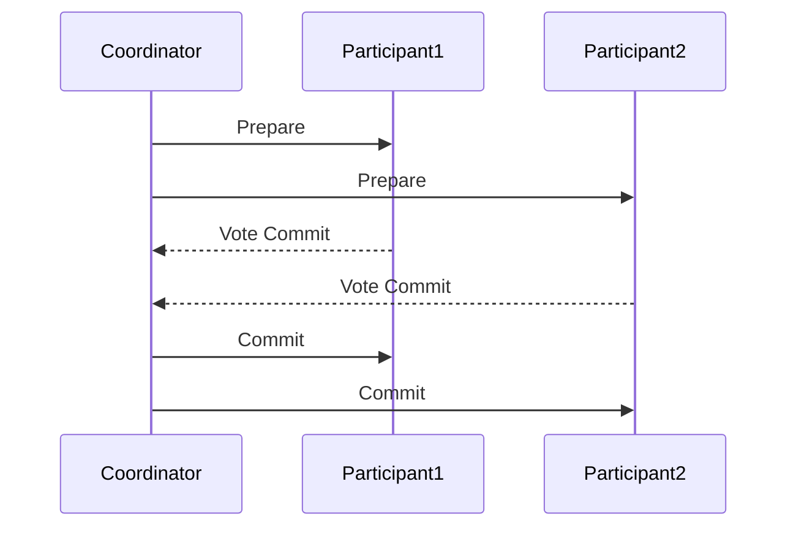
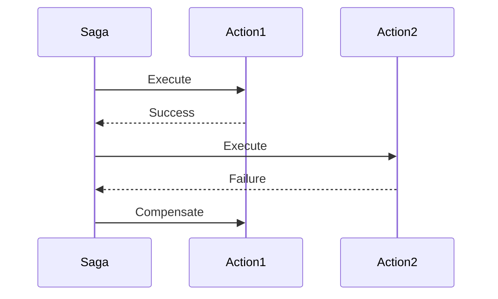

## 11.13. Patterns for Data Consistency

In the realm of distributed systems, ensuring data consistency is a critical challenge. Rust, with its focus on safety and concurrency, offers unique capabilities for implementing data consistency patterns. In this section, we will explore key concepts such as eventual consistency and the CAP theorem, and delve into patterns like Two-Phase Commit and Saga. We will also provide practical examples of implementing consistency controls in Rust, discuss the challenges of distributed transactions, and examine the trade-offs between consistency, availability, and partition tolerance.

### Understanding Data Consistency

Data consistency in distributed systems refers to the uniformity and accuracy of data across different nodes or components. It ensures that all users see the same data at the same time, regardless of where they are accessing it from. However, achieving consistency in distributed systems is challenging due to network latency, failures, and the inherent complexity of managing multiple nodes.

#### Eventual Consistency

Eventual consistency is a consistency model used in distributed computing to achieve high availability. It guarantees that, given enough time without new updates, all replicas of a data item will converge to the same value. This model is often used in systems where availability is prioritized over immediate consistency, such as in large-scale web applications.

#### CAP Theorem

The CAP theorem, also known as Brewer's theorem, states that in any distributed data store, only two out of the following three guarantees can be achieved simultaneously:

- **Consistency**: Every read receives the most recent write.
- **Availability**: Every request receives a response, without guarantee that it contains the most recent write.
- **Partition Tolerance**: The system continues to operate despite arbitrary partitioning due to network failures.

Understanding the CAP theorem is crucial for designing distributed systems, as it helps in making informed trade-offs between these three properties.

### Patterns for Data Consistency

#### Two-Phase Commit (2PC)

The Two-Phase Commit protocol is a distributed algorithm that ensures all nodes in a distributed system agree on a transaction's outcome. It consists of two phases:

1. **Prepare Phase**: The coordinator node asks all participant nodes to prepare for the transaction. Each participant responds with a vote to commit or abort.
2. **Commit Phase**: If all participants vote to commit, the coordinator sends a commit message to all participants. If any participant votes to abort, the coordinator sends an abort message.

##### Rust Implementation Example

```rust
use std::collections::HashMap;
use std::sync::{Arc, Mutex};

#[derive(Debug)]
enum Vote {
    Commit,
    Abort,
}

#[derive(Debug)]
struct Participant {
    id: u32,
    vote: Option<Vote>,
}

impl Participant {
    fn new(id: u32) -> Self {
        Participant { id, vote: None }
    }

    fn prepare(&mut self) -> Vote {
        // Simulate a decision-making process
        self.vote = Some(Vote::Commit);
        self.vote.clone().unwrap()
    }

    fn commit(&self) {
        println!("Participant {} committed.", self.id);
    }

    fn abort(&self) {
        println!("Participant {} aborted.", self.id);
    }
}

struct Coordinator {
    participants: HashMap<u32, Participant>,
}

impl Coordinator {
    fn new() -> Self {
        Coordinator {
            participants: HashMap::new(),
        }
    }

    fn add_participant(&mut self, participant: Participant) {
        self.participants.insert(participant.id, participant);
    }

    fn execute_transaction(&mut self) {
        let mut all_commit = true;

        // Prepare phase
        for participant in self.participants.values_mut() {
            if participant.prepare() == Vote::Abort {
                all_commit = false;
                break;
            }
        }

        // Commit phase
        for participant in self.participants.values() {
            if all_commit {
                participant.commit();
            } else {
                participant.abort();
            }
        }
    }
}

fn main() {
    let mut coordinator = Coordinator::new();
    coordinator.add_participant(Participant::new(1));
    coordinator.add_participant(Participant::new(2));

    coordinator.execute_transaction();
}
```

In this example, we simulate a simple Two-Phase Commit protocol using Rust. The `Coordinator` manages a set of `Participant` nodes, each of which can vote to commit or abort a transaction.

#### Saga Pattern

The Saga pattern is an alternative to the Two-Phase Commit protocol for managing distributed transactions. It breaks a transaction into a series of smaller, independent transactions, each with its own compensating action. If a transaction fails, the compensating actions are executed to undo the changes made by previous transactions.

##### Rust Implementation Example

```rust
use std::collections::VecDeque;

#[derive(Debug)]
enum SagaStep {
    Action(Box<dyn Fn() -> bool>),
    Compensation(Box<dyn Fn()>),
}

struct Saga {
    steps: VecDeque<SagaStep>,
}

impl Saga {
    fn new() -> Self {
        Saga {
            steps: VecDeque::new(),
        }
    }

    fn add_step(&mut self, action: Box<dyn Fn() -> bool>, compensation: Box<dyn Fn()>) {
        self.steps.push_back(SagaStep::Action(action));
        self.steps.push_back(SagaStep::Compensation(compensation));
    }

    fn execute(&mut self) {
        let mut executed_steps = VecDeque::new();

        while let Some(step) = self.steps.pop_front() {
            match step {
                SagaStep::Action(action) => {
                    if action() {
                        executed_steps.push_back(step);
                    } else {
                        self.compensate(executed_steps);
                        break;
                    }
                }
                _ => {}
            }
        }
    }

    fn compensate(&self, mut executed_steps: VecDeque<SagaStep>) {
        while let Some(step) = executed_steps.pop_back() {
            if let SagaStep::Compensation(compensation) = step {
                compensation();
            }
        }
    }
}

fn main() {
    let mut saga = Saga::new();

    saga.add_step(
        Box::new(|| {
            println!("Executing action 1");
            true
        }),
        Box::new(|| println!("Compensating action 1")),
    );

    saga.add_step(
        Box::new(|| {
            println!("Executing action 2");
            false // Simulate failure
        }),
        Box::new(|| println!("Compensating action 2")),
    );

    saga.execute();
}
```

In this example, we implement a simple Saga pattern in Rust. The `Saga` struct manages a sequence of actions and their corresponding compensations. If an action fails, the compensating actions are executed in reverse order.

### Challenges in Distributed Transactions

Distributed transactions face several challenges, including:

- **Network Latency**: Communication between nodes can be slow and unreliable, leading to delays and potential inconsistencies.
- **Partial Failures**: Some nodes may fail while others continue to operate, complicating the coordination of transactions.
- **Concurrency Control**: Ensuring that concurrent transactions do not interfere with each other is a complex task.
- **Trade-offs**: Balancing consistency, availability, and partition tolerance (CAP theorem) requires careful consideration of the system's requirements and constraints.

### Trade-offs Between Consistency, Availability, and Partition Tolerance

The CAP theorem highlights the trade-offs between consistency, availability, and partition tolerance in distributed systems. In practice, systems often prioritize one or two of these properties based on their specific needs:

- **Consistency and Availability**: Suitable for systems where data accuracy is critical, but partition tolerance is less of a concern.
- **Consistency and Partition Tolerance**: Ideal for systems that can tolerate some downtime but require accurate data.
- **Availability and Partition Tolerance**: Common in systems where uptime is crucial, and eventual consistency is acceptable.

### Rust's Unique Features for Data Consistency

Rust offers several unique features that make it well-suited for implementing data consistency patterns:

- **Ownership and Borrowing**: Rust's ownership model ensures memory safety and prevents data races, which is crucial for maintaining consistency in concurrent systems.
- **Concurrency Primitives**: Rust provides powerful concurrency primitives, such as channels and locks, to facilitate safe communication and synchronization between threads.
- **Error Handling**: Rust's `Result` and `Option` types enable robust error handling, allowing developers to gracefully handle failures in distributed transactions.

### Differences and Similarities with Other Patterns

While the Two-Phase Commit and Saga patterns are commonly used for ensuring data consistency, they have distinct differences:

- **Two-Phase Commit**: Provides strong consistency guarantees but can be slow and prone to blocking in the presence of failures.
- **Saga Pattern**: Offers greater flexibility and fault tolerance by breaking transactions into smaller steps, but may result in eventual consistency.

### Visualizing Data Consistency Patterns

To better understand the flow of data consistency patterns, let's visualize the Two-Phase Commit and Saga patterns using Mermaid.js diagrams.

#### Two-Phase Commit Diagram



This sequence diagram illustrates the Two-Phase Commit protocol, where the coordinator communicates with participants to prepare and commit a transaction.

#### Saga Pattern Diagram



This sequence diagram depicts the Saga pattern, where actions are executed sequentially, and compensations are triggered upon failure.

### Knowledge Check

To reinforce your understanding of data consistency patterns, consider the following questions:

- What are the key differences between the Two-Phase Commit and Saga patterns?
- How does the CAP theorem influence the design of distributed systems?
- What are the trade-offs between consistency, availability, and partition tolerance?
- How can Rust's ownership model help ensure data consistency in concurrent systems?

### Conclusion

Ensuring data consistency in distributed systems is a complex but essential task. By understanding and implementing patterns like Two-Phase Commit and Saga, and leveraging Rust's unique features, developers can build robust and reliable systems. Remember, this is just the beginning. As you progress, you'll encounter more advanced scenarios and challenges. Keep experimenting, stay curious, and enjoy the journey!

## Quiz Time!



### What is eventual consistency?

- [x] A model where all replicas converge to the same value over time
- [ ] A model where all replicas are immediately consistent
- [ ] A model that prioritizes availability over consistency
- [ ] A model that guarantees partition tolerance

> **Explanation:** Eventual consistency ensures that all replicas will converge to the same value over time, given no new updates.

### Which of the following is NOT a part of the CAP theorem?

- [ ] Consistency
- [ ] Availability
- [x] Durability
- [ ] Partition Tolerance

> **Explanation:** The CAP theorem consists of Consistency, Availability, and Partition Tolerance, not Durability.

### What is the primary purpose of the Two-Phase Commit protocol?

- [x] To ensure all nodes agree on a transaction's outcome
- [ ] To improve system availability
- [ ] To enhance partition tolerance
- [ ] To reduce network latency

> **Explanation:** The Two-Phase Commit protocol ensures that all nodes in a distributed system agree on the outcome of a transaction.

### In the Saga pattern, what happens if a transaction fails?

- [x] Compensating actions are executed
- [ ] The entire transaction is rolled back
- [ ] The system becomes unavailable
- [ ] The transaction is retried indefinitely

> **Explanation:** In the Saga pattern, compensating actions are executed to undo the changes made by previous transactions if a transaction fails.

### What is a key advantage of the Saga pattern over the Two-Phase Commit protocol?

- [x] Greater flexibility and fault tolerance
- [ ] Stronger consistency guarantees
- [ ] Faster transaction processing
- [ ] Simpler implementation

> **Explanation:** The Saga pattern offers greater flexibility and fault tolerance by breaking transactions into smaller steps.

### How does Rust's ownership model contribute to data consistency?

- [x] By preventing data races and ensuring memory safety
- [ ] By improving network latency
- [ ] By enhancing partition tolerance
- [ ] By simplifying error handling

> **Explanation:** Rust's ownership model prevents data races and ensures memory safety, which is crucial for maintaining consistency in concurrent systems.

### What trade-offs does the CAP theorem highlight?

- [x] Consistency, availability, and partition tolerance
- [ ] Durability, availability, and partition tolerance
- [ ] Consistency, durability, and availability
- [ ] Partition tolerance, durability, and consistency

> **Explanation:** The CAP theorem highlights the trade-offs between consistency, availability, and partition tolerance.

### Which Rust feature is particularly useful for implementing the Saga pattern?

- [x] Closures and functional programming
- [ ] Low-level memory management
- [ ] Interoperability with C
- [ ] Embedded systems development

> **Explanation:** Closures and functional programming in Rust are useful for implementing the Saga pattern, allowing for flexible and composable actions and compensations.

### What is a common challenge in distributed transactions?

- [x] Network latency and partial failures
- [ ] High memory usage
- [ ] Lack of concurrency
- [ ] Limited scalability

> **Explanation:** Network latency and partial failures are common challenges in distributed transactions, affecting coordination and consistency.

### True or False: The Two-Phase Commit protocol is always faster than the Saga pattern.

- [ ] True
- [x] False

> **Explanation:** The Two-Phase Commit protocol is not always faster than the Saga pattern. It can be slower and prone to blocking in the presence of failures.


