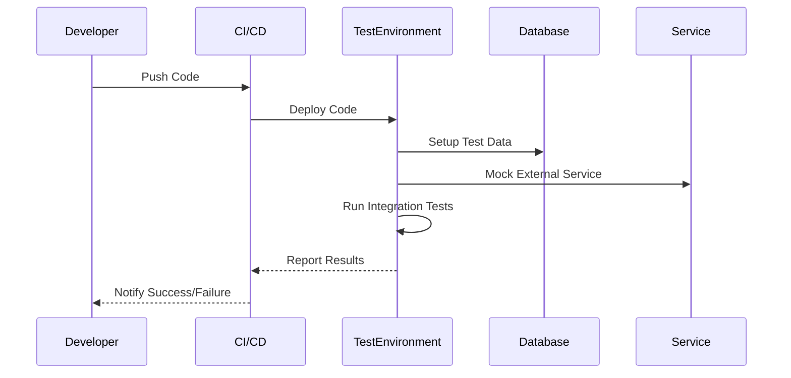

## 11.14. Integration Testing

Integration testing is a crucial phase in the software development lifecycle, ensuring that different components of a system work together seamlessly. In Rust, integration testing is particularly important due to the language's focus on safety and concurrency, which can introduce complex interactions between components. This section will guide you through the best practices for integration testing in Rust, including structuring tests, interacting with databases and services, using test doubles, and automating tests in CI/CD pipelines.

### Importance of Integration Testing

Integration testing serves as a bridge between unit testing and system testing. While unit tests focus on individual components, integration tests ensure that these components interact correctly. This is vital in Rust, where the ownership model and concurrency features can lead to intricate interdependencies.

**Key Benefits:**
- **Detects Interface Issues:** Integration tests can uncover issues at the boundaries between components, such as mismatched data formats or incorrect API usage.
- **Validates System Behavior:** They ensure that the system behaves as expected when components are combined.
- **Enhances Confidence:** By verifying interactions, integration tests increase confidence in the system's reliability and robustness.

### Structuring Integration Tests in Rust

In Rust, integration tests are typically placed in the `tests` directory at the root of your project. This directory is separate from the `src` directory, which contains your main codebase. Each file in the `tests` directory is compiled as a separate crate, allowing you to test your library's public API.

**Example Directory Structure:**
```
my_project/
├── src/
│   ├── lib.rs
│   └── main.rs
└── tests/
    ├── integration_test1.rs
    └── integration_test2.rs
```

**Key Points:**
- **Public API Testing:** Integration tests should focus on testing the public API of your library or application.
- **Modular Tests:** Organize tests into separate files based on functionality or feature sets.
- **Use `#[test]` Attribute:** Each test function should be annotated with `#[test]`.

### Testing Interactions with Databases and Services

Interacting with databases and external services is a common requirement in integration testing. Rust provides several crates to facilitate these interactions, such as `diesel` for databases and `reqwest` for HTTP services.

**Database Testing Example:**

```rust
// In tests/database_test.rs

use my_project::database::establish_connection;
use diesel::prelude::*;

#[test]
fn test_database_interaction() {
    let connection = establish_connection();
    let results = my_project::models::get_all_users(&connection);

    assert!(results.is_ok());
    assert!(!results.unwrap().is_empty());
}
```

**Service Testing Example:**

```rust
// In tests/service_test.rs

use my_project::services::fetch_data;
use tokio::runtime::Runtime;

#[test]
fn test_service_interaction() {
    let mut rt = Runtime::new().unwrap();
    let result = rt.block_on(fetch_data("https://api.example.com/data"));

    assert!(result.is_ok());
    assert_eq!(result.unwrap().status(), 200);
}
```

### Using Test Doubles and Environment Setup

Test doubles, such as mocks and stubs, are essential for isolating components during integration testing. They allow you to simulate interactions with external systems without relying on actual implementations.

**Mocking Example with `mockito`:**

```rust
// In tests/mock_test.rs

use my_project::services::fetch_data;
use mockito::mock;
use tokio::runtime::Runtime;

#[test]
fn test_service_with_mock() {
    let _m = mock("GET", "/data")
        .with_status(200)
        .with_body("{\"key\": \"value\"}")
        .create();

    let mut rt = Runtime::new().unwrap();
    let result = rt.block_on(fetch_data(&mockito::server_url()));

    assert!(result.is_ok());
    assert_eq!(result.unwrap().text().unwrap(), "{\"key\": \"value\"}");
}
```

**Environment Setup:**
- **Configuration Files:** Use configuration files to manage different environments (e.g., development, testing, production).
- **Environment Variables:** Leverage environment variables to switch configurations dynamically during tests.

### Automating Tests in CI/CD Pipelines

Automating integration tests in CI/CD pipelines ensures that tests are run consistently and efficiently. This can be achieved using tools like GitHub Actions, Travis CI, or Jenkins.

**Example GitHub Actions Workflow:**

```yaml
name: Rust CI

on: [push, pull_request]

jobs:
  build:
    runs-on: ubuntu-latest

    steps:
    - uses: actions/checkout@v2
    - name: Set up Rust
      uses: actions-rs/toolchain@v1
      with:
        toolchain: stable
    - name: Run tests
      run: cargo test --all
```

**Key Considerations:**
- **Parallel Execution:** Run tests in parallel to reduce execution time.
- **Environment Consistency:** Ensure that the CI environment mirrors your local development setup as closely as possible.
- **Failure Notifications:** Configure notifications for test failures to ensure prompt attention.

### Visualizing Integration Testing Workflow

To better understand the integration testing workflow, let's visualize the process using a sequence diagram.



**Diagram Description:**
- **Developer** pushes code to the repository.
- **CI/CD** system deploys the code to a **TestEnvironment**.
- **TestEnvironment** sets up test data in the **Database** and mocks external **Service** interactions.
- Integration tests are executed, and results are reported back to the **CI/CD** system.
- **Developer** receives notifications about the test outcomes.

### Knowledge Check

- **Why is integration testing important in Rust?**
- **How do you structure integration tests in a Rust project?**
- **What are some common tools for interacting with databases and services in Rust?**
- **How can test doubles be used in integration testing?**
- **What are the benefits of automating tests in CI/CD pipelines?**

### Exercises

1. **Set up a Rust project with integration tests** that interact with a mock HTTP service. Use `mockito` to simulate the service.
2. **Create a CI/CD pipeline** using GitHub Actions to automate the integration tests for your project.
3. **Experiment with environment variables** to switch between different configurations during integration testing.

### Summary

Integration testing in Rust is an essential practice for ensuring that different components of a system work together as expected. By structuring tests effectively, using test doubles, and automating tests in CI/CD pipelines, you can enhance the reliability and robustness of your Rust applications. Remember, this is just the beginning. As you progress, you'll build more complex and interactive systems. Keep experimenting, stay curious, and enjoy the journey!

## Quiz Time!



### Why is integration testing important in Rust?

- [x] It ensures different components work together seamlessly.
- [ ] It only tests individual functions.
- [ ] It replaces unit testing.
- [ ] It is not necessary in Rust.

> **Explanation:** Integration testing is crucial for verifying that different components of a system interact correctly, especially in a language like Rust that emphasizes safety and concurrency.

### How should integration tests be structured in a Rust project?

- [x] In the `tests` directory at the root of the project.
- [ ] Inside the `src` directory.
- [ ] In the `main.rs` file.
- [ ] In a separate repository.

> **Explanation:** Integration tests in Rust are typically placed in the `tests` directory, separate from the main codebase, to test the public API.

### Which crate is commonly used for mocking HTTP services in Rust?

- [x] `mockito`
- [ ] `serde`
- [ ] `diesel`
- [ ] `tokio`

> **Explanation:** `mockito` is a popular crate for mocking HTTP services in Rust, allowing you to simulate interactions with external systems.

### What is a key benefit of using test doubles in integration testing?

- [x] They isolate components by simulating interactions with external systems.
- [ ] They make tests slower.
- [ ] They are only used in unit tests.
- [ ] They are unnecessary in integration tests.

> **Explanation:** Test doubles, such as mocks and stubs, help isolate components during integration testing by simulating interactions with external systems.

### What is a common tool for automating tests in CI/CD pipelines for Rust projects?

- [x] GitHub Actions
- [ ] Cargo
- [ ] Clippy
- [ ] Rustfmt

> **Explanation:** GitHub Actions is a popular tool for automating tests in CI/CD pipelines, ensuring consistent and efficient test execution.

### What should be ensured when setting up a CI environment for integration testing?

- [x] It mirrors the local development setup as closely as possible.
- [ ] It uses a different operating system.
- [ ] It skips integration tests.
- [ ] It only runs on weekends.

> **Explanation:** Ensuring that the CI environment mirrors the local development setup helps maintain consistency and reliability in test results.

### What is the purpose of environment variables in integration testing?

- [x] To switch configurations dynamically during tests.
- [ ] To store test results.
- [ ] To replace configuration files.
- [ ] To make tests slower.

> **Explanation:** Environment variables allow for dynamic configuration switching during integration tests, facilitating testing in different environments.

### Which of the following is a benefit of parallel test execution in CI/CD pipelines?

- [x] Reduced execution time.
- [ ] Increased test complexity.
- [ ] Slower test execution.
- [ ] More test failures.

> **Explanation:** Running tests in parallel can significantly reduce execution time, making the CI/CD process more efficient.

### What is a key consideration when using test doubles in integration testing?

- [x] Ensuring they accurately simulate the behavior of external systems.
- [ ] Making them as complex as possible.
- [ ] Using them only in unit tests.
- [ ] Avoiding them entirely.

> **Explanation:** Test doubles should accurately simulate the behavior of external systems to ensure reliable and meaningful test results.

### Integration tests in Rust should focus on testing which aspect of a library or application?

- [x] The public API
- [ ] Private functions
- [ ] Internal modules
- [ ] Unused code

> **Explanation:** Integration tests should focus on testing the public API of a library or application to ensure correct interaction between components.


