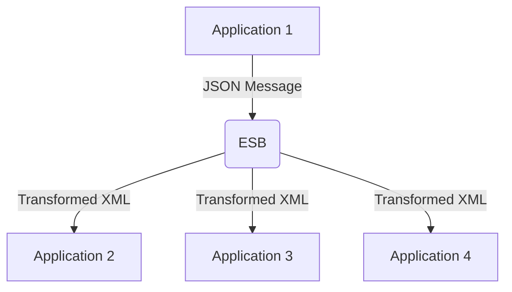

## 11.15. Enterprise Service Bus (ESB) Patterns

In the modern enterprise landscape, systems rarely operate in isolation. They need to communicate, share data, and coordinate actions to achieve business objectives. An Enterprise Service Bus (ESB) is a software architecture model used for designing and implementing the interaction and communication between mutually interacting software applications in a service-oriented architecture (SOA). In this section, we will explore how ESB patterns can be implemented in Rust, a language known for its performance and safety, to facilitate seamless integration between disparate systems.

### What is an Enterprise Service Bus (ESB)?

An Enterprise Service Bus (ESB) acts as a central hub that facilitates communication between different applications and services within an enterprise. It provides a standardized way to integrate applications by enabling them to communicate through a common messaging system. The ESB handles message routing, transformation, and protocol mediation, allowing systems to interact without being tightly coupled.

#### Key Features of ESB:

- **Message Routing**: Directs messages to the appropriate service based on predefined rules.
- **Message Transformation**: Converts messages from one format to another to ensure compatibility between systems.
- **Protocol Mediation**: Bridges different communication protocols, enabling interoperability.
- **Service Orchestration**: Coordinates multiple services to achieve a business process.

### Role of ESB in Modern Enterprises

The primary role of an ESB is to decouple systems, allowing them to evolve independently while still being able to communicate. This decoupling provides flexibility, scalability, and maintainability, which are crucial in today's fast-paced business environment.

### Integrating Rust Applications with ESBs

Rust, with its focus on safety and concurrency, is an excellent choice for building components that interact with an ESB. Rust applications can be integrated with ESBs to perform tasks such as message transformation, routing, and protocol mediation.

#### Example: Message Transformation in Rust

Let's consider a scenario where a Rust application needs to transform incoming JSON messages into XML format before sending them to another service.

```rust
use serde_json::Value;
use quick_xml::se::to_string;

fn transform_json_to_xml(json_data: &str) -> Result<String, Box<dyn std::error::Error>> {
    // Parse the JSON data
    let json_value: Value = serde_json::from_str(json_data)?;

    // Convert JSON to XML
    let xml_data = to_string(&json_value)?;

    Ok(xml_data)
}

fn main() {
    let json_data = r#"{"name": "John Doe", "age": 30}"#;
    match transform_json_to_xml(json_data) {
        Ok(xml) => println!("XML Data: {}", xml),
        Err(e) => eprintln!("Error: {}", e),
    }
}
```

In this example, we use the `serde_json` crate to parse JSON data and the `quick_xml` crate to convert it into XML format. This transformation is crucial for systems that require data in specific formats.

### Benefits of Using ESB Patterns in Rust

1. **Decoupling**: By using an ESB, Rust applications can communicate with other systems without being tightly coupled, allowing for independent evolution and scalability.

2. **Flexibility**: ESBs provide a flexible architecture that can adapt to changing business needs and integrate new services with minimal disruption.

3. **Centralized Management**: An ESB centralizes integration logic, making it easier to manage and monitor communication between systems.

4. **Improved Reliability**: With built-in features like message queuing and retry mechanisms, ESBs enhance the reliability of inter-system communication.

### Challenges and Modern Alternatives to ESBs

While ESBs offer numerous benefits, they also come with challenges such as complexity, performance bottlenecks, and single points of failure. As a result, modern architectures often explore alternatives like microservices and event-driven architectures.

#### Microservices and Event-Driven Architectures

Microservices architecture breaks down applications into smaller, independent services that communicate over lightweight protocols. Event-driven architectures use events to trigger communication between services, often leveraging message brokers like Kafka or RabbitMQ.

### Visualizing ESB Patterns

To better understand how ESB patterns work, let's visualize a typical ESB architecture using a Mermaid.js diagram.



**Diagram Description**: This diagram illustrates an ESB receiving a JSON message from Application 1, transforming it into XML, and then routing it to Applications 2, 3, and 4.

### Rust-Specific Considerations

When implementing ESB patterns in Rust, consider the following:

- **Concurrency**: Rust's ownership model and concurrency features make it ideal for handling multiple simultaneous message transformations and routings.
- **Error Handling**: Utilize Rust's robust error handling mechanisms to manage failures gracefully.
- **Performance**: Rust's performance characteristics ensure that message processing is efficient and low-latency.

### Try It Yourself

Experiment with the provided code example by modifying the JSON structure or adding additional transformations. Consider integrating with a message broker like Kafka to simulate a real-world ESB scenario.

### Knowledge Check

- How does an ESB facilitate communication between disparate systems?
- What are the benefits of using Rust for ESB pattern implementation?
- How can message transformation be achieved in Rust?

### Summary

In this section, we've explored the concept of Enterprise Service Bus (ESB) patterns and how they can be implemented in Rust. We've discussed the benefits of using ESBs, such as decoupling and flexibility, and highlighted the challenges and modern alternatives. By leveraging Rust's unique features, developers can build robust and efficient ESB components that enhance system integration.

## Quiz Time!



### What is the primary role of an Enterprise Service Bus (ESB)?

- [x] To facilitate communication between disparate systems
- [ ] To store large amounts of data
- [ ] To replace all existing systems
- [ ] To serve as a user interface

> **Explanation:** An ESB acts as a central hub that facilitates communication between different applications and services within an enterprise.

### Which Rust feature is particularly beneficial for implementing ESB patterns?

- [x] Concurrency
- [ ] Garbage collection
- [ ] Dynamic typing
- [ ] Manual memory management

> **Explanation:** Rust's ownership model and concurrency features make it ideal for handling multiple simultaneous message transformations and routings.

### What is a common challenge associated with ESBs?

- [x] Complexity
- [ ] Lack of flexibility
- [ ] Inability to handle large data volumes
- [ ] Poor security

> **Explanation:** ESBs can become complex, leading to performance bottlenecks and single points of failure.

### What is a modern alternative to ESBs?

- [x] Microservices architecture
- [ ] Monolithic architecture
- [ ] Client-server architecture
- [ ] Peer-to-peer architecture

> **Explanation:** Microservices architecture breaks down applications into smaller, independent services that communicate over lightweight protocols.

### How can message transformation be achieved in Rust?

- [x] Using crates like `serde_json` and `quick_xml`
- [ ] Using built-in Rust functions
- [ ] Using external hardware
- [ ] Using a different programming language

> **Explanation:** Crates like `serde_json` and `quick_xml` can be used to parse and transform messages in Rust.

### What is a benefit of using ESB patterns in Rust?

- [x] Decoupling systems
- [ ] Increasing system coupling
- [ ] Reducing system reliability
- [ ] Limiting system scalability

> **Explanation:** By using an ESB, Rust applications can communicate with other systems without being tightly coupled, allowing for independent evolution and scalability.

### What does the ESB handle in communication?

- [x] Message routing, transformation, and protocol mediation
- [ ] User authentication
- [ ] Data storage
- [ ] User interface design

> **Explanation:** The ESB handles message routing, transformation, and protocol mediation, allowing systems to interact without being tightly coupled.

### What is a key feature of an ESB?

- [x] Service orchestration
- [ ] Data encryption
- [ ] User management
- [ ] File storage

> **Explanation:** Service orchestration is a key feature of an ESB, coordinating multiple services to achieve a business process.

### Which of the following is NOT a benefit of using an ESB?

- [ ] Decoupling systems
- [ ] Flexibility
- [ ] Centralized management
- [x] Increased complexity

> **Explanation:** While ESBs offer benefits like decoupling and flexibility, they can also introduce increased complexity.

### True or False: Rust's performance characteristics ensure that message processing in an ESB is efficient and low-latency.

- [x] True
- [ ] False

> **Explanation:** Rust's performance characteristics ensure that message processing is efficient and low-latency, making it suitable for ESB implementations.



Remember, this is just the beginning. As you progress, you'll build more complex and interactive systems. Keep experimenting, stay curious, and enjoy the journey!
