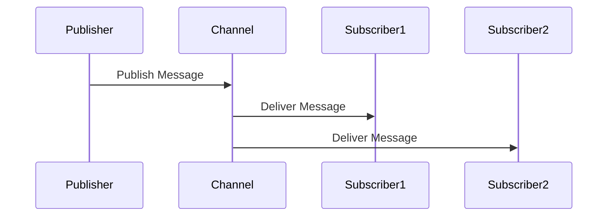

## 11.2. Messaging Patterns in Rust

In the world of distributed systems and enterprise integration, messaging patterns play a crucial role in ensuring that components can communicate effectively and efficiently. Rust, with its focus on safety and concurrency, offers unique advantages when implementing these patterns. In this section, we will explore common messaging patterns such as Publish/Subscribe, Request/Reply, and Message Routing, and demonstrate how to implement them in Rust applications. We will also discuss libraries and tools that facilitate messaging in Rust, highlight the benefits of these patterns in decoupling components and enhancing scalability, and provide best practices and potential pitfalls to consider.

### Introduction to Messaging Patterns

Messaging patterns are design patterns that define how messages are sent and received between different components or systems. These patterns help in decoupling components, allowing them to interact without being tightly bound to each other. This decoupling is essential for building scalable and maintainable systems.

#### Key Messaging Patterns

1. **Publish/Subscribe**: A messaging pattern where senders (publishers) broadcast messages to multiple receivers (subscribers) without knowing their identities.
2. **Request/Reply**: A pattern where a sender sends a request message and waits for a reply message from the receiver.
3. **Message Routing**: A pattern that involves directing messages to different destinations based on certain criteria.

### Implementing Publish/Subscribe in Rust

The Publish/Subscribe pattern is widely used in scenarios where multiple components need to react to the same event or message. In Rust, this pattern can be implemented using channels, which are part of the standard library, or using third-party libraries like `tokio` or `async-std` for asynchronous messaging.

#### Using Rust Channels

Rust's standard library provides channels for message passing between threads. Channels can be used to implement the Publish/Subscribe pattern by having a publisher send messages to a channel, and multiple subscribers receive messages from the channel.

```rust
use std::sync::mpsc;
use std::thread;

fn main() {
    // Create a channel
    let (tx, rx) = mpsc::channel();

    // Spawn multiple subscriber threads
    for i in 0..3 {
        let rx = rx.clone();
        thread::spawn(move || {
            while let Ok(message) = rx.recv() {
                println!("Subscriber {} received: {}", i, message);
            }
        });
    }

    // Publisher thread
    thread::spawn(move || {
        let messages = vec!["Hello", "World", "From", "Rust"];
        for message in messages {
            tx.send(message).unwrap();
        }
    });

    // Give threads time to process messages
    thread::sleep(std::time::Duration::from_secs(1));
}
```

In this example, we create a channel and spawn multiple subscriber threads that listen for messages. The publisher thread sends messages to the channel, which are then received by the subscribers.

#### Using Tokio for Asynchronous Publish/Subscribe

For asynchronous messaging, the `tokio` library provides a powerful runtime for building concurrent applications. Here's how you can implement the Publish/Subscribe pattern using `tokio`:

```rust
use tokio::sync::broadcast;
use tokio::task;

#[tokio::main]
async fn main() {
    // Create a broadcast channel
    let (tx, _rx) = broadcast::channel(10);

    // Spawn subscriber tasks
    for i in 0..3 {
        let mut rx = tx.subscribe();
        task::spawn(async move {
            while let Ok(message) = rx.recv().await {
                println!("Subscriber {} received: {}", i, message);
            }
        });
    }

    // Publisher task
    task::spawn(async move {
        let messages = vec!["Hello", "World", "From", "Rust"];
        for message in messages {
            tx.send(message).unwrap();
        }
    });

    // Give tasks time to process messages
    tokio::time::sleep(tokio::time::Duration::from_secs(1)).await;
}
```

In this asynchronous example, we use `tokio::sync::broadcast` to create a broadcast channel. Each subscriber task listens for messages, and the publisher task sends messages to the channel.

### Implementing Request/Reply in Rust

The Request/Reply pattern is useful when a component needs to send a request and wait for a response. This pattern can be implemented using synchronous or asynchronous channels in Rust.

#### Synchronous Request/Reply

```rust
use std::sync::mpsc;
use std::thread;

fn main() {
    // Create a channel for request/reply
    let (tx, rx) = mpsc::channel();

    // Spawn a thread to handle requests
    thread::spawn(move || {
        while let Ok(request) = rx.recv() {
            println!("Received request: {}", request);
            // Simulate processing and send a reply
            let reply = format!("Reply to {}", request);
            tx.send(reply).unwrap();
        }
    });

    // Send a request and wait for a reply
    tx.send("Request 1").unwrap();
    if let Ok(reply) = rx.recv() {
        println!("Received reply: {}", reply);
    }
}
```

In this example, a request is sent through a channel, and the receiver processes the request and sends a reply back through the same channel.

#### Asynchronous Request/Reply with Tokio

```rust
use tokio::sync::oneshot;
use tokio::task;

#[tokio::main]
async fn main() {
    // Create a oneshot channel for request/reply
    let (tx, rx) = oneshot::channel();

    // Spawn a task to handle requests
    task::spawn(async move {
        if let Ok(request) = rx.await {
            println!("Received request: {}", request);
            // Simulate processing and send a reply
            let reply = format!("Reply to {}", request);
            tx.send(reply).unwrap();
        }
    });

    // Send a request and wait for a reply
    tx.send("Request 1").unwrap();
    if let Ok(reply) = rx.await {
        println!("Received reply: {}", reply);
    }
}
```

In this asynchronous example, we use `tokio::sync::oneshot` to create a channel for a single request/reply interaction.

### Implementing Message Routing in Rust

Message Routing involves directing messages to different destinations based on certain criteria. This pattern can be implemented using Rust's pattern matching capabilities and channels.

#### Basic Message Routing

```rust
use std::sync::mpsc;
use std::thread;

fn main() {
    // Create channels for different routes
    let (tx1, rx1) = mpsc::channel();
    let (tx2, rx2) = mpsc::channel();

    // Spawn threads for each route
    thread::spawn(move || {
        while let Ok(message) = rx1.recv() {
            println!("Route 1 received: {}", message);
        }
    });

    thread::spawn(move || {
        while let Ok(message) = rx2.recv() {
            println!("Route 2 received: {}", message);
        }
    });

    // Message router
    let messages = vec!["Route1: Hello", "Route2: World"];
    for message in messages {
        if message.starts_with("Route1") {
            tx1.send(message).unwrap();
        } else if message.starts_with("Route2") {
            tx2.send(message).unwrap();
        }
    }
}
```

In this example, messages are routed to different channels based on their content.

### Libraries and Tools for Messaging in Rust

Several libraries and tools can facilitate messaging in Rust applications:

- **Tokio**: A runtime for writing reliable asynchronous applications with Rust. It provides utilities for asynchronous I/O, timers, and channels.
- **async-std**: An asynchronous version of the Rust standard library, providing similar functionality to Tokio.
- **Actix**: A powerful actor framework for Rust that can be used for building concurrent applications.
- **RabbitMQ**: A message broker that can be used with Rust through libraries like `lapin`.
- **Kafka**: A distributed event streaming platform that can be integrated with Rust using libraries like `rdkafka`.

### Benefits of Messaging Patterns

Implementing messaging patterns in Rust offers several benefits:

- **Decoupling**: Components can communicate without being tightly coupled, making the system more flexible and easier to maintain.
- **Scalability**: Messaging patterns can help distribute load across multiple components, improving scalability.
- **Concurrency**: Rust's ownership model and concurrency features make it well-suited for implementing messaging patterns safely and efficiently.

### Best Practices and Potential Pitfalls

When implementing messaging patterns in Rust, consider the following best practices and potential pitfalls:

- **Error Handling**: Ensure that errors are handled gracefully, especially in asynchronous contexts.
- **Resource Management**: Be mindful of resource usage, such as memory and CPU, to avoid bottlenecks.
- **Concurrency**: Use Rust's concurrency features effectively to avoid data races and deadlocks.
- **Testing**: Thoroughly test messaging components to ensure they behave correctly under various conditions.

### Try It Yourself

Experiment with the code examples provided in this section. Try modifying the number of subscribers in the Publish/Subscribe pattern or change the routing criteria in the Message Routing example. Observe how these changes affect the behavior of the system.

### Visualizing Messaging Patterns

To better understand how these messaging patterns work, let's visualize the Publish/Subscribe pattern using a sequence diagram:



This diagram shows how a message published by the Publisher is delivered to multiple Subscribers through a Channel.

### Conclusion

Messaging patterns are essential for building scalable and maintainable systems. Rust's unique features, such as its ownership model and concurrency capabilities, make it an excellent choice for implementing these patterns. By leveraging Rust's libraries and tools, you can build robust messaging systems that are both efficient and safe.

## Quiz Time!



### What is the primary benefit of using the Publish/Subscribe pattern?

- [x] Decoupling components
- [ ] Increasing message size
- [ ] Reducing network latency
- [ ] Enhancing security

> **Explanation:** The Publish/Subscribe pattern allows components to communicate without being tightly coupled, enhancing flexibility and maintainability.

### Which Rust library is commonly used for asynchronous messaging?

- [x] Tokio
- [ ] std::sync::mpsc
- [ ] serde
- [ ] rayon

> **Explanation:** Tokio is a popular library for asynchronous programming in Rust, providing utilities for asynchronous I/O and messaging.

### In the Request/Reply pattern, what does the sender do after sending a request?

- [x] Waits for a reply
- [ ] Sends another request
- [ ] Closes the connection
- [ ] Broadcasts the message

> **Explanation:** In the Request/Reply pattern, the sender waits for a reply after sending a request.

### What is a potential pitfall when implementing messaging patterns in Rust?

- [x] Resource management
- [ ] Using pattern matching
- [ ] Writing comments
- [ ] Using structs

> **Explanation:** Resource management is crucial in messaging systems to avoid bottlenecks and ensure efficient operation.

### Which messaging pattern involves directing messages to different destinations based on criteria?

- [x] Message Routing
- [ ] Publish/Subscribe
- [ ] Request/Reply
- [ ] Load Balancing

> **Explanation:** Message Routing involves directing messages to different destinations based on certain criteria.

### What is a key feature of Rust that aids in implementing messaging patterns?

- [x] Ownership model
- [ ] Dynamic typing
- [ ] Garbage collection
- [ ] Reflection

> **Explanation:** Rust's ownership model helps manage resources safely and efficiently, which is beneficial for messaging patterns.

### Which library can be used for integrating Rust with RabbitMQ?

- [x] lapin
- [ ] rdkafka
- [ ] serde
- [ ] hyper

> **Explanation:** The `lapin` library is used for integrating Rust applications with RabbitMQ.

### What is the role of a channel in the Publish/Subscribe pattern?

- [x] Facilitates message delivery
- [ ] Encrypts messages
- [ ] Compresses data
- [ ] Logs messages

> **Explanation:** In the Publish/Subscribe pattern, a channel facilitates the delivery of messages from publishers to subscribers.

### Which pattern is suitable for scenarios where a component needs to send a request and wait for a response?

- [x] Request/Reply
- [ ] Publish/Subscribe
- [ ] Message Routing
- [ ] Observer

> **Explanation:** The Request/Reply pattern is used when a component needs to send a request and wait for a response.

### Rust's concurrency features help in avoiding which common issue in messaging systems?

- [x] Data races
- [ ] Syntax errors
- [ ] Memory leaks
- [ ] Compilation errors

> **Explanation:** Rust's concurrency features help avoid data races, which are common issues in messaging systems.



Remember, this is just the beginning. As you progress, you'll build more complex and interactive messaging systems. Keep experimenting, stay curious, and enjoy the journey!
