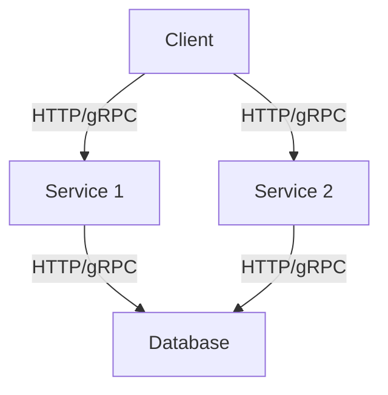

## 11.4. Service-Oriented Architecture (SOA)

Service-Oriented Architecture (SOA) is a design paradigm that enables the creation of modular and reusable services. These services communicate over a network to provide functionality to other applications. In this section, we will explore the principles of SOA, discuss how Rust services can fit into an SOA, provide examples of creating microservices with Rust, highlight communication protocols and data formats, and discuss challenges and strategies for service discovery and orchestration.

### Principles of Service-Oriented Architecture

SOA is built on several key principles that guide the design and implementation of services:

1. **Loose Coupling**: Services are designed to be independent, minimizing dependencies on other services. This allows for flexibility and scalability.

2. **Interoperability**: Services communicate using standard protocols and data formats, enabling them to work across different platforms and technologies.

3. **Reusability**: Services are designed to be reusable across different applications and contexts, reducing redundancy and promoting efficiency.

4. **Discoverability**: Services are easily discoverable and can be located and invoked by other services or applications.

5. **Composability**: Services can be composed to create more complex services or applications, allowing for modular and scalable systems.

### Rust in Service-Oriented Architecture

Rust is well-suited for implementing SOA due to its performance, safety, and concurrency features. Rust's strong type system and memory safety guarantees make it an excellent choice for building reliable and efficient services. Let's explore how Rust can be used to implement SOA.

#### Creating Microservices with Rust

Microservices are a popular implementation of SOA, where applications are composed of small, independent services that communicate over a network. Rust's performance and safety features make it an ideal choice for building microservices.

**Example: Creating a Simple Microservice in Rust**

Let's create a simple microservice in Rust using the `actix-web` framework. This microservice will provide a RESTful API for managing a list of tasks.

```rust
use actix_web::{web, App, HttpServer, Responder, HttpResponse};
use serde::{Deserialize, Serialize};
use std::sync::Mutex;

#[derive(Serialize, Deserialize)]
struct Task {
    id: u32,
    description: String,
}

struct AppState {
    tasks: Mutex<Vec<Task>>,
}

async fn get_tasks(data: web::Data<AppState>) -> impl Responder {
    let tasks = data.tasks.lock().unwrap();
    HttpResponse::Ok().json(&*tasks)
}

async fn add_task(task: web::Json<Task>, data: web::Data<AppState>) -> impl Responder {
    let mut tasks = data.tasks.lock().unwrap();
    tasks.push(task.into_inner());
    HttpResponse::Created().finish()
}

#[actix_web::main]
async fn main() -> std::io::Result<()> {
    let app_state = web::Data::new(AppState {
        tasks: Mutex::new(Vec::new()),
    });

    HttpServer::new(move || {
        App::new()
            .app_data(app_state.clone())
            .route("/tasks", web::get().to(get_tasks))
            .route("/tasks", web::post().to(add_task))
    })
    .bind("127.0.0.1:8080")?
    .run()
    .await
}
```

In this example, we define a `Task` struct and use `actix-web` to create a simple RESTful API with two endpoints: one for retrieving tasks and another for adding tasks. The tasks are stored in a `Mutex` to ensure thread safety.

#### Communication Protocols and Data Formats

In SOA, services communicate using standard protocols and data formats. Common protocols include HTTP, gRPC, and AMQP, while common data formats include JSON, XML, and Protocol Buffers.

**HTTP and JSON**

HTTP is a widely used protocol for communication between services, and JSON is a popular data format due to its simplicity and readability. Rust's `serde` library makes it easy to serialize and deserialize JSON data.

**gRPC and Protocol Buffers**

gRPC is a high-performance RPC framework that uses Protocol Buffers for data serialization. Rust has excellent support for gRPC through the `tonic` library.

**Example: gRPC Service in Rust**

```rust
use tonic::{transport::Server, Request, Response, Status};
use tonic::transport::Channel;
use tonic::codegen::http::Uri;
use hello_world::greeter_client::GreeterClient;
use hello_world::greeter_server::{Greeter, GreeterServer};
use hello_world::{HelloReply, HelloRequest};

pub mod hello_world {
    tonic::include_proto!("helloworld");
}

#[derive(Default)]
pub struct MyGreeter {}

#[tonic::async_trait]
impl Greeter for MyGreeter {
    async fn say_hello(
        &self,
        request: Request<HelloRequest>,
    ) -> Result<Response<HelloReply>, Status> {
        let reply = hello_world::HelloReply {
            message: format!("Hello {}!", request.into_inner().name),
        };
        Ok(Response::new(reply))
    }
}

#[tokio::main]
async fn main() -> Result<(), Box<dyn std::error::Error>> {
    let addr = "[::1]:50051".parse()?;
    let greeter = MyGreeter::default();

    Server::builder()
        .add_service(GreeterServer::new(greeter))
        .serve(addr)
        .await?;

    Ok(())
}
```

In this example, we define a simple gRPC service using the `tonic` library. The service implements a `say_hello` method that returns a greeting message.

### Challenges and Strategies for Service Discovery and Orchestration

In SOA, service discovery and orchestration are critical components that enable services to find and communicate with each other.

#### Service Discovery

Service discovery involves locating and connecting to services in a dynamic environment. Common strategies for service discovery include:

- **Service Registries**: Centralized databases that store information about available services. Examples include Consul, etcd, and ZooKeeper.

- **DNS-Based Discovery**: Using DNS to resolve service names to IP addresses.

- **Client-Side Discovery**: Clients are responsible for discovering and connecting to services.

#### Orchestration

Orchestration involves managing the interactions and dependencies between services. Common orchestration tools include Kubernetes and Docker Swarm.

**Example: Using Kubernetes for Service Discovery and Orchestration**

Kubernetes provides built-in service discovery and orchestration capabilities. Services are registered with the Kubernetes API, and clients can discover services using DNS or environment variables.

```yaml
apiVersion: v1
kind: Service
metadata:
  name: my-service
spec:
  selector:
    app: MyApp
  ports:
    - protocol: TCP
      port: 80
      targetPort: 9376
```

In this example, we define a Kubernetes service that exposes a set of pods running the `MyApp` application. The service can be discovered using DNS or environment variables.

### Visualizing SOA with Rust

To better understand how SOA works with Rust, let's visualize a simple SOA architecture using Mermaid.js.



In this diagram, we have a client that communicates with two services using HTTP or gRPC. The services interact with a shared database.

### Knowledge Check

- **What are the key principles of SOA?**
- **How can Rust be used to implement microservices?**
- **What are some common communication protocols and data formats used in SOA?**
- **What strategies can be used for service discovery and orchestration?**

### Summary

In this section, we explored the principles of Service-Oriented Architecture and how Rust can be used to implement modular and reusable services. We discussed creating microservices with Rust, communication protocols and data formats, and challenges and strategies for service discovery and orchestration. Remember, this is just the beginning. As you progress, you'll build more complex and interactive services. Keep experimenting, stay curious, and enjoy the journey!

## Quiz Time!



### What is a key principle of SOA?

- [x] Loose Coupling
- [ ] Tight Coupling
- [ ] Monolithic Design
- [ ] Single Responsibility

> **Explanation:** Loose coupling is a key principle of SOA, allowing services to be independent and flexible.

### Which Rust framework is used for creating RESTful APIs?

- [x] actix-web
- [ ] rocket
- [ ] hyper
- [ ] warp

> **Explanation:** `actix-web` is a popular Rust framework for creating RESTful APIs.

### What protocol does gRPC use for communication?

- [x] HTTP/2
- [ ] HTTP/1.1
- [ ] FTP
- [ ] SMTP

> **Explanation:** gRPC uses HTTP/2 for communication, providing high performance and efficiency.

### Which library is used for JSON serialization in Rust?

- [x] serde
- [ ] json
- [ ] rust-json
- [ ] json-rs

> **Explanation:** `serde` is a popular library in Rust for JSON serialization and deserialization.

### What is a common strategy for service discovery?

- [x] Service Registries
- [ ] Manual Configuration
- [ ] Hardcoding IPs
- [ ] Static Files

> **Explanation:** Service registries are a common strategy for service discovery, providing a centralized database of available services.

### Which tool provides orchestration capabilities in SOA?

- [x] Kubernetes
- [ ] Docker
- [ ] Vagrant
- [ ] Ansible

> **Explanation:** Kubernetes provides orchestration capabilities, managing the interactions and dependencies between services.

### What data format is commonly used with HTTP in SOA?

- [x] JSON
- [ ] XML
- [ ] CSV
- [ ] YAML

> **Explanation:** JSON is a commonly used data format with HTTP due to its simplicity and readability.

### What is the role of a service registry?

- [x] Store information about available services
- [ ] Execute services
- [ ] Monitor services
- [ ] Secure services

> **Explanation:** A service registry stores information about available services, enabling service discovery.

### Which Rust library supports gRPC?

- [x] tonic
- [ ] grpc-rs
- [ ] grpcio
- [ ] grpc-rust

> **Explanation:** `tonic` is a Rust library that supports gRPC, providing tools for building gRPC services.

### True or False: Rust's memory safety guarantees make it unsuitable for SOA.

- [ ] True
- [x] False

> **Explanation:** Rust's memory safety guarantees make it an excellent choice for SOA, providing reliability and efficiency.




