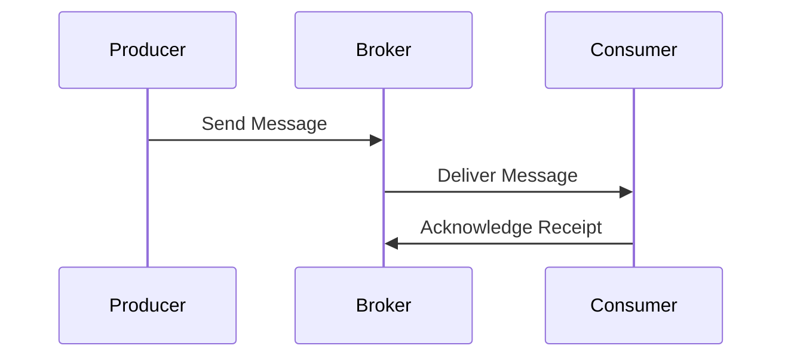

## 11.5. Using Message Brokers (RabbitMQ, Kafka)

In modern software architecture, message brokers play a crucial role in enabling asynchronous communication and facilitating event-driven architectures. They act as intermediaries that allow different components of a system to communicate with each other without being directly connected. This section explores how to integrate Rust applications with two popular message brokers: RabbitMQ and Kafka. We'll delve into the concepts, provide examples using Rust libraries, and discuss best practices for robust messaging.

### Understanding Message Brokers

Message brokers are software modules that translate messages from the formal messaging protocol of the sender to the formal messaging protocol of the receiver. They are essential in decoupling the components of a system, allowing them to communicate asynchronously. This decoupling is vital for building scalable and resilient systems.

#### Key Concepts

- **Producer**: The application or service that sends messages to the broker.
- **Consumer**: The application or service that receives messages from the broker.
- **Queue**: A storage mechanism within the broker where messages are held until they are consumed.
- **Topic**: A category or feed name to which messages are published. Consumers can subscribe to topics to receive messages.

### RabbitMQ and Kafka Overview

#### RabbitMQ

RabbitMQ is a widely-used open-source message broker that supports multiple messaging protocols. It is known for its reliability, flexibility, and ease of use. RabbitMQ uses a queue-based architecture where producers send messages to queues, and consumers receive messages from these queues.

#### Kafka

Apache Kafka is a distributed event streaming platform capable of handling trillions of events a day. It is designed for high-throughput, fault-tolerant, and scalable messaging. Kafka uses a publish-subscribe model where messages are published to topics, and consumers subscribe to these topics to receive messages.

### Integrating Rust with RabbitMQ

To interact with RabbitMQ in Rust, we can use the `lapin` crate, which provides a client library for the AMQP protocol used by RabbitMQ.

#### Setting Up RabbitMQ

Before integrating with RabbitMQ, ensure that you have RabbitMQ installed and running on your system. You can download it from the [official RabbitMQ website](https://www.rabbitmq.com/download.html).

#### Using the `lapin` Crate

The `lapin` crate is a Rust library that provides an interface to interact with RabbitMQ. It allows you to create producers and consumers, manage queues, and handle messages.

##### Installing `lapin`

Add the following to your `Cargo.toml` file to include the `lapin` crate in your project:

```toml
[dependencies]
lapin = "1.6"
tokio = { version = "1", features = ["full"] }
```

##### Producing Messages

Here's a simple example of producing messages to a RabbitMQ queue using `lapin`:

```rust
use lapin::{options::*, types::FieldTable, BasicProperties, Connection, ConnectionProperties};
use tokio_amqp::*;

#[tokio::main]
async fn main() {
    // Establish a connection to RabbitMQ
    let addr = std::env::var("AMQP_ADDR").unwrap_or_else(|_| "amqp://127.0.0.1:5672/%2f".into());
    let conn = Connection::connect(&addr, ConnectionProperties::default().with_tokio()).await.unwrap();

    // Create a channel
    let channel = conn.create_channel().await.unwrap();

    // Declare a queue
    let queue = channel.queue_declare(
        "hello",
        QueueDeclareOptions::default(),
        FieldTable::default(),
    ).await.unwrap();

    // Publish a message
    let payload = b"Hello, world!";
    channel.basic_publish(
        "",
        "hello",
        BasicPublishOptions::default(),
        payload.to_vec(),
        BasicProperties::default(),
    ).await.unwrap().await.unwrap();

    println!("Sent: {:?}", payload);
}
```

**Explanation**: This code establishes a connection to RabbitMQ, creates a channel, declares a queue named "hello", and publishes a message to it.

##### Consuming Messages

To consume messages from a RabbitMQ queue, you can use the following example:

```rust
use lapin::{options::*, types::FieldTable, Connection, ConnectionProperties};
use tokio_amqp::*;
use futures_lite::stream::StreamExt;

#[tokio::main]
async fn main() {
    // Establish a connection to RabbitMQ
    let addr = std::env::var("AMQP_ADDR").unwrap_or_else(|_| "amqp://127.0.0.1:5672/%2f".into());
    let conn = Connection::connect(&addr, ConnectionProperties::default().with_tokio()).await.unwrap();

    // Create a channel
    let channel = conn.create_channel().await.unwrap();

    // Declare a queue
    let queue = channel.queue_declare(
        "hello",
        QueueDeclareOptions::default(),
        FieldTable::default(),
    ).await.unwrap();

    // Start consuming messages
    let mut consumer = channel.basic_consume(
        "hello",
        "my_consumer",
        BasicConsumeOptions::default(),
        FieldTable::default(),
    ).await.unwrap();

    println!("Waiting for messages...");

    while let Some(delivery) = consumer.next().await {
        let delivery = delivery.unwrap();
        println!("Received: {:?}", std::str::from_utf8(&delivery.data).unwrap());
        delivery.ack(BasicAckOptions::default()).await.unwrap();
    }
}
```

**Explanation**: This code connects to RabbitMQ, creates a channel, declares a queue, and starts consuming messages from the "hello" queue. It prints each received message and acknowledges it.

### Integrating Rust with Kafka

For Kafka, we can use the `rdkafka` crate, which provides a high-level Kafka client for Rust.

#### Setting Up Kafka

Ensure you have Kafka installed and running. You can download it from the [Apache Kafka website](https://kafka.apache.org/downloads).

#### Using the `rdkafka` Crate

The `rdkafka` crate is a Rust library that provides an interface to interact with Kafka. It supports both producing and consuming messages.

##### Installing `rdkafka`

Add the following to your `Cargo.toml` file to include the `rdkafka` crate in your project:

```toml
[dependencies]
rdkafka = { version = "0.28", features = ["tokio"] }
tokio = { version = "1", features = ["full"] }
```

##### Producing Messages

Here's an example of producing messages to a Kafka topic using `rdkafka`:

```rust
use rdkafka::config::ClientConfig;
use rdkafka::producer::{FutureProducer, FutureRecord};
use std::time::Duration;

#[tokio::main]
async fn main() {
    // Create a producer
    let producer: FutureProducer = ClientConfig::new()
        .set("bootstrap.servers", "localhost:9092")
        .create()
        .expect("Producer creation error");

    // Produce a message
    let delivery_status = producer
        .send(
            FutureRecord::to("test-topic")
                .payload("Hello, Kafka!")
                .key("key"),
            Duration::from_secs(0),
        )
        .await;

    println!("Delivery status: {:?}", delivery_status);
}
```

**Explanation**: This code creates a Kafka producer, connects to a Kafka broker, and sends a message to the "test-topic" topic.

##### Consuming Messages

To consume messages from a Kafka topic, you can use the following example:

```rust
use rdkafka::config::ClientConfig;
use rdkafka::consumer::{Consumer, StreamConsumer};
use rdkafka::message::Message;
use rdkafka::util::get_rdkafka_version;
use futures_lite::stream::StreamExt;

#[tokio::main]
async fn main() {
    // Create a consumer
    let consumer: StreamConsumer = ClientConfig::new()
        .set("group.id", "test-group")
        .set("bootstrap.servers", "localhost:9092")
        .set("enable.partition.eof", "false")
        .create()
        .expect("Consumer creation failed");

    // Subscribe to a topic
    consumer.subscribe(&["test-topic"]).expect("Can't subscribe to specified topic");

    println!("Waiting for messages...");

    // Consume messages
    while let Some(message) = consumer.stream().next().await {
        match message {
            Ok(m) => {
                let payload = m.payload().unwrap();
                println!("Received: {:?}", std::str::from_utf8(payload).unwrap());
            }
            Err(e) => println!("Error receiving message: {:?}", e),
        }
    }
}
```

**Explanation**: This code creates a Kafka consumer, subscribes to the "test-topic" topic, and prints each received message.

### Configuration, Scaling, and Reliability

#### Configuration

Both RabbitMQ and Kafka require proper configuration to ensure optimal performance and reliability. Key configuration parameters include:

- **Connection settings**: Define the broker's address, port, and authentication details.
- **Queue/Topic settings**: Specify the names, durability, and replication factors.
- **Consumer settings**: Set the consumer group, offset management, and message acknowledgment.

#### Scaling

To scale message brokers, consider the following strategies:

- **Horizontal scaling**: Add more broker instances to distribute the load.
- **Partitioning**: In Kafka, use partitions to parallelize message processing.
- **Load balancing**: Distribute messages evenly across consumers.

#### Reliability

Ensure reliability by implementing:

- **Message durability**: Persist messages to disk to prevent data loss.
- **Replication**: Use multiple replicas to ensure availability.
- **Acknowledgments**: Confirm message receipt to avoid duplicates.

### Best Practices for Robust Messaging

1. **Use Idempotent Producers**: Ensure that producing the same message multiple times has the same effect as producing it once.
2. **Handle Failures Gracefully**: Implement retry mechanisms and error handling to manage transient failures.
3. **Monitor and Log**: Use monitoring tools to track message flow and detect anomalies.
4. **Secure Communication**: Use encryption and authentication to protect data in transit.
5. **Optimize Performance**: Tune configuration settings to balance throughput and latency.

### Try It Yourself

Experiment with the provided code examples by modifying the message content, queue/topic names, and consumer behavior. Try implementing additional features such as message filtering, batching, or priority queues.

### Visualizing Message Flow

Below is a diagram illustrating the message flow in a typical message broker setup:



**Description**: This sequence diagram shows the interaction between a producer, a message broker, and a consumer. The producer sends a message to the broker, which then delivers it to the consumer. The consumer acknowledges receipt of the message.

### References and Links

- [RabbitMQ Official Documentation](https://www.rabbitmq.com/documentation.html)
- [Apache Kafka Documentation](https://kafka.apache.org/documentation/)
- [lapin crate on crates.io](https://crates.io/crates/lapin)
- [rdkafka crate on crates.io](https://crates.io/crates/rdkafka)

### Knowledge Check

- What is the role of a message broker in a distributed system?
- How does RabbitMQ differ from Kafka in terms of architecture?
- What are some key configuration parameters for message brokers?
- Why is message durability important in messaging systems?
- How can you scale a message broker to handle increased load?

### Embrace the Journey

Remember, integrating message brokers into your Rust applications is just the beginning. As you progress, you'll build more complex and resilient systems. Keep experimenting, stay curious, and enjoy the journey!

## Quiz Time!



### What is the primary role of a message broker?

- [x] To enable asynchronous communication between different components of a system.
- [ ] To store data permanently.
- [ ] To execute code on behalf of the client.
- [ ] To provide a user interface for applications.

> **Explanation:** Message brokers facilitate asynchronous communication by acting as intermediaries between different system components.

### Which Rust crate is used to interact with RabbitMQ?

- [x] lapin
- [ ] rdkafka
- [ ] tokio
- [ ] serde

> **Explanation:** The `lapin` crate provides an interface to interact with RabbitMQ using the AMQP protocol.

### What is a key feature of Kafka that supports high throughput?

- [x] Partitioning
- [ ] Queue-based architecture
- [ ] Synchronous communication
- [ ] Single-threaded processing

> **Explanation:** Kafka uses partitioning to parallelize message processing, which supports high throughput.

### How can you ensure message durability in RabbitMQ?

- [x] Persist messages to disk
- [ ] Use in-memory queues
- [ ] Disable acknowledgments
- [ ] Limit the number of consumers

> **Explanation:** Persisting messages to disk ensures that they are not lost in case of a broker failure.

### What is the purpose of consumer acknowledgments?

- [x] To confirm message receipt and avoid duplicates
- [ ] To increase message throughput
- [ ] To reduce latency
- [ ] To encrypt messages

> **Explanation:** Acknowledgments confirm that a message has been received and processed, preventing duplicates.

### Which of the following is a best practice for robust messaging?

- [x] Use idempotent producers
- [ ] Disable logging
- [ ] Use a single broker instance
- [ ] Avoid monitoring tools

> **Explanation:** Idempotent producers ensure that producing the same message multiple times has the same effect as producing it once.

### What is a common strategy for scaling message brokers?

- [x] Horizontal scaling
- [ ] Vertical scaling
- [ ] Reducing the number of consumers
- [ ] Limiting message size

> **Explanation:** Horizontal scaling involves adding more broker instances to distribute the load.

### What is the `rdkafka` crate used for?

- [x] Interacting with Kafka
- [ ] Interacting with RabbitMQ
- [ ] Managing HTTP requests
- [ ] Serializing data

> **Explanation:** The `rdkafka` crate provides a high-level Kafka client for Rust.

### True or False: Kafka uses a queue-based architecture.

- [ ] True
- [x] False

> **Explanation:** Kafka uses a publish-subscribe model, not a queue-based architecture.

### What is a key benefit of using message brokers?

- [x] Decoupling system components
- [ ] Increasing code complexity
- [ ] Reducing system reliability
- [ ] Limiting scalability

> **Explanation:** Message brokers decouple system components, allowing them to communicate asynchronously and independently.




