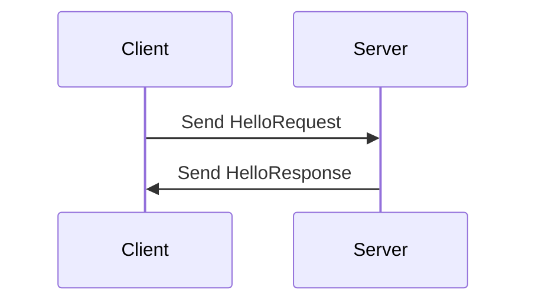

## 11.7. gRPC and Protobuf Integration

In this section, we delve into the integration of gRPC and Protocol Buffers in Rust, focusing on efficient, strongly-typed remote procedure calls. We will explore the advantages of using gRPC over traditional REST APIs, provide practical examples using the `tonic` and `prost` crates, and discuss the benefits of interoperability and performance.

### Introduction to gRPC and Protocol Buffers

**gRPC** (gRPC Remote Procedure Calls) is a high-performance, open-source universal RPC framework initially developed by Google. It enables applications to communicate with each other as if they were local, regardless of the environment they are running in. gRPC uses **Protocol Buffers** (Protobuf) as its interface definition language (IDL) and serialization mechanism, which allows for efficient and compact data representation.

**Protocol Buffers** are a language-neutral, platform-neutral extensible mechanism for serializing structured data. They are used to define the structure of the data and the services that will be exposed via gRPC. Protobuf files (`.proto`) describe the data structures and service interfaces, which are then compiled into code for various programming languages, including Rust.

### Advantages of gRPC over REST

While RESTful APIs have been the standard for web services, gRPC offers several advantages:

1. **Performance**: gRPC uses HTTP/2, which allows for multiplexing multiple requests over a single connection, reducing latency and improving throughput.
2. **Strong Typing**: With Protobuf, gRPC provides strong typing and schema validation, reducing runtime errors.
3. **Bi-directional Streaming**: gRPC supports client, server, and bi-directional streaming, enabling real-time communication.
4. **Code Generation**: Protobuf allows for automatic code generation, reducing boilerplate and ensuring consistency across services.
5. **Interoperability**: gRPC services can be consumed by clients written in different languages, making it ideal for polyglot environments.

### Setting Up gRPC in Rust with `tonic` and `prost`

To implement gRPC in Rust, we use the `tonic` and `prost` crates. `tonic` is a gRPC client and server implementation for Rust, while `prost` is a Protobuf compiler for Rust.

#### Installing Dependencies

Add the following dependencies to your `Cargo.toml`:

```toml
[dependencies]
tonic = "0.5"
prost = "0.8"
prost-types = "0.8"
tokio = { version = "1", features = ["full"] }
```

#### Defining a Protobuf Service

Create a `.proto` file to define your service and messages. For example, let's define a simple `Greeter` service:

```proto
syntax = "proto3";

package greeter;

service Greeter {
  rpc SayHello (HelloRequest) returns (HelloResponse);
}

message HelloRequest {
  string name = 1;
}

message HelloResponse {
  string message = 1;
}
```

#### Generating Rust Code

Use `tonic-build` to generate Rust code from the `.proto` file. Add a build script (`build.rs`) to your project:

```rust
fn main() {
    tonic_build::compile_protos("proto/greeter.proto").unwrap();
}
```

Run `cargo build` to generate the Rust code for the service.

#### Implementing the Server

Create a server that implements the `Greeter` service:

```rust
use tonic::{transport::Server, Request, Response, Status};
use greeter::greeter_server::{Greeter, GreeterServer};
use greeter::{HelloRequest, HelloResponse};

pub mod greeter {
    tonic::include_proto!("greeter");
}

#[derive(Default)]
pub struct MyGreeter {}

#[tonic::async_trait]
impl Greeter for MyGreeter {
    async fn say_hello(
        &self,
        request: Request<HelloRequest>,
    ) -> Result<Response<HelloResponse>, Status> {
        let reply = greeter::HelloResponse {
            message: format!("Hello {}!", request.into_inner().name),
        };
        Ok(Response::new(reply))
    }
}

#[tokio::main]
async fn main() -> Result<(), Box<dyn std::error::Error>> {
    let addr = "[::1]:50051".parse()?;
    let greeter = MyGreeter::default();

    println!("GreeterServer listening on {}", addr);

    Server::builder()
        .add_service(GreeterServer::new(greeter))
        .serve(addr)
        .await?;

    Ok(())
}
```

#### Implementing the Client

Create a client to call the `Greeter` service:

```rust
use greeter::greeter_client::GreeterClient;
use greeter::HelloRequest;

pub mod greeter {
    tonic::include_proto!("greeter");
}

#[tokio::main]
async fn main() -> Result<(), Box<dyn std::error::Error>> {
    let mut client = GreeterClient::connect("http://[::1]:50051").await?;

    let request = tonic::Request::new(HelloRequest {
        name: "World".into(),
    });

    let response = client.say_hello(request).await?;

    println!("RESPONSE={:?}", response);

    Ok(())
}
```

### Code Generation and Service Definition

The process of code generation in gRPC involves compiling the `.proto` files into language-specific code. In Rust, this is facilitated by the `tonic-build` crate, which generates client and server code from the Protobuf definitions. This ensures that the service interfaces are consistent and reduces the likelihood of errors.

### Interoperability and Performance Benefits

gRPC's use of HTTP/2 and Protobuf provides significant performance benefits over traditional REST APIs. The binary serialization format of Protobuf is more compact than JSON, reducing the size of messages transmitted over the network. Additionally, HTTP/2's multiplexing capabilities allow for multiple requests and responses to be sent over a single connection, reducing latency.

Interoperability is another key advantage of gRPC. With support for multiple programming languages, gRPC services can be consumed by clients written in different languages, making it ideal for microservices architectures and polyglot environments.

### Visualizing gRPC Architecture

To better understand the architecture of a gRPC service, let's visualize the interaction between the client and server using a sequence diagram.



This diagram illustrates the simple request-response interaction in a gRPC service. The client sends a `HelloRequest` to the server, and the server responds with a `HelloResponse`.

### Try It Yourself

To deepen your understanding, try modifying the code examples:

- Add a new method to the `Greeter` service, such as `SayGoodbye`.
- Implement client and server streaming methods.
- Experiment with different data types in the Protobuf messages.

### References and Further Reading

- [gRPC Official Documentation](https://grpc.io/docs/)
- [Protocol Buffers Documentation](https://developers.google.com/protocol-buffers)
- [tonic crate on crates.io](https://crates.io/crates/tonic)
- [prost crate on crates.io](https://crates.io/crates/prost)

### Knowledge Check

Before we conclude, let's reinforce what we've learned with a few questions:

- What are the key advantages of using gRPC over REST?
- How does gRPC achieve strong typing and schema validation?
- What role does the `tonic-build` crate play in a Rust gRPC project?

### Embrace the Journey

Remember, integrating gRPC and Protobuf into your Rust projects is just the beginning. As you continue to explore these technologies, you'll discover new ways to build efficient, scalable, and interoperable services. Keep experimenting, stay curious, and enjoy the journey!

## Quiz Time!



### What is gRPC primarily used for?

- [x] High-performance remote procedure calls
- [ ] Web page rendering
- [ ] Database management
- [ ] File storage

> **Explanation:** gRPC is used for high-performance remote procedure calls, enabling efficient communication between services.

### Which protocol does gRPC use for communication?

- [x] HTTP/2
- [ ] HTTP/1.1
- [ ] FTP
- [ ] SMTP

> **Explanation:** gRPC uses HTTP/2 for communication, which allows for multiplexing and improved performance.

### What is the role of Protocol Buffers in gRPC?

- [x] Serialization and interface definition
- [ ] Database indexing
- [ ] Network routing
- [ ] File compression

> **Explanation:** Protocol Buffers are used for serialization and defining interfaces in gRPC services.

### Which Rust crate is used for gRPC implementation?

- [x] tonic
- [ ] serde
- [ ] hyper
- [ ] tokio

> **Explanation:** The `tonic` crate is used for implementing gRPC services in Rust.

### What is the purpose of the `prost` crate?

- [x] Compiling Protocol Buffers
- [ ] Managing HTTP requests
- [ ] Database connections
- [ ] File I/O operations

> **Explanation:** The `prost` crate is used for compiling Protocol Buffers into Rust code.

### How does gRPC achieve strong typing?

- [x] Using Protocol Buffers for schema definition
- [ ] Through dynamic typing
- [ ] By using JSON
- [ ] With XML schemas

> **Explanation:** gRPC achieves strong typing by using Protocol Buffers to define schemas.

### What is a key benefit of using HTTP/2 in gRPC?

- [x] Multiplexing multiple requests over a single connection
- [ ] Simplified URL structure
- [ ] Enhanced security features
- [ ] Reduced server load

> **Explanation:** HTTP/2 allows for multiplexing multiple requests over a single connection, improving performance.

### What is the main advantage of gRPC's binary serialization format?

- [x] Compact message size
- [ ] Human readability
- [ ] Easy debugging
- [ ] Text-based format

> **Explanation:** The binary serialization format of gRPC is more compact than text-based formats like JSON.

### Can gRPC services be consumed by clients in different programming languages?

- [x] True
- [ ] False

> **Explanation:** gRPC supports multiple programming languages, allowing services to be consumed by clients in different languages.

### What is the role of `tonic-build` in a Rust gRPC project?

- [x] Generating Rust code from Protobuf definitions
- [ ] Managing HTTP requests
- [ ] Compiling Rust code
- [ ] Handling database connections

> **Explanation:** `tonic-build` is used to generate Rust code from Protobuf definitions, ensuring consistency in service interfaces.


