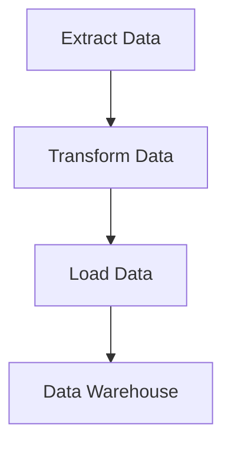

## 11.8. Batch Processing and ETL Pipelines

In the realm of data engineering, batch processing and ETL (Extract, Transform, Load) pipelines are fundamental for handling large volumes of data efficiently. Rust, with its emphasis on performance and safety, is an excellent choice for implementing these pipelines. In this section, we will delve into the concepts of ETL, explore Rust's capabilities for high-performance data tasks, and provide practical examples using popular Rust libraries like `csv`, `serde`, and `polars`.

### Understanding ETL and Its Importance

ETL stands for Extract, Transform, Load, and it is a process used to consolidate data from various sources into a single, unified data store. This process is crucial for data analysis, reporting, and decision-making. Here's a breakdown of each component:

- **Extract**: This step involves retrieving data from various sources, such as databases, files, or APIs.
- **Transform**: The extracted data is then cleaned, normalized, and transformed into a suitable format for analysis.
- **Load**: Finally, the transformed data is loaded into a target data store, such as a data warehouse or a database, for further use.

ETL processes are essential for organizations to make informed decisions based on comprehensive and accurate data.

### Rust's Suitability for High-Performance Data Tasks

Rust is a systems programming language known for its performance, safety, and concurrency capabilities. These features make it particularly well-suited for high-performance data tasks, including ETL pipelines. Here are some reasons why Rust is an excellent choice:

- **Memory Safety**: Rust's ownership model ensures memory safety without the need for a garbage collector, reducing the risk of memory leaks and data races.
- **Concurrency**: Rust's concurrency model allows for safe and efficient parallel processing, which is crucial for handling large datasets.
- **Performance**: Rust's performance is comparable to C and C++, making it ideal for computationally intensive tasks.
- **Ecosystem**: Rust has a growing ecosystem of libraries and tools for data manipulation and processing.

### Implementing ETL Pipelines in Rust

Let's explore how to implement ETL pipelines in Rust using some of its powerful libraries.

#### Extracting Data

To extract data, we can use the `csv` crate, which provides a fast and flexible CSV reader and writer. Here's an example of how to read data from a CSV file:

```rust
use csv::ReaderBuilder;
use std::error::Error;

fn read_csv(file_path: &str) -> Result<(), Box<dyn Error>> {
    let mut rdr = ReaderBuilder::new()
        .has_headers(true)
        .from_path(file_path)?;

    for result in rdr.records() {
        let record = result?;
        println!("{:?}", record);
    }
    Ok(())
}

fn main() {
    if let Err(err) = read_csv("data.csv") {
        eprintln!("Error reading CSV: {}", err);
    }
}
```

In this example, we use `ReaderBuilder` to configure the CSV reader and iterate over each record. The `csv` crate handles parsing and provides a convenient way to access each row of data.

#### Transforming Data

For data transformation, the `serde` crate is invaluable. It allows for serialization and deserialization of data structures, making it easy to transform data into different formats. Here's an example of transforming CSV data into a Rust struct:

```rust
use serde::Deserialize;
use csv::ReaderBuilder;
use std::error::Error;

#[derive(Debug, Deserialize)]
struct Record {
    name: String,
    age: u32,
    email: String,
}

fn transform_csv(file_path: &str) -> Result<(), Box<dyn Error>> {
    let mut rdr = ReaderBuilder::new()
        .has_headers(true)
        .from_path(file_path)?;

    for result in rdr.deserialize() {
        let record: Record = result?;
        println!("{:?}", record);
    }
    Ok(())
}

fn main() {
    if let Err(err) = transform_csv("data.csv") {
        eprintln!("Error transforming CSV: {}", err);
    }
}
```

In this code, we define a `Record` struct and use `serde` to deserialize each CSV row into an instance of `Record`. This allows for easy manipulation and transformation of data.

#### Loading Data

Loading data into a target data store can be done using various Rust libraries, depending on the destination. For example, if you're loading data into a database, you might use the `diesel` or `sqlx` crates. Here's a simplified example of loading data into a vector for further processing:

```rust
use serde::Deserialize;
use csv::ReaderBuilder;
use std::error::Error;

#[derive(Debug, Deserialize)]
struct Record {
    name: String,
    age: u32,
    email: String,
}

fn load_data(file_path: &str) -> Result<Vec<Record>, Box<dyn Error>> {
    let mut rdr = ReaderBuilder::new()
        .has_headers(true)
        .from_path(file_path)?;

    let mut records = Vec::new();
    for result in rdr.deserialize() {
        let record: Record = result?;
        records.push(record);
    }
    Ok(records)
}

fn main() {
    match load_data("data.csv") {
        Ok(records) => println!("Loaded {} records", records.len()),
        Err(err) => eprintln!("Error loading data: {}", err),
    }
}
```

This example demonstrates loading data into a vector, which can then be used for further processing or analysis.

### Using the `polars` Crate for Data Manipulation

The `polars` crate is a powerful library for data manipulation and analysis in Rust. It provides a DataFrame API similar to Pandas in Python, making it easy to work with large datasets. Here's an example of using `polars` to perform data manipulation:

```rust
use polars::prelude::*;
use std::error::Error;

fn manipulate_data(file_path: &str) -> Result<DataFrame, Box<dyn Error>> {
    let df = CsvReader::from_path(file_path)?
        .has_header(true)
        .finish()?;

    let filtered_df = df.filter(&df.column("age")?.gt(30)?)?;
    Ok(filtered_df)
}

fn main() {
    match manipulate_data("data.csv") {
        Ok(df) => println!("{:?}", df),
        Err(err) => eprintln!("Error manipulating data: {}", err),
    }
}
```

In this example, we use `polars` to read a CSV file into a DataFrame and filter rows where the age is greater than 30. The `polars` crate provides a rich set of functions for data manipulation, making it a powerful tool for ETL tasks.

### Error Handling and Optimization Strategies

Error handling is crucial in ETL pipelines to ensure data integrity and reliability. Rust's `Result` and `Option` types provide a robust way to handle errors. Here are some strategies for effective error handling and optimization:

- **Use `Result` and `Option`**: Leverage Rust's type system to handle errors gracefully and avoid panics.
- **Log Errors**: Implement logging to capture and analyze errors during the ETL process.
- **Optimize I/O Operations**: Use buffered I/O and parallel processing to optimize data extraction and loading.
- **Profile and Benchmark**: Use tools like `cargo bench` and `criterion` to profile and optimize performance.

### Visualizing ETL Pipelines

To better understand the ETL process, let's visualize a typical ETL pipeline using a flowchart:



This diagram illustrates the flow of data from extraction to transformation and finally loading into a data warehouse.

### Try It Yourself

Now that we've covered the basics of implementing ETL pipelines in Rust, it's time to experiment. Try modifying the code examples to:

- Extract data from different file formats, such as JSON or XML.
- Implement additional transformation steps, such as data aggregation or normalization.
- Load data into a database using the `diesel` or `sqlx` crates.

### Key Takeaways

- ETL pipelines are essential for consolidating and preparing data for analysis.
- Rust's performance and safety features make it an excellent choice for implementing ETL pipelines.
- Libraries like `csv`, `serde`, and `polars` provide powerful tools for data manipulation in Rust.
- Effective error handling and optimization strategies are crucial for reliable ETL processes.

### Further Reading

- [Rust CSV Documentation](https://docs.rs/csv/latest/csv/)
- [Serde Documentation](https://serde.rs/)
- [Polars Documentation](https://docs.rs/polars/latest/polars/)

## Quiz Time!



### What does ETL stand for in data processing?

- [x] Extract, Transform, Load
- [ ] Evaluate, Test, Launch
- [ ] Execute, Transfer, Log
- [ ] Edit, Translate, Link

> **Explanation:** ETL stands for Extract, Transform, Load, which are the three main steps in the data processing pipeline.

### Why is Rust suitable for high-performance data tasks?

- [x] Memory safety and concurrency
- [ ] Built-in garbage collection
- [ ] Dynamic typing
- [ ] Lack of ecosystem

> **Explanation:** Rust's memory safety, concurrency model, and performance make it suitable for high-performance data tasks.

### Which crate is used for reading and writing CSV files in Rust?

- [x] csv
- [ ] serde
- [ ] polars
- [ ] diesel

> **Explanation:** The `csv` crate is used for reading and writing CSV files in Rust.

### What is the purpose of the `serde` crate in Rust?

- [x] Serialization and deserialization
- [ ] File I/O operations
- [ ] Network communication
- [ ] GUI development

> **Explanation:** The `serde` crate is used for serialization and deserialization of data structures in Rust.

### How can you handle errors in Rust ETL pipelines?

- [x] Using `Result` and `Option` types
- [ ] Ignoring errors
- [ ] Using global variables
- [ ] Using exceptions

> **Explanation:** Rust uses `Result` and `Option` types for error handling, providing a robust way to manage errors.

### Which library provides a DataFrame API similar to Pandas in Python?

- [x] polars
- [ ] csv
- [ ] serde
- [ ] sqlx

> **Explanation:** The `polars` crate provides a DataFrame API similar to Pandas in Python.

### What is the first step in an ETL pipeline?

- [x] Extract
- [ ] Transform
- [ ] Load
- [ ] Analyze

> **Explanation:** The first step in an ETL pipeline is to extract data from various sources.

### What is a common optimization strategy for ETL pipelines?

- [x] Use buffered I/O
- [ ] Use global variables
- [ ] Avoid logging
- [ ] Use dynamic typing

> **Explanation:** Using buffered I/O is a common optimization strategy to improve performance in ETL pipelines.

### What does the `polars` crate in Rust help with?

- [x] Data manipulation and analysis
- [ ] Network communication
- [ ] GUI development
- [ ] File I/O operations

> **Explanation:** The `polars` crate is used for data manipulation and analysis in Rust.

### Rust's concurrency model allows for safe and efficient parallel processing. True or False?

- [x] True
- [ ] False

> **Explanation:** Rust's concurrency model ensures safe and efficient parallel processing, making it ideal for handling large datasets.



Remember, this is just the beginning. As you progress, you'll build more complex and efficient ETL pipelines. Keep experimenting, stay curious, and enjoy the journey!
