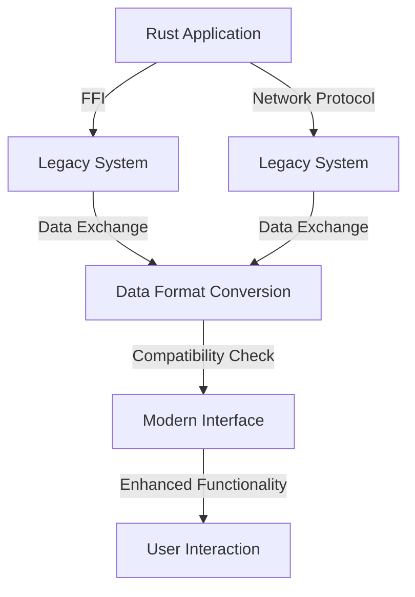

## 11.9. Handling Legacy Systems

In the ever-evolving landscape of software development, legacy systems often pose significant challenges. These systems, while outdated, are often critical to business operations and cannot be easily replaced. Integrating modern Rust applications with such legacy systems requires careful planning and execution. In this section, we will explore strategies for interfacing Rust with legacy systems, discuss the challenges involved, and provide best practices for mitigating risks.

### Understanding Legacy Systems

Legacy systems are older software applications or platforms that continue to be used despite the availability of newer technologies. They often run on outdated hardware or software environments and may use obsolete programming languages or data formats. The primary challenges posed by legacy systems include:

- **Compatibility Issues**: Legacy systems may not support modern protocols or data formats, making integration difficult.
- **Limited Documentation**: Documentation for legacy systems is often sparse or outdated, complicating the integration process.
- **Security Risks**: Older systems may have unpatched vulnerabilities, posing security risks.
- **Performance Constraints**: Legacy systems may not be optimized for current workloads, leading to performance bottlenecks.

### Interfacing with Legacy Systems

To integrate Rust applications with legacy systems, developers can use several approaches, including Foreign Function Interface (FFI) and network protocols.

#### Foreign Function Interface (FFI)

FFI allows Rust code to call functions written in other languages, such as C or C++. This is particularly useful when dealing with legacy systems written in these languages. Rust's FFI capabilities enable seamless integration with existing codebases.

**Example: Interfacing with C Code**

```rust
// Define the external C function
extern "C" {
    fn legacy_function(input: i32) -> i32;
}

fn main() {
    // Call the legacy C function
    let result = unsafe { legacy_function(42) };
    println!("Result from legacy system: {}", result);
}
```

In this example, we define an external C function using the `extern` keyword and call it within an `unsafe` block. This allows Rust to interact with the legacy C code.

#### Network Protocols

Another approach to interfacing with legacy systems is through network protocols. Many legacy systems support protocols such as HTTP, TCP/IP, or custom protocols. Rust's robust networking libraries make it easy to communicate with these systems.

**Example: Communicating via TCP**

```rust
use std::net::TcpStream;
use std::io::{self, Write, Read};

fn main() -> io::Result<()> {
    let mut stream = TcpStream::connect("127.0.0.1:8080")?;

    // Send data to the legacy system
    stream.write_all(b"Hello, legacy system!")?;

    let mut buffer = [0; 512];
    // Read response from the legacy system
    let n = stream.read(&mut buffer)?;
    println!("Received: {}", String::from_utf8_lossy(&buffer[..n]));

    Ok(())
}
```

This example demonstrates how to establish a TCP connection to a legacy system, send data, and read the response.

### Wrapping or Extending Legacy Code

Rust can be used to wrap or extend legacy code, providing a modern interface while preserving the existing functionality. This approach allows developers to gradually transition from legacy systems to modern applications.

#### Wrapping Legacy Code

Wrapping involves creating a Rust interface around legacy code, enabling new features or improvements without altering the original codebase.

**Example: Wrapping a Legacy Library**

```rust
mod legacy {
    pub fn legacy_add(a: i32, b: i32) -> i32 {
        // Simulate a legacy addition function
        a + b
    }
}

struct ModernCalculator;

impl ModernCalculator {
    fn add(a: i32, b: i32) -> i32 {
        // Use the legacy function within a modern interface
        legacy::legacy_add(a, b)
    }
}

fn main() {
    let result = ModernCalculator::add(5, 7);
    println!("Result: {}", result);
}
```

In this example, we wrap a legacy addition function within a modern Rust interface, allowing for future enhancements.

#### Extending Legacy Code

Extending involves adding new functionality to legacy systems using Rust, such as additional features or performance improvements.

**Example: Extending with New Features**

```rust
mod legacy {
    pub fn legacy_multiply(a: i32, b: i32) -> i32 {
        // Simulate a legacy multiplication function
        a * b
    }
}

struct AdvancedCalculator;

impl AdvancedCalculator {
    fn multiply(a: i32, b: i32) -> i32 {
        // Use the legacy function
        legacy::legacy_multiply(a, b)
    }

    fn square(a: i32) -> i32 {
        // New feature: square a number
        Self::multiply(a, a)
    }
}

fn main() {
    let result = AdvancedCalculator::square(4);
    println!("Square: {}", result);
}
```

Here, we extend the legacy code by adding a new feature to calculate the square of a number.

### Best Practices for Mitigating Risks

When integrating Rust with legacy systems, it's essential to follow best practices to mitigate risks and ensure a smooth transition.

1. **Thorough Testing**: Conduct comprehensive testing to identify and address compatibility issues. Use unit tests, integration tests, and regression tests to validate functionality.

2. **Incremental Integration**: Integrate Rust with legacy systems incrementally, starting with non-critical components. This approach minimizes disruption and allows for gradual adaptation.

3. **Documentation**: Maintain detailed documentation of the integration process, including code changes, configurations, and dependencies. This documentation will be invaluable for future maintenance and troubleshooting.

4. **Security Audits**: Perform security audits to identify and address vulnerabilities in legacy systems. Implement security measures such as encryption and access controls to protect sensitive data.

5. **Performance Monitoring**: Monitor the performance of integrated systems to identify bottlenecks and optimize resource usage. Use profiling tools to analyze performance metrics and make necessary adjustments.

### Data Format Conversions and Compatibility

Legacy systems often use outdated data formats that may not be compatible with modern applications. Rust provides tools for data format conversions and compatibility.

#### Data Format Conversions

Rust's `serde` library is a powerful tool for serializing and deserializing data in various formats, such as JSON, XML, and more. This capability is essential for converting data between legacy and modern systems.

**Example: JSON Serialization with Serde**

```rust
use serde::{Serialize, Deserialize};
use serde_json;

#[derive(Serialize, Deserialize)]
struct LegacyData {
    id: u32,
    name: String,
}

fn main() {
    // Convert legacy data to JSON
    let data = LegacyData { id: 1, name: "Legacy Item".to_string() };
    let json = serde_json::to_string(&data).unwrap();
    println!("Serialized JSON: {}", json);

    // Convert JSON back to legacy data
    let deserialized: LegacyData = serde_json::from_str(&json).unwrap();
    println!("Deserialized Data: {:?}", deserialized);
}
```

This example demonstrates how to serialize and deserialize data using the `serde` library, facilitating data format conversions.

#### Compatibility Considerations

When dealing with legacy systems, it's crucial to ensure compatibility with existing data formats and protocols. Consider the following strategies:

- **Backward Compatibility**: Ensure that new features or changes do not break existing functionality. Use versioning to manage changes and maintain compatibility.

- **Data Validation**: Implement data validation to ensure that data exchanged between systems meets expected formats and constraints.

- **Protocol Adapters**: Use protocol adapters to translate between different communication protocols, enabling seamless integration with legacy systems.

### Visualizing the Integration Process

To better understand the integration process, let's visualize the flow of data and interactions between Rust applications and legacy systems.



**Diagram Description**: This flowchart illustrates the integration process between Rust applications and legacy systems. It shows the use of FFI and network protocols for interfacing, data exchange and conversion, compatibility checks, and the provision of a modern interface for enhanced functionality.

### Conclusion

Integrating Rust applications with legacy systems is a complex but rewarding endeavor. By leveraging Rust's capabilities, developers can modernize legacy systems, improve performance, and enhance functionality. Remember to follow best practices, conduct thorough testing, and ensure compatibility to mitigate risks and achieve successful integration.

### Embrace the Journey

As you embark on the journey of integrating Rust with legacy systems, remember that each challenge is an opportunity for growth and innovation. Stay curious, experiment with different approaches, and enjoy the process of transforming outdated technologies into modern, efficient solutions.

## Quiz Time!



### What is a primary challenge posed by legacy systems?

- [x] Compatibility issues
- [ ] Modern documentation
- [ ] High performance
- [ ] Latest security features

> **Explanation:** Legacy systems often face compatibility issues due to outdated technologies and protocols.

### Which Rust feature allows calling functions written in other languages?

- [x] Foreign Function Interface (FFI)
- [ ] Network Protocols
- [ ] Serde Library
- [ ] Cargo

> **Explanation:** FFI allows Rust to call functions written in other languages like C or C++.

### What is a benefit of using network protocols for integration?

- [x] Enables communication with systems supporting protocols like HTTP or TCP/IP
- [ ] Provides direct memory access
- [ ] Eliminates the need for data conversion
- [ ] Ensures backward compatibility

> **Explanation:** Network protocols facilitate communication with systems that support these protocols, enabling integration.

### How can Rust wrap legacy code?

- [x] By creating a modern interface around legacy functions
- [ ] By rewriting the entire legacy system
- [ ] By ignoring legacy code
- [ ] By using only network protocols

> **Explanation:** Wrapping involves creating a modern interface around legacy code, allowing for enhancements without altering the original codebase.

### What is a best practice for mitigating risks in legacy integration?

- [x] Conducting thorough testing
- [ ] Ignoring security audits
- [ ] Skipping documentation
- [ ] Immediate full integration

> **Explanation:** Thorough testing helps identify and address compatibility issues, ensuring a smooth integration process.

### Which library is used for data format conversions in Rust?

- [x] Serde
- [ ] Cargo
- [ ] Clippy
- [ ] Rayon

> **Explanation:** The `serde` library is used for serializing and deserializing data in various formats, facilitating data format conversions.

### What is a strategy for ensuring compatibility with legacy systems?

- [x] Implementing data validation
- [ ] Ignoring protocol differences
- [ ] Removing backward compatibility
- [ ] Using only modern data formats

> **Explanation:** Data validation ensures that data exchanged between systems meets expected formats and constraints, maintaining compatibility.

### What does the flowchart in the article illustrate?

- [x] The integration process between Rust applications and legacy systems
- [ ] The architecture of a Rust application
- [ ] The development lifecycle of a Rust project
- [ ] The syntax of Rust programming language

> **Explanation:** The flowchart illustrates the integration process, showing interactions between Rust applications and legacy systems.

### How can Rust extend legacy code?

- [x] By adding new functionality or performance improvements
- [ ] By removing existing features
- [ ] By converting it to a different language
- [ ] By ignoring legacy code

> **Explanation:** Extending involves adding new functionality or performance improvements to legacy systems using Rust.

### True or False: Legacy systems are always easy to integrate with modern applications.

- [ ] True
- [x] False

> **Explanation:** Legacy systems often pose challenges due to outdated technologies, limited documentation, and compatibility issues, making integration complex.


