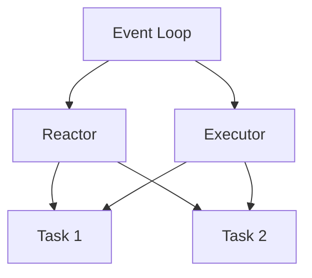

## 12.1. Asynchronous I/O with Tokio

In the realm of systems programming, Rust stands out for its focus on safety and performance. When it comes to building high-performance network applications, asynchronous I/O is a crucial component. Tokio, a powerful asynchronous runtime for Rust, provides the tools necessary to handle I/O operations efficiently. In this section, we will explore how to leverage Tokio for asynchronous I/O, write async network code, and understand the underlying concepts of event loops, reactors, and executors.

### Introduction to Tokio

Tokio is an asynchronous runtime for Rust, designed to provide the building blocks needed for writing non-blocking network applications. It is built on top of Rust's `async`/`await` syntax, making it easier to write asynchronous code that is both efficient and readable. Tokio's core features include:

- **Event-driven architecture**: Tokio uses an event loop to manage I/O operations, allowing applications to handle many connections concurrently.
- **Task scheduling**: Tokio's executor efficiently schedules tasks, ensuring that CPU resources are used effectively.
- **Rich ecosystem**: Tokio provides a wide range of utilities and libraries for networking, timers, and more.

### Writing Async Network Code with Tokio

To write asynchronous network code with Tokio, we need to understand the `async`/`await` syntax in Rust. This syntax allows us to write asynchronous functions that can yield control back to the executor, enabling other tasks to run concurrently.

#### Example: Asynchronous TCP Client

Let's start by writing a simple asynchronous TCP client using Tokio. This client will connect to a server, send a message, and print the response.

```rust
use tokio::net::TcpStream;
use tokio::io::{self, AsyncWriteExt, AsyncReadExt};

#[tokio::main]
async fn main() -> io::Result<()> {
    // Connect to the server
    let mut stream = TcpStream::connect("127.0.0.1:8080").await?;

    // Send a message to the server
    stream.write_all(b"Hello, server!").await?;

    // Read the response from the server
    let mut buffer = [0; 1024];
    let n = stream.read(&mut buffer).await?;

    // Print the response
    println!("Received: {}", String::from_utf8_lossy(&buffer[..n]));

    Ok(())
}
```

In this example, we use `TcpStream::connect` to establish a connection to the server. The `write_all` and `read` methods are asynchronous, allowing the client to perform other tasks while waiting for I/O operations to complete.

#### Example: Asynchronous TCP Server

Now, let's create a simple asynchronous TCP server that listens for incoming connections and echoes back any messages it receives.

```rust
use tokio::net::TcpListener;
use tokio::io::{self, AsyncWriteExt, AsyncReadExt};

#[tokio::main]
async fn main() -> io::Result<()> {
    // Bind the listener to the address
    let listener = TcpListener::bind("127.0.0.1:8080").await?;

    loop {
        // Accept an incoming connection
        let (mut socket, _) = listener.accept().await?;

        // Spawn a new task to handle the connection
        tokio::spawn(async move {
            let mut buffer = [0; 1024];

            // Read data from the socket
            match socket.read(&mut buffer).await {
                Ok(n) if n == 0 => return, // Connection closed
                Ok(n) => {
                    // Echo the data back to the client
                    if let Err(e) = socket.write_all(&buffer[..n]).await {
                        eprintln!("Failed to write to socket; err = {:?}", e);
                    }
                }
                Err(e) => {
                    eprintln!("Failed to read from socket; err = {:?}", e);
                }
            }
        });
    }
}
```

In this server example, we use `TcpListener::bind` to listen for incoming connections. For each connection, we spawn a new task to handle the communication, allowing the server to handle multiple clients concurrently.

### Understanding Event Loops, Reactors, and Executors

Tokio's architecture is based on the reactor pattern, which is a design pattern for handling I/O operations asynchronously. Let's break down the key components:

- **Event Loop**: The event loop is the core of Tokio's runtime. It continuously polls for I/O events and dispatches them to the appropriate tasks. The event loop ensures that tasks are executed when their I/O operations are ready to proceed.

- **Reactor**: The reactor is responsible for monitoring I/O resources (such as sockets) and notifying the event loop when they are ready for reading or writing. This allows the application to perform non-blocking I/O operations.

- **Executor**: The executor is responsible for scheduling and running tasks. It ensures that tasks are executed efficiently, balancing CPU usage and I/O operations.



*Diagram: Tokio's Event Loop, Reactor, and Executor Architecture*

### Best Practices and Common Pitfalls

When working with Tokio, it's important to follow best practices to ensure that your applications are efficient and reliable. Here are some tips:

- **Avoid blocking operations**: Blocking operations can prevent the event loop from processing other tasks. Use asynchronous alternatives whenever possible.
- **Use `tokio::spawn` for concurrency**: Tokio's `spawn` function allows you to run tasks concurrently. Use it to handle multiple connections or perform background tasks.
- **Handle errors gracefully**: Always handle errors in your asynchronous code. Use the `Result` type to propagate errors and provide meaningful error messages.
- **Monitor performance**: Use tools like `tokio-console` to monitor the performance of your applications and identify bottlenecks.

### Try It Yourself

Experiment with the provided code examples by modifying them to suit your needs. For instance, try changing the server to handle multiple messages from a client or implement a simple chat application using Tokio.

### External Resources

For more information on Tokio and asynchronous programming in Rust, check out the following resources:

- [Tokio Documentation](https://tokio.rs/)
- [Rust Async Book](https://rust-lang.github.io/async-book/)

### Knowledge Check

Before we wrap up, let's reinforce what we've learned with a few questions and exercises. Try to answer them to test your understanding of asynchronous I/O with Tokio.

## Quiz Time!



### What is Tokio in Rust?

- [x] An asynchronous runtime for Rust
- [ ] A synchronous I/O library for Rust
- [ ] A GUI framework for Rust
- [ ] A database library for Rust

> **Explanation:** Tokio is an asynchronous runtime for Rust, designed to handle non-blocking I/O operations efficiently.

### Which pattern does Tokio's architecture follow?

- [x] Reactor pattern
- [ ] Singleton pattern
- [ ] Observer pattern
- [ ] Factory pattern

> **Explanation:** Tokio's architecture is based on the reactor pattern, which is used for handling I/O operations asynchronously.

### What is the role of the event loop in Tokio?

- [x] To continuously poll for I/O events and dispatch them to tasks
- [ ] To manage memory allocation
- [ ] To handle user input
- [ ] To render graphics

> **Explanation:** The event loop in Tokio continuously polls for I/O events and dispatches them to the appropriate tasks for execution.

### How do you run tasks concurrently in Tokio?

- [x] Using `tokio::spawn`
- [ ] Using `std::thread::spawn`
- [ ] Using `std::sync::Mutex`
- [ ] Using `std::sync::Arc`

> **Explanation:** In Tokio, you use `tokio::spawn` to run tasks concurrently, allowing multiple tasks to execute without blocking each other.

### What should you avoid in asynchronous code with Tokio?

- [x] Blocking operations
- [ ] Error handling
- [ ] Using `async`/`await`
- [ ] Task spawning

> **Explanation:** Blocking operations should be avoided in asynchronous code with Tokio, as they can prevent the event loop from processing other tasks.

### Which function is used to connect to a TCP server in Tokio?

- [x] `TcpStream::connect`
- [ ] `TcpListener::bind`
- [ ] `std::net::TcpStream::connect`
- [ ] `std::net::TcpListener::bind`

> **Explanation:** `TcpStream::connect` is used in Tokio to establish a connection to a TCP server asynchronously.

### What is the purpose of the reactor in Tokio?

- [x] To monitor I/O resources and notify the event loop
- [ ] To execute tasks
- [ ] To manage memory allocation
- [ ] To handle user input

> **Explanation:** The reactor in Tokio monitors I/O resources and notifies the event loop when they are ready for reading or writing.

### How can you monitor the performance of a Tokio application?

- [x] Using `tokio-console`
- [ ] Using `std::sync::Mutex`
- [ ] Using `std::thread::spawn`
- [ ] Using `std::sync::Arc`

> **Explanation:** `tokio-console` is a tool that can be used to monitor the performance of Tokio applications and identify bottlenecks.

### What is the main advantage of using asynchronous I/O?

- [x] It allows handling many connections concurrently without blocking
- [ ] It simplifies error handling
- [ ] It reduces memory usage
- [ ] It improves code readability

> **Explanation:** The main advantage of asynchronous I/O is that it allows handling many connections concurrently without blocking, improving performance and scalability.

### True or False: Tokio can be used for both networking and file I/O operations.

- [x] True
- [ ] False

> **Explanation:** True. Tokio can be used for both networking and file I/O operations, providing a comprehensive solution for asynchronous I/O in Rust.



Remember, this is just the beginning of your journey with asynchronous programming in Rust. As you continue to explore and experiment, you'll discover more advanced techniques and patterns that will enhance your skills. Keep experimenting, stay curious, and enjoy the journey!
