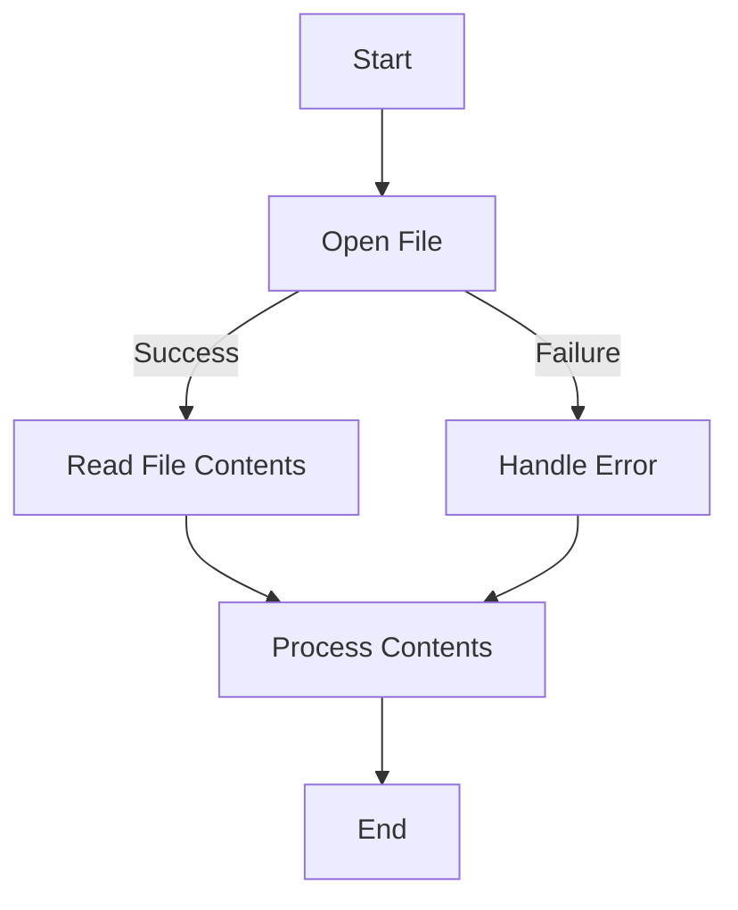

## 12.10. File System Operations and Patterns

In this section, we delve into the intricacies of file system operations in Rust, exploring how to manage files and directories efficiently and safely. Rust's standard library provides robust tools for handling file I/O, ensuring memory safety and concurrency without sacrificing performance. We'll cover reading and writing files, traversing directories, handling file permissions and metadata, and addressing cross-platform considerations.

### Reading from and Writing to Files

File I/O is a fundamental aspect of many applications. Rust provides the `std::fs` module, which contains functions and types for file operations. Let's explore how to read from and write to files using Rust.

#### Reading Files

To read a file in Rust, we typically use the `File` struct from the `std::fs` module. Here's a simple example of reading a file's contents:

```rust
use std::fs::File;
use std::io::{self, Read};

fn read_file_contents(file_path: &str) -> io::Result<String> {
    let mut file = File::open(file_path)?;
    let mut contents = String::new();
    file.read_to_string(&mut contents)?;
    Ok(contents)
}

fn main() {
    match read_file_contents("example.txt") {
        Ok(contents) => println!("File contents:\n{}", contents),
        Err(e) => eprintln!("Error reading file: {}", e),
    }
}
```

**Explanation:**

- We use `File::open` to open a file, which returns a `Result<File>`.
- The `read_to_string` method reads the file's contents into a `String`.
- Error handling is done using the `?` operator, which propagates errors.

#### Writing to Files

Writing to a file is similar to reading. We use the `File` struct and the `write_all` method:

```rust
use std::fs::File;
use std::io::{self, Write};

fn write_to_file(file_path: &str, data: &str) -> io::Result<()> {
    let mut file = File::create(file_path)?;
    file.write_all(data.as_bytes())?;
    Ok(())
}

fn main() {
    match write_to_file("output.txt", "Hello, Rust!") {
        Ok(_) => println!("Data written successfully."),
        Err(e) => eprintln!("Error writing to file: {}", e),
    }
}
```

**Explanation:**

- `File::create` is used to create a new file or truncate an existing one.
- `write_all` writes a byte slice to the file.
- Again, the `?` operator is used for error propagation.

### Traversing Directories

Traversing directories is essential for applications that need to process multiple files. Rust provides the `std::fs::read_dir` function for this purpose.

#### Example: Directory Traversal

```rust
use std::fs;
use std::io;

fn list_files_in_directory(dir_path: &str) -> io::Result<()> {
    for entry in fs::read_dir(dir_path)? {
        let entry = entry?;
        let path = entry.path();
        println!("Found file: {:?}", path);
    }
    Ok(())
}

fn main() {
    match list_files_in_directory(".") {
        Ok(_) => println!("Directory traversal complete."),
        Err(e) => eprintln!("Error traversing directory: {}", e),
    }
}
```

**Explanation:**

- `fs::read_dir` returns an iterator over the entries in a directory.
- Each entry is a `Result<DirEntry>`, which provides access to the file's path.

### Handling File Permissions and Metadata

File permissions and metadata are crucial for managing access control and file attributes. Rust provides the `std::fs::metadata` function and the `Permissions` struct for this purpose.

#### Example: Checking File Metadata

```rust
use std::fs;
use std::os::unix::fs::PermissionsExt;

fn check_file_metadata(file_path: &str) -> std::io::Result<()> {
    let metadata = fs::metadata(file_path)?;
    println!("File size: {} bytes", metadata.len());
    println!("Is read-only: {}", metadata.permissions().readonly());
    println!("Permissions: {:o}", metadata.permissions().mode());
    Ok(())
}

fn main() {
    match check_file_metadata("example.txt") {
        Ok(_) => println!("Metadata checked successfully."),
        Err(e) => eprintln!("Error checking metadata: {}", e),
    }
}
```

**Explanation:**

- `fs::metadata` retrieves metadata for a file, including size and permissions.
- `PermissionsExt` provides additional methods for Unix-like systems, such as `mode`.

### Error Handling for I/O Operations

Error handling is critical in file I/O operations to ensure robustness. Rust's `Result` and `Option` types are used extensively for this purpose.

#### Example: Robust Error Handling

```rust
use std::fs::File;
use std::io::{self, Read};

fn read_file_with_error_handling(file_path: &str) -> io::Result<String> {
    let mut file = File::open(file_path).map_err(|e| {
        eprintln!("Failed to open file: {}", e);
        e
    })?;
    let mut contents = String::new();
    file.read_to_string(&mut contents).map_err(|e| {
        eprintln!("Failed to read file: {}", e);
        e
    })?;
    Ok(contents)
}

fn main() {
    match read_file_with_error_handling("example.txt") {
        Ok(contents) => println!("File contents:\n{}", contents),
        Err(_) => eprintln!("An error occurred."),
    }
}
```

**Explanation:**

- `map_err` is used to handle errors and provide custom error messages.
- This approach allows for more informative error handling.

### Cross-Platform Considerations

Rust's standard library is designed to be cross-platform, but there are some differences to consider, especially regarding file permissions and paths.

#### Path Handling

Rust provides the `std::path` module, which includes the `Path` and `PathBuf` types for cross-platform path manipulation.

#### Example: Cross-Platform Paths

```rust
use std::path::Path;

fn print_file_name(file_path: &str) {
    let path = Path::new(file_path);
    if let Some(file_name) = path.file_name() {
        println!("File name: {:?}", file_name);
    } else {
        println!("No file name found.");
    }
}

fn main() {
    print_file_name("example.txt");
}
```

**Explanation:**

- `Path::new` creates a new `Path` instance.
- `file_name` extracts the file name component of the path.

### Visualizing File System Operations

To better understand file system operations, let's visualize the process of reading a file and handling errors using a flowchart.



**Description:** This flowchart illustrates the process of opening a file, reading its contents, handling potential errors, and processing the data.

### Knowledge Check

Before we conclude, let's reinforce our understanding with a few questions:

- What is the purpose of the `?` operator in Rust's file I/O operations?
- How can you handle file permissions in a cross-platform manner?
- What are the benefits of using `Path` and `PathBuf` for path manipulation?

### Embrace the Journey

Remember, mastering file system operations in Rust is just the beginning. As you progress, you'll be able to build more complex applications that interact with the file system efficiently and safely. Keep experimenting, stay curious, and enjoy the journey!

## Quiz Time!



### What is the primary purpose of the `?` operator in Rust's file I/O operations?

- [x] To propagate errors
- [ ] To suppress errors
- [ ] To convert errors to strings
- [ ] To log errors

> **Explanation:** The `?` operator is used to propagate errors in Rust, allowing for concise error handling.

### Which module in Rust provides functions and types for file operations?

- [x] `std::fs`
- [ ] `std::io`
- [ ] `std::path`
- [ ] `std::env`

> **Explanation:** The `std::fs` module contains functions and types for file operations in Rust.

### How can you read the contents of a file into a `String` in Rust?

- [x] Using the `read_to_string` method
- [ ] Using the `read_line` method
- [ ] Using the `read_bytes` method
- [ ] Using the `read_char` method

> **Explanation:** The `read_to_string` method reads the contents of a file into a `String`.

### What does the `fs::metadata` function return?

- [x] Metadata about a file, including size and permissions
- [ ] The contents of a file
- [ ] The path of a file
- [ ] The name of a file

> **Explanation:** The `fs::metadata` function returns metadata about a file, such as its size and permissions.

### Which type is used for cross-platform path manipulation in Rust?

- [x] `Path` and `PathBuf`
- [ ] `String` and `str`
- [ ] `Vec` and `VecDeque`
- [ ] `HashMap` and `HashSet`

> **Explanation:** `Path` and `PathBuf` are used for cross-platform path manipulation in Rust.

### What is the purpose of the `PermissionsExt` trait?

- [x] To provide additional methods for Unix-like systems
- [ ] To provide additional methods for Windows systems
- [ ] To provide additional methods for MacOS systems
- [ ] To provide additional methods for Linux systems

> **Explanation:** The `PermissionsExt` trait provides additional methods for Unix-like systems, such as `mode`.

### How can you handle errors in file I/O operations in Rust?

- [x] Using the `Result` and `Option` types
- [ ] Using the `Error` and `Panic` types
- [ ] Using the `Try` and `Catch` types
- [ ] Using the `Throw` and `Catch` types

> **Explanation:** Rust uses the `Result` and `Option` types for error handling in file I/O operations.

### What is the function of `File::create` in Rust?

- [x] To create a new file or truncate an existing one
- [ ] To read the contents of a file
- [ ] To delete a file
- [ ] To rename a file

> **Explanation:** `File::create` is used to create a new file or truncate an existing one.

### Which method is used to write a byte slice to a file in Rust?

- [x] `write_all`
- [ ] `write_bytes`
- [ ] `write_string`
- [ ] `write_line`

> **Explanation:** The `write_all` method is used to write a byte slice to a file in Rust.

### Rust's standard library is designed to be cross-platform.

- [x] True
- [ ] False

> **Explanation:** Rust's standard library is designed to be cross-platform, accommodating different operating systems.



By understanding and applying these file system operations and patterns, you'll be well-equipped to handle file I/O in Rust efficiently and safely. Keep exploring and experimenting with Rust's powerful capabilities!
