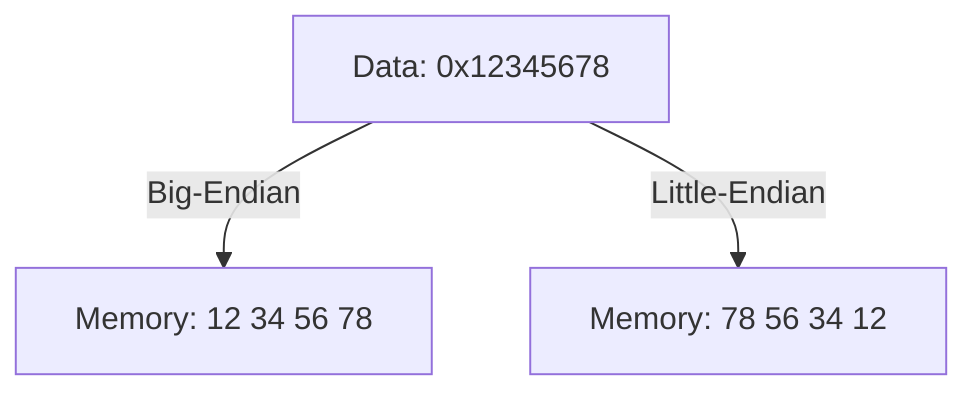
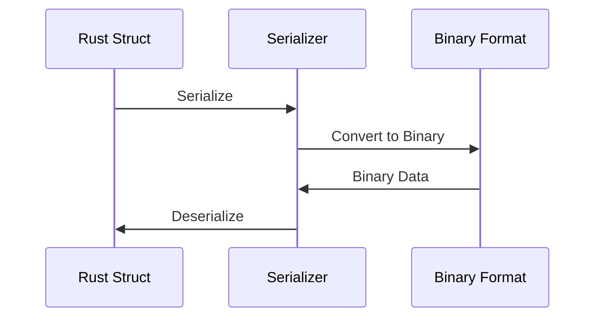

## 12.11. Handling Binary Data and Serialization

In the world of systems programming, handling binary data and serialization is a fundamental skill. Rust, with its focus on safety and performance, provides powerful tools and libraries to work with binary data efficiently. In this section, we'll explore the representation of binary data, discuss endianness and alignment, and delve into serialization formats like BSON and MessagePack. We'll also highlight security considerations when dealing with untrusted data.

### Understanding Binary Data Representation

Binary data is the raw format in which computers store and process information. Unlike text data, which is human-readable, binary data is composed of bytes that represent various data types, such as integers, floating-point numbers, and more complex structures.

#### Key Concepts

- **Bits and Bytes**: The smallest unit of data in computing is a bit, which can be either 0 or 1. A byte consists of 8 bits and can represent 256 different values (0-255).
- **Data Types**: Different data types have different binary representations. For example, an `i32` integer in Rust is represented by 4 bytes.

### Endianness and Alignment

Endianness refers to the order in which bytes are arranged within larger data types. There are two main types of endianness:

- **Big-Endian**: The most significant byte (MSB) is stored at the smallest memory address.
- **Little-Endian**: The least significant byte (LSB) is stored at the smallest memory address.

#### Why Endianness Matters

Endianness is crucial when exchanging binary data between systems with different architectures. Misinterpreting the byte order can lead to incorrect data processing.

#### Alignment

Alignment refers to how data is arranged and accessed in memory. Proper alignment can improve performance by ensuring that data accesses are efficient. Misaligned data can lead to slower access times and potential errors.

### Working with the `byteorder` Crate

The [`byteorder`](https://crates.io/crates/byteorder) crate in Rust provides utilities for reading and writing numbers in both big-endian and little-endian byte order. This is particularly useful when dealing with binary data that needs to be portable across different systems.

#### Example: Reading and Writing with `byteorder`

Let's demonstrate how to use the `byteorder` crate to read and write integers in different byte orders.

```rust
use byteorder::{BigEndian, LittleEndian, ReadBytesExt, WriteBytesExt};
use std::io::Cursor;

fn main() {
    let mut buf = vec![];

    // Write a 32-bit integer in big-endian order
    buf.write_u32::<BigEndian>(0x12345678).unwrap();

    // Write a 32-bit integer in little-endian order
    buf.write_u32::<LittleEndian>(0x12345678).unwrap();

    // Read the integers back
    let mut rdr = Cursor::new(buf);
    let big_endian_value = rdr.read_u32::<BigEndian>().unwrap();
    let little_endian_value = rdr.read_u32::<LittleEndian>().unwrap();

    println!("Big-endian: 0x{:08x}", big_endian_value);
    println!("Little-endian: 0x{:08x}", little_endian_value);
}
```

**Explanation**: In this example, we use `write_u32` and `read_u32` methods to handle 32-bit integers in both big-endian and little-endian formats. The `Cursor` type allows us to treat a vector as a byte stream.

### Serialization Formats: BSON and MessagePack

Serialization is the process of converting data structures into a format that can be easily stored or transmitted and later reconstructed. Rust supports several serialization formats, including BSON and MessagePack.

#### BSON

[BSON](https://bsonspec.org/) (Binary JSON) is a binary representation of JSON-like documents. It is used primarily in MongoDB and supports rich data types.

#### MessagePack

[MessagePack](https://crates.io/crates/rmp) is an efficient binary serialization format that is more compact than JSON. It is suitable for applications where performance and bandwidth are critical.

#### Example: Serializing with MessagePack

Let's see how to serialize and deserialize data using the `rmp` crate for MessagePack.

```rust
use rmp_serde::{Deserializer, Serializer};
use serde::{Deserialize, Serialize};
use std::io::Cursor;

#[derive(Debug, Serialize, Deserialize)]
struct Point {
    x: i32,
    y: i32,
}

fn main() {
    let point = Point { x: 10, y: 20 };

    // Serialize the point to MessagePack
    let mut buf = Vec::new();
    point.serialize(&mut Serializer::new(&mut buf)).unwrap();

    // Deserialize the point from MessagePack
    let mut de = Deserializer::new(Cursor::new(&buf));
    let deserialized_point: Point = Deserialize::deserialize(&mut de).unwrap();

    println!("Deserialized Point: {:?}", deserialized_point);
}
```

**Explanation**: In this example, we define a `Point` struct and use the `rmp_serde` crate to serialize it into MessagePack format and then deserialize it back into a Rust struct.

### Security Considerations with Untrusted Data

When handling binary data, especially from untrusted sources, it's crucial to consider security implications. Here are some best practices:

- **Validate Input**: Always validate and sanitize input data to prevent buffer overflows and other vulnerabilities.
- **Use Safe Libraries**: Prefer using well-tested libraries for parsing and serialization to avoid common pitfalls.
- **Handle Errors Gracefully**: Implement robust error handling to manage unexpected data formats or corrupted data.

### Visualizing Endianness and Serialization

To better understand the concepts of endianness and serialization, let's visualize the process using Mermaid.js diagrams.

#### Endianness Visualization



**Description**: This diagram illustrates how the same data is stored differently in memory depending on the endianness.

#### Serialization Workflow



**Description**: This sequence diagram shows the process of serializing a Rust struct into a binary format and then deserializing it back.

### Try It Yourself

To deepen your understanding, try modifying the code examples:

- Change the data types and observe how the byte order affects the output.
- Experiment with different serialization formats and compare their efficiency.
- Implement error handling for corrupted or unexpected data.

### Key Takeaways

- Binary data representation is fundamental in systems programming.
- Endianness and alignment are critical for cross-platform data exchange.
- The `byteorder` crate simplifies handling different byte orders in Rust.
- Serialization formats like BSON and MessagePack offer efficient data storage and transmission.
- Security is paramount when dealing with untrusted binary data.

### Further Reading

- [Rust Documentation](https://doc.rust-lang.org/)
- [Byteorder Crate Documentation](https://docs.rs/byteorder/)
- [MessagePack Specification](https://msgpack.org/index.html)

## Quiz Time!



### What is the smallest unit of data in computing?

- [x] Bit
- [ ] Byte
- [ ] Kilobyte
- [ ] Megabyte

> **Explanation:** A bit is the smallest unit of data, representing a binary value of 0 or 1.

### What does endianness refer to?

- [x] The order of bytes in a data type
- [ ] The size of a data type
- [ ] The alignment of data in memory
- [ ] The speed of data processing

> **Explanation:** Endianness refers to the order in which bytes are arranged within larger data types.

### Which crate is used for handling byte order in Rust?

- [x] byteorder
- [ ] serde
- [ ] rmp
- [ ] bson

> **Explanation:** The `byteorder` crate provides utilities for reading and writing numbers in different byte orders.

### What is BSON primarily used for?

- [x] A binary representation of JSON-like documents
- [ ] A text-based serialization format
- [ ] A compression algorithm
- [ ] A database management system

> **Explanation:** BSON is a binary representation of JSON-like documents, used primarily in MongoDB.

### Which serialization format is more compact than JSON?

- [x] MessagePack
- [ ] XML
- [ ] YAML
- [ ] CSV

> **Explanation:** MessagePack is an efficient binary serialization format that is more compact than JSON.

### What should you do when handling untrusted binary data?

- [x] Validate and sanitize input
- [ ] Ignore errors
- [ ] Use unsafe code
- [ ] Assume data is safe

> **Explanation:** Always validate and sanitize input data to prevent vulnerabilities.

### What is the purpose of the `rmp_serde` crate?

- [x] To serialize and deserialize data using MessagePack
- [ ] To handle byte order
- [ ] To manage memory allocation
- [ ] To perform cryptographic operations

> **Explanation:** The `rmp_serde` crate is used for serializing and deserializing data using the MessagePack format.

### Which of the following is a key consideration when dealing with binary data?

- [x] Security
- [ ] Color
- [ ] Font size
- [ ] Screen resolution

> **Explanation:** Security is a key consideration when handling binary data, especially from untrusted sources.

### What is the role of the `Cursor` type in Rust?

- [x] To treat a vector as a byte stream
- [ ] To manage database connections
- [ ] To handle user input
- [ ] To perform mathematical calculations

> **Explanation:** The `Cursor` type allows a vector to be treated as a byte stream for reading and writing.

### True or False: Endianness affects how data is stored in memory.

- [x] True
- [ ] False

> **Explanation:** Endianness affects the byte order in which data is stored in memory.



Remember, this is just the beginning. As you progress, you'll build more complex and interactive applications. Keep experimenting, stay curious, and enjoy the journey!
