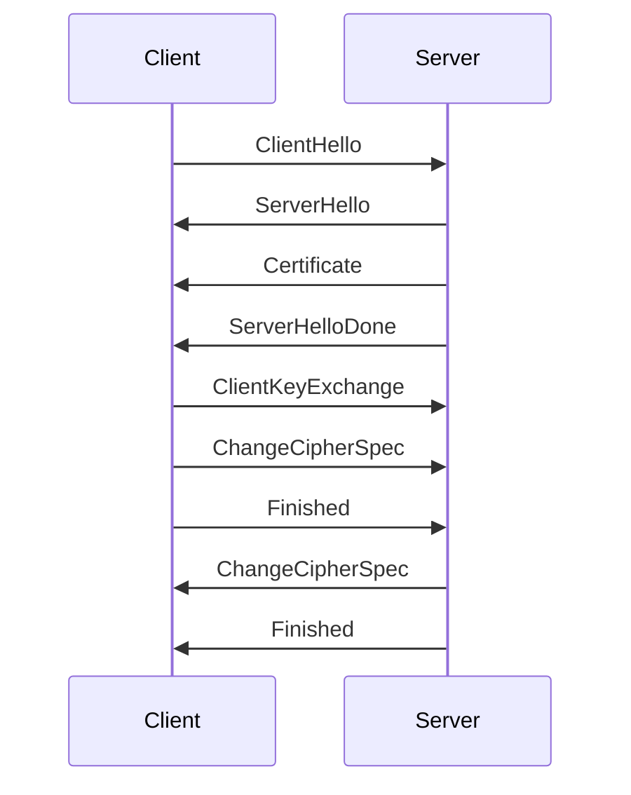

## 12.12. Network Security and TLS

In today's digital landscape, securing network communications is paramount. Transport Layer Security (TLS) is a widely adopted protocol that ensures privacy and data integrity between two communicating applications. In Rust, libraries such as `rustls` and `native-tls` provide robust tools for implementing TLS in your applications. This section will guide you through the essentials of network security using TLS, focusing on encryption, authentication, certificate management, and best practices for secure configurations. We'll also explore handling TLS in asynchronous contexts, a crucial aspect for modern network applications.

### Understanding TLS: Encryption and Authentication

TLS is a cryptographic protocol designed to provide secure communication over a computer network. It achieves this through two primary mechanisms: encryption and authentication.

- **Encryption** ensures that the data transmitted between the client and server is unreadable to any third party. This is achieved through symmetric encryption algorithms, which use a shared secret key to encrypt and decrypt data.
- **Authentication** verifies the identities of the communicating parties. This is typically done using digital certificates issued by trusted Certificate Authorities (CAs). Authentication prevents man-in-the-middle attacks by ensuring that the server you are communicating with is indeed the server you intend to communicate with.

### Implementing TLS in Rust with `rustls`

`rustls` is a modern TLS library written in Rust. It is designed to be secure, fast, and easy to use. Unlike some other TLS libraries, `rustls` does not rely on OpenSSL, which makes it a great choice for Rust applications due to its safety and performance characteristics.

#### Setting Up `rustls`

To get started with `rustls`, add the following dependencies to your `Cargo.toml` file:

```toml
[dependencies]
rustls = "0.20"
tokio = { version = "1", features = ["full"] }
tokio-rustls = "0.23"
```

Here's a simple example of a TLS client using `rustls`:

```rust
use tokio::net::TcpStream;
use tokio_rustls::TlsConnector;
use rustls::ClientConfig;
use std::sync::Arc;
use webpki::DNSNameRef;

#[tokio::main]
async fn main() -> Result<(), Box<dyn std::error::Error>> {
    // Load the root certificates
    let mut root_cert_store = rustls::RootCertStore::empty();
    root_cert_store.add_server_trust_anchors(&webpki_roots::TLS_SERVER_ROOTS);

    // Configure the client
    let config = ClientConfig::builder()
        .with_safe_defaults()
        .with_root_certificates(root_cert_store)
        .with_no_client_auth();

    let connector = TlsConnector::from(Arc::new(config));
    let domain = DNSNameRef::try_from_ascii_str("example.com").unwrap();

    // Connect to the server
    let stream = TcpStream::connect("example.com:443").await?;
    let tls_stream = connector.connect(domain, stream).await?;

    println!("Connected to the server with TLS");

    Ok(())
}
```

**Explanation:**

- **Root Certificates**: We load root certificates to verify the server's certificate.
- **Client Configuration**: We create a `ClientConfig` with safe defaults and root certificates.
- **TLS Connection**: We establish a TLS connection using `TlsConnector`.

### Certificate Management and Validation

Certificates are a cornerstone of TLS, providing a way to authenticate the server's identity. Proper certificate management and validation are crucial for maintaining secure communications.

#### Managing Certificates

Certificates can be managed using various tools and libraries. In Rust, you can use the `rustls` library to handle certificates efficiently. Here are some key points to consider:

- **Certificate Chains**: Ensure that your server's certificate chain is complete and correctly ordered.
- **Certificate Revocation**: Implement mechanisms to check for certificate revocation, such as Online Certificate Status Protocol (OCSP) or Certificate Revocation Lists (CRLs).
- **Certificate Renewal**: Regularly renew certificates before they expire to maintain uninterrupted service.

#### Validating Certificates

Certificate validation involves checking the certificate's authenticity and integrity. This includes verifying the certificate's signature, expiration date, and domain name. In `rustls`, this is handled automatically when you configure the client with root certificates.

### Best Practices for Secure TLS Configurations

To ensure the security of your TLS implementation, follow these best practices:

- **Use Strong Cipher Suites**: Configure your TLS settings to use strong, modern cipher suites. Avoid outdated algorithms like RC4 and MD5.
- **Enable Perfect Forward Secrecy (PFS)**: Use cipher suites that support PFS to ensure that session keys are not compromised even if the server's private key is compromised.
- **Regularly Update Libraries**: Keep your TLS libraries up to date to benefit from security patches and improvements.
- **Implement Certificate Pinning**: Consider implementing certificate pinning to prevent man-in-the-middle attacks by verifying the server's certificate against a known, trusted certificate.

### Handling TLS in Asynchronous Contexts

In modern applications, handling network operations asynchronously is essential for performance and scalability. Rust's asynchronous ecosystem, powered by `tokio`, provides excellent support for asynchronous I/O, including TLS.

#### Asynchronous TLS with `tokio-rustls`

`tokio-rustls` is a crate that integrates `rustls` with `tokio`, allowing you to perform asynchronous TLS operations. The example provided earlier demonstrates how to use `tokio-rustls` to establish a TLS connection asynchronously.

### Implementing TLS with `native-tls`

`native-tls` is another popular crate for handling TLS in Rust. It provides a platform-native TLS implementation, which means it uses the operating system's TLS library (such as SChannel on Windows, Secure Transport on macOS, and OpenSSL on Linux).

#### Setting Up `native-tls`

To use `native-tls`, add the following dependency to your `Cargo.toml` file:

```toml
[dependencies]
native-tls = "0.2"
tokio = { version = "1", features = ["full"] }
tokio-native-tls = "0.3"
```

Here's an example of a TLS client using `native-tls`:

```rust
use tokio::net::TcpStream;
use tokio_native_tls::TlsConnector;
use native_tls::TlsConnector as NativeTlsConnector;

#[tokio::main]
async fn main() -> Result<(), Box<dyn std::error::Error>> {
    // Create a native TLS connector
    let connector = NativeTlsConnector::builder().build()?;
    let connector = TlsConnector::from(connector);

    // Connect to the server
    let stream = TcpStream::connect("example.com:443").await?;
    let tls_stream = connector.connect("example.com", stream).await?;

    println!("Connected to the server with TLS");

    Ok(())
}
```

**Explanation:**

- **Platform-Native TLS**: `native-tls` uses the platform's native TLS library, providing seamless integration with the operating system's security features.
- **Asynchronous Connection**: `tokio-native-tls` allows you to perform asynchronous TLS operations using `tokio`.

### Choosing Between `rustls` and `native-tls`

When deciding between `rustls` and `native-tls`, consider the following factors:

- **Security**: `rustls` is designed with security in mind and does not rely on external libraries like OpenSSL. It is a great choice if you want a pure Rust solution.
- **Compatibility**: `native-tls` provides better compatibility with platform-specific features and may be easier to use if you need to integrate with existing systems that rely on the platform's TLS library.
- **Performance**: Both libraries offer excellent performance, but `rustls` may have an edge due to its focus on safety and efficiency.

### Visualizing TLS Handshake Process

To better understand how TLS works, let's visualize the TLS handshake process using a sequence diagram:



**Description**: This diagram illustrates the TLS handshake process, where the client and server exchange messages to establish a secure connection. The process involves negotiating cipher suites, exchanging certificates, and generating session keys.

### Try It Yourself

To deepen your understanding of TLS in Rust, try modifying the provided examples:

- **Experiment with Different Cipher Suites**: Modify the `rustls` configuration to use different cipher suites and observe the impact on security and performance.
- **Implement Certificate Pinning**: Add certificate pinning to the `rustls` example and test it with a known, trusted certificate.
- **Handle Asynchronous TLS Operations**: Extend the examples to handle multiple concurrent TLS connections using `tokio`.

### References and Further Reading

- [rustls crate documentation](https://docs.rs/rustls/)
- [native-tls crate documentation](https://docs.rs/native-tls/)
- [TLS 1.3 RFC](https://tools.ietf.org/html/rfc8446)
- [Web PKI and Certificate Authorities](https://letsencrypt.org/docs/integration-guide/)

### Key Takeaways

- TLS is essential for securing network communications, providing encryption and authentication.
- `rustls` and `native-tls` are powerful libraries for implementing TLS in Rust applications.
- Proper certificate management and validation are crucial for maintaining secure communications.
- Follow best practices for secure TLS configurations, such as using strong cipher suites and enabling PFS.
- Asynchronous TLS operations are supported in Rust through libraries like `tokio-rustls` and `tokio-native-tls`.

## Quiz Time!



### What is the primary purpose of TLS in network communications?

- [x] To provide encryption and authentication
- [ ] To increase network speed
- [ ] To compress data
- [ ] To manage network traffic

> **Explanation:** TLS is designed to provide encryption and authentication, ensuring secure communication between clients and servers.


### Which Rust library is a pure Rust implementation of TLS?

- [x] rustls
- [ ] native-tls
- [ ] openssl
- [ ] tokio-tls

> **Explanation:** `rustls` is a pure Rust implementation of TLS, designed for security and performance.


### What is the role of digital certificates in TLS?

- [x] To authenticate the identity of the server
- [ ] To encrypt data
- [ ] To compress data
- [ ] To manage network traffic

> **Explanation:** Digital certificates are used in TLS to authenticate the identity of the server, preventing man-in-the-middle attacks.


### Which crate integrates `rustls` with `tokio` for asynchronous TLS operations?

- [x] tokio-rustls
- [ ] tokio-native-tls
- [ ] async-tls
- [ ] hyper-tls

> **Explanation:** `tokio-rustls` integrates `rustls` with `tokio`, allowing for asynchronous TLS operations.


### What is a key advantage of using `native-tls`?

- [x] It uses the platform's native TLS library
- [ ] It is faster than `rustls`
- [ ] It is written in pure Rust
- [ ] It has more features than `rustls`

> **Explanation:** `native-tls` uses the platform's native TLS library, providing better compatibility with platform-specific features.


### What is Perfect Forward Secrecy (PFS)?

- [x] A feature that ensures session keys are not compromised even if the server's private key is compromised
- [ ] A method to compress data
- [ ] A way to increase network speed
- [ ] A type of digital certificate

> **Explanation:** Perfect Forward Secrecy (PFS) ensures that session keys are not compromised even if the server's private key is compromised.


### Which of the following is a best practice for secure TLS configurations?

- [x] Use strong cipher suites
- [ ] Use outdated algorithms like RC4
- [ ] Disable certificate validation
- [ ] Use weak passwords

> **Explanation:** Using strong cipher suites is a best practice for secure TLS configurations.


### What is the purpose of certificate pinning?

- [x] To prevent man-in-the-middle attacks by verifying the server's certificate against a known, trusted certificate
- [ ] To compress data
- [ ] To increase network speed
- [ ] To manage network traffic

> **Explanation:** Certificate pinning prevents man-in-the-middle attacks by verifying the server's certificate against a known, trusted certificate.


### Which crate provides platform-native TLS implementation in Rust?

- [x] native-tls
- [ ] rustls
- [ ] openssl
- [ ] tokio-tls

> **Explanation:** `native-tls` provides a platform-native TLS implementation, using the operating system's TLS library.


### True or False: Asynchronous TLS operations are not supported in Rust.

- [ ] True
- [x] False

> **Explanation:** Asynchronous TLS operations are supported in Rust through libraries like `tokio-rustls` and `tokio-native-tls`.



Remember, mastering network security and TLS in Rust is a journey. Keep experimenting, stay curious, and enjoy the process of building secure applications!
