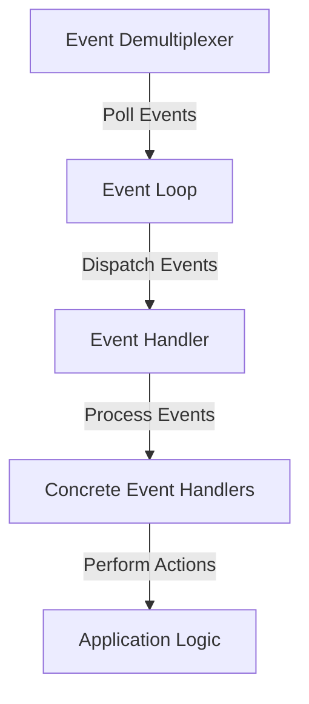

## 12.13. The Asynchronous Reactor Pattern

In the world of systems programming, efficiently handling I/O events is crucial for building high-performance applications. The Asynchronous Reactor Pattern is a design pattern that provides a robust framework for managing I/O operations in an event-driven manner. In this section, we will explore the Reactor pattern, its components, and how it is implemented in Rust using the Tokio library. We will also delve into event-driven I/O operations, integration with OS-level event polling, and the benefits of using this pattern in high-load scenarios.

### Understanding the Reactor Pattern

The Reactor pattern is a design pattern used to handle service requests delivered concurrently to an application by one or more clients. The pattern provides a mechanism to demultiplex and dispatch service requests that are delivered to an application from one or more clients. It is particularly useful in scenarios where multiple I/O operations need to be handled simultaneously without blocking the main execution thread.

#### Key Components of the Reactor Pattern

1. **Event Demultiplexer**: This component waits for events to occur on a set of event sources and then notifies the application when an event occurs. In Rust, this is often implemented using OS-level event polling mechanisms like `epoll` on Linux or `kqueue` on BSD systems.

2. **Event Handler**: This is the component that processes the events. Each type of event has a corresponding event handler that performs the necessary actions when an event is triggered.

3. **Synchronous Event De-multiplexer**: This component is responsible for blocking and waiting for events to occur. It is typically implemented using system calls like `select`, `poll`, or `epoll`.

4. **Concrete Event Handlers**: These are specific implementations of event handlers that perform the actual work required when an event occurs.

5. **Initiation Dispatcher**: This component manages the registration of event handlers and the dispatching of events to the appropriate handlers.

### How Tokio Uses the Reactor Pattern

Tokio is a popular asynchronous runtime for Rust that leverages the Reactor pattern to handle I/O events efficiently. Tokio provides a multi-threaded, work-stealing scheduler that allows tasks to be executed concurrently. It uses the Reactor pattern to manage I/O events, ensuring that tasks are executed only when their associated I/O operations are ready.

#### Tokio's Reactor Implementation

Tokio's reactor is built on top of the `mio` library, which provides a cross-platform abstraction over OS-level event polling mechanisms. Here's how Tokio implements the Reactor pattern:

- **Event Loop**: Tokio's event loop is responsible for polling I/O events and dispatching them to the appropriate tasks. It uses `mio` to interface with the OS's event polling system.

- **Task Management**: Tokio manages tasks using a work-stealing scheduler. Tasks are lightweight, non-blocking units of work that can be executed concurrently.

- **Resource Management**: Tokio provides abstractions for managing resources like sockets and timers. These resources are integrated with the event loop, allowing them to be polled for readiness.

#### Code Example: Basic Tokio Reactor

Let's look at a simple example of using Tokio to handle asynchronous I/O operations:

```rust
use tokio::net::TcpListener;
use tokio::prelude::*;

#[tokio::main]
async fn main() -> Result<(), Box<dyn std::error::Error>> {
    // Bind a TCP listener to the address
    let listener = TcpListener::bind("127.0.0.1:8080").await?;

    loop {
        // Accept an incoming connection
        let (mut socket, _) = listener.accept().await?;

        // Spawn a new task to handle the connection
        tokio::spawn(async move {
            let mut buf = [0; 1024];

            // Read data from the socket
            match socket.read(&mut buf).await {
                Ok(n) if n == 0 => return, // Connection closed
                Ok(n) => {
                    // Write the data back to the socket
                    if let Err(e) = socket.write_all(&buf[0..n]).await {
                        eprintln!("failed to write to socket; err = {:?}", e);
                    }
                }
                Err(e) => {
                    eprintln!("failed to read from socket; err = {:?}", e);
                }
            }
        });
    }
}
```

In this example, we use Tokio's `TcpListener` to accept incoming TCP connections. For each connection, we spawn a new task to handle the I/O operations asynchronously. The `read` and `write_all` operations are non-blocking, allowing the event loop to continue processing other tasks.

### Event-Driven I/O Operations

Event-driven I/O operations are at the heart of the Reactor pattern. By using non-blocking I/O, applications can handle multiple connections simultaneously without being blocked by slow or unresponsive clients.

#### Benefits of Event-Driven I/O

- **Scalability**: Event-driven I/O allows applications to handle thousands of connections simultaneously, making it ideal for high-load scenarios.

- **Responsiveness**: By avoiding blocking operations, event-driven I/O ensures that applications remain responsive even under heavy load.

- **Resource Efficiency**: Non-blocking I/O operations consume fewer resources compared to traditional blocking I/O, allowing applications to scale efficiently.

### Integrating with OS-Level Event Polling

The Reactor pattern relies heavily on OS-level event polling mechanisms to monitor multiple I/O sources simultaneously. In Rust, this is typically achieved using the `mio` library, which provides a cross-platform abstraction over these mechanisms.

#### OS-Level Event Polling Mechanisms

- **`epoll` (Linux)**: A scalable I/O event notification system that allows applications to monitor multiple file descriptors for readiness.

- **`kqueue` (BSD)**: A scalable event notification interface that provides efficient I/O event monitoring.

- **`IOCP` (Windows)**: An asynchronous I/O completion port system that allows applications to handle multiple I/O operations concurrently.

### Benefits in High-Load Scenarios

The Asynchronous Reactor Pattern is particularly beneficial in high-load scenarios where applications need to handle a large number of concurrent connections. By leveraging non-blocking I/O and event-driven architecture, applications can achieve high throughput and low latency.

#### Key Benefits

- **High Throughput**: The Reactor pattern allows applications to process a large number of requests simultaneously, maximizing throughput.

- **Low Latency**: By avoiding blocking operations, the Reactor pattern ensures that applications can respond to requests quickly, minimizing latency.

- **Efficient Resource Utilization**: Non-blocking I/O operations consume fewer resources, allowing applications to scale efficiently without requiring additional hardware.

### Visualizing the Reactor Pattern

To better understand the flow of the Reactor pattern, let's visualize the components and their interactions using a Mermaid.js diagram:



**Diagram Description**: This diagram illustrates the flow of the Reactor pattern, where the Event Demultiplexer polls for events, the Event Loop dispatches them to the Event Handler, and the Concrete Event Handlers perform the necessary actions.

### Try It Yourself

To gain a deeper understanding of the Reactor pattern, try modifying the code example provided above. Experiment with different I/O operations, such as handling HTTP requests or integrating with a database. Observe how the non-blocking nature of the Reactor pattern allows your application to handle multiple connections simultaneously.

### Knowledge Check

- What are the key components of the Reactor pattern?
- How does Tokio implement the Reactor pattern in Rust?
- What are the benefits of using event-driven I/O operations?
- How does the Reactor pattern integrate with OS-level event polling mechanisms?
- Why is the Reactor pattern beneficial in high-load scenarios?

### Embrace the Journey

Remember, mastering the Asynchronous Reactor Pattern is just the beginning. As you continue to explore Rust's capabilities, you'll discover even more powerful techniques for building high-performance applications. Keep experimenting, stay curious, and enjoy the journey!

## Quiz Time!



### What is the primary role of the Event Demultiplexer in the Reactor pattern?

- [x] To wait for events and notify the application when they occur
- [ ] To process events directly
- [ ] To manage task scheduling
- [ ] To handle network connections

> **Explanation:** The Event Demultiplexer is responsible for waiting for events to occur and notifying the application when they do.

### Which Rust library provides a cross-platform abstraction over OS-level event polling mechanisms?

- [x] mio
- [ ] hyper
- [ ] serde
- [ ] rayon

> **Explanation:** The `mio` library provides a cross-platform abstraction over OS-level event polling mechanisms.

### How does Tokio manage tasks in its Reactor implementation?

- [x] Using a work-stealing scheduler
- [ ] Using a single-threaded event loop
- [ ] Using blocking I/O operations
- [ ] Using a fixed thread pool

> **Explanation:** Tokio uses a work-stealing scheduler to manage tasks in its Reactor implementation.

### What is a key benefit of using non-blocking I/O operations?

- [x] Scalability
- [ ] Increased memory usage
- [ ] Reduced code complexity
- [ ] Simplified error handling

> **Explanation:** Non-blocking I/O operations allow applications to handle multiple connections simultaneously, improving scalability.

### Which OS-level event polling mechanism is used on Linux systems?

- [x] epoll
- [ ] kqueue
- [ ] IOCP
- [ ] select

> **Explanation:** `epoll` is the OS-level event polling mechanism used on Linux systems.

### What is the main advantage of using the Reactor pattern in high-load scenarios?

- [x] High throughput and low latency
- [ ] Simplified code structure
- [ ] Reduced development time
- [ ] Improved error handling

> **Explanation:** The Reactor pattern provides high throughput and low latency, making it ideal for high-load scenarios.

### Which component of the Reactor pattern is responsible for processing events?

- [x] Event Handler
- [ ] Event Demultiplexer
- [ ] Initiation Dispatcher
- [ ] Concrete Event Handlers

> **Explanation:** The Event Handler is responsible for processing events in the Reactor pattern.

### How does the Reactor pattern ensure efficient resource utilization?

- [x] By using non-blocking I/O operations
- [ ] By using a single-threaded model
- [ ] By reducing the number of event handlers
- [ ] By simplifying the application logic

> **Explanation:** The Reactor pattern uses non-blocking I/O operations, which consume fewer resources and allow efficient scaling.

### What is the role of Concrete Event Handlers in the Reactor pattern?

- [x] To perform the actual work required when an event occurs
- [ ] To manage task scheduling
- [ ] To wait for events to occur
- [ ] To handle network connections

> **Explanation:** Concrete Event Handlers perform the actual work required when an event occurs.

### True or False: The Reactor pattern is only beneficial for network programming.

- [ ] True
- [x] False

> **Explanation:** While the Reactor pattern is commonly used in network programming, it can be applied to any scenario requiring efficient I/O event handling.


