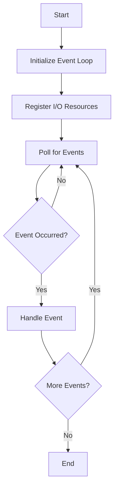

## 12.14. Non-Blocking I/O Patterns

In the world of systems programming, efficient I/O operations are crucial for building responsive applications. Rust, with its focus on safety and concurrency, provides powerful tools for implementing non-blocking I/O patterns. In this section, we'll explore the differences between blocking and non-blocking I/O, how to implement non-blocking operations in Rust using the `mio` and `tokio` crates, and how to handle readiness and partial operations. We'll also discuss integrating these patterns with event loops to create efficient, scalable applications.

### Understanding Blocking vs. Non-Blocking I/O

Before diving into non-blocking I/O, it's essential to understand the distinction between blocking and non-blocking I/O operations.

**Blocking I/O**: In blocking I/O, a thread is halted until the I/O operation completes. This can lead to inefficiencies, especially in applications that require high concurrency or responsiveness, as threads spend time waiting for I/O operations to finish.

**Non-Blocking I/O**: Non-blocking I/O allows a thread to initiate an I/O operation and continue executing other tasks while waiting for the operation to complete. This approach can significantly improve application responsiveness and resource utilization by allowing multiple I/O operations to be handled concurrently.

### Implementing Non-Blocking I/O in Rust

Rust provides several tools and libraries to implement non-blocking I/O, with `mio` and `tokio` being two of the most prominent. Let's explore how to use these libraries to create non-blocking I/O operations.

#### Using the `mio` Crate

`mio` (Metal IO) is a low-level library for non-blocking I/O in Rust. It provides a platform-independent interface for handling I/O events, making it a great choice for building event-driven applications.

**Key Concepts in `mio`**:
- **Event Loop**: The core of `mio` is the event loop, which listens for I/O events and dispatches them to the appropriate handlers.
- **Poll**: A structure that monitors file descriptors for readiness events.
- **Token**: A unique identifier for each I/O source, used to track events.

**Example: Basic Non-Blocking TCP Server with `mio`**

```rust
use mio::{Events, Interest, Poll, Token};
use mio::net::TcpListener;
use std::io;

const SERVER: Token = Token(0);

fn main() -> io::Result<()> {
    // Create a poll instance
    let mut poll = Poll::new()?;
    // Create storage for events
    let mut events = Events::with_capacity(128);

    // Bind a TCP listener to an address
    let addr = "127.0.0.1:8080".parse().unwrap();
    let mut server = TcpListener::bind(addr)?;

    // Register the server with the poll instance
    poll.registry().register(&mut server, SERVER, Interest::READABLE)?;

    loop {
        // Poll for events
        poll.poll(&mut events, None)?;

        for event in events.iter() {
            match event.token() {
                SERVER => {
                    // Accept a new connection
                    let (mut connection, _address) = server.accept()?;
                    println!("Accepted a new connection");
                    // Handle the connection
                    handle_connection(&mut connection)?;
                }
                _ => unreachable!(),
            }
        }
    }
}

fn handle_connection(connection: &mut mio::net::TcpStream) -> io::Result<()> {
    // Handle the connection
    Ok(())
}
```

In this example, we create a basic TCP server using `mio`. The server listens for incoming connections and handles them in a non-blocking manner. The `Poll` instance is used to monitor the server socket for readiness events, and the `Token` is used to identify the server socket.

#### Using the `tokio` Crate

`tokio` is a high-level asynchronous runtime for Rust, built on top of `mio`. It provides a more ergonomic API for working with non-blocking I/O, making it easier to build complex asynchronous applications.

**Key Concepts in `tokio`**:
- **Async/Await**: `tokio` leverages Rust's async/await syntax to provide a more intuitive way to write asynchronous code.
- **Tasks**: Units of work that can be executed concurrently.
- **Runtime**: The core of `tokio`, responsible for executing tasks and managing I/O resources.

**Example: Basic Non-Blocking TCP Server with `tokio`**

```rust
use tokio::net::TcpListener;
use tokio::prelude::*;

#[tokio::main]
async fn main() -> Result<(), Box<dyn std::error::Error>> {
    // Bind a TCP listener to an address
    let addr = "127.0.0.1:8080".parse().unwrap();
    let mut listener = TcpListener::bind(addr).await?;

    loop {
        // Accept a new connection
        let (mut socket, _addr) = listener.accept().await?;
        println!("Accepted a new connection");

        // Spawn a new task to handle the connection
        tokio::spawn(async move {
            let mut buf = [0; 1024];

            // Read data from the socket
            match socket.read(&mut buf).await {
                Ok(n) if n == 0 => return, // Connection closed
                Ok(n) => {
                    // Write the data back to the socket
                    if let Err(e) = socket.write_all(&buf[0..n]).await {
                        eprintln!("Failed to write to socket; err = {:?}", e);
                    }
                }
                Err(e) => {
                    eprintln!("Failed to read from socket; err = {:?}", e);
                }
            }
        });
    }
}
```

In this example, we create a non-blocking TCP server using `tokio`. The server listens for incoming connections and spawns a new task for each connection. The async/await syntax makes it easy to write asynchronous code that is both readable and efficient.

### Handling Readiness and Partial Operations

In non-blocking I/O, it's crucial to handle readiness and partial operations effectively. Readiness refers to the state of an I/O resource being ready for reading or writing, while partial operations occur when an I/O operation completes only partially.

**Handling Readiness**: Use the event loop to monitor I/O resources for readiness events. When a resource is ready, perform the I/O operation.

**Handling Partial Operations**: Be prepared to handle cases where an I/O operation completes only partially. For example, when reading from a socket, you may receive only part of the data. In such cases, continue the operation until it completes.

### Integrating with Event Loops

Event loops are at the heart of non-blocking I/O patterns. They allow you to efficiently manage multiple I/O resources and handle events as they occur.

**Integration with `mio`**: Use the `Poll` structure to create an event loop that monitors I/O resources for readiness events. Dispatch events to the appropriate handlers based on the `Token`.

**Integration with `tokio`**: `tokio` provides a built-in event loop as part of its runtime. Use the async/await syntax to write asynchronous code that integrates seamlessly with the event loop.

### Visualizing Non-Blocking I/O with Event Loops

To better understand how non-blocking I/O works with event loops, let's visualize the process using a flowchart.



**Description**: This flowchart illustrates the process of handling non-blocking I/O with an event loop. The event loop initializes, registers I/O resources, and polls for events. When an event occurs, it is handled, and the loop continues until no more events are present.

### Try It Yourself

Experiment with the code examples provided in this section. Try modifying the server to handle multiple connections concurrently or implement additional features such as logging or error handling. By experimenting with the code, you'll gain a deeper understanding of non-blocking I/O patterns in Rust.

### External Resources

For further reading and exploration, consider the following resources:
- [mio Crate Documentation](https://crates.io/crates/mio)
- [Tokio Documentation](https://tokio.rs/)
- [Rust Async Book](https://rust-lang.github.io/async-book/)

### Knowledge Check

- What is the difference between blocking and non-blocking I/O?
- How does the `mio` crate help in implementing non-blocking I/O in Rust?
- What are the key concepts of `tokio` for non-blocking I/O?
- How do you handle readiness and partial operations in non-blocking I/O?
- What role does the event loop play in non-blocking I/O patterns?

### Summary

In this section, we've explored non-blocking I/O patterns in Rust, focusing on the differences between blocking and non-blocking I/O, implementing non-blocking operations using `mio` and `tokio`, handling readiness and partial operations, and integrating with event loops. By leveraging these patterns, you can build responsive, efficient applications that make the most of Rust's concurrency features.

Remember, this is just the beginning. As you progress, you'll build more complex and interactive applications. Keep experimenting, stay curious, and enjoy the journey!

## Quiz Time!



### What is the primary advantage of non-blocking I/O over blocking I/O?

- [x] Improved application responsiveness
- [ ] Simplified code structure
- [ ] Reduced memory usage
- [ ] Increased CPU utilization

> **Explanation:** Non-blocking I/O allows a thread to continue executing other tasks while waiting for I/O operations to complete, improving application responsiveness.

### Which Rust crate provides a low-level interface for non-blocking I/O?

- [x] mio
- [ ] tokio
- [ ] async-std
- [ ] hyper

> **Explanation:** The `mio` crate provides a low-level interface for non-blocking I/O in Rust.

### What is the role of the `Poll` structure in `mio`?

- [x] It monitors file descriptors for readiness events.
- [ ] It manages asynchronous tasks.
- [ ] It provides a high-level API for networking.
- [ ] It handles error reporting.

> **Explanation:** The `Poll` structure in `mio` is used to monitor file descriptors for readiness events.

### How does `tokio` simplify writing asynchronous code in Rust?

- [x] By using the async/await syntax
- [ ] By providing a built-in HTTP server
- [ ] By offering a graphical user interface
- [ ] By integrating with the Rust compiler

> **Explanation:** `tokio` simplifies writing asynchronous code in Rust by leveraging the async/await syntax.

### What is a common challenge when handling partial operations in non-blocking I/O?

- [x] Ensuring the operation completes fully
- [ ] Managing memory allocation
- [ ] Handling user input
- [ ] Synchronizing threads

> **Explanation:** In non-blocking I/O, partial operations may occur, requiring additional logic to ensure the operation completes fully.

### What is the purpose of an event loop in non-blocking I/O patterns?

- [x] To efficiently manage multiple I/O resources and handle events
- [ ] To compile Rust code
- [ ] To manage memory allocation
- [ ] To provide a user interface

> **Explanation:** An event loop efficiently manages multiple I/O resources and handles events as they occur.

### Which crate provides a high-level asynchronous runtime for Rust?

- [x] tokio
- [ ] mio
- [ ] hyper
- [ ] serde

> **Explanation:** `tokio` provides a high-level asynchronous runtime for Rust.

### What is a `Token` used for in `mio`?

- [x] To uniquely identify each I/O source
- [ ] To manage memory allocation
- [ ] To handle error reporting
- [ ] To provide a user interface

> **Explanation:** A `Token` in `mio` is used to uniquely identify each I/O source.

### How can you handle readiness in non-blocking I/O?

- [x] By using an event loop to monitor I/O resources
- [ ] By blocking the thread until the resource is ready
- [ ] By using a graphical user interface
- [ ] By compiling the code

> **Explanation:** In non-blocking I/O, readiness is handled by using an event loop to monitor I/O resources.

### True or False: Non-blocking I/O patterns can improve application scalability.

- [x] True
- [ ] False

> **Explanation:** Non-blocking I/O patterns can improve application scalability by allowing multiple I/O operations to be handled concurrently.


