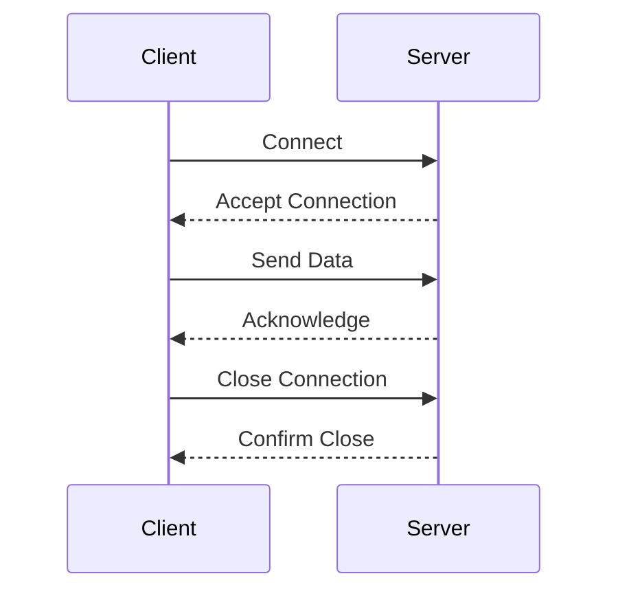

## 12.2. Network Programming Basics in Rust

Network programming is an essential skill for developers building applications that communicate over the internet or local networks. Rust, with its emphasis on safety and performance, provides powerful tools for network programming. In this section, we'll explore the basics of network programming in Rust, focusing on TCP and UDP communication, socket creation, data transmission, error handling, and the differences between synchronous and asynchronous approaches.

### Understanding TCP and UDP Communication

Before diving into Rust's implementation, it's crucial to understand the fundamental differences between TCP (Transmission Control Protocol) and UDP (User Datagram Protocol).

- **TCP** is a connection-oriented protocol that ensures reliable, ordered, and error-checked delivery of data between applications. It is suitable for applications where data integrity and order are critical, such as web servers and database connections.

- **UDP** is a connectionless protocol that allows for faster data transmission at the cost of reliability. It is ideal for applications where speed is more critical than reliability, such as video streaming or online gaming.

### Creating Sockets in Rust

Sockets are the endpoints for sending and receiving data over a network. Rust's standard library provides the `std::net` module, which includes the necessary types and functions for socket programming.

#### TCP Sockets

To create a TCP connection, you typically need a server that listens for incoming connections and a client that connects to the server.

**TCP Server Example:**

```rust
use std::net::{TcpListener, TcpStream};
use std::io::{Read, Write};
use std::thread;

fn handle_client(mut stream: TcpStream) {
    let mut buffer = [0; 512];
    while match stream.read(&mut buffer) {
        Ok(size) => {
            stream.write(&buffer[0..size]).unwrap();
            true
        }
        Err(_) => {
            println!("An error occurred, terminating connection with {}", stream.peer_addr().unwrap());
            false
        }
    } {}
}

fn main() {
    let listener = TcpListener::bind("127.0.0.1:7878").unwrap();
    println!("Server listening on port 7878");

    for stream in listener.incoming() {
        match stream {
            Ok(stream) => {
                thread::spawn(|| {
                    handle_client(stream);
                });
            }
            Err(e) => {
                println!("Error: {}", e);
            }
        }
    }
}
```

**Explanation:**

- We create a `TcpListener` bound to a local address and port.
- The server listens for incoming connections using the `incoming` method.
- For each connection, a new thread is spawned to handle the client, allowing the server to handle multiple clients concurrently.
- The `handle_client` function reads data from the client and echoes it back.

**TCP Client Example:**

```rust
use std::net::TcpStream;
use std::io::{self, Write, Read};

fn main() {
    match TcpStream::connect("127.0.0.1:7878") {
        Ok(mut stream) => {
            println!("Successfully connected to server");

            let msg = b"Hello from client!";
            stream.write(msg).unwrap();
            println!("Sent message: {:?}", msg);

            let mut buffer = [0; 512];
            match stream.read(&mut buffer) {
                Ok(size) => {
                    println!("Received reply: {:?}", &buffer[0..size]);
                }
                Err(e) => {
                    println!("Failed to receive data: {}", e);
                }
            }
        }
        Err(e) => {
            println!("Failed to connect: {}", e);
        }
    }
}
```

**Explanation:**

- The client connects to the server using `TcpStream::connect`.
- It sends a message to the server and waits for a reply.
- The server's response is read into a buffer and printed.

#### UDP Sockets

UDP communication involves sending and receiving datagrams without establishing a connection.

**UDP Server Example:**

```rust
use std::net::UdpSocket;

fn main() {
    let socket = UdpSocket::bind("127.0.0.1:34254").expect("Couldn't bind to address");
    let mut buf = [0; 512];

    loop {
        let (amt, src) = socket.recv_from(&mut buf).expect("Didn't receive data");
        println!("Received {} bytes from {}", amt, src);

        let buf = &mut buf[..amt];
        buf.reverse();
        socket.send_to(buf, &src).expect("Couldn't send data");
    }
}
```

**Explanation:**

- We bind a `UdpSocket` to a local address and port.
- The server listens for incoming datagrams using `recv_from`.
- It reverses the received data and sends it back to the sender.

**UDP Client Example:**

```rust
use std::net::UdpSocket;

fn main() {
    let socket = UdpSocket::bind("127.0.0.1:0").expect("Couldn't bind to address");
    socket.connect("127.0.0.1:34254").expect("Couldn't connect to server");

    let msg = b"Hello from UDP client!";
    socket.send(msg).expect("Couldn't send data");

    let mut buf = [0; 512];
    let (amt, _src) = socket.recv_from(&mut buf).expect("Didn't receive data");
    println!("Received {} bytes: {:?}", amt, &buf[..amt]);
}
```

**Explanation:**

- The client binds to a local address and connects to the server.
- It sends a datagram to the server and waits for a response.
- The server's response is printed.

### Data Transmission and Reception

Data transmission involves sending data from one socket to another, while reception involves reading data from a socket. In Rust, this is typically done using the `Read` and `Write` traits.

**Key Points:**

- **Blocking I/O**: By default, Rust's socket operations are blocking, meaning the program will wait until the operation completes.
- **Non-blocking I/O**: You can configure sockets to be non-blocking, allowing the program to continue executing while waiting for I/O operations to complete.

### Error Handling and Timeouts

Error handling is crucial in network programming due to the unpredictable nature of networks. Rust's `Result` and `Option` types are used extensively for error handling.

**Handling Errors:**

- Use `match` statements to handle different error cases.
- Use `unwrap` or `expect` for quick error handling during development, but replace them with proper error handling in production code.

**Setting Timeouts:**

You can set timeouts for socket operations to prevent the program from hanging indefinitely.

**Example: Setting a Read Timeout**

```rust
use std::net::TcpStream;
use std::time::Duration;

fn main() {
    let mut stream = TcpStream::connect("127.0.0.1:7878").unwrap();
    stream.set_read_timeout(Some(Duration::new(5, 0))).expect("set_read_timeout call failed");

    let mut buffer = [0; 512];
    match stream.read(&mut buffer) {
        Ok(size) => println!("Read {} bytes", size),
        Err(e) => println!("Failed to read from stream: {}", e),
    }
}
```

**Explanation:**

- We set a read timeout of 5 seconds using `set_read_timeout`.
- If the read operation takes longer than 5 seconds, it will return an error.

### Synchronous vs. Asynchronous Approaches

Rust supports both synchronous and asynchronous network programming. The choice between the two depends on the application's requirements.

#### Synchronous Programming

Synchronous programming is straightforward and easier to reason about, but it can lead to performance bottlenecks if not managed properly.

**Advantages:**

- Simplicity: Easier to write and understand.
- Predictability: Operations complete in the order they are called.

**Disadvantages:**

- Blocking: Can lead to performance issues if operations take a long time.

#### Asynchronous Programming

Asynchronous programming allows for non-blocking operations, improving performance and responsiveness.

**Advantages:**

- Non-blocking: Operations can run concurrently without waiting for each other.
- Scalability: Better suited for high-performance applications.

**Disadvantages:**

- Complexity: More challenging to write and understand.
- Requires an async runtime: Libraries like `tokio` or `async-std` are needed.

**Asynchronous Example with Tokio:**

```rust
use tokio::net::TcpListener;
use tokio::prelude::*;

#[tokio::main]
async fn main() {
    let listener = TcpListener::bind("127.0.0.1:7878").await.unwrap();
    println!("Server listening on port 7878");

    loop {
        let (mut socket, _) = listener.accept().await.unwrap();
        tokio::spawn(async move {
            let mut buf = [0; 1024];
            loop {
                match socket.read(&mut buf).await {
                    Ok(0) => return, // Connection closed
                    Ok(n) => {
                        if socket.write_all(&buf[0..n]).await.is_err() {
                            return; // Connection error
                        }
                    }
                    Err(_) => {
                        return; // Read error
                    }
                }
            }
        });
    }
}
```

**Explanation:**

- We use `tokio` for asynchronous I/O.
- The server listens for incoming connections and spawns a new task for each connection.
- The task reads data from the socket and echoes it back.

### Visualizing Network Communication

To better understand the flow of network communication, let's visualize the interaction between a client and a server using a sequence diagram.



**Diagram Explanation:**

- The client initiates a connection to the server.
- The server accepts the connection and acknowledges it.
- The client sends data, and the server acknowledges receipt.
- The client closes the connection, and the server confirms the closure.

### Try It Yourself

Experiment with the provided examples by modifying the server and client code. Try changing the message content, adjusting timeouts, or implementing additional error handling. This hands-on approach will deepen your understanding of network programming in Rust.

### References and Further Reading

- [Rust Standard Library Documentation](https://doc.rust-lang.org/std/net/index.html)
- [Tokio: Asynchronous Runtime for Rust](https://tokio.rs/)
- [Rust by Example: Network Programming](https://doc.rust-lang.org/rust-by-example/std_misc/net.html)

### Key Takeaways

- TCP and UDP are fundamental protocols for network communication, each with distinct characteristics.
- Rust's standard library provides robust support for socket programming.
- Error handling and timeouts are crucial for reliable network applications.
- Synchronous programming is simpler but can block, while asynchronous programming is more complex but offers better performance.

## Quiz Time!



### What is the primary difference between TCP and UDP?

- [x] TCP is connection-oriented, while UDP is connectionless.
- [ ] TCP is faster than UDP.
- [ ] UDP guarantees data delivery, while TCP does not.
- [ ] UDP is used for web servers, while TCP is used for video streaming.

> **Explanation:** TCP is connection-oriented and ensures reliable data delivery, while UDP is connectionless and does not guarantee delivery.

### Which Rust module provides types and functions for socket programming?

- [x] `std::net`
- [ ] `std::io`
- [ ] `std::sync`
- [ ] `std::thread`

> **Explanation:** The `std::net` module provides the necessary types and functions for socket programming in Rust.

### What is a key advantage of using asynchronous programming in Rust?

- [x] Non-blocking operations
- [ ] Simplicity
- [ ] Predictability
- [ ] Requires no additional libraries

> **Explanation:** Asynchronous programming allows for non-blocking operations, improving performance and scalability.

### How do you set a read timeout for a TCP stream in Rust?

- [x] Using `set_read_timeout`
- [ ] Using `set_timeout`
- [ ] Using `set_blocking`
- [ ] Using `set_nonblocking`

> **Explanation:** The `set_read_timeout` method is used to set a read timeout for a TCP stream in Rust.

### What is the purpose of the `unwrap` method in Rust?

- [x] To quickly handle errors by panicking if an error occurs
- [ ] To convert a `Result` to an `Option`
- [ ] To handle errors gracefully
- [ ] To ignore errors

> **Explanation:** The `unwrap` method is used to quickly handle errors by panicking if an error occurs, which is useful during development.

### Which library is commonly used for asynchronous programming in Rust?

- [x] `tokio`
- [ ] `serde`
- [ ] `rayon`
- [ ] `hyper`

> **Explanation:** `tokio` is a popular library for asynchronous programming in Rust, providing an async runtime and utilities.

### What does the `recv_from` method do in a UDP socket?

- [x] Receives data from a socket and returns the sender's address
- [ ] Sends data to a socket
- [ ] Connects to a remote socket
- [ ] Binds a socket to a local address

> **Explanation:** The `recv_from` method receives data from a socket and returns the sender's address in a UDP socket.

### What is a disadvantage of synchronous programming?

- [x] Blocking operations can lead to performance issues
- [ ] Complexity
- [ ] Requires an async runtime
- [ ] Non-blocking operations

> **Explanation:** Synchronous programming can lead to performance issues due to blocking operations, especially in I/O-bound applications.

### True or False: Rust's socket operations are non-blocking by default.

- [ ] True
- [x] False

> **Explanation:** Rust's socket operations are blocking by default, but they can be configured to be non-blocking.

### Which protocol is more suitable for applications where data integrity is critical?

- [x] TCP
- [ ] UDP

> **Explanation:** TCP is more suitable for applications where data integrity and order are critical, as it ensures reliable delivery.



Remember, this is just the beginning. As you progress, you'll build more complex and interactive network applications. Keep experimenting, stay curious, and enjoy the journey!
