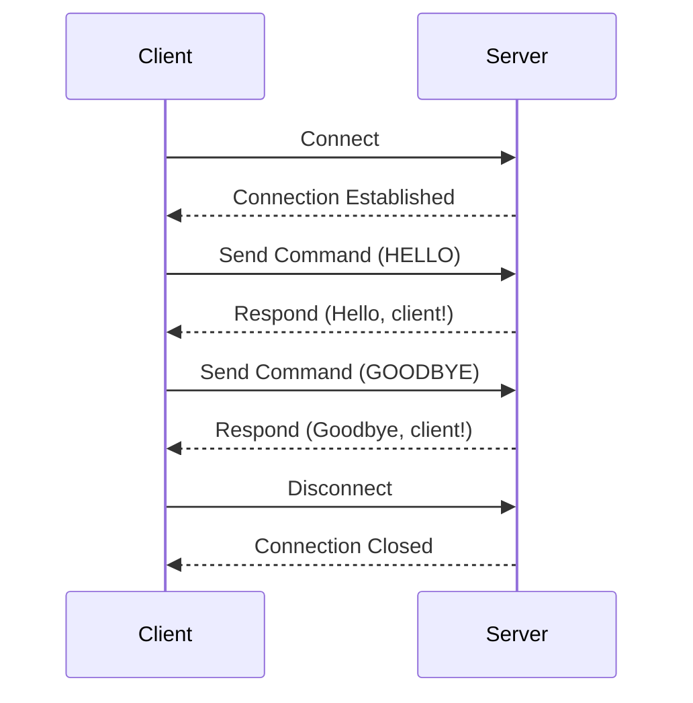

## 12.3. Implementing Servers and Clients

In this section, we delve into the world of network programming in Rust, focusing on building robust servers and clients. Rust's emphasis on safety and concurrency makes it an ideal choice for developing network applications that are both efficient and reliable. We'll explore server-client architecture, multi-threaded server implementations, handling concurrent connections, protocol parsing, and security considerations.

### Understanding Server-Client Architecture

The server-client architecture is a foundational concept in network programming. It involves a server that provides resources or services and a client that requests them. This architecture is prevalent in various applications, from web services to file sharing.

#### Key Components

- **Server**: Listens for incoming connections and processes requests from clients.
- **Client**: Initiates a connection to the server and sends requests for resources or services.
- **Protocol**: Defines the rules for communication between the server and client.

### Building a Basic Server in Rust

Let's start by building a simple TCP server using Rust's standard library. This server will listen for incoming connections and echo back any data received.

```rust
use std::net::{TcpListener, TcpStream};
use std::io::{Read, Write};
use std::thread;

fn handle_client(mut stream: TcpStream) {
    let mut buffer = [0; 512];
    while match stream.read(&mut buffer) {
        Ok(size) => {
            stream.write(&buffer[0..size]).unwrap();
            true
        }
        Err(_) => {
            println!("An error occurred, terminating connection with {}", stream.peer_addr().unwrap());
            false
        }
    } {}
}

fn main() {
    let listener = TcpListener::bind("127.0.0.1:7878").unwrap();
    println!("Server listening on port 7878");

    for stream in listener.incoming() {
        match stream {
            Ok(stream) => {
                println!("New connection: {}", stream.peer_addr().unwrap());
                thread::spawn(|| handle_client(stream));
            }
            Err(e) => {
                println!("Error: {}", e);
            }
        }
    }
}
```

#### Explanation

- **TcpListener**: Binds to a specified address and port, listening for incoming connections.
- **TcpStream**: Represents a connection between the server and a client.
- **Thread Spawning**: Each connection is handled in a separate thread, allowing the server to manage multiple clients concurrently.

### Multi-Threaded Servers and Concurrency

Handling multiple connections efficiently is crucial for server performance. Rust's ownership model and concurrency primitives make it well-suited for building multi-threaded servers.

#### Handling Concurrent Connections

To handle concurrent connections safely, we can use Rust's `std::sync` module, which provides synchronization primitives like `Mutex` and `Arc`.

```rust
use std::sync::{Arc, Mutex};
use std::net::{TcpListener, TcpStream};
use std::io::{Read, Write};
use std::thread;

fn handle_client(stream: Arc<Mutex<TcpStream>>) {
    let mut buffer = [0; 512];
    let mut stream = stream.lock().unwrap();
    while match stream.read(&mut buffer) {
        Ok(size) => {
            stream.write(&buffer[0..size]).unwrap();
            true
        }
        Err(_) => {
            println!("An error occurred, terminating connection with {}", stream.peer_addr().unwrap());
            false
        }
    } {}
}

fn main() {
    let listener = TcpListener::bind("127.0.0.1:7878").unwrap();
    println!("Server listening on port 7878");

    for stream in listener.incoming() {
        match stream {
            Ok(stream) => {
                println!("New connection: {}", stream.peer_addr().unwrap());
                let stream = Arc::new(Mutex::new(stream));
                thread::spawn(move || handle_client(stream));
            }
            Err(e) => {
                println!("Error: {}", e);
            }
        }
    }
}
```

#### Key Points

- **Arc**: A thread-safe reference-counting pointer that allows multiple ownership of the same data.
- **Mutex**: Ensures that only one thread can access the data at a time, preventing data races.

### Protocol Implementation and Parsing

Protocols define the rules for communication between the server and client. Implementing and parsing protocols correctly is essential for interoperability and security.

#### Example: Implementing a Simple Protocol

Let's implement a simple protocol where the client sends a command, and the server responds accordingly.

```rust
use std::net::{TcpListener, TcpStream};
use std::io::{Read, Write};
use std::thread;

fn handle_client(mut stream: TcpStream) {
    let mut buffer = [0; 512];
    while match stream.read(&mut buffer) {
        Ok(size) => {
            let request = String::from_utf8_lossy(&buffer[0..size]);
            let response = match request.trim() {
                "HELLO" => "Hello, client!",
                "GOODBYE" => "Goodbye, client!",
                _ => "Unknown command",
            };
            stream.write(response.as_bytes()).unwrap();
            true
        }
        Err(_) => {
            println!("An error occurred, terminating connection with {}", stream.peer_addr().unwrap());
            false
        }
    } {}
}

fn main() {
    let listener = TcpListener::bind("127.0.0.1:7878").unwrap();
    println!("Server listening on port 7878");

    for stream in listener.incoming() {
        match stream {
            Ok(stream) => {
                println!("New connection: {}", stream.peer_addr().unwrap());
                thread::spawn(|| handle_client(stream));
            }
            Err(e) => {
                println!("Error: {}", e);
            }
        }
    }
}
```

#### Parsing and Responding

- **Command Parsing**: The server reads the incoming data and interprets it as a command.
- **Response Generation**: Based on the command, the server sends an appropriate response.

### Security Considerations

Security is a critical aspect of network programming. Here are some best practices to secure your Rust servers and clients:

#### Use TLS for Secure Communication

Transport Layer Security (TLS) encrypts data in transit, preventing eavesdropping and tampering.

```rust
use std::net::TcpListener;
use std::sync::Arc;
use rustls::{ServerConfig, NoClientAuth};
use rustls::internal::pemfile::{certs, rsa_private_keys};
use std::fs::File;
use std::io::BufReader;

fn main() {
    let cert_file = &mut BufReader::new(File::open("cert.pem").unwrap());
    let key_file = &mut BufReader::new(File::open("key.pem").unwrap());
    let cert_chain = certs(cert_file).unwrap();
    let mut keys = rsa_private_keys(key_file).unwrap();
    let config = ServerConfig::new(NoClientAuth::new());
    let config = Arc::new(config.set_single_cert(cert_chain, keys.remove(0)).unwrap());

    let listener = TcpListener::bind("127.0.0.1:7878").unwrap();
    println!("Secure server listening on port 7878");

    for stream in listener.incoming() {
        match stream {
            Ok(stream) => {
                println!("New secure connection: {}", stream.peer_addr().unwrap());
                // Handle secure connection
            }
            Err(e) => {
                println!("Error: {}", e);
            }
        }
    }
}
```

#### Validate Input

Always validate and sanitize input to prevent injection attacks and buffer overflows.

#### Implement Authentication and Authorization

Ensure that only authorized clients can access your server by implementing authentication mechanisms.

### Try It Yourself

Experiment with the provided code examples by modifying them to suit your needs. Try adding new commands to the protocol, implementing client-side code, or securing the server with TLS.

### Visualizing Server-Client Interaction

Below is a sequence diagram illustrating the interaction between a client and a server.



### Summary

In this section, we've explored the essentials of implementing servers and clients in Rust. We've covered server-client architecture, multi-threaded server implementations, handling concurrent connections, protocol parsing, and security considerations. Rust's powerful concurrency model and safety features make it an excellent choice for building robust network applications.

### Further Reading

- [Rust Standard Library Documentation](https://doc.rust-lang.org/std/)
- [Tokio: Asynchronous Runtime for Rust](https://tokio.rs/)
- [Rustls: Modern TLS Library for Rust](https://github.com/rustls/rustls)

## Quiz Time!



### What is the primary role of a server in a server-client architecture?

- [x] To listen for incoming connections and process requests from clients.
- [ ] To initiate connections and request resources.
- [ ] To provide a user interface for client interactions.
- [ ] To store client data locally.

> **Explanation:** A server listens for incoming connections and processes requests from clients, providing resources or services.

### Which Rust feature is crucial for handling concurrent connections safely?

- [x] Ownership model and concurrency primitives.
- [ ] Dynamic typing.
- [ ] Garbage collection.
- [ ] Reflection.

> **Explanation:** Rust's ownership model and concurrency primitives like `Mutex` and `Arc` are crucial for safely handling concurrent connections.

### What is the purpose of the `Arc` type in Rust?

- [x] To allow multiple ownership of the same data across threads.
- [ ] To provide a mutable reference to data.
- [ ] To enforce single-threaded access to data.
- [ ] To manage memory allocation automatically.

> **Explanation:** `Arc` is a thread-safe reference-counting pointer that allows multiple ownership of the same data across threads.

### How does TLS enhance the security of a network application?

- [x] By encrypting data in transit to prevent eavesdropping and tampering.
- [ ] By providing a firewall to block unauthorized access.
- [ ] By storing passwords securely on the server.
- [ ] By ensuring the server is always online.

> **Explanation:** TLS encrypts data in transit, preventing eavesdropping and tampering, thus enhancing the security of network applications.

### What should be done to prevent injection attacks in a server application?

- [x] Validate and sanitize input.
- [ ] Use a faster network protocol.
- [ ] Increase server bandwidth.
- [ ] Implement a caching mechanism.

> **Explanation:** Validating and sanitizing input is crucial to prevent injection attacks and ensure the security of a server application.

### Which library can be used for asynchronous programming in Rust?

- [x] Tokio
- [ ] Rustls
- [ ] Serde
- [ ] Diesel

> **Explanation:** Tokio is an asynchronous runtime for Rust, used for building asynchronous applications.

### What is the function of the `Mutex` type in Rust?

- [x] To ensure that only one thread can access the data at a time.
- [ ] To provide immutable access to data.
- [ ] To manage memory allocation automatically.
- [ ] To allow multiple threads to access data simultaneously.

> **Explanation:** `Mutex` ensures that only one thread can access the data at a time, preventing data races.

### What is the role of a protocol in server-client communication?

- [x] To define the rules for communication between the server and client.
- [ ] To encrypt data during transmission.
- [ ] To manage server resources.
- [ ] To provide a user interface for client interactions.

> **Explanation:** A protocol defines the rules for communication between the server and client, ensuring interoperability and correct data exchange.

### Which of the following is a best practice for securing a Rust server?

- [x] Implementing authentication and authorization.
- [ ] Using dynamic typing.
- [ ] Disabling all logging.
- [ ] Allowing unrestricted access to all clients.

> **Explanation:** Implementing authentication and authorization ensures that only authorized clients can access the server, enhancing security.

### True or False: Rust's standard library provides built-in support for TLS.

- [ ] True
- [x] False

> **Explanation:** Rust's standard library does not provide built-in support for TLS. Libraries like Rustls are used for TLS in Rust applications.



Remember, this is just the beginning. As you progress, you'll build more complex and interactive network applications. Keep experimenting, stay curious, and enjoy the journey!
