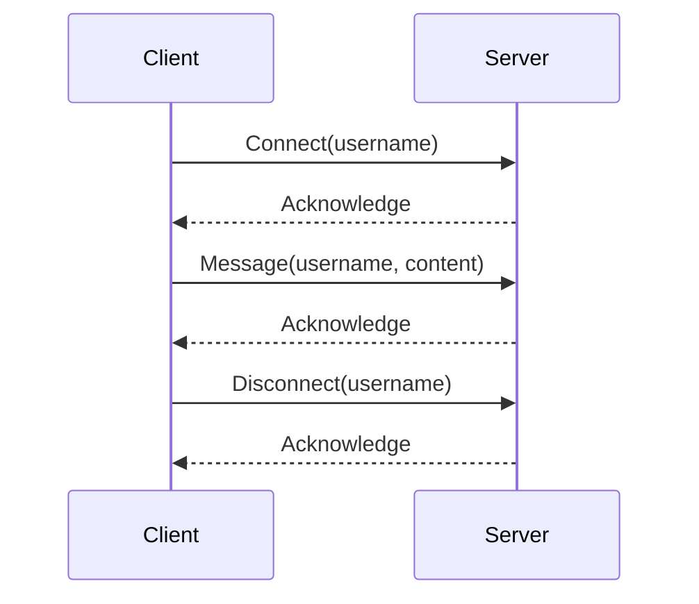

## 12.4. Protocol Design and Implementation

Designing and implementing custom network protocols in Rust is a crucial skill for developers working in networking, distributed systems, and real-time applications. This section will guide you through the key aspects of protocol design, including serialization formats, message framing, error detection and correction, and interoperability. We'll also provide practical examples and code snippets to illustrate these concepts.

### Key Aspects of Protocol Design

Designing a network protocol involves several critical considerations:

1. **Purpose and Requirements**: Define the protocol's purpose and the requirements it must meet. Consider factors such as latency, throughput, reliability, and security.

2. **Message Structure**: Design the structure of messages exchanged between clients and servers. This includes defining headers, payloads, and any metadata required for processing.

3. **Serialization Format**: Choose a serialization format that balances efficiency, readability, and compatibility. Common formats include JSON, XML, Protocol Buffers, and MessagePack.

4. **Message Framing**: Implement message framing to delineate message boundaries in a stream of bytes. This is essential for protocols that operate over TCP, which is a stream-oriented protocol.

5. **Error Handling**: Design mechanisms for detecting and correcting errors. This includes checksums, sequence numbers, and retransmission strategies.

6. **Interoperability**: Ensure the protocol can interoperate with other systems and languages. This may involve adhering to existing standards or providing comprehensive documentation.

### Serialization Formats and Message Framing

Serialization is the process of converting data structures into a format that can be easily transmitted over a network. Let's explore some popular serialization formats and how to implement message framing in Rust.

#### Serialization Formats

- **JSON**: A human-readable format that's easy to use and widely supported. However, it can be verbose and inefficient for large data sets.

- **Protocol Buffers**: A binary format developed by Google, offering compact serialization and strong typing. It's suitable for high-performance applications.

- **MessagePack**: A binary format that's more efficient than JSON but retains human readability. It's a good compromise between JSON and Protocol Buffers.

- **Bincode**: A Rust-specific binary format that's fast and compact, ideal for Rust-to-Rust communication.

#### Implementing Serialization in Rust

Let's look at an example of serializing and deserializing data using Protocol Buffers in Rust. We'll use the `prost` crate, a popular library for working with Protocol Buffers.

First, define a `.proto` file describing your message structure:

```protobuf
syntax = "proto3";

message ExampleMessage {
    string id = 1;
    int32 value = 2;
}
```

Next, generate Rust code from the `.proto` file using `prost-build` in your `build.rs`:

```rust
fn main() {
    prost_build::compile_protos(&["src/example.proto"], &["src/"]).unwrap();
}
```

Now, you can serialize and deserialize messages in Rust:

```rust
use example::ExampleMessage;

fn main() {
    // Create a new message
    let message = ExampleMessage {
        id: "123".to_string(),
        value: 42,
    };

    // Serialize the message to bytes
    let encoded: Vec<u8> = prost::Message::encode_to_vec(&message);

    // Deserialize the message from bytes
    let decoded = ExampleMessage::decode(&*encoded).unwrap();

    println!("Decoded message: id={}, value={}", decoded.id, decoded.value);
}
```

#### Message Framing

When transmitting messages over a stream-oriented protocol like TCP, it's essential to implement message framing to delineate message boundaries. One common approach is to prefix each message with its length.

Here's an example of implementing message framing in Rust:

```rust
use std::io::{self, Read, Write};
use std::net::TcpStream;

fn send_message(stream: &mut TcpStream, message: &[u8]) -> io::Result<()> {
    // Write the length of the message as a 4-byte integer
    let length = message.len() as u32;
    stream.write_all(&length.to_be_bytes())?;

    // Write the message itself
    stream.write_all(message)?;
    Ok(())
}

fn receive_message(stream: &mut TcpStream) -> io::Result<Vec<u8>> {
    // Read the length of the message
    let mut length_bytes = [0; 4];
    stream.read_exact(&mut length_bytes)?;
    let length = u32::from_be_bytes(length_bytes) as usize;

    // Read the message itself
    let mut message = vec![0; length];
    stream.read_exact(&mut message)?;
    Ok(message)
}
```

### Error Detection and Correction Mechanisms

Error detection and correction are vital for ensuring reliable communication over potentially unreliable networks. Here are some common techniques:

- **Checksums**: A simple way to detect errors by calculating a checksum for each message and verifying it upon receipt.

- **Sequence Numbers**: Assign sequence numbers to messages to detect lost or out-of-order messages.

- **Retransmission**: Implement a mechanism to retransmit lost or corrupted messages.

#### Implementing Error Detection in Rust

Let's implement a simple checksum mechanism in Rust:

```rust
fn calculate_checksum(data: &[u8]) -> u16 {
    data.iter().fold(0u16, |acc, &byte| acc.wrapping_add(byte as u16))
}

fn verify_checksum(data: &[u8], checksum: u16) -> bool {
    calculate_checksum(data) == checksum
}
```

### Interoperability and Documentation

Interoperability is crucial for protocols that need to communicate with systems written in different languages or adhere to existing standards. Here are some best practices:

- **Adhere to Standards**: Whenever possible, use existing standards and protocols to ensure compatibility.

- **Provide Comprehensive Documentation**: Document the protocol's message structure, serialization format, and error handling mechanisms. This helps other developers understand and implement the protocol.

- **Use Language-Agnostic Formats**: Choose serialization formats that are supported by multiple languages, such as JSON or Protocol Buffers.

### Example: Designing a Custom Protocol

Let's design a simple custom protocol for a chat application. We'll use JSON for serialization and implement message framing and error detection.

#### Protocol Specification

- **Message Types**: Define message types such as `Connect`, `Message`, and `Disconnect`.

- **Serialization**: Use JSON to serialize messages.

- **Message Framing**: Prefix each message with its length.

- **Error Detection**: Use checksums to verify message integrity.

#### Implementing the Protocol in Rust

First, define the message types:

```rust
use serde::{Deserialize, Serialize};

#[derive(Serialize, Deserialize)]
enum ChatMessage {
    Connect { username: String },
    Message { username: String, content: String },
    Disconnect { username: String },
}
```

Next, implement serialization and message framing:

```rust
use std::io::{self, Read, Write};
use std::net::TcpStream;
use serde_json;

fn send_chat_message(stream: &mut TcpStream, message: &ChatMessage) -> io::Result<()> {
    // Serialize the message to JSON
    let json = serde_json::to_string(message).unwrap();

    // Calculate the checksum
    let checksum = calculate_checksum(json.as_bytes());

    // Create a framed message with length and checksum
    let framed_message = format!("{}:{}:{}", json.len(), checksum, json);

    // Send the framed message
    stream.write_all(framed_message.as_bytes())?;
    Ok(())
}

fn receive_chat_message(stream: &mut TcpStream) -> io::Result<ChatMessage> {
    // Read the length and checksum
    let mut length_and_checksum = String::new();
    stream.read_line(&mut length_and_checksum)?;

    // Parse the length and checksum
    let parts: Vec<&str> = length_and_checksum.split(':').collect();
    let length: usize = parts[0].parse().unwrap();
    let checksum: u16 = parts[1].parse().unwrap();

    // Read the message
    let mut json = vec![0; length];
    stream.read_exact(&mut json)?;

    // Verify the checksum
    if !verify_checksum(&json, checksum) {
        return Err(io::Error::new(io::ErrorKind::InvalidData, "Checksum verification failed"));
    }

    // Deserialize the message
    let message: ChatMessage = serde_json::from_slice(&json).unwrap();
    Ok(message)
}
```

### Try It Yourself

Experiment with the code examples provided. Try modifying the message structure, serialization format, or error detection mechanisms. Consider implementing additional features such as encryption or compression.

### Visualizing Protocol Design

To better understand the flow of messages in a protocol, let's visualize the process using a sequence diagram.



This diagram illustrates the sequence of messages exchanged between a client and server in our chat protocol.

### References and Links

- [Rust Documentation](https://doc.rust-lang.org/)
- [Prost: Protocol Buffers for Rust](https://github.com/tokio-rs/prost)
- [Serde: Serialization Framework for Rust](https://serde.rs/)
- [JSON: JavaScript Object Notation](https://www.json.org/json-en.html)

### Knowledge Check

- What are the key considerations when designing a network protocol?
- How does message framing work in a stream-oriented protocol like TCP?
- What are some common serialization formats, and what are their trade-offs?
- How can you implement error detection and correction in a protocol?
- Why is interoperability important, and how can it be achieved?

### Embrace the Journey

Designing and implementing network protocols is a challenging but rewarding task. As you gain experience, you'll develop a deeper understanding of the trade-offs involved and the best practices to follow. Remember, this is just the beginning. Keep experimenting, stay curious, and enjoy the journey!

## Quiz Time!



### What is the primary purpose of serialization in network protocols?

- [x] To convert data structures into a format that can be transmitted over a network
- [ ] To encrypt data for secure transmission
- [ ] To compress data for faster transmission
- [ ] To format data for display on a user interface

> **Explanation:** Serialization is the process of converting data structures into a format that can be easily transmitted over a network.

### Which serialization format is known for being human-readable and widely supported?

- [x] JSON
- [ ] Protocol Buffers
- [ ] MessagePack
- [ ] Bincode

> **Explanation:** JSON is a human-readable format that's easy to use and widely supported.

### What is message framing in the context of network protocols?

- [x] Delineating message boundaries in a stream of bytes
- [ ] Encrypting messages for secure transmission
- [ ] Compressing messages for faster transmission
- [ ] Formatting messages for display on a user interface

> **Explanation:** Message framing is the process of delineating message boundaries in a stream of bytes, which is essential for protocols that operate over TCP.

### Which of the following is a common technique for error detection in network protocols?

- [x] Checksums
- [ ] Encryption
- [ ] Compression
- [ ] Serialization

> **Explanation:** Checksums are a simple way to detect errors by calculating a checksum for each message and verifying it upon receipt.

### What is the role of sequence numbers in network protocols?

- [x] To detect lost or out-of-order messages
- [ ] To encrypt messages for secure transmission
- [ ] To compress messages for faster transmission
- [ ] To format messages for display on a user interface

> **Explanation:** Sequence numbers are used to detect lost or out-of-order messages in network protocols.

### Why is interoperability important in protocol design?

- [x] To ensure the protocol can communicate with systems written in different languages
- [ ] To encrypt messages for secure transmission
- [ ] To compress messages for faster transmission
- [ ] To format messages for display on a user interface

> **Explanation:** Interoperability ensures that the protocol can communicate with systems written in different languages or adhere to existing standards.

### Which serialization format is developed by Google and offers compact serialization and strong typing?

- [x] Protocol Buffers
- [ ] JSON
- [ ] MessagePack
- [ ] Bincode

> **Explanation:** Protocol Buffers is a binary format developed by Google, offering compact serialization and strong typing.

### What is the purpose of a checksum in a network protocol?

- [x] To verify message integrity
- [ ] To encrypt messages for secure transmission
- [ ] To compress messages for faster transmission
- [ ] To format messages for display on a user interface

> **Explanation:** A checksum is used to verify the integrity of a message by calculating a checksum for each message and verifying it upon receipt.

### What is a key advantage of using Protocol Buffers over JSON?

- [x] Compact serialization and strong typing
- [ ] Human readability
- [ ] Wide support across languages
- [ ] Simplicity

> **Explanation:** Protocol Buffers offer compact serialization and strong typing, making them suitable for high-performance applications.

### True or False: Message framing is unnecessary when using a datagram-oriented protocol like UDP.

- [x] True
- [ ] False

> **Explanation:** Message framing is unnecessary when using a datagram-oriented protocol like UDP because each datagram is a self-contained message.


