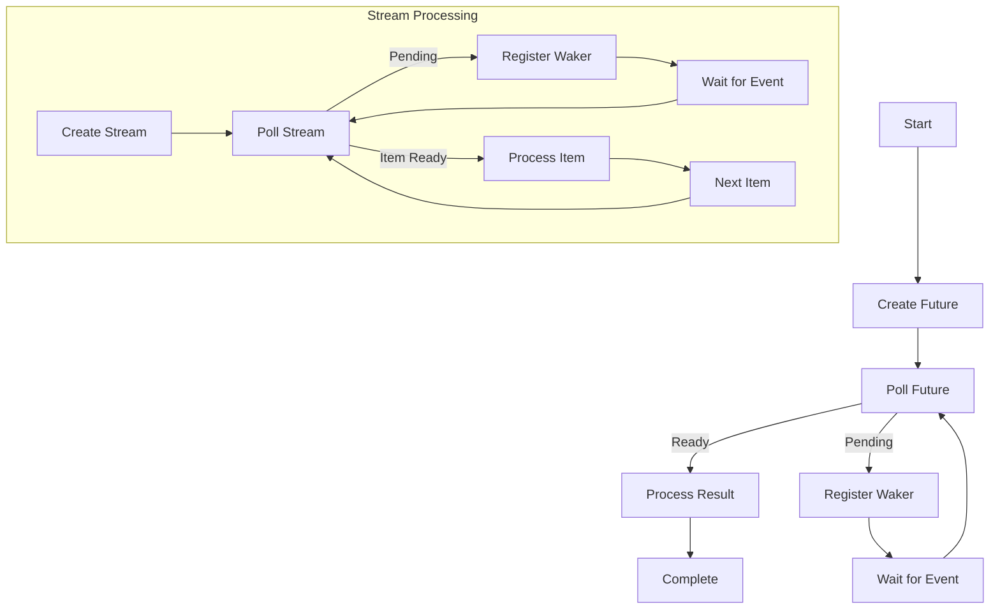

## 12.5. Using Futures and Streams for I/O

In the realm of systems programming, efficient handling of I/O operations is crucial for building responsive and high-performance applications. Rust, with its powerful type system and focus on safety, offers robust support for asynchronous programming through futures and streams. In this section, we will delve into how these constructs can be utilized to handle asynchronous I/O operations effectively.

### Introduction to Futures and Streams

Futures and streams are abstractions that allow us to work with asynchronous computations and data flows. A **future** represents a value that may not be available yet, while a **stream** is a sequence of values that are produced asynchronously over time.

#### Futures in Rust

A future is an abstraction for a computation that may complete at some point in the future. It is a placeholder for a value that is not yet available. In Rust, futures are represented by the `Future` trait, which provides a way to poll the computation to see if it is complete.

```rust
use std::future::Future;
use std::pin::Pin;
use std::task::{Context, Poll};

struct MyFuture;

impl Future for MyFuture {
    type Output = i32;

    fn poll(self: Pin<&mut Self>, cx: &mut Context<'_>) -> Poll<Self::Output> {
        // Simulate some computation
        Poll::Ready(42)
    }
}
```

In this example, `MyFuture` is a simple future that immediately returns the value `42`. The `poll` method is used to check the status of the computation.

#### Streams in Rust

Streams extend the concept of futures to sequences of values. They are similar to iterators but are asynchronous. The `Stream` trait in Rust provides a way to poll for the next value in the sequence.

```rust
use futures::stream::{self, StreamExt};

async fn process_stream() {
    let mut stream = stream::iter(vec![1, 2, 3]);

    while let Some(value) = stream.next().await {
        println!("Received: {}", value);
    }
}
```

Here, we create a stream from a vector and process each value asynchronously. The `next` method returns a future that resolves to the next item in the stream.

### Non-Blocking I/O with Futures and Streams

One of the primary benefits of using futures and streams is the ability to perform non-blocking I/O operations. This is particularly useful in network programming, where waiting for data can be a significant bottleneck.

#### Non-Blocking Reads and Writes

In Rust, non-blocking I/O is achieved by using asynchronous functions that return futures. These functions allow the program to continue executing other tasks while waiting for I/O operations to complete.

```rust
use tokio::io::{self, AsyncReadExt, AsyncWriteExt};
use tokio::net::TcpStream;

async fn read_from_socket() -> io::Result<()> {
    let mut stream = TcpStream::connect("127.0.0.1:8080").await?;
    let mut buffer = [0; 1024];

    let n = stream.read(&mut buffer).await?;
    println!("Read {} bytes", n);

    Ok(())
}

async fn write_to_socket() -> io::Result<()> {
    let mut stream = TcpStream::connect("127.0.0.1:8080").await?;
    stream.write_all(b"Hello, world!").await?;

    Ok(())
}
```

In these examples, `read_from_socket` and `write_to_socket` demonstrate non-blocking reads and writes using the `tokio` runtime. The `read` and `write_all` methods return futures that resolve when the I/O operation is complete.

### Backpressure and Flow Control

When working with streams, managing the flow of data is essential to prevent overwhelming the system with too much data at once. This is where backpressure and flow control come into play.

#### Understanding Backpressure

Backpressure is a mechanism that allows the consumer of a stream to signal the producer to slow down or stop sending data until it is ready to process more. This is crucial in scenarios where the producer can generate data faster than the consumer can handle.

```rust
use futures::stream::{self, StreamExt};

async fn handle_backpressure() {
    let stream = stream::iter(vec![1, 2, 3, 4, 5]);

    stream
        .for_each_concurrent(2, |value| async move {
            println!("Processing: {}", value);
            // Simulate some work
            tokio::time::sleep(tokio::time::Duration::from_secs(1)).await;
        })
        .await;
}
```

In this example, `for_each_concurrent` is used to process up to two items concurrently, effectively applying backpressure by limiting the number of concurrent tasks.

### Error Handling in Asynchronous Contexts

Error handling is an integral part of any robust application, and asynchronous programming introduces additional challenges. Rust's type system and the `Result` and `Option` types provide powerful tools for managing errors in asynchronous contexts.

#### Handling Errors in Futures

When working with futures, errors can be propagated using the `?` operator, just like in synchronous code. This allows for concise and readable error handling.

```rust
use tokio::io::{self, AsyncReadExt};
use tokio::net::TcpStream;

async fn read_with_error_handling() -> io::Result<()> {
    let mut stream = TcpStream::connect("127.0.0.1:8080").await?;
    let mut buffer = [0; 1024];

    match stream.read(&mut buffer).await {
        Ok(n) => println!("Read {} bytes", n),
        Err(e) => eprintln!("Failed to read from socket: {}", e),
    }

    Ok(())
}
```

In this example, errors from the `read` operation are handled using a `match` statement, allowing for custom error handling logic.

### Performance Benefits of Asynchronous I/O

Asynchronous I/O can significantly improve the performance of applications by allowing them to handle multiple I/O operations concurrently without blocking. This is particularly beneficial in high-performance network servers and applications that require low latency.

#### Concurrency and Scalability

By leveraging asynchronous I/O, applications can scale to handle many connections simultaneously without the overhead of spawning a new thread for each connection. This leads to more efficient use of system resources and better overall performance.

```rust
use tokio::net::TcpListener;
use tokio::prelude::*;

async fn handle_client(mut socket: TcpStream) {
    let mut buffer = [0; 1024];

    loop {
        let n = match socket.read(&mut buffer).await {
            Ok(n) if n == 0 => return, // Connection closed
            Ok(n) => n,
            Err(_) => return, // Error occurred
        };

        if socket.write_all(&buffer[0..n]).await.is_err() {
            return; // Error occurred
        }
    }
}

#[tokio::main]
async fn main() -> io::Result<()> {
    let listener = TcpListener::bind("127.0.0.1:8080").await?;

    loop {
        let (socket, _) = listener.accept().await?;
        tokio::spawn(async move {
            handle_client(socket).await;
        });
    }
}
```

In this example, a simple echo server is implemented using asynchronous I/O. The server can handle multiple clients concurrently by spawning a new task for each connection.

### Visualizing Asynchronous I/O with Futures and Streams

To better understand how futures and streams work together to handle asynchronous I/O, let's visualize the flow of data and control in a typical asynchronous application.



**Diagram Description**: This flowchart illustrates the lifecycle of a future and a stream in an asynchronous Rust application. The future is created and polled until it is ready, at which point the result is processed. Similarly, a stream is polled for items, and each item is processed as it becomes available.

### Try It Yourself

To deepen your understanding of futures and streams in Rust, try modifying the code examples provided. Experiment with different stream processing techniques, such as filtering or mapping values, and observe how they affect the flow of data and control.

### References and Further Reading

- [Rust Async Book](https://rust-lang.github.io/async-book/)
- [Tokio Documentation](https://docs.rs/tokio/)
- [Futures Crate Documentation](https://docs.rs/futures/)

### Knowledge Check

Before moving on, let's reinforce what we've learned with a few questions and exercises.

1. What is the primary benefit of using futures and streams for I/O operations in Rust?
2. How does backpressure help manage the flow of data in a stream?
3. Modify the echo server example to log each connection's IP address.
4. What are some common error handling strategies in asynchronous Rust code?
5. How can you limit the number of concurrent tasks when processing a stream?

### Embrace the Journey

Remember, mastering asynchronous I/O in Rust is a journey. As you continue to explore and experiment with futures and streams, you'll gain a deeper understanding of how to build efficient and responsive applications. Keep pushing the boundaries, stay curious, and enjoy the process!

## Quiz Time!



### What is a future in Rust?

- [x] An abstraction for a computation that may complete at some point in the future.
- [ ] A synchronous computation that is always ready.
- [ ] A type of iterator in Rust.
- [ ] A data structure for storing asynchronous tasks.

> **Explanation:** A future is an abstraction for a computation that may complete at some point in the future, allowing for asynchronous programming.

### What is the primary purpose of using streams in Rust?

- [x] To handle sequences of values that are produced asynchronously over time.
- [ ] To perform synchronous I/O operations.
- [ ] To manage memory allocation.
- [ ] To create threads for parallel processing.

> **Explanation:** Streams are used to handle sequences of values that are produced asynchronously, similar to iterators but in an asynchronous context.

### How does backpressure help in stream processing?

- [x] It allows the consumer to signal the producer to slow down or stop sending data.
- [ ] It speeds up the data production process.
- [ ] It increases the buffer size for data storage.
- [ ] It removes errors from the data stream.

> **Explanation:** Backpressure allows the consumer to signal the producer to slow down or stop sending data, preventing the system from being overwhelmed.

### What is the role of the `poll` method in a future?

- [x] To check the status of the computation and determine if it is complete.
- [ ] To start the computation immediately.
- [ ] To allocate memory for the future.
- [ ] To convert the future into a stream.

> **Explanation:** The `poll` method is used to check the status of the computation and determine if it is complete, returning `Poll::Ready` or `Poll::Pending`.

### Which crate is commonly used for asynchronous I/O in Rust?

- [x] Tokio
- [ ] Serde
- [ ] Diesel
- [ ] Rayon

> **Explanation:** Tokio is a popular crate used for asynchronous I/O in Rust, providing tools for non-blocking network programming.

### What is the benefit of using `for_each_concurrent` in stream processing?

- [x] It allows processing multiple items concurrently, applying backpressure.
- [ ] It processes items sequentially.
- [ ] It increases the buffer size for each item.
- [ ] It converts the stream into a future.

> **Explanation:** `for_each_concurrent` allows processing multiple items concurrently, effectively applying backpressure by limiting the number of concurrent tasks.

### How can errors be propagated in asynchronous Rust code?

- [x] Using the `?` operator.
- [ ] By ignoring them.
- [ ] By converting them into warnings.
- [ ] By using global error handlers.

> **Explanation:** Errors in asynchronous Rust code can be propagated using the `?` operator, similar to synchronous code.

### What is the primary advantage of non-blocking I/O?

- [x] It allows the program to continue executing other tasks while waiting for I/O operations to complete.
- [ ] It simplifies the code structure.
- [ ] It increases the size of the binary.
- [ ] It reduces the need for error handling.

> **Explanation:** Non-blocking I/O allows the program to continue executing other tasks while waiting for I/O operations to complete, improving performance and responsiveness.

### What is the purpose of the `AsyncReadExt` trait?

- [x] To provide asynchronous read methods for I/O operations.
- [ ] To convert synchronous reads into asynchronous reads.
- [ ] To manage memory allocation for I/O buffers.
- [ ] To handle errors in asynchronous reads.

> **Explanation:** The `AsyncReadExt` trait provides asynchronous read methods for I/O operations, allowing for non-blocking reads.

### True or False: Streams in Rust are similar to iterators but are asynchronous.

- [x] True
- [ ] False

> **Explanation:** Streams in Rust are indeed similar to iterators but are designed to handle asynchronous sequences of values.


