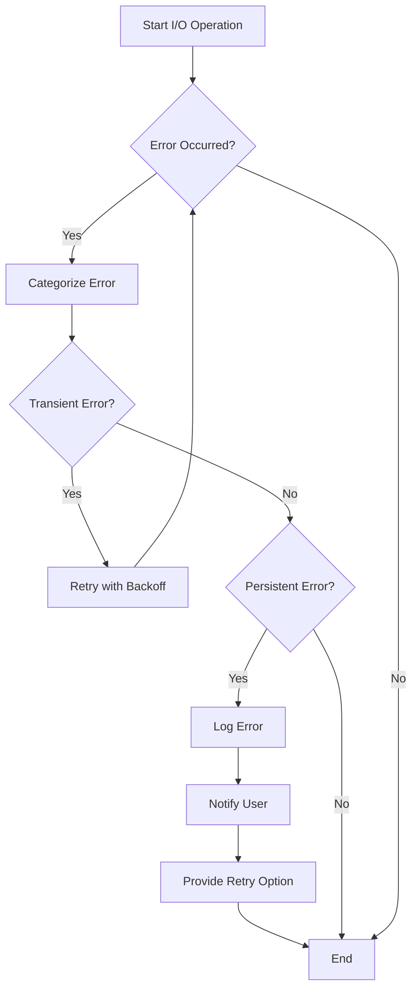

## 12.6. Patterns for Handling I/O Errors

In the realm of systems programming, handling Input/Output (I/O) errors effectively is crucial for building robust and resilient applications. Rust, with its emphasis on safety and concurrency, provides a powerful toolkit for managing these errors. This section delves into the common sources of I/O errors, strategies for implementing retry logic and timeouts, categorizing and managing different error types, user experience considerations, and the importance of logging and monitoring.

### Common Sources of I/O Errors

I/O operations are inherently prone to errors due to their interaction with external systems and hardware. Understanding these sources is the first step in designing effective error handling strategies.

1. **Network Failures**: These can occur due to connectivity issues, server downtime, or DNS resolution failures. Network failures are often transient and may require retry logic.

2. **File System Errors**: These include permission issues, missing files, or disk space exhaustion. File system errors can be persistent and may require user intervention.

3. **Hardware Malfunctions**: Faulty hardware components can lead to I/O errors, such as disk read/write failures.

4. **Timeouts**: Operations that take longer than expected can result in timeouts, especially in network communications.

5. **Data Corruption**: Errors in data transmission or storage can lead to corrupted data, necessitating validation and error correction mechanisms.

### Strategies for Retry Logic and Timeouts

Implementing retry logic and timeouts is essential for handling transient I/O errors effectively. Here are some strategies to consider:

#### Retry Logic

Retry logic involves reattempting an operation that has failed due to a transient error. Here are some best practices:

- **Exponential Backoff**: Gradually increase the delay between retries to reduce the load on the system and increase the chances of success.

```rust
use std::time::Duration;
use std::thread::sleep;

fn perform_io_operation() -> Result<(), &'static str> {
    // Simulate an I/O operation that might fail
    Err("Network error")
}

fn retry_with_exponential_backoff() {
    let mut attempts = 0;
    let max_attempts = 5;

    while attempts < max_attempts {
        match perform_io_operation() {
            Ok(_) => {
                println!("Operation succeeded");
                return;
            }
            Err(e) => {
                println!("Attempt {} failed: {}", attempts + 1, e);
                let wait_time = Duration::from_secs(2u64.pow(attempts));
                println!("Retrying in {:?}...", wait_time);
                sleep(wait_time);
                attempts += 1;
            }
        }
    }

    println!("Operation failed after {} attempts", max_attempts);
}

fn main() {
    retry_with_exponential_backoff();
}
```

- **Jitter**: Add randomness to the backoff time to prevent synchronized retries from overwhelming the system.

- **Max Retries**: Set a limit on the number of retries to prevent infinite loops.

#### Timeouts

Timeouts prevent operations from hanging indefinitely. Here’s how to implement them:

- **Set Reasonable Timeouts**: Determine appropriate timeout durations based on the operation and network conditions.

- **Use Asynchronous I/O**: Rust’s `async`/`await` syntax can be used to handle timeouts effectively.

```rust
use tokio::time::{timeout, Duration};

async fn perform_async_io_operation() -> Result<(), &'static str> {
    // Simulate an asynchronous I/O operation
    tokio::time::sleep(Duration::from_secs(3)).await;
    Err("Operation timed out")
}

#[tokio::main]
async fn main() {
    let result = timeout(Duration::from_secs(2), perform_async_io_operation()).await;

    match result {
        Ok(Ok(_)) => println!("Operation succeeded"),
        Ok(Err(e)) => println!("Operation failed: {}", e),
        Err(_) => println!("Operation timed out"),
    }
}
```

### Categorizing and Managing Different Error Types

Rust’s type system and error handling capabilities allow for precise categorization and management of errors.

#### Error Categorization

- **Transient vs. Persistent Errors**: Transient errors, such as network failures, may resolve themselves over time, while persistent errors, like file permission issues, require user intervention.

- **Recoverable vs. Unrecoverable Errors**: Use Rust’s `Result` and `Option` types to distinguish between errors that can be handled and those that cannot.

#### Error Management

- **Use Custom Error Types**: Define custom error types to encapsulate different error categories and provide meaningful error messages.

```rust
use std::fmt;

#[derive(Debug)]
enum IoError {
    NetworkError(String),
    FileSystemError(String),
    TimeoutError,
}

impl fmt::Display for IoError {
    fn fmt(&self, f: &mut fmt::Formatter) -> fmt::Result {
        match self {
            IoError::NetworkError(msg) => write!(f, "Network error: {}", msg),
            IoError::FileSystemError(msg) => write!(f, "File system error: {}", msg),
            IoError::TimeoutError => write!(f, "Operation timed out"),
        }
    }
}

fn main() {
    let error = IoError::NetworkError("Connection refused".to_string());
    println!("Error occurred: {}", error);
}
```

- **Leverage the `thiserror` and `anyhow` Crates**: These crates simplify error handling by providing macros and utilities for defining and managing errors.

### User Experience Considerations

Handling I/O errors gracefully is crucial for maintaining a positive user experience.

- **Provide Clear Error Messages**: Inform users about the nature of the error and possible actions they can take.

- **Offer Retry Options**: Allow users to retry operations that have failed due to transient errors.

- **Fail Gracefully**: Ensure that the application remains stable and responsive even when errors occur.

### Logging and Monitoring of Errors

Effective logging and monitoring are essential for diagnosing and resolving I/O errors.

- **Log Error Details**: Capture detailed information about errors, including timestamps, error messages, and stack traces.

- **Use Structured Logging**: Employ structured logging formats, such as JSON, to facilitate automated analysis and monitoring.

- **Monitor Error Trends**: Analyze logs to identify patterns and trends in errors, enabling proactive resolution.

### Visualizing Error Handling Workflow

To better understand the flow of error handling in I/O operations, let's visualize the process using a flowchart.



This flowchart illustrates the decision-making process involved in handling I/O errors, from detecting an error to categorizing it and deciding on the appropriate action.

### Knowledge Check

Before we conclude, let's reinforce our understanding with a few questions:

1. What are some common sources of I/O errors?
2. How can exponential backoff improve retry logic?
3. Why is it important to categorize errors as transient or persistent?
4. What role does user experience play in error handling?
5. How can structured logging aid in monitoring errors?

### Embrace the Journey

Remember, mastering I/O error handling in Rust is a journey. As you continue to build and refine your applications, keep experimenting with different strategies and techniques. Stay curious, and enjoy the process of creating robust and resilient systems!

## Quiz Time!



### What is a common source of I/O errors?

- [x] Network Failures
- [ ] Syntax Errors
- [ ] Compilation Errors
- [ ] Logical Errors

> **Explanation:** Network failures are a common source of I/O errors due to connectivity issues or server downtime.

### Which strategy is used to prevent synchronized retries from overwhelming the system?

- [ ] Linear Backoff
- [x] Jitter
- [ ] Immediate Retry
- [ ] Constant Delay

> **Explanation:** Jitter adds randomness to the backoff time, preventing synchronized retries.

### What is the purpose of setting a maximum number of retries?

- [x] To prevent infinite loops
- [ ] To ensure immediate success
- [ ] To increase system load
- [ ] To reduce error logging

> **Explanation:** Setting a maximum number of retries prevents infinite loops in retry logic.

### How can Rust's `async`/`await` syntax help with timeouts?

- [x] By handling asynchronous operations effectively
- [ ] By increasing execution speed
- [ ] By reducing code complexity
- [ ] By eliminating errors

> **Explanation:** Rust's `async`/`await` syntax helps manage asynchronous operations, including handling timeouts.

### What is a benefit of using custom error types?

- [x] Providing meaningful error messages
- [ ] Reducing code size
- [ ] Increasing execution speed
- [ ] Simplifying syntax

> **Explanation:** Custom error types allow for meaningful error messages and better error categorization.

### Why is it important to provide clear error messages to users?

- [x] To inform users about the nature of the error
- [ ] To increase application speed
- [ ] To reduce code complexity
- [ ] To eliminate errors

> **Explanation:** Clear error messages help users understand the error and possible actions they can take.

### What is the role of structured logging in error handling?

- [x] Facilitating automated analysis and monitoring
- [ ] Reducing code size
- [ ] Increasing execution speed
- [ ] Simplifying syntax

> **Explanation:** Structured logging formats, like JSON, facilitate automated analysis and monitoring of errors.

### How can monitoring error trends help in error handling?

- [x] By enabling proactive resolution
- [ ] By reducing code complexity
- [ ] By increasing execution speed
- [ ] By eliminating errors

> **Explanation:** Monitoring error trends helps identify patterns, enabling proactive error resolution.

### What is the purpose of offering retry options to users?

- [x] To allow users to retry operations that failed due to transient errors
- [ ] To increase application speed
- [ ] To reduce code complexity
- [ ] To eliminate errors

> **Explanation:** Offering retry options allows users to retry operations that failed due to transient errors.

### True or False: Persistent errors usually resolve themselves over time.

- [ ] True
- [x] False

> **Explanation:** Persistent errors often require user intervention and do not resolve themselves over time.




