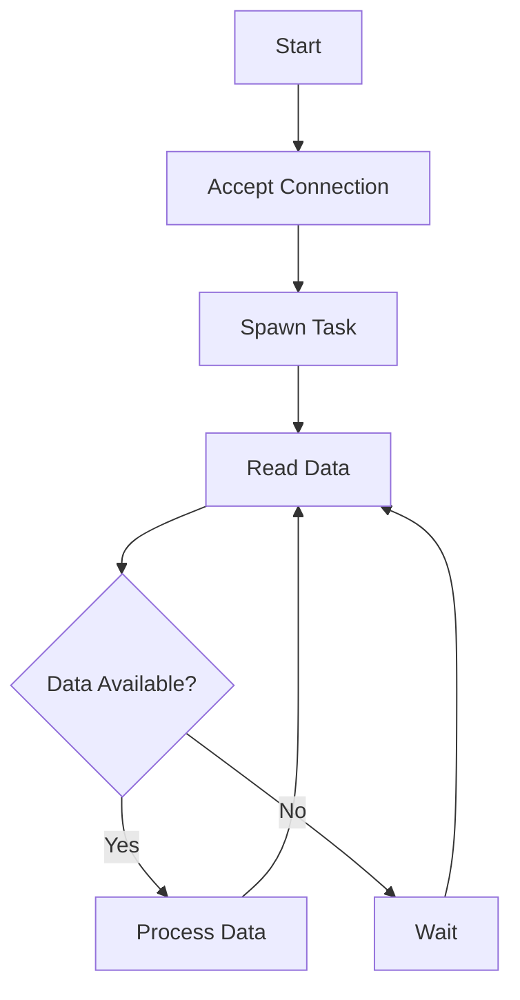
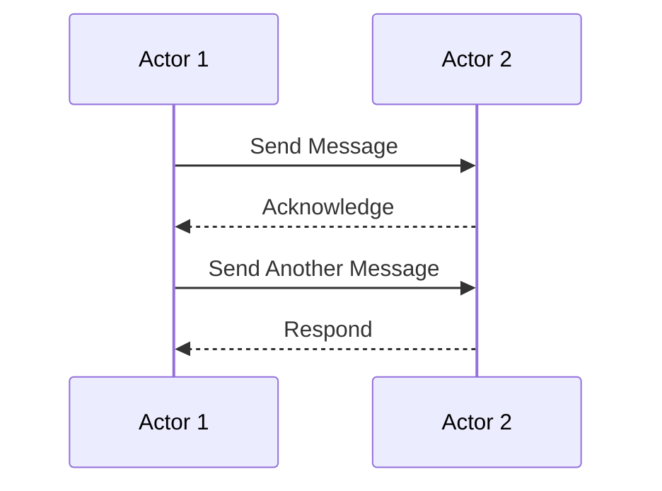

## 12.7. High-Performance Networking

In the world of network programming, achieving high throughput and low latency is crucial for building efficient and responsive applications. Rust, with its focus on safety and performance, offers unique advantages for developing high-performance network applications. In this section, we will explore various techniques and best practices for building such applications in Rust.

### Factors Affecting Network Performance

Before diving into specific techniques, it's important to understand the factors that can affect network performance:

1. **Latency**: The time it takes for a message to travel from the source to the destination. Lower latency is crucial for real-time applications.

2. **Throughput**: The amount of data transferred over a network in a given amount of time. High throughput is essential for data-intensive applications.

3. **Concurrency**: The ability to handle multiple connections simultaneously. Efficient concurrency models can significantly impact performance.

4. **Resource Utilization**: Efficient use of CPU, memory, and network resources can lead to better performance.

5. **Network Protocols**: The choice of protocol (e.g., TCP, UDP) can affect performance based on the application's requirements.

### Zero-Copy I/O

Zero-copy I/O is a technique that minimizes data copying between user space and kernel space, reducing CPU overhead and improving performance. Rust's standard library and ecosystem provide several tools to implement zero-copy I/O.

#### Example: Using `mio` for Zero-Copy I/O

The `mio` crate is a low-level library for building non-blocking network applications in Rust. It provides a mechanism for zero-copy I/O by allowing direct access to the underlying buffers.

```rust
use mio::{Events, Interest, Poll, Token};
use mio::net::TcpListener;
use std::io::{self, Read, Write};

fn main() -> io::Result<()> {
    let mut poll = Poll::new()?;
    let mut events = Events::with_capacity(128);
    let addr = "127.0.0.1:8080".parse().unwrap();
    let mut listener = TcpListener::bind(addr)?;

    poll.registry().register(&mut listener, Token(0), Interest::READABLE)?;

    let mut connections = Vec::new();

    loop {
        poll.poll(&mut events, None)?;

        for event in events.iter() {
            match event.token() {
                Token(0) => {
                    let (mut connection, _address) = listener.accept()?;
                    poll.registry().register(&mut connection, Token(connections.len() + 1), Interest::READABLE)?;
                    connections.push(connection);
                }
                Token(n) => {
                    let connection = &mut connections[n - 1];
                    let mut buffer = [0; 1024];
                    match connection.read(&mut buffer) {
                        Ok(0) => {
                            // Connection closed
                        }
                        Ok(n) => {
                            connection.write_all(&buffer[..n])?;
                        }
                        Err(ref err) if err.kind() == io::ErrorKind::WouldBlock => {
                            // Would block, try again later
                        }
                        Err(err) => {
                            return Err(err);
                        }
                    }
                }
            }
        }
    }
}
```

In this example, `mio` is used to handle multiple connections efficiently without blocking. The zero-copy I/O is achieved by directly reading from and writing to the buffer without intermediate copying.

### Tuning Operating System Parameters

Operating system parameters can significantly impact network performance. Here are some common parameters to consider tuning:

1. **Socket Buffers**: Increasing the size of socket buffers can improve throughput by allowing more data to be queued for transmission.

2. **TCP Congestion Control**: Different congestion control algorithms can affect performance. Experiment with different algorithms to find the best fit for your application.

3. **Network Interface Card (NIC) Offloading**: Enable features like TCP segmentation offloading (TSO) and large receive offload (LRO) to reduce CPU load.

4. **Interrupt Coalescing**: Adjusting interrupt coalescing settings can reduce CPU usage by batching network interrupts.

### Profiling and Optimizing Code

Profiling is essential for identifying bottlenecks and optimizing network applications. Rust provides several tools for profiling and optimization.

#### Using `perf` for Profiling

`perf` is a powerful Linux tool for profiling applications. It can be used to identify CPU hotspots and other performance issues.

```bash
# Compile the Rust application with debug symbols
cargo build --release

# Run the application with perf
perf record ./target/release/my_app

# Analyze the results
perf report
```

#### Optimizing Code

Once bottlenecks are identified, consider the following optimization techniques:

1. **Algorithm Optimization**: Choose efficient algorithms and data structures to reduce computational overhead.

2. **Memory Management**: Use Rust's ownership and borrowing system to minimize unnecessary allocations and deallocations.

3. **Concurrency**: Use Rust's concurrency primitives, such as threads and async/await, to efficiently handle multiple connections.

### Concurrency Models and Scalability

Concurrency is a key factor in building scalable network applications. Rust offers several concurrency models to choose from.

#### Asynchronous Programming with `async`/`await`

Rust's `async`/`await` syntax allows for writing asynchronous code that is easy to read and maintain. It is particularly useful for I/O-bound tasks.

```rust
use tokio::net::TcpListener;
use tokio::prelude::*;

#[tokio::main]
async fn main() -> io::Result<()> {
    let listener = TcpListener::bind("127.0.0.1:8080").await?;

    loop {
        let (mut socket, _) = listener.accept().await?;
        tokio::spawn(async move {
            let mut buf = [0; 1024];
            loop {
                match socket.read(&mut buf).await {
                    Ok(0) => return, // Connection closed
                    Ok(n) => {
                        if socket.write_all(&buf[..n]).await.is_err() {
                            return; // Write error
                        }
                    }
                    Err(_) => return, // Read error
                }
            }
        });
    }
}
```

In this example, `tokio` is used to handle asynchronous I/O. The `async`/`await` syntax makes it easy to write non-blocking code that scales well with the number of connections.

#### The Actor Model

The actor model is another concurrency model that can be used to build scalable network applications. It involves breaking down an application into independent actors that communicate via message passing.

```rust
use actix::prelude::*;

struct MyActor;

impl Actor for MyActor {
    type Context = Context<Self>;
}

struct Ping;

impl Message for Ping {
    type Result = ();
}

impl Handler<Ping> for MyActor {
    type Result = ();

    fn handle(&mut self, _msg: Ping, _ctx: &mut Context<Self>) {
        println!("Ping received");
    }
}

fn main() {
    let system = System::new();
    let addr = MyActor.start();
    addr.do_send(Ping);
    system.run().unwrap();
}
```

In this example, `actix` is used to implement the actor model. Each actor runs in its own context and communicates with other actors via messages.

### Visualizing Concurrency Models

To better understand the concurrency models discussed, let's visualize them using Mermaid.js diagrams.

#### Asynchronous Programming Flow



This flowchart represents the asynchronous programming model where tasks are spawned for each connection, allowing the application to handle multiple connections concurrently.

#### Actor Model Communication



This sequence diagram illustrates the communication between actors in the actor model, where messages are passed between independent actors.

### Knowledge Check

- **Question**: What is zero-copy I/O, and why is it important for high-performance networking?
- **Question**: How can operating system parameters be tuned to improve network performance?
- **Question**: What are some tools available in Rust for profiling network applications?
- **Question**: How does the `async`/`await` syntax in Rust help with concurrency?

### Try It Yourself

Experiment with the code examples provided in this section. Try modifying the buffer sizes, changing the concurrency model, or tuning operating system parameters to see how they affect performance.

### Conclusion

Building high-performance network applications in Rust involves understanding the factors that affect performance, leveraging zero-copy I/O, tuning operating system parameters, profiling and optimizing code, and choosing the right concurrency model. By applying these techniques, you can create efficient and scalable network applications that meet the demands of modern computing.

Remember, this is just the beginning. As you progress, you'll discover more advanced techniques and optimizations. Keep experimenting, stay curious, and enjoy the journey!

## Quiz Time!



### What is zero-copy I/O?

- [x] A technique that minimizes data copying between user space and kernel space
- [ ] A method for increasing network latency
- [ ] A way to copy data multiple times for redundancy
- [ ] A technique for encrypting network data

> **Explanation:** Zero-copy I/O minimizes data copying between user space and kernel space, reducing CPU overhead and improving performance.

### Which Rust crate is commonly used for non-blocking network applications?

- [x] mio
- [ ] serde
- [ ] tokio
- [ ] actix

> **Explanation:** The `mio` crate is a low-level library for building non-blocking network applications in Rust.

### What is the purpose of tuning socket buffers?

- [x] To improve throughput by allowing more data to be queued for transmission
- [ ] To increase latency
- [ ] To reduce the number of connections
- [ ] To encrypt network data

> **Explanation:** Increasing the size of socket buffers can improve throughput by allowing more data to be queued for transmission.

### How does the `async`/`await` syntax help with concurrency in Rust?

- [x] It allows writing asynchronous code that is easy to read and maintain
- [ ] It increases the number of threads
- [ ] It blocks the execution of code
- [ ] It decreases the number of connections

> **Explanation:** The `async`/`await` syntax allows for writing asynchronous code that is easy to read and maintain, making it useful for I/O-bound tasks.

### What is the actor model?

- [x] A concurrency model that involves breaking down an application into independent actors that communicate via message passing
- [ ] A model for encrypting network data
- [ ] A method for increasing network latency
- [ ] A technique for copying data multiple times

> **Explanation:** The actor model involves breaking down an application into independent actors that communicate via message passing.

### Which tool is used for profiling applications in Linux?

- [x] perf
- [ ] cargo
- [ ] clippy
- [ ] rustfmt

> **Explanation:** `perf` is a powerful Linux tool for profiling applications.

### What is the benefit of using NIC offloading?

- [x] To reduce CPU load
- [ ] To increase network latency
- [ ] To encrypt network data
- [ ] To decrease the number of connections

> **Explanation:** Enabling NIC offloading features like TCP segmentation offloading (TSO) and large receive offload (LRO) can reduce CPU load.

### What is the role of interrupt coalescing in network performance?

- [x] To reduce CPU usage by batching network interrupts
- [ ] To increase network latency
- [ ] To encrypt network data
- [ ] To decrease the number of connections

> **Explanation:** Adjusting interrupt coalescing settings can reduce CPU usage by batching network interrupts.

### What is the main advantage of using `tokio` for network applications?

- [x] It provides an asynchronous runtime for handling I/O-bound tasks
- [ ] It increases network latency
- [ ] It reduces the number of connections
- [ ] It encrypts network data

> **Explanation:** `tokio` provides an asynchronous runtime for handling I/O-bound tasks, making it suitable for network applications.

### True or False: The actor model is a concurrency model that involves blocking threads.

- [ ] True
- [x] False

> **Explanation:** The actor model is a concurrency model that involves breaking down an application into independent actors that communicate via message passing, not blocking threads.


