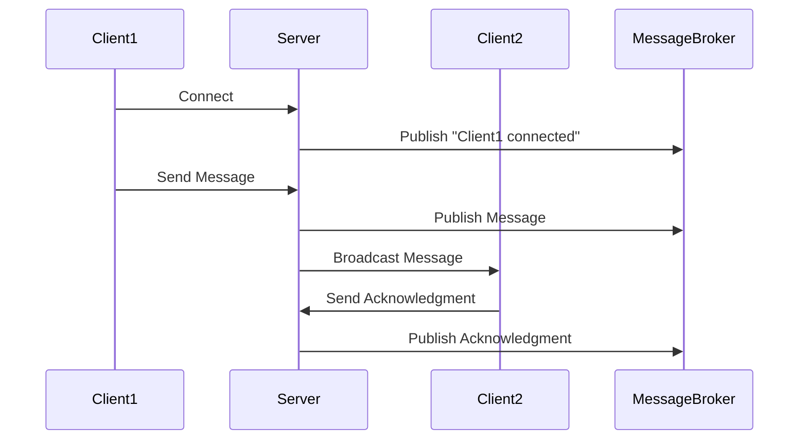

## 12.8. Reactive Networking Applications

In this section, we delve into the world of reactive networking applications in Rust, exploring how reactive programming principles can be leveraged to build responsive and efficient network applications. We will cover the core concepts of reactive programming, discuss event-driven architecture, and provide practical examples using asynchronous streams and sinks. Additionally, we will highlight the advantages of handling real-time data and discuss integration with other reactive systems.

### Introduction to Reactive Programming

Reactive programming is a programming paradigm oriented around data flows and the propagation of change. This means that it allows developers to express static or dynamic data flows with ease, and automatically propagate changes through the data flow. Reactive programming is particularly useful in scenarios where applications need to respond to a large number of events or data streams in real-time.

#### Key Concepts

- **Observables**: These are data sources that emit events over time. In Rust, these can be represented using asynchronous streams.
- **Observers**: These are entities that subscribe to observables to receive and process emitted events.
- **Schedulers**: These manage the execution of tasks, ensuring that events are processed in a timely manner.
- **Backpressure**: This is a mechanism to control the flow of data, ensuring that observers are not overwhelmed by the rate at which observables emit events.

### Event-Driven Architecture

Event-driven architecture (EDA) is a software architecture pattern promoting the production, detection, consumption of, and reaction to events. In an event-driven system, components communicate through the production and consumption of events, which can be processed asynchronously.

#### Benefits of EDA

- **Scalability**: Systems can scale more easily as components are decoupled and can be scaled independently.
- **Responsiveness**: Applications can respond to events in real-time, improving user experience.
- **Flexibility**: Components can be added, removed, or modified without affecting the entire system.

### Asynchronous Streams and Sinks in Rust

Rust's asynchronous programming model is built around the `async`/`await` syntax, which allows for writing non-blocking code that is easy to read and maintain. Asynchronous streams and sinks are key components in building reactive networking applications.

#### Asynchronous Streams

An asynchronous stream is a sequence of values that are computed asynchronously. Rust provides the `Stream` trait, which is similar to the `Iterator` trait but for asynchronous operations.

```rust
use futures::stream::{self, StreamExt};

async fn process_stream() {
    let stream = stream::iter(vec![1, 2, 3, 4, 5]);
    stream.for_each(|value| async move {
        println!("Received value: {}", value);
    }).await;
}
```

In this example, we create a stream of integers and process each value asynchronously using the `for_each` combinator.

#### Asynchronous Sinks

A sink is a consumer of a stream of values. In Rust, the `Sink` trait represents an asynchronous sink.

```rust
use futures::sink::SinkExt;
use futures::channel::mpsc;

async fn process_sink() {
    let (mut tx, mut rx) = mpsc::channel(10);

    tx.send(42).await.unwrap();
    if let Some(value) = rx.next().await {
        println!("Received value: {}", value);
    }
}
```

Here, we create a channel that acts as a sink, sending and receiving values asynchronously.

### Building Reactive Networking Applications

To build reactive networking applications in Rust, we can combine asynchronous streams and sinks with event-driven architecture principles. Let's explore a practical example of a reactive networking application using Rust's `tokio` and `futures` crates.

#### Example: A Simple Chat Server

We'll build a simple chat server that handles multiple clients, broadcasting messages to all connected clients in real-time.

```rust
use tokio::net::{TcpListener, TcpStream};
use tokio::sync::broadcast;
use tokio::io::{AsyncReadExt, AsyncWriteExt};
use std::sync::Arc;

async fn handle_client(mut socket: TcpStream, mut rx: broadcast::Receiver<String>) {
    let (mut reader, mut writer) = socket.split();
    let mut buf = vec![0; 1024];

    loop {
        tokio::select! {
            result = reader.read(&mut buf) => {
                let n = result.unwrap();
                if n == 0 {
                    break;
                }
                let msg = String::from_utf8_lossy(&buf[..n]).to_string();
                println!("Received: {}", msg);
            }
            result = rx.recv() => {
                let msg = result.unwrap();
                writer.write_all(msg.as_bytes()).await.unwrap();
            }
        }
    }
}

async fn run_server() {
    let listener = TcpListener::bind("127.0.0.1:8080").await.unwrap();
    let (tx, _rx) = broadcast::channel(10);

    loop {
        let (socket, _) = listener.accept().await.unwrap();
        let rx = tx.subscribe();
        tokio::spawn(handle_client(socket, rx));
    }
}

#[tokio::main]
async fn main() {
    run_server().await;
}
```

In this example, we use `tokio` to handle asynchronous I/O operations. The server listens for incoming TCP connections and spawns a new task for each client. Each client task reads messages from the client and broadcasts them to all other clients using a `broadcast` channel.

### Advantages of Reactive Networking Applications

Reactive networking applications offer several advantages, particularly in handling real-time data:

- **Efficiency**: By using asynchronous streams and sinks, applications can handle a large number of concurrent connections without blocking.
- **Scalability**: Reactive applications can scale horizontally by adding more instances to handle increased load.
- **Resilience**: Event-driven architecture allows for graceful handling of failures and retries.

### Integration with Other Reactive Systems

Reactive networking applications can be integrated with other reactive systems, such as message brokers, databases, and cloud services. This integration can be achieved using Rust's rich ecosystem of crates and libraries.

#### Example: Integrating with a Message Broker

Let's consider integrating our chat server with a message broker like RabbitMQ to persist messages and ensure delivery.

```rust
use lapin::{options::*, types::FieldTable, BasicProperties, Connection, ConnectionProperties};
use tokio_amqp::*;

async fn publish_message(channel: &lapin::Channel, message: &str) {
    channel.basic_publish(
        "",
        "chat_queue",
        BasicPublishOptions::default(),
        message.as_bytes(),
        BasicProperties::default(),
    ).await.unwrap();
}

async fn run_server_with_broker() {
    let conn = Connection::connect("amqp://localhost:5672/%2f", ConnectionProperties::default().with_tokio()).await.unwrap();
    let channel = conn.create_channel().await.unwrap();

    channel.queue_declare(
        "chat_queue",
        QueueDeclareOptions::default(),
        FieldTable::default(),
    ).await.unwrap();

    let listener = TcpListener::bind("127.0.0.1:8080").await.unwrap();
    let (tx, _rx) = broadcast::channel(10);

    loop {
        let (socket, _) = listener.accept().await.unwrap();
        let rx = tx.subscribe();
        let channel = channel.clone();
        tokio::spawn(async move {
            handle_client(socket, rx).await;
            publish_message(&channel, "Client disconnected").await;
        });
    }
}
```

In this example, we use the `lapin` crate to connect to RabbitMQ and publish messages to a queue. This integration allows us to persist chat messages and ensure they are delivered even if clients disconnect.

### Visualizing Reactive Networking Architecture

To better understand the flow of data in a reactive networking application, let's visualize the architecture using a sequence diagram.



This diagram illustrates how messages flow between clients, the server, and a message broker in a reactive networking application.

### Try It Yourself

Now that we've explored the concepts and examples, it's time to try it yourself! Modify the chat server example to add new features, such as:

- Implementing user authentication.
- Adding support for private messages between clients.
- Integrating with a different message broker or database.

### Knowledge Check

Before we wrap up, let's reinforce what we've learned with a few questions:

- What are the key components of reactive programming?
- How does event-driven architecture improve scalability?
- What are the benefits of using asynchronous streams in Rust?

### Summary

In this section, we've explored the principles of reactive programming and event-driven architecture in the context of networking applications. We've seen how Rust's asynchronous programming model, with its streams and sinks, can be used to build efficient and scalable reactive applications. By integrating with other reactive systems, such as message brokers, we can further enhance the capabilities of our applications.

Remember, this is just the beginning. As you progress, you'll build more complex and interactive networking applications. Keep experimenting, stay curious, and enjoy the journey!

## Quiz Time!



### What is a key benefit of reactive programming in networking applications?

- [x] It allows for efficient handling of real-time data.
- [ ] It simplifies synchronous code execution.
- [ ] It eliminates the need for error handling.
- [ ] It reduces the need for data serialization.

> **Explanation:** Reactive programming is particularly useful for efficiently handling real-time data flows and changes.

### Which Rust trait is used to represent asynchronous streams?

- [x] Stream
- [ ] Iterator
- [ ] Future
- [ ] Sink

> **Explanation:** The `Stream` trait in Rust is used to represent asynchronous sequences of values.

### What is the purpose of backpressure in reactive programming?

- [x] To control the flow of data and prevent overwhelming observers.
- [ ] To increase the speed of data processing.
- [ ] To eliminate the need for event-driven architecture.
- [ ] To simplify error handling.

> **Explanation:** Backpressure is a mechanism to control the flow of data, ensuring that observers are not overwhelmed by the rate of data emission.

### How does event-driven architecture improve scalability?

- [x] By decoupling components and allowing independent scaling.
- [ ] By reducing the number of components in the system.
- [ ] By eliminating the need for asynchronous operations.
- [ ] By simplifying the codebase.

> **Explanation:** Event-driven architecture improves scalability by decoupling components, allowing them to be scaled independently.

### Which crate is commonly used in Rust for asynchronous I/O operations?

- [x] tokio
- [ ] serde
- [ ] clap
- [ ] regex

> **Explanation:** The `tokio` crate is widely used in Rust for handling asynchronous I/O operations.

### What is an advantage of using asynchronous streams in Rust?

- [x] They allow for non-blocking processing of data sequences.
- [ ] They simplify synchronous code execution.
- [ ] They eliminate the need for error handling.
- [ ] They reduce the need for data serialization.

> **Explanation:** Asynchronous streams allow for non-blocking processing of data sequences, improving efficiency.

### How can reactive networking applications be integrated with message brokers?

- [x] By using crates like `lapin` to connect and publish messages.
- [ ] By eliminating the need for asynchronous operations.
- [ ] By simplifying the codebase.
- [ ] By reducing the number of components in the system.

> **Explanation:** Reactive networking applications can be integrated with message brokers using crates like `lapin` to connect and publish messages.

### What is the role of a scheduler in reactive programming?

- [x] To manage the execution of tasks and ensure timely processing of events.
- [ ] To simplify synchronous code execution.
- [ ] To eliminate the need for error handling.
- [ ] To reduce the need for data serialization.

> **Explanation:** Schedulers manage the execution of tasks, ensuring that events are processed in a timely manner.

### Which of the following is a component of event-driven architecture?

- [x] Event producers and consumers
- [ ] Synchronous code execution
- [ ] Data serialization
- [ ] Error handling

> **Explanation:** Event-driven architecture involves event producers and consumers that communicate through events.

### True or False: Reactive programming eliminates the need for error handling.

- [ ] True
- [x] False

> **Explanation:** Reactive programming does not eliminate the need for error handling; it provides mechanisms to handle errors effectively.


