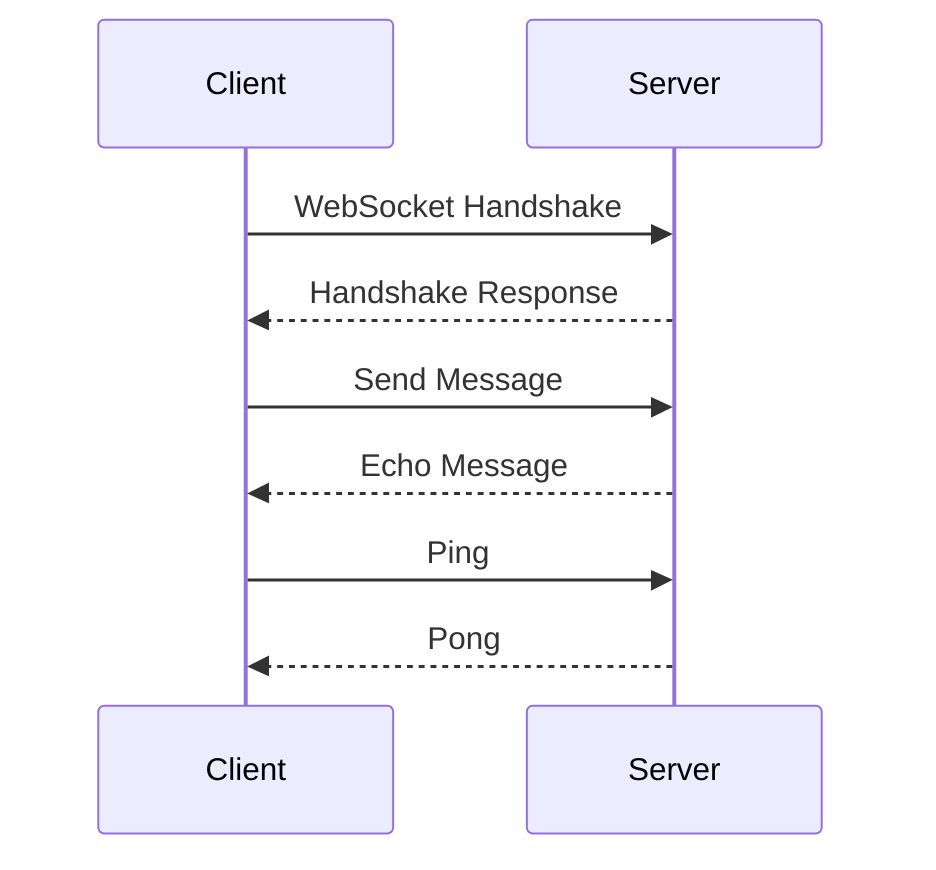

## 12.9. WebSockets and Real-Time Communication

In the ever-evolving landscape of web technologies, real-time communication has become a cornerstone for interactive applications. WebSockets, a protocol designed for full-duplex communication channels over a single TCP connection, play a pivotal role in enabling real-time data exchange between clients and servers. In this section, we will delve into the WebSocket protocol, explore its benefits, and demonstrate how to implement WebSocket servers and clients in Rust using popular libraries like `tungstenite` and `warp`. We will also discuss message framing, keep-alive mechanisms, security considerations, and practical use cases such as chat applications and live updates.

### Understanding the WebSocket Protocol

The WebSocket protocol, standardized by the IETF as RFC 6455, provides a persistent connection between a client and a server, allowing for bidirectional communication. Unlike HTTP, which follows a request-response model, WebSockets enable continuous data exchange without the overhead of HTTP headers, making them ideal for real-time applications.

#### Benefits of WebSockets

- **Low Latency**: WebSockets reduce latency by maintaining a persistent connection, eliminating the need for repeated handshakes.
- **Full-Duplex Communication**: Both client and server can send messages independently, enhancing interactivity.
- **Efficient Data Transfer**: Minimal overhead compared to HTTP, as headers are sent only once during the handshake.
- **Scalability**: Suitable for applications requiring frequent updates, such as online gaming, financial tickers, and collaborative tools.

### Implementing WebSocket Servers and Clients in Rust

Rust, with its emphasis on safety and concurrency, is well-suited for building robust WebSocket applications. We will explore two popular libraries: `tungstenite` for WebSocket protocol handling and `warp` for building web servers with WebSocket support.

#### Setting Up a WebSocket Server with Tungstenite

The `tungstenite` crate provides a lightweight and flexible WebSocket implementation. Let's create a simple WebSocket server that echoes messages back to the client.

```rust
use std::net::TcpListener;
use tungstenite::server::accept;

fn main() {
    // Bind the server to a local address
    let server = TcpListener::bind("127.0.0.1:9001").expect("Failed to bind server");

    // Accept incoming connections
    for stream in server.incoming() {
        let stream = stream.expect("Failed to accept connection");
        // Accept the WebSocket handshake
        let mut websocket = accept(stream).expect("Failed to accept WebSocket connection");

        // Echo messages back to the client
        loop {
            let msg = websocket.read_message().expect("Error reading message");
            if msg.is_text() || msg.is_binary() {
                websocket.write_message(msg).expect("Error writing message");
            }
        }
    }
}
```

**Explanation**:
- We bind the server to a local address using `TcpListener`.
- For each incoming connection, we accept the WebSocket handshake.
- The server reads messages from the client and echoes them back.

#### Creating a WebSocket Client with Tungstenite

Let's create a simple WebSocket client that connects to our server and sends a message.

```rust
use tungstenite::connect;
use url::Url;

fn main() {
    // Connect to the WebSocket server
    let (mut socket, response) =
        connect(Url::parse("ws://127.0.0.1:9001").unwrap()).expect("Can't connect");

    println!("Connected to the server");
    println!("Response HTTP code: {}", response.status());

    // Send a message to the server
    socket.write_message(tungstenite::Message::Text("Hello, WebSocket!".into())).unwrap();

    // Read the echoed message
    let msg = socket.read_message().expect("Error reading message");
    println!("Received: {}", msg);
}
```

**Explanation**:
- We use `connect` to establish a connection to the WebSocket server.
- A message is sent to the server, and the echoed message is printed.

#### WebSocket Server with Warp

The `warp` framework simplifies building web servers in Rust, including WebSocket support. Let's create a WebSocket server using `warp`.

```rust
use warp::Filter;

#[tokio::main]
async fn main() {
    // Define a WebSocket route
    let ws_route = warp::path("ws")
        .and(warp::ws())
        .map(|ws: warp::ws::Ws| {
            ws.on_upgrade(|websocket| async {
                let (mut tx, mut rx) = websocket.split();
                while let Some(result) = rx.next().await {
                    if let Ok(msg) = result {
                        tx.send(msg).await.unwrap();
                    }
                }
            })
        });

    // Start the server
    warp::serve(ws_route).run(([127, 0, 0, 1], 9001)).await;
}
```

**Explanation**:
- We define a WebSocket route using `warp::path` and `warp::ws`.
- The server echoes messages received from the client.

### Handling Message Framing and Keep-Alive

WebSockets use frames to encapsulate messages, allowing for efficient data transfer. The protocol supports text, binary, ping, pong, and close frames. Handling these frames correctly is crucial for maintaining a stable connection.

#### Ping/Pong for Keep-Alive

Ping and pong frames are used to keep the connection alive. The server can send a ping frame, and the client should respond with a pong frame. This mechanism helps detect broken connections.

```rust
// Example of sending a ping frame
websocket.write_message(tungstenite::Message::Ping(vec![])).expect("Error sending ping");

// Example of handling a pong frame
let msg = websocket.read_message().expect("Error reading message");
if msg.is_pong() {
    println!("Received pong");
}
```

### Security Considerations

When implementing WebSockets, security is paramount. Here are some best practices:

- **Use Secure WebSockets (wss://)**: Encrypt communication using TLS to protect against eavesdropping and man-in-the-middle attacks.
- **Validate Origin Headers**: Ensure that requests originate from trusted sources to prevent cross-site WebSocket hijacking.
- **Limit Message Size**: Prevent denial-of-service attacks by setting a maximum message size.
- **Handle Errors Gracefully**: Implement error handling to manage unexpected disconnections and protocol violations.

### Use Cases for WebSockets

WebSockets are ideal for applications requiring real-time data exchange. Here are some common use cases:

- **Chat Applications**: Enable real-time messaging between users.
- **Live Updates**: Provide instant updates for stock prices, sports scores, or news feeds.
- **Collaborative Tools**: Facilitate real-time collaboration in document editing or whiteboarding applications.
- **Online Gaming**: Support multiplayer interactions with low latency.

### Visualizing WebSocket Communication

To better understand the flow of WebSocket communication, let's visualize the process using a sequence diagram.



**Diagram Explanation**:
- The client initiates a WebSocket handshake with the server.
- Upon successful handshake, the client sends a message, and the server echoes it back.
- The client sends a ping frame, and the server responds with a pong frame to keep the connection alive.

### Try It Yourself

Experiment with the provided code examples by modifying the message content, adding additional message types, or implementing custom logic for handling different frames. This hands-on approach will deepen your understanding of WebSocket communication in Rust.

### References and Further Reading

- [WebSocket Protocol (RFC 6455)](https://tools.ietf.org/html/rfc6455)
- [Tungstenite Crate Documentation](https://crates.io/crates/tungstenite)
- [Warp Crate Documentation](https://crates.io/crates/warp)

### Knowledge Check

- What are the key benefits of using WebSockets for real-time communication?
- How does the WebSocket protocol differ from HTTP?
- What are some security considerations when implementing WebSockets?
- Describe a use case where WebSockets would be advantageous.

### Embrace the Journey

Remember, mastering WebSockets in Rust is just the beginning. As you continue to explore real-time communication, you'll unlock new possibilities for creating interactive and responsive applications. Keep experimenting, stay curious, and enjoy the journey!

## Quiz Time!



### What is a key benefit of using WebSockets over HTTP for real-time communication?

- [x] Low latency due to persistent connections
- [ ] Higher security than HTTP
- [ ] Easier to implement than HTTP
- [ ] Better for static content delivery

> **Explanation:** WebSockets provide low latency by maintaining a persistent connection, unlike HTTP which requires repeated handshakes.

### Which Rust crate is commonly used for WebSocket protocol handling?

- [x] tungstenite
- [ ] serde
- [ ] tokio
- [ ] hyper

> **Explanation:** The `tungstenite` crate is widely used for handling WebSocket protocols in Rust.

### What is the purpose of ping/pong frames in WebSockets?

- [x] To keep the connection alive
- [ ] To encrypt messages
- [ ] To compress data
- [ ] To authenticate users

> **Explanation:** Ping/pong frames are used to keep the WebSocket connection alive by detecting broken connections.

### What should you validate to prevent cross-site WebSocket hijacking?

- [x] Origin headers
- [ ] Content-Type headers
- [ ] User-Agent headers
- [ ] Accept headers

> **Explanation:** Validating Origin headers ensures that WebSocket requests originate from trusted sources, preventing hijacking.

### Which of the following is a common use case for WebSockets?

- [x] Chat applications
- [ ] Static website hosting
- [ ] Batch processing
- [ ] File storage

> **Explanation:** WebSockets are commonly used in chat applications for real-time messaging.

### What is a security best practice when using WebSockets?

- [x] Use Secure WebSockets (wss://)
- [ ] Disable TLS
- [ ] Allow all origins
- [ ] Increase message size limits

> **Explanation:** Using Secure WebSockets (wss://) encrypts communication, protecting against eavesdropping.

### Which Rust framework simplifies building web servers with WebSocket support?

- [x] warp
- [ ] actix
- [ ] rocket
- [ ] diesel

> **Explanation:** The `warp` framework provides built-in support for WebSockets, simplifying server development.

### What is the role of the `accept` function in a WebSocket server?

- [x] To accept the WebSocket handshake
- [ ] To send messages to the client
- [ ] To close the connection
- [ ] To encrypt data

> **Explanation:** The `accept` function is used to accept the WebSocket handshake from a client.

### True or False: WebSockets can only send text data.

- [ ] True
- [x] False

> **Explanation:** WebSockets can send both text and binary data, making them versatile for various applications.

### What is the main advantage of using WebSockets for online gaming?

- [x] Low latency communication
- [ ] High data compression
- [ ] Simplified game logic
- [ ] Enhanced graphics

> **Explanation:** WebSockets provide low latency communication, which is crucial for real-time interactions in online gaming.


