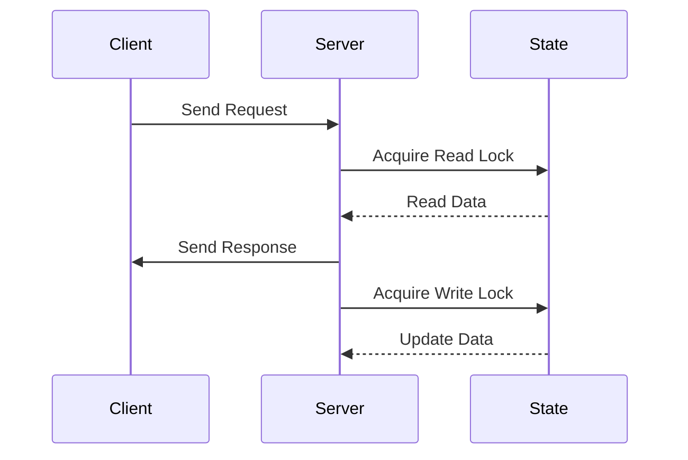

## 13.11. Performance Optimization in Web Applications

In the world of web development, performance is a critical factor that can make or break an application. Rust, with its focus on safety and concurrency, offers unique opportunities for building high-performance web applications. In this section, we'll explore techniques for measuring and improving the performance of Rust web applications to ensure they can handle high loads efficiently.

### Understanding Common Performance Bottlenecks

Before diving into optimization techniques, it's essential to understand the common performance bottlenecks in web applications:

1. **I/O Operations**: Network and disk I/O can be significant bottlenecks, especially in web applications that rely heavily on database interactions or external API calls.

2. **CPU-bound Tasks**: Intensive computations can slow down request handling, leading to increased response times.

3. **Memory Usage**: Excessive memory allocations and inefficient data structures can lead to increased garbage collection and memory pressure.

4. **Concurrency Issues**: Poorly managed concurrency can lead to contention, deadlocks, and inefficient resource utilization.

5. **Blocking Operations**: Synchronous operations that block the main thread can degrade performance, especially in asynchronous applications.

### Profiling Rust Web Applications

Profiling is the first step in performance optimization. It helps identify where your application spends most of its time and resources. Rust provides several tools for profiling, including Flamegraph and `perf`.

#### Using Flamegraph

Flamegraph is a powerful tool for visualizing stack traces and identifying performance bottlenecks. It generates interactive flame graphs that help you understand where your application spends most of its time.

To use Flamegraph with a Rust application:

1. **Install Flamegraph**: You can install Flamegraph using Cargo:

   ```bash
   cargo install flamegraph
   ```

2. **Run Your Application with Profiling**: Use Flamegraph to profile your application:

   ```bash
   cargo flamegraph
   ```

3. **Analyze the Flamegraph**: Open the generated SVG file in a browser to explore the flame graph. Look for tall stacks, which indicate functions consuming the most CPU time.

#### Using `perf`

`perf` is a powerful Linux tool for performance analysis. It provides detailed insights into CPU usage, cache misses, and more.

1. **Install `perf`**: Ensure `perf` is installed on your system.

2. **Run Your Application with `perf`**: Use `perf` to record performance data:

   ```bash
   perf record -g ./your_application
   ```

3. **Generate a Report**: Use `perf` to generate a report:

   ```bash
   perf report
   ```

4. **Analyze the Report**: Look for functions with high CPU usage and investigate further.

### Strategies for Optimizing Rust Web Applications

Once you've identified the bottlenecks, you can apply various optimization strategies to improve performance.

#### Reducing Allocations

Memory allocations can be expensive, especially in high-load scenarios. Here are some strategies to reduce allocations:

- **Use Stack Allocation**: Prefer stack allocation over heap allocation whenever possible. Use fixed-size arrays and structs instead of dynamic collections.

- **Reuse Buffers**: Reuse buffers and data structures to avoid repeated allocations. Consider using the `bytes` crate for efficient buffer management.

- **Optimize Data Structures**: Choose the right data structures for your use case. For example, use `Vec` for dynamic arrays and `HashMap` for key-value storage.

#### Improving Concurrency

Concurrency is a core strength of Rust, and optimizing it can lead to significant performance gains:

- **Use Asynchronous Programming**: Leverage Rust's `async`/`await` syntax to handle I/O-bound tasks efficiently. Use libraries like `tokio` for asynchronous runtime.

- **Minimize Lock Contention**: Use lock-free data structures or minimize the scope of locks to reduce contention. Consider using `RwLock` for read-heavy workloads.

- **Parallelize CPU-bound Tasks**: Use libraries like `rayon` to parallelize CPU-bound tasks and take advantage of multi-core processors.

#### Impact of Asynchronous Programming

Asynchronous programming can significantly impact performance by allowing your application to handle more concurrent requests without blocking threads.

- **Non-blocking I/O**: Use non-blocking I/O to handle multiple connections simultaneously. This is especially useful for web servers handling many concurrent requests.

- **Task Scheduling**: Efficient task scheduling ensures that your application remains responsive under load. Use `tokio`'s task scheduling features to manage asynchronous tasks effectively.

### Load Testing and Benchmarking

Load testing is crucial for understanding how your application performs under high traffic. It helps identify bottlenecks and ensures your application can scale.

#### Using Locust

Locust is a popular load testing tool that allows you to simulate traffic and measure performance.

1. **Install Locust**: Install Locust using pip:

   ```bash
   pip install locust
   ```

2. **Write a Locustfile**: Define user behavior in a `locustfile.py`:

   ```python
   from locust import HttpUser, task

   class MyUser(HttpUser):
       @task
       def my_task(self):
           self.client.get("/my_endpoint")
   ```

3. **Run Locust**: Start Locust and open the web interface:

   ```bash
   locust -f locustfile.py
   ```

4. **Simulate Traffic**: Use the web interface to simulate traffic and monitor performance metrics.

#### Using k6

k6 is another powerful load testing tool that provides a scripting API for defining test scenarios.

1. **Install k6**: Download and install k6 from the [official website](https://k6.io/).

2. **Write a Test Script**: Define your test scenario in a JavaScript file:

   ```javascript
   import http from 'k6/http';
   import { sleep } from 'k6';

   export default function () {
       http.get('http://your_application/my_endpoint');
       sleep(1);
   }
   ```

3. **Run k6**: Execute the test script:

   ```bash
   k6 run script.js
   ```

4. **Analyze Results**: Review the output for performance metrics and identify areas for improvement.

### Code Example: Optimizing a Rust Web Application

Let's look at a simple example of optimizing a Rust web application using asynchronous programming and efficient data structures.

```rust
use tokio::net::TcpListener;
use tokio::prelude::*;
use std::sync::Arc;
use tokio::sync::RwLock;
use std::collections::HashMap;

type SharedState = Arc<RwLock<HashMap<String, String>>>;

#[tokio::main]
async fn main() -> Result<(), Box<dyn std::error::Error>> {
    let listener = TcpListener::bind("127.0.0.1:8080").await?;
    let state: SharedState = Arc::new(RwLock::new(HashMap::new()));

    loop {
        let (mut socket, _) = listener.accept().await?;
        let state = state.clone();

        tokio::spawn(async move {
            let mut buf = [0; 1024];
            loop {
                let n = match socket.read(&mut buf).await {
                    Ok(n) if n == 0 => return,
                    Ok(n) => n,
                    Err(_) => return,
                };

                let response = handle_request(&buf[..n], &state).await;
                if socket.write_all(response.as_bytes()).await.is_err() {
                    return;
                }
            }
        });
    }
}

async fn handle_request(buf: &[u8], state: &SharedState) -> String {
    let request = String::from_utf8_lossy(buf);
    let response = format!("Received: {}", request);

    let mut data = state.write().await;
    data.insert("last_request".to_string(), request.to_string());

    response
}
```

In this example, we use `tokio` for asynchronous I/O and `RwLock` for efficient read-heavy access to shared state. This approach allows the application to handle multiple connections concurrently without blocking.

### Visualizing Concurrency in Rust Web Applications

To better understand how concurrency works in Rust web applications, let's visualize the flow of handling multiple requests using a sequence diagram.



This diagram illustrates how the server handles requests concurrently, using read and write locks to manage shared state efficiently.

### Key Takeaways

- **Identify Bottlenecks**: Use profiling tools like Flamegraph and `perf` to identify performance bottlenecks in your application.

- **Optimize Memory Usage**: Reduce allocations and choose efficient data structures to minimize memory pressure.

- **Leverage Concurrency**: Use Rust's concurrency features to handle multiple requests efficiently.

- **Adopt Asynchronous Programming**: Use `async`/`await` to handle I/O-bound tasks without blocking threads.

- **Load Testing**: Use tools like Locust and k6 to simulate traffic and measure performance under load.

### Embrace the Journey

Remember, performance optimization is an ongoing process. As you continue to develop and refine your Rust web applications, keep experimenting with different techniques and tools. Stay curious, and enjoy the journey of building high-performance web applications with Rust!

## Quiz Time!



### What is a common performance bottleneck in web applications?

- [x] I/O Operations
- [ ] Excessive Logging
- [ ] Static File Serving
- [ ] CSS Styling

> **Explanation:** I/O operations, such as network and disk I/O, are common bottlenecks in web applications.

### Which tool is used to visualize stack traces in Rust applications?

- [x] Flamegraph
- [ ] Cargo
- [ ] Clippy
- [ ] Rustfmt

> **Explanation:** Flamegraph is used to visualize stack traces and identify performance bottlenecks.

### What is the purpose of using `async`/`await` in Rust web applications?

- [x] To handle I/O-bound tasks efficiently
- [ ] To improve code readability
- [ ] To reduce memory usage
- [ ] To simplify error handling

> **Explanation:** `async`/`await` is used to handle I/O-bound tasks efficiently without blocking threads.

### Which crate is commonly used for benchmarking in Rust?

- [x] `criterion`
- [ ] `serde`
- [ ] `tokio`
- [ ] `rayon`

> **Explanation:** The `criterion` crate is commonly used for benchmarking Rust applications.

### What is the benefit of using `RwLock` in Rust?

- [x] It allows multiple readers or one writer at a time
- [ ] It prevents all concurrent access
- [ ] It simplifies error handling
- [ ] It reduces memory usage

> **Explanation:** `RwLock` allows multiple readers or one writer at a time, reducing contention in read-heavy workloads.

### Which tool can be used for load testing Rust web applications?

- [x] Locust
- [ ] Cargo
- [ ] Clippy
- [ ] Rustfmt

> **Explanation:** Locust is a tool used for load testing web applications, including those written in Rust.

### What is a key strategy for reducing memory allocations in Rust?

- [x] Reuse buffers and data structures
- [ ] Use dynamic collections
- [ ] Increase heap size
- [ ] Avoid stack allocation

> **Explanation:** Reusing buffers and data structures helps reduce memory allocations.

### How can you minimize lock contention in Rust applications?

- [x] Use lock-free data structures
- [ ] Use more locks
- [ ] Increase lock scope
- [ ] Avoid concurrency

> **Explanation:** Using lock-free data structures or minimizing the scope of locks can reduce contention.

### What is the impact of blocking operations in asynchronous applications?

- [x] They degrade performance
- [ ] They improve code readability
- [ ] They reduce memory usage
- [ ] They simplify error handling

> **Explanation:** Blocking operations degrade performance in asynchronous applications by blocking threads.

### True or False: Profiling is the first step in performance optimization.

- [x] True
- [ ] False

> **Explanation:** Profiling is the first step in performance optimization, as it helps identify where the application spends most of its time and resources.


