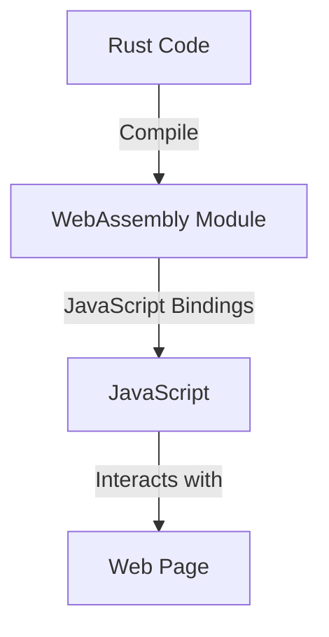

## 13.12. Front-End Integration with WebAssembly

WebAssembly (WASM) is revolutionizing web development by allowing languages like Rust to run in the browser, providing near-native performance and opening new possibilities for front-end development. In this section, we'll explore how to integrate Rust with WebAssembly, enabling you to create powerful, efficient web applications.

### What is WebAssembly?

WebAssembly is a binary instruction format designed as a portable target for the compilation of high-level languages like Rust, C, and C++. It enables code to run on the web at near-native speed, providing a way to execute code written in languages other than JavaScript in the browser.

#### Benefits of WebAssembly for Web Development

- **Performance**: WebAssembly is designed for high performance, allowing complex computations to be executed efficiently in the browser.
- **Portability**: Code compiled to WebAssembly can run on any platform that supports it, making it highly portable.
- **Interoperability**: WebAssembly can interoperate with JavaScript, allowing developers to leverage existing JavaScript libraries and frameworks.
- **Security**: WebAssembly runs in a sandboxed environment, providing a secure execution context.

### Compiling Rust to WebAssembly

To compile Rust code to WebAssembly, we use tools like `wasm-pack`, which simplifies the process and provides a seamless integration with JavaScript.

#### Setting Up Your Environment

Before we begin, ensure you have Rust and `wasm-pack` installed. You can install `wasm-pack` using the following command:

```bash
cargo install wasm-pack
```

#### Creating a Simple Rust Project

Let's create a simple Rust project that we'll compile to WebAssembly:

```bash
cargo new hello-wasm --lib
cd hello-wasm
```

Edit the `Cargo.toml` file to include the necessary dependencies:

```toml
[dependencies]
wasm-bindgen = "0.2"
```

#### Writing Rust Code

In `src/lib.rs`, write a simple function that will be exposed to JavaScript:

```rust
use wasm_bindgen::prelude::*;

// This function will be callable from JavaScript
#[wasm_bindgen]
pub fn greet(name: &str) -> String {
    format!("Hello, {}!", name)
}
```

#### Building the Project

Use `wasm-pack` to build the project:

```bash
wasm-pack build --target web
```

This command compiles the Rust code to WebAssembly and generates the necessary JavaScript bindings.

### Interoperating with JavaScript

Once compiled, you can use the generated WebAssembly module in a JavaScript application.

#### Setting Up a Simple HTML Page

Create an `index.html` file to load and use the WebAssembly module:

```html
<!DOCTYPE html>
<html lang="en">
<head>
    <meta charset="UTF-8">
    <meta name="viewport" content="width=device-width, initial-scale=1.0">
    <title>Rust and WebAssembly</title>
</head>
<body>
    <h1>Rust and WebAssembly</h1>
    <button id="greet-button">Greet</button>
    <script type="module">
        import init, { greet } from './pkg/hello_wasm.js';

        async function run() {
            await init();
            document.getElementById('greet-button').addEventListener('click', () => {
                alert(greet('World'));
            });
        }

        run();
    </script>
</body>
</html>
```

### Frameworks and Libraries for WASM Development in Rust

Several frameworks and libraries facilitate WebAssembly development in Rust, making it easier to build complex web applications.

#### Yew

[Yew](https://yew.rs/) is a modern Rust framework for creating multi-threaded front-end web apps using WebAssembly. It provides a component-based architecture similar to React, allowing developers to build interactive web applications with Rust.

#### Wasm-bindgen

[Wasm-bindgen](https://github.com/rustwasm/wasm-bindgen) is a library that facilitates high-level interactions between Rust and JavaScript. It provides macros and utilities to easily call JavaScript functions from Rust and vice versa.

### Use Cases for Rust in the Browser

Using Rust in the browser can provide significant advantages in certain scenarios:

- **Performance-Intensive Applications**: Applications requiring heavy computations, such as games or data visualization tools, can benefit from Rust's performance.
- **Security-Critical Applications**: Rust's memory safety guarantees make it an excellent choice for applications where security is paramount.
- **Code Reuse**: If you have existing Rust code, compiling it to WebAssembly allows you to reuse it in web applications.

### Try It Yourself

Experiment with the code examples provided by modifying the `greet` function to accept different parameters or perform more complex operations. Try integrating other Rust libraries and see how they perform in the browser.

### Visualizing Rust and WebAssembly Integration

To better understand how Rust and WebAssembly interact with JavaScript, let's visualize the process:



**Diagram Description**: This diagram illustrates the process of compiling Rust code into a WebAssembly module, which is then used in a JavaScript application to interact with a web page.

### Knowledge Check

- Explain the benefits of using WebAssembly for web development.
- Describe how to compile Rust code to WebAssembly.
- Demonstrate how to interoperate between Rust-generated WebAssembly and JavaScript.
- Identify scenarios where using Rust in the browser is advantageous.

### Summary

In this section, we've explored how to leverage WebAssembly to run Rust code in the browser, enabling powerful front-end development. By compiling Rust to WebAssembly, we can create high-performance, secure web applications that interoperate seamlessly with JavaScript. As you continue your journey, remember to experiment with different frameworks and libraries, and explore the vast possibilities that Rust and WebAssembly offer for web development.

## Quiz Time!



### What is WebAssembly?

- [x] A binary instruction format for a stack-based virtual machine
- [ ] A JavaScript framework
- [ ] A Rust library
- [ ] A CSS preprocessor

> **Explanation:** WebAssembly is a binary instruction format for a stack-based virtual machine, designed to run code at near-native speed in the browser.

### Which tool is commonly used to compile Rust code to WebAssembly?

- [x] wasm-pack
- [ ] npm
- [ ] cargo-web
- [ ] webpack

> **Explanation:** `wasm-pack` is a tool that simplifies the process of compiling Rust code to WebAssembly and integrating it with JavaScript.

### What is the primary benefit of using WebAssembly in web development?

- [x] Near-native performance
- [ ] Easier debugging
- [ ] Better styling capabilities
- [ ] Simplified HTML structure

> **Explanation:** WebAssembly provides near-native performance, making it ideal for performance-intensive applications.

### How does WebAssembly improve security in web applications?

- [x] It runs in a sandboxed environment
- [ ] It encrypts all data
- [ ] It uses a secure coding language
- [ ] It requires authentication

> **Explanation:** WebAssembly runs in a sandboxed environment, providing a secure execution context for web applications.

### Which Rust framework is used for creating web apps with WebAssembly?

- [x] Yew
- [ ] Rocket
- [ ] Actix
- [ ] Diesel

> **Explanation:** Yew is a modern Rust framework for creating multi-threaded front-end web apps using WebAssembly.

### What is the role of wasm-bindgen in Rust and WebAssembly integration?

- [x] Facilitates high-level interactions between Rust and JavaScript
- [ ] Compiles Rust code to WebAssembly
- [ ] Provides a web server for Rust applications
- [ ] Manages Rust dependencies

> **Explanation:** Wasm-bindgen facilitates high-level interactions between Rust and JavaScript, allowing seamless communication between the two.

### What kind of applications benefit most from using Rust in the browser?

- [x] Performance-intensive applications
- [ ] Simple static websites
- [ ] Basic CRUD applications
- [ ] Text editors

> **Explanation:** Performance-intensive applications benefit most from using Rust in the browser due to its high performance and memory safety.

### How can you modify the `greet` function in the example to accept different parameters?

- [x] Change the function signature to accept additional parameters
- [ ] Use a different Rust library
- [ ] Modify the JavaScript code only
- [ ] Change the HTML structure

> **Explanation:** You can modify the `greet` function by changing its signature to accept additional parameters, allowing it to perform more complex operations.

### What is the purpose of the `wasm-pack build --target web` command?

- [x] Compiles Rust code to WebAssembly and generates JavaScript bindings
- [ ] Installs Rust dependencies
- [ ] Runs a web server
- [ ] Minifies JavaScript code

> **Explanation:** The `wasm-pack build --target web` command compiles Rust code to WebAssembly and generates the necessary JavaScript bindings for integration.

### True or False: WebAssembly can only be used with Rust.

- [ ] True
- [x] False

> **Explanation:** False. WebAssembly can be used with multiple languages, including Rust, C, and C++, among others.



Remember, this is just the beginning. As you progress, you'll build more complex and interactive web pages. Keep experimenting, stay curious, and enjoy the journey!
