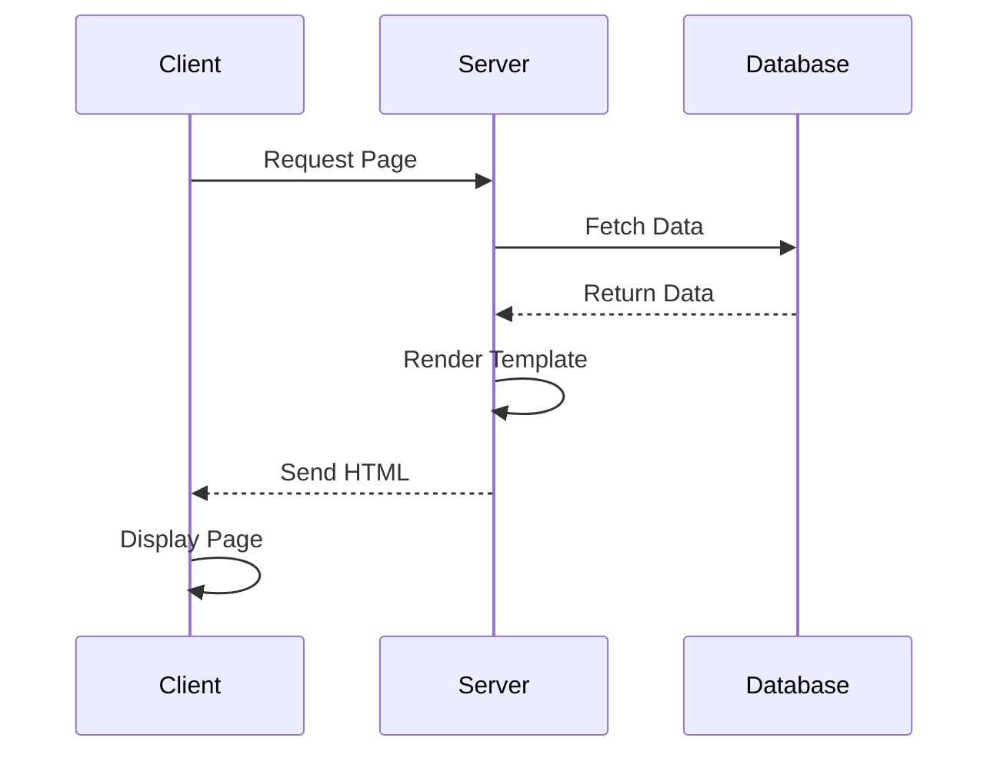

## 13.13. Server-Side Rendering and Templating

In the realm of web development, server-side rendering (SSR) and templating are pivotal techniques for generating dynamic content. Rust, with its robust ecosystem and performance-oriented design, offers several tools and libraries to facilitate SSR and templating. This section delves into the concepts, benefits, and implementation strategies for SSR and templating in Rust web applications.

### Understanding Server-Side Rendering (SSR)

**Server-side rendering** is the process of generating HTML content on the server rather than in the client's browser. This approach contrasts with client-side rendering, where JavaScript is used to build the HTML dynamically on the client side. SSR offers several benefits:

- **Improved Performance**: By delivering pre-rendered HTML, SSR can reduce the time to first meaningful paint, enhancing user experience, especially on slower networks.
- **SEO Benefits**: Search engines can easily index server-rendered pages, improving the discoverability of your content.
- **Consistent User Experience**: SSR ensures that users receive a fully rendered page, reducing the reliance on JavaScript for initial content display.

### Templating Engines in Rust

Rust provides several templating engines that facilitate the integration of dynamic data into HTML templates. Let's explore three popular options: Tera, Handlebars, and Askama.

#### Tera

[Tera](https://tera.netlify.app/) is a powerful templating engine inspired by Jinja2 and Django templates. It offers a rich set of features, including template inheritance, filters, and macros.

**Example: Rendering a Tera Template**

```rust
use tera::{Tera, Context};

fn render_template() -> Result<String, tera::Error> {
    let tera = Tera::new("templates/**/*")?;
    let mut context = Context::new();
    context.insert("name", "Rust Developer");
    tera.render("hello.html", &context)
}

fn main() {
    match render_template() {
        Ok(html) => println!("{}", html),
        Err(e) => eprintln!("Error rendering template: {}", e),
    }
}
```

In this example, we create a `Tera` instance, define a context with dynamic data, and render the `hello.html` template.

#### Handlebars

[Handlebars-rust](https://github.com/sunng87/handlebars-rust) is another popular templating engine known for its simplicity and logic-less design. It emphasizes separating HTML generation from application logic.

**Example: Rendering a Handlebars Template**

```rust
use handlebars::Handlebars;
use serde_json::json;

fn render_template() -> Result<String, handlebars::RenderError> {
    let mut handlebars = Handlebars::new();
    handlebars.register_template_string("hello", "Hello, {{name}}!")?;
    let data = json!({"name": "Rust Developer"});
    handlebars.render("hello", &data)
}

fn main() {
    match render_template() {
        Ok(html) => println!("{}", html),
        Err(e) => eprintln!("Error rendering template: {}", e),
    }
}
```

Here, we register a template string with Handlebars and render it using JSON data.

#### Askama

[Askama](https://github.com/djc/askama) is a compile-time templating engine that uses Rust's type system to ensure template safety. It compiles templates into Rust code, offering excellent performance.

**Example: Rendering an Askama Template**

```rust
use askama::Template;

#[derive(Template)]
#[template(path = "hello.html")]
struct HelloTemplate<'a> {
    name: &'a str,
}

fn main() {
    let template = HelloTemplate { name: "Rust Developer" };
    println!("{}", template.render().unwrap());
}
```

Askama templates are defined using Rust structs, and the `Template` derive macro generates the necessary code for rendering.

### Structuring Applications for SSR

When building applications with SSR, it's crucial to structure your codebase efficiently. Here are some best practices:

1. **Separation of Concerns**: Keep your business logic separate from presentation logic. Use controllers or handlers to manage data processing and pass the results to templates.

2. **Efficient Data Fetching**: Minimize database queries and network requests by batching data fetching operations. Consider using caching mechanisms to store frequently accessed data.

3. **Template Organization**: Organize templates in a hierarchical structure to facilitate reuse and maintainability. Use template inheritance and partials to avoid duplication.

4. **Error Handling**: Implement robust error handling to gracefully manage rendering failures. Provide fallback templates or error pages to enhance user experience.

### Best Practices for Managing Templates

- **Template Caching**: Cache compiled templates to reduce rendering overhead. This is particularly important for high-traffic applications.
- **Minimize Logic in Templates**: Keep templates as simple as possible. Avoid embedding complex logic and calculations within templates.
- **Use Template Inheritance**: Leverage template inheritance to create a base layout and extend it for specific pages. This promotes consistency and reduces duplication.
- **Optimize for Performance**: Profile your templates to identify bottlenecks. Use tools like `cargo flamegraph` to visualize performance hotspots.

### Visualizing SSR Workflow

To better understand the SSR workflow, let's visualize the process using a sequence diagram.



**Diagram Description**: This sequence diagram illustrates the SSR workflow. The client requests a page, the server fetches data from the database, renders the template, and sends the HTML back to the client for display.

### Try It Yourself

To deepen your understanding, try modifying the code examples to include additional dynamic data. Experiment with different templating engines and explore their unique features.

### References and Links

- [Tera Templating Engine](https://tera.netlify.app/)
- [Handlebars-rust](https://github.com/sunng87/handlebars-rust)
- [Askama Templating Engine](https://github.com/djc/askama)

### Knowledge Check

- What are the benefits of server-side rendering?
- How does Tera differ from Handlebars in terms of features and design philosophy?
- What are some best practices for organizing templates in a Rust web application?

### Embrace the Journey

Remember, mastering SSR and templating in Rust is a journey. As you experiment and build more complex applications, you'll gain a deeper understanding of these powerful techniques. Stay curious, keep exploring, and enjoy the process!

## Quiz Time!



### What is a key benefit of server-side rendering (SSR)?

- [x] Improved SEO
- [ ] Increased client-side processing
- [ ] Reduced server load
- [ ] More complex JavaScript

> **Explanation:** SSR improves SEO by delivering pre-rendered HTML, making it easier for search engines to index the content.

### Which templating engine in Rust is inspired by Jinja2?

- [x] Tera
- [ ] Handlebars
- [ ] Askama
- [ ] Mustache

> **Explanation:** Tera is inspired by Jinja2 and Django templates, offering a rich set of features.

### How does Askama ensure template safety?

- [x] By using Rust's type system
- [ ] By using runtime checks
- [ ] By using JavaScript
- [ ] By using external libraries

> **Explanation:** Askama compiles templates into Rust code, leveraging Rust's type system for safety.

### What is a best practice for managing templates in Rust?

- [x] Use template inheritance
- [ ] Embed complex logic in templates
- [ ] Avoid caching templates
- [ ] Use inline styles

> **Explanation:** Template inheritance promotes consistency and reduces duplication, making it a best practice.

### Which Rust templating engine compiles templates at compile time?

- [x] Askama
- [ ] Tera
- [ ] Handlebars
- [ ] Mustache

> **Explanation:** Askama compiles templates into Rust code at compile time, ensuring performance and safety.

### What is a common use case for server-side rendering?

- [x] Delivering pre-rendered HTML for better SEO
- [ ] Executing JavaScript on the server
- [ ] Reducing server-side logic
- [ ] Increasing client-side rendering

> **Explanation:** SSR delivers pre-rendered HTML, which is beneficial for SEO and initial page load performance.

### Which templating engine is known for its logic-less design?

- [x] Handlebars
- [ ] Tera
- [ ] Askama
- [ ] Mustache

> **Explanation:** Handlebars is known for its logic-less design, emphasizing separation of HTML generation from application logic.

### What should be minimized in templates for better performance?

- [x] Complex logic
- [ ] HTML tags
- [ ] CSS styles
- [ ] JavaScript functions

> **Explanation:** Minimizing complex logic in templates helps improve performance and maintainability.

### True or False: Server-side rendering can reduce the time to first meaningful paint.

- [x] True
- [ ] False

> **Explanation:** SSR can reduce the time to first meaningful paint by delivering pre-rendered HTML, enhancing user experience.

### What is a benefit of using template caching?

- [x] Reduces rendering overhead
- [ ] Increases template complexity
- [ ] Slows down server response
- [ ] Requires more memory

> **Explanation:** Template caching reduces rendering overhead, improving performance for high-traffic applications.


