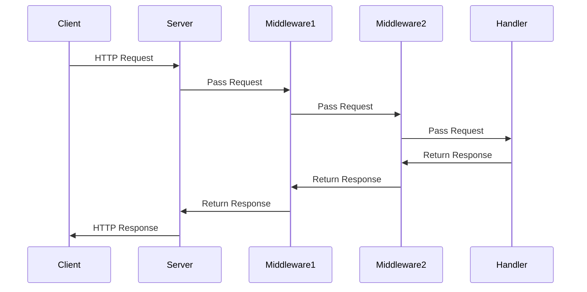

## 13.15. The Request-Response Pipeline Pattern

### Introduction

The Request-Response Pipeline Pattern is a fundamental concept in web development that facilitates the processing of HTTP requests and responses. This pattern is particularly significant in Rust web applications, where efficiency, safety, and concurrency are paramount. By understanding and implementing this pattern, developers can create robust and scalable web applications using Rust's powerful features.

### Understanding the Request-Response Pipeline Pattern

The Request-Response Pipeline Pattern is a design pattern that structures the flow of HTTP requests through a series of processing stages, often referred to as middleware. Each stage in the pipeline can inspect, modify, or terminate the request before passing it to the next stage. This pattern is crucial for implementing cross-cutting concerns such as authentication, logging, and error handling.

#### Significance of the Pattern

- **Modularity**: The pattern promotes modularity by allowing developers to encapsulate specific functionalities within middleware components.
- **Reusability**: Middleware components can be reused across different applications, reducing code duplication.
- **Maintainability**: By separating concerns, the pattern enhances the maintainability of web applications.
- **Scalability**: The pattern supports scalable architectures by efficiently managing the flow of requests and responses.

### Implementing the Pattern in Rust Frameworks

Rust offers several web frameworks that implement the Request-Response Pipeline Pattern, with Actix-web and Rocket being two of the most popular. Each framework provides its own mechanisms for defining and managing the pipeline.

#### Actix-web

Actix-web is a powerful, actor-based framework that leverages Rust's concurrency model to handle HTTP requests efficiently. It provides a flexible middleware system that allows developers to define the request-response pipeline.

**Example: Actix-web Middleware**

```rust
use actix_web::{web, App, HttpServer, HttpRequest, HttpResponse, Result, middleware};

// Define a simple middleware function
async fn log_middleware(req: HttpRequest, srv: middleware::Next<'_>) -> Result<HttpResponse> {
    println!("Request: {} {}", req.method(), req.uri());
    let res = srv.call(req).await?;
    println!("Response: {}", res.status());
    Ok(res)
}

#[actix_web::main]
async fn main() -> std::io::Result<()> {
    HttpServer::new(|| {
        App::new()
            .wrap_fn(log_middleware) // Add middleware to the pipeline
            .route("/", web::get().to(|| async { HttpResponse::Ok().body("Hello, world!") }))
    })
    .bind("127.0.0.1:8080")?
    .run()
    .await
}
```

In this example, we define a simple logging middleware that prints the request method and URI, as well as the response status. The middleware is added to the pipeline using the `wrap_fn` method.

#### Rocket

Rocket is another popular Rust web framework that emphasizes ease of use and developer productivity. It provides a straightforward mechanism for defining request guards and fairings, which serve as middleware components in the request-response pipeline.

**Example: Rocket Fairing**

```rust
#[macro_use] extern crate rocket;

use rocket::{Request, Data, Response, fairing::{Fairing, Info, Kind}, http::Header};

struct AddHeader;

#[rocket::async_trait]
impl Fairing for AddHeader {
    fn info(&self) -> Info {
        Info {
            name: "Add Custom Header",
            kind: Kind::Response
        }
    }

    async fn on_response<'r>(&self, _request: &'r Request<'_>, response: &mut Response<'r>) {
        response.set_header(Header::new("X-Custom-Header", "Rocket"));
    }
}

#[launch]
fn rocket() -> _ {
    rocket::build()
        .attach(AddHeader) // Attach the fairing to the pipeline
        .mount("/", routes![index])
}

#[get("/")]
fn index() -> &'static str {
    "Hello, Rocket!"
}
```

In this Rocket example, we define a fairing that adds a custom header to every response. The fairing is attached to the pipeline using the `attach` method.

### Flow of HTTP Requests Through the Pipeline

The flow of HTTP requests through the request-response pipeline involves several key stages:

1. **Request Reception**: The server receives an HTTP request from a client.
2. **Middleware Processing**: The request passes through a series of middleware components, each of which can inspect, modify, or terminate the request.
3. **Handler Execution**: The request reaches the designated handler, which processes the request and generates a response.
4. **Response Processing**: The response passes back through the middleware components, allowing for further modifications.
5. **Response Delivery**: The server sends the final response back to the client.

### Modifying Requests and Responses

One of the key benefits of the request-response pipeline is the ability to modify requests and responses at various stages. This capability is essential for implementing features such as authentication, logging, and error handling.

**Example: Modifying Requests in Actix-web**

```rust
use actix_web::{web, App, HttpServer, HttpRequest, HttpResponse, Result, middleware};

// Middleware to add a custom header to the request
async fn add_header_middleware(req: HttpRequest, srv: middleware::Next<'_>) -> Result<HttpResponse> {
    let mut req = req;
    req.headers_mut().insert("X-Custom-Header", "Actix".parse().unwrap());
    srv.call(req).await
}

#[actix_web::main]
async fn main() -> std::io::Result<()> {
    HttpServer::new(|| {
        App::new()
            .wrap_fn(add_header_middleware) // Add middleware to modify the request
            .route("/", web::get().to(|| async { HttpResponse::Ok().body("Hello, world!") }))
    })
    .bind("127.0.0.1:8080")?
    .run()
    .await
}
```

In this example, we define a middleware function that adds a custom header to the request before passing it to the next stage in the pipeline.

### Best Practices for Maintaining Clean and Efficient Pipelines

To maintain clean and efficient request-response pipelines, consider the following best practices:

- **Keep Middleware Focused**: Each middleware component should have a single responsibility. This approach enhances modularity and reusability.
- **Order Matters**: The order in which middleware components are added to the pipeline can affect the application's behavior. Ensure that middleware is added in the correct order.
- **Avoid Blocking Operations**: Middleware should avoid blocking operations, as they can degrade performance. Use asynchronous operations whenever possible.
- **Error Handling**: Implement robust error handling mechanisms within middleware to gracefully handle exceptions and provide meaningful error responses.
- **Logging and Monitoring**: Use middleware to log requests and responses for monitoring and debugging purposes.

### Visualizing the Request-Response Pipeline

To better understand the flow of requests and responses through the pipeline, let's visualize the process using a sequence diagram.



This diagram illustrates the sequential flow of an HTTP request through two middleware components and a handler, followed by the response returning through the same components.

### Rust Unique Features

Rust's unique features, such as ownership, borrowing, and concurrency, play a significant role in implementing the request-response pipeline pattern. These features ensure memory safety and prevent data races, making Rust an ideal choice for building high-performance web applications.

- **Ownership and Borrowing**: Rust's ownership model ensures that data is safely shared between middleware components without risking data corruption.
- **Concurrency**: Rust's concurrency model allows for efficient handling of multiple requests simultaneously, enhancing the scalability of web applications.

### Differences and Similarities with Other Patterns

The request-response pipeline pattern shares similarities with other middleware-based patterns, such as the Chain of Responsibility pattern. However, it is specifically tailored for web applications and focuses on processing HTTP requests and responses.

### Conclusion

The Request-Response Pipeline Pattern is a powerful design pattern that enhances the modularity, reusability, and maintainability of Rust web applications. By leveraging Rust's unique features and following best practices, developers can build efficient and scalable web applications that handle HTTP requests and responses with ease.

### Try It Yourself

Experiment with the code examples provided in this section. Try adding additional middleware components to the pipeline, or modify existing ones to implement new features such as authentication or logging. By doing so, you'll gain a deeper understanding of the request-response pipeline pattern and its applications in Rust web development.

## Quiz Time!



### What is the primary purpose of the Request-Response Pipeline Pattern?

- [x] To structure the flow of HTTP requests through a series of processing stages.
- [ ] To handle database transactions in web applications.
- [ ] To manage user authentication and authorization.
- [ ] To optimize the performance of web servers.

> **Explanation:** The Request-Response Pipeline Pattern structures the flow of HTTP requests through middleware components for processing.

### Which Rust web framework uses fairings as middleware components?

- [ ] Actix-web
- [x] Rocket
- [ ] Hyper
- [ ] Warp

> **Explanation:** Rocket uses fairings as middleware components in its request-response pipeline.

### In Actix-web, which method is used to add middleware to the pipeline?

- [ ] attach
- [x] wrap_fn
- [ ] use
- [ ] add_middleware

> **Explanation:** The `wrap_fn` method is used in Actix-web to add middleware to the request-response pipeline.

### What is a key benefit of using middleware in the request-response pipeline?

- [x] Modularity
- [ ] Increased latency
- [ ] Reduced security
- [ ] Complexity

> **Explanation:** Middleware enhances modularity by encapsulating specific functionalities within components.

### Which of the following is a best practice for maintaining clean pipelines?

- [x] Avoid blocking operations
- [ ] Use synchronous operations
- [ ] Add all middleware at the end of the pipeline
- [ ] Ignore error handling

> **Explanation:** Avoiding blocking operations is a best practice to maintain efficient pipelines.

### What is the role of the handler in the request-response pipeline?

- [x] To process the request and generate a response
- [ ] To log the request details
- [ ] To modify the request headers
- [ ] To terminate the request

> **Explanation:** The handler processes the request and generates the response in the pipeline.

### How does Rust's ownership model benefit the request-response pipeline?

- [x] Ensures data is safely shared between middleware components
- [ ] Increases memory usage
- [ ] Reduces code readability
- [ ] Limits concurrency

> **Explanation:** Rust's ownership model ensures safe data sharing, preventing data corruption.

### What is the significance of the order in which middleware is added to the pipeline?

- [x] It affects the application's behavior
- [ ] It has no impact on the application
- [ ] It determines the server's IP address
- [ ] It sets the application's logging level

> **Explanation:** The order of middleware affects how requests and responses are processed.

### True or False: The request-response pipeline pattern is specific to Rust web applications.

- [ ] True
- [x] False

> **Explanation:** The request-response pipeline pattern is not specific to Rust; it is used in various web development frameworks.

### Which feature of Rust enhances the scalability of web applications?

- [x] Concurrency model
- [ ] Lack of garbage collection
- [ ] Manual memory management
- [ ] Single-threaded execution

> **Explanation:** Rust's concurrency model enhances scalability by efficiently handling multiple requests.



Remember, this is just the beginning. As you progress, you'll build more complex and interactive web applications. Keep experimenting, stay curious, and enjoy the journey!
